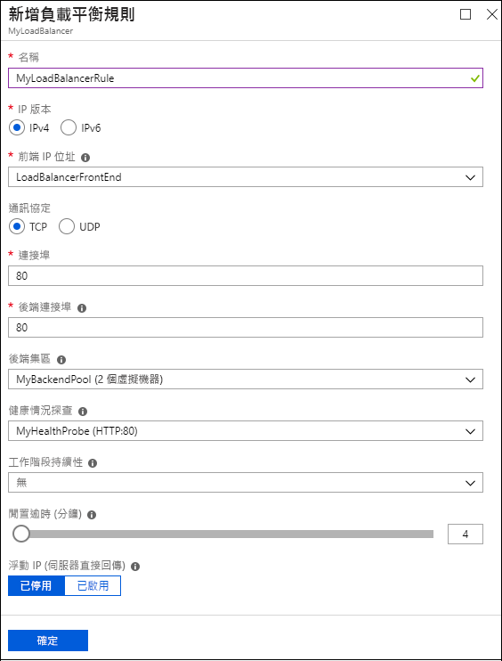

# 使用 Azure 入口網站建立公用基本負載平衡器以平衡 VM 的負載

負載平衡會將傳入要求分散於多部虛擬機器，藉此提供高可用性和範圍。 您可使用 Azure 入口網站建立負載平衡器，以平衡虛擬機器的負載。 本快速入門示範如何建立網路資源、後端伺服器和公用基本負載平衡器。

如果您沒有 Azure 訂用帳戶，請在開始前建立 [免費帳戶](https://azure.microsoft.com/free/?WT.mc_id=A261C142F) 。 

## 登入 Azure 入口網站

在 [http://portal.azure.com](http://portal.azure.com) 登入 Azure 入口網站。

## 建立基本負載平衡器

在本節中，您會使用入口網站建立公用基本負載平衡器。 當您使用入口網站建立負載平衡器資源時，系統會在您建立公用 IP 時，將公用 IP 位址自動設定為負載平衡器的前端 (名為 LoadBalancerFrontend)。

1. 在畫面的左上方，按一下 [建立資源] > [網路] > [負載平衡器]。
2. 在 [建立負載平衡器] 頁面中輸入負載平衡器的下列值：
    - myLoadBalancer - 作為負載平衡器的名稱。
    - Public - 作為負載平衡器的類型。
    - myPublicIP -作為您必須建立的公用 IP，其 SKU 為 [基本]，而且 [指派] 設為 [動態]。
    - myResourceGroupLB - 作為您新建立的資源群組的名稱。
3. 按一下 [建立] 以建立負載平衡器。
   
    

## 建立後端伺服器

本節中，您會建立一個虛擬網路、針對基本負載平衡器的後端集區建立兩部虛擬機器，然後在虛擬機器上安裝 IIS，協助測試負載平衡器。

### 建立虛擬網路
1. 在螢幕的左上方，按一下 [新增] > [網路] > [虛擬網路]，然後輸入虛擬網路的下列值：
    - myVnet - 作為虛擬網路的名稱。
    - myResourceGroupLB - 作為現有資源群組的名稱
    - myBackendSubnet - 作為子網路名稱。
2. 按一下 [建立] 以建立虛擬網路。

    

### 建立虛擬機器

1. 在螢幕的左上方，按一下 [新增] > [計算] > [Windows Server 2016 Datacenter]，然後輸入虛擬網路的下列值：
    - myVM1 - 作為虛擬機器的名稱。        
    - azureuser - 作為系統管理員使用者名稱。 -    
    - myResourceGroupLB - 針對 [資源群組]，選取 [使用現有的]，然後選取 myResourceGroupLB。
2. 按一下 [SERVICEPRINCIPAL] 。
3. 選取 [DS1_V2] 作為虛擬機器的大小，然後按一下 [選取]。
4. 輸入 VM 設定的下列值：
    - myAvailabilitySet - 作為您新建立的可用性設定組名稱。
    -  myVNet - 確保已選取作為虛擬網路。
    - myBackendSubnet - 確保已選取作為子網路。
    - myVM1-ip - 作為公用 IP 位址。
    - myNetworkSecurityGroup - 作為您必須建立之新網路安全性群組 (防火牆) 的名稱。
5. 按一下 [停用] 來停用開機診斷。
6. 按一下 [確定]，檢閱 [摘要] 頁面上的設定，然後按一下 [建立]。
7. 使用步驟 1-6，建立名為 VM2 的第二部 VM，其可用性設定組為 myAvailabilityset、虛擬網路為 myVnet、子網路為 myBackendSubnet，而其網路安全性群組為 myNetworkSecurityGroup。 

### 建立 NSG 規則

在本節中，您會建立 NSG 規則，以允許使用 HTTP 與 RDP 的輸入連線。

1. 按一下左側功能表中的 [所有資源]，然後從資源清單按一下 **myNetworkSecurityGroup**，其位於 **myResourceGroupLB** 資源群組中。
2. 在 [設定] 底下，按一下 [輸入安全性規則]，然後按一下 [新增]。
3. 輸入輸入安全性規則 (名為 myHTTPRule) 的下列值，以允許使用連接埠 80 的輸入 HTTP 連線：
    - 服務標記 - 作為 [來源]。
    - 網際網路 - 作為 [來源服務標記]
    - 80 - 作為 [目的地連接埠範圍]
    - TCP - 作為 [通訊協定]
    - 允許 - 作為 [動作]
    - 100 作為 [優先順序]
    - myHTTPRule 作為名稱
    - 允許 HTTP - 作為描述
4. 按一下 [SERVICEPRINCIPAL] 。
 
 
5. 重複步驟 2 到 4 來建立另一個名為 myRDPRule 的規則，以允許使用連接埠 3389 的輸入 RDP 連線，其具有下列值：
    - 服務標記 - 作為 [來源]。
    - 網際網路 - 作為 [來源服務標記]
    - 3389 - 作為 [目的地連接埠範圍]
    - TCP - 作為 [通訊協定]
    - 允許 - 作為 [動作]
    - 200 作為 [優先順序]
    - myRDPRule 作為名稱
    - 允許 RDP - 作為描述

   

### 安裝 IIS

1. 按一下左側功能表中的 [所有資源]，然後從資源清單按一下 **myVM1**，其位於 myResourceGroupLB 資源群組中。
2. 在 [概觀] 頁面上，按一下 [連線] 以透過 RDP 連入 VM。
3. 以使用者名稱 azureuser 和密碼 Azure123456! 登入 VM
4. 在伺服器桌面上，瀏覽至 [Windows 系統管理工具]>[伺服器管理員]。
5. 在 [伺服器管理員] 中，按一下 [管理]，然後按一下 [新增角色及功能]。
 
6. 在 [新增角色及功能精靈] 中，使用下列值：
    - 在 [選取安裝類型] 頁面中，按一下 [角色型或功能型安裝]。
    - 在 [選取目的地伺服器] 頁面中，按一下 [myVM1]。
    - 在 [選取伺服器角色] 頁面中，按一下 [Web 伺服器 (IIS)]。
    - 依照指示完成精靈的其餘部分 
7. 針對虛擬機器 myVM2 重複步驟 1 到 6。

## 建立基本負載平衡器資源

在本節中，您會設定後端位址集區和健康狀態探查的負載平衡器設定，並指定負載平衡器和 NAT 規則。

### 建立後端位址集區

若要將流量分散至 VM，後端位址集區包含已連線至負載平衡器之虛擬 (NIC) 的 IP 位址。 建立後端位址集區 myBackendPool 以納入 VM1 和 VM2。

1. 按一下左側功能表中的 [所有資源]，然後從資源清單按一下 [myLoadBalancer]。
2. 在 [設定] 之下，依序按一下 [後端集區] 和 [新增]。
3. 在 [新增後端集區] 頁面上，執行下列操作：
    - 針對名稱，輸入 *myBackEndPool，作為您後端集區的名稱。
    - 針對 [關聯對象]，從下拉式功能表按一下 [可用性設定組]
    - 針對 [可用性設定組]，按一下 [myAvailabilitySet]。
    - 按一下 [新增目標網路 IP 組態]，將您建立的每部虛擬機器 (myVM1 & myVM2) 新增至後端集區。
    - 按一下 [SERVICEPRINCIPAL] 。

    

3. 請檢查以確定負載平衡器後端集區設定顯示  **VM1** 和 **VM2** 這兩個 VM。

### 建立健康狀態探查

若要讓基本負載平衡器監視您應用程式的狀態，請使用健康狀態探查。 健康狀態探查會根據 VM 對健康狀態檢查的回應，以動態方式從負載平衡器輪替中新增或移除 VM。 建立健康狀態探查 myHealthProbe 以監視 VM 的健康狀態。

1. 按一下左側功能表中的 [所有資源]，然後從資源清單按一下 [myLoadBalancer]。
2. 在 [設定] 之下，依序按一下 [健康狀態探查] 和 [新增]。
3. 使用下列值來建立健康狀態探查：
    - myHealthProbe - 作為健康狀態探查的名稱。
    - HTTP - 作為通訊協定類型。
    - 80 - 作為連接埠號碼。
    - 15 - 探查嘗試的 [間隔] 秒數。
    - 2 - 作為 [狀況不良閾值]，或將 VM 視為狀況不良之前，必須達到的連續探查失敗次數。
4. 按一下 [SERVICEPRINCIPAL] 。

   

### 建立負載平衡器規則

負載平衡器規則用來定義如何將流量分散至 VM。 您可定義連入流量的前端 IP 組態及後端 IP 集區來接收流量，以及所需的來源和目的地連接埠。 建立負載平衡器規則 myLoadBalancerRuleWeb，用來接聽前端 LoadBalancerFrontEnd 中的連接埠 80，以及用來將負載平衡的網路流量傳送到後端位址集區 myBackEndPool (也是使用連接埠 80)。 

1. 按一下左側功能表中的 [所有資源]，然後從資源清單按一下 [myLoadBalancer]。
2. 在 [設定] 之下，按一下 [負載平衡規則]，然後按一下 [新增]。
3. 使用下列值來設定負載平衡規則：
    - myHTTPRule - 作為負載平衡器規則的名稱。
    - TCP - 作為通訊協定類型。
    - 80 - 作為連接埠號碼。
    - 80 - 作為後端連接埠。
    - myBackendPool - 作為後端集區的名稱。
    - myHealthProbe - 作為健康狀態探查的名稱。
4. 按一下 [SERVICEPRINCIPAL] 。
    
    

## 測試負載平衡器
1. 在 [概觀] 畫面上尋找負載平衡器的公用 IP 位址。 按一下 [所有資源]，然後按一下 [myPublicIP]。

2. 將公用 IP 位址複製並貼到您瀏覽器的網址列。 IIS Web 伺服器的預設頁面會顯示在瀏覽器上。

  

## 清除資源

若不再需要，可刪除資源群組、負載平衡器和所有相關資源。 若要這樣做，請選取包含負載平衡器的資源群組，然後按一下 [刪除]。

## 後續步驟

在本快速入門中，您已建立資源群組、網路資源和後端伺服器。 接著，您可使用這些資源來建立負載平衡器。 若要深入了解負載平衡器及其相關聯的資源，請繼續閱讀教學課程文章。
