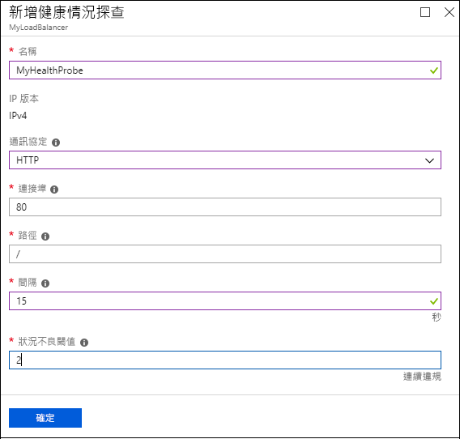

# 快速入門：使用 Azure 入口網站建立基本負載平衡器

負載平衡會將傳入要求分散於多部虛擬機器 (VM)，藉此提供高可用性和範圍。 您可使用 Azure 入口網站建立負載平衡器，以及平衡虛擬機器的流量。 本快速入門說明如何在基本定價層建立及設定負載平衡器、後端伺服器及網路資源。

如果您沒有 Azure 訂用帳戶，請在開始前建立 [免費帳戶](https://azure.microsoft.com/free/?WT.mc_id=A261C142F) 。 

若要進行本快速入門中的工作，請登入 [Azure 入口網站](http://portal.azure.com)。

## 建立基本負載平衡器

首先，使用入口網站建立公用基本負載平衡器。 您所建立的名稱和公用 IP 位址會自動設定為負載平衡器的前端。

1. 在畫面的左上方，按一下 [建立資源] > [網路] > [負載平衡器]。
2. 在 [建立負載平衡器] 頁面的 [基本資料] 中，輸入或選取下列資訊、接受其餘設定的預設值，然後選取 [檢閱 + 建立]：

    | 設定                 | 值                                              |
    | ---                     | ---                                                |
    | 訂用帳戶               | 選取您的訂用帳戶。    |    
    | 資源群組         | 選取 [新建]，並在文字方塊中輸入 *MyResourceGroupLB*。|
    | Name                   | *myLoadBalancer*                                   |
    | 區域         | 選取 [西歐]。                                        |
    | 類型          | 選取 [公用]。                                        |
    | SKU           | 選取 [基本]。                          |
    | 公用 IP 位址 | 選取 [建立新的]。 |
    | 公用 IP 位址名稱              | *MyPublicIP*   |
    | 指派| 靜態|

3. 在 [檢閱 + 建立] 索引標籤中，按一下 [建立]。   

## 建立後端伺服器

接下來，針對基本負載平衡器的後端集區，建立一個虛擬網路以及兩部虛擬機器。 

### 建立虛擬網路

1. 在入口網站的左上方，選取 [建立資源] > [網路] > [虛擬網路]。
   
1. 在 [建立虛擬網路] 窗格中，輸入或選取下列值：
   
   - **名稱**：輸入 MyVnet。
   - **資源群組**：下拉 [選取現有的]，然後選取 [MyResourceGroupLB]。 
   - [子網路] > [名稱]：輸入 MyBackendSubnet。
   
1. 選取 [建立] 。

   

### 建立虛擬機器

1. 在入口網站的左上方，選取 [建立資源] > **[計算]** > [Windows Server 2016 Datacenter]。 
   
1. 在 [建立虛擬機器] 中，輸入或選取 [基本資訊] 索引標籤中的下列值：
   - [訂用帳戶] > [資源群組]：下拉並選取 [MyResourceGroupLB]。
   - **執行個體詳細資料** > **虛擬機器名稱**：輸入 MyVM1。
   - **執行個體詳細資料** > **可用性選項**： 
     1. 下拉並選取 [可用性設定組]。 
     2. 選取 [新建]，輸入 MyAvailabilitySet，然後選取 [確定]。
  
1. 選取 [網路] 索引標籤，或選取 **[下一步：磁碟]**，然後選取 **[下一步：網路]**。 
   
   請確定已選取下列項目：
   - **虛擬網路**：**MyVnet**
   - **子網路**：**MyBackendSubnet**
   - **公用 IP**：**MyVM1-ip**
   
   若要在 [網路安全性群組] 之下建立新的網路安全性群組 (NSG，一種防火牆類型)，請選取 [進階]。 
   1. 在 [設定網路安全性群組] 欄位中，選取 [新建]。 
   1. 輸入 MyNetworkSecurityGroup，然後選取 [確定]。 
   
1. 選取 [管理] 索引標籤，或選取 [下一步] > [管理]。 在 [監視] 下，將 [開機診斷] 設定為 [關閉]。
   
1. 選取 [檢閱 + 建立]。
   
1. 檢閱設定，然後選取 [建立]。 

1. 請依照下列步驟來建立名為 *MyVM2* 的第二個 VM，其 [公用 IP] 位址為 *MyVM2 ip*，而所有其他設定與 MyVM1 相同。 

### 建立 VM 的 NSG 規則

在本節中，您會建立 VM 的網路安全性群組 (NSG) 規則，以允許輸入網際網路 (HTTP) 和遠端桌面 (RDP) 連線。

1. 在左側功能表上，選取 [所有資源]。 從資源清單，選取 **MyResourceGroupLB** 資源群組中的 **MyNetworkSecurityGroup**。
   
1. 在 [設定] 下，選取 [輸入安全性規則]，然後選取 [新增]。
   
1. 在 [新增輸入安全性規則] 對話方塊中，針對 HTTP 規則，輸入或選取下列值：
   
   - **來源**：選取 [服務標記]。  
   - **來源服務標記**：選取 [網際網路]。 
   - **目的地連接埠範圍**：輸入 80。
   - **通訊協定**：選取 [TCP]。 
   - **動作**：選取 [允許]。  
   - **優先順序**：輸入 100。 
   - **名稱**：輸入 MyHTTPRule。 
   - **描述**：輸入「允許 HTTP」。 
   
1. 選取 [新增] 。 
   
   
   
1. 使用下列不同的值，針對輸入 RDP 規則重複這些步驟：
   - **目的地連接埠範圍**：輸入 3389。
   - **優先順序**：輸入 200。 
   - **名稱**：輸入 MyRDPRule。 
   - **描述**：輸入「允許 RDP」。 

## 建立負載平衡器的資源

在本節中，您會設定後端位址集區的負載平衡器設定、健康狀態探查以及負載平衡器規則。

### 建立後端位址集區

若要將流量分散至 VM，則負載平衡器會使用後端位址集區。 後端位址集區包含已連線至負載平衡器之虛擬網路介面 (NIC) 的 IP 位址。 

**若要建立包含 VM1 和 VM2 的後端位址集區：**

1. 選取左側功能表上的 [所有資源]，然後從資源清單中選取 [MyLoadBalancer]。
   
1. 在 [設定] 底下選取 [後端集區]，然後選取 [新增]。
   
1. 在 [新增後端集區] 頁面上，輸入或選取下列值：
   
   - **名稱**：輸入 MyBackEndPool。
   - **與下列產生關聯**：下拉並選取 [可用性設定組]。
   - **可用性設定組**：選取 [MyAvailabilitySet]。
   
1. 選取 [新增目標網路 IP 組態]。 
   1. 將您所建立的每部虛擬機器 (**MyVM1** 和 **MyVM2**) 新增至後端集區。
   2. 新增每部機器之後，下拉並選取其 [網路 IP 組態]。 
   
1. 選取 [確定] 。
   
   
   
1. 在 [後端集區] 頁面上，展開 **MyBackendPool**，並確定 **VM1** 和 **VM2** 都已列出。

### 建立健康狀態探查

若要讓負載平衡器能監視 VM 狀態，請使用健康情況探查。 健康狀態探查會根據 VM 對健康狀態檢查的回應，以動態方式從負載平衡器輪替中新增或移除 VM。 

**若要建立健康情況探查以監視 VM 的健康情況：**

1. 選取左側功能表上的 [所有資源]，然後從資源清單中選取 [MyLoadBalancer]。
   
1. 在 [設定] 底下選取 [健康狀態探查]，然後選取 [新增]。
   
1. 在 [新增健康情況探查] 頁面上，輸入或選取下列值：
   
   - **名稱**：輸入 MyHealthProbe。
   - **通訊協定**：下拉並選取 [HTTP]。 
   - **連接埠**：輸入 80。 
   - **路徑**：接受 / 作為預設 URI。 您可以使用任何其他 URI 來取代此值。 
   - **間隔**：輸入 15。 間隔是探查嘗試之間的秒數。
   - **狀況不良閾值**：輸入 2。 這個值是將 VM 視為狀況不良之前，所發生的連續探查失敗次數。
   
1. 選取 [確定] 。
   
   

### 建立負載平衡器規則

負載平衡器規則可定義如何將流量分散至 VM。 此規則會定義連入流量的前端 IP 組態、用來接收流量的後端 IP 集區，以及所需的來源和目的地連接埠。 

名為 **MyLoadBalancerRule** 的負載平衡器規則會接聽前端 **LoadBalancerFrontEnd** 中的連接埠 80。 此規則會將網路流量傳送到後端位址集區 **MyBackEndPool**，也在連接埠 80 上。 

**若要建立負載平衡器規則：**

1. 選取左側功能表上的 [所有資源]，然後從資源清單中選取 [MyLoadBalancer]。
   
1. 在 [設定] 下選取 [負載平衡規則]，然後選取 [新增]。
   
1. 在 [新增負載平衡規則] 頁面上，輸入或選取下列值：
   
   - **名稱**：輸入 MyLoadBalancerRule。
   - **前端 IP 位址：** 輸入 LoadBalancerFrontend。
   - **通訊協定**：選取 [TCP]。
   - **連接埠**：輸入 80。
   - **後端連接埠**：輸入 80。
   - **後端集區**：選取 [MyBackendPool]。
   - **健康情況探查**：選取 [MyHealthProbe]。 
   
1. 選取 [確定] 。
   
  

## 測試負載平衡器

您將使用公用 IP 位址，在 VM 上測試負載平衡器。 

在入口網站中 **MyLoadBalancer** 的 [概觀] 頁面上，於 [公用 IP 位址] 之下尋找其公用 IP 位址。 將滑鼠停在該位址上，然後選取 [複製] 圖示來複製它。 

### 在 VM 上安裝 IIS

在虛擬機器上安裝 Internet Information Services (IIS)，協助測試負載平衡器。

**若要將遠端桌面 (RDP) 連到 VM：**

1. 在入口網站的左側功能表上，選取 [所有資源]。 從資源清單，選取 **MyResourceGroupLB** 資源群組中的 **MyVM1**。
   
1. 在 [概觀] 頁面上，選取 [連線]，然後選取 [下載 RDP 檔案]。 
   
1. 開啟所下載的 RDP 檔案，然後選取 [連線]。
   
1. 在 [Windows 安全性] 畫面上，選取 [更多選擇]，然後選取 [使用不同的帳戶]。 
   
   輸入使用者名稱和密碼，然後選取 [確定]。
   
1. 對任何憑證提示回應 [是]。 
   
   VM 桌面會在新視窗中開啟。 
   
**若要在 VM 上安裝 IIS：**

1. 如果 [伺服器管理員] 尚未在伺服器桌面上開啟，請瀏覽至 [Windows 系統管理工具] > [伺服器管理員]。
   
1. 在 [伺服器管理員] 中，選取 [新增角色及功能]。
   
   
   
1. 在 [新增角色及功能精靈] 中：
   1. 在 [選取安裝類型] 頁面中，選取 [角色型或功能型安裝]。
   1. 在 [選取目的地伺服器] 頁面上，選取 [MyVM1]。
   1. 在 [選取伺服器角色] 頁面上，按一下 [網頁伺服器 (IIS)]。 
   1. 在安裝必要工具的提示中，選取 [新增功能]。 
   1. 接受預設值，然後選取 [安裝]。 
   1. 當功能安裝完成時，請選取 [關閉]。 
   
1. 針對虛擬機器 **MyVM2** 重複步驟，但是將目的地伺服器設定為 [MyVM2]。

### 測試負載平衡器

開啟瀏覽器，並在瀏覽器的網址列中貼入負載平衡器的公用 IP 位址。 IIS Web 伺服器預設頁面應會出現在瀏覽器中。

## 清除資源

當您不再需要時，若要刪除負載平衡器和所有相關的資源，請開啟 **MyResourceGroupLB** 資源群組並選取 [刪除資源群組]。

## 後續步驟

在本快速入門中，您建立了基本層負載平衡器。 您也建立並設定了資源群組、網路資源、後端伺服器、健康情況探查，以及要搭配負載平衡器使用的規則。 您已在 VM 上安裝 IIS，並使用它來測試負載平衡器。 

若要深入了解 Azure Load Balancer，請繼續進行教學課程。

> [!div class="nextstepaction"]
> [Azure Load Balancer 教學課程](tutorial-load-balancer-basic-internal-portal.md)
