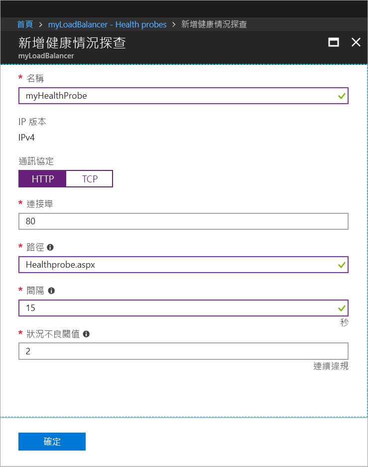
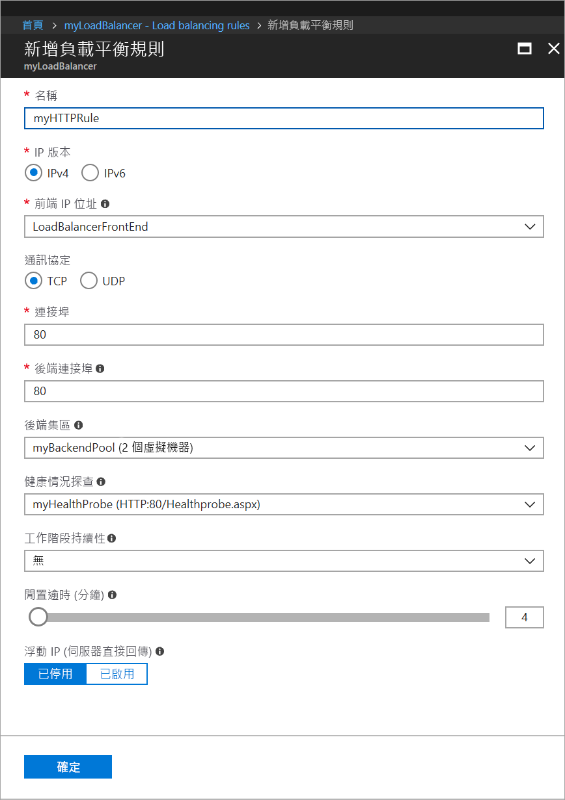

# 快速入門：使用 Azure 入口網站建立標準負載平衡器以平衡 VM 的負載

負載平衡會將傳入要求分散於多部虛擬機器，藉此提供高可用性和範圍。 您可使用 Azure 入口網站建立負載平衡器，以平衡虛擬機器 (VM) 的負載。 本快速入門示範如何使用標準負載平衡器來平衡 VM 的負載。

如果您沒有 Azure 訂用帳戶，請在開始前建立 [免費帳戶](https://azure.microsoft.com/free/?WT.mc_id=A261C142F) 。 

## 登入 Azure

在 [http://portal.azure.com](http://portal.azure.com) 登入 Azure 入口網站。

## 建立公用負載平衡器

在本節中，您會建立公用負載平衡器，協助平衡虛擬機器的負載。 Standard Load Balancer 只支援標準公用 IP 位址。 當您建立標準負載平衡器時，也必須建立新的標準公用 IP 位址，而該 IP 位址會設定為標準負載平衡器的前端 (預設的名稱為 LoadBalancerFrontend)。 

1. 在畫面的左上方，按一下 [建立資源] > [網路] > [負載平衡器]。
2. 在 [建立負載平衡器] 頁面的 [基本資料] 中，輸入或選取下列資訊、接受其餘設定的預設值，然後選取 [檢閱 + 建立]：

    | 設定                 | 值                                              |
    | ---                     | ---                                                |
    | 訂用帳戶               | 選取您的訂用帳戶。    |    
    | 資源群組         | 選取 [新建]，並在文字方塊中輸入 *MyResourceGroupSLB*。|
    | Name                   | *myLoadBalancer*                                   |
    | 區域         | 選取 [西歐]。                                        |
    | 類型          | 選取 [公用]。                                        |
    | SKU           | 選取 [標準]。                          |
    | 公用 IP 位址 | 選取 [建立新的]。 |
    | 公用 IP 位址名稱              | 在文字方塊中輸入 *myPublicIP*。   |
    |可用性區域| 選取 [區域備援]。    |
3. 在 [檢閱 + 建立] 索引標籤中，按一下 [建立]。   

## 建立後端伺服器

本節中，您會建立一個虛擬網路、針對負載平衡器的後端集區建立兩部虛擬機器，然後在虛擬機器上安裝 IIS，協助測試負載平衡器。

### 建立虛擬網路
1. 在螢幕的左上方，按一下 [新增] > [網路] > [虛擬網路]，然後輸入虛擬網路的下列值：
    - myVnet - 作為虛擬網路的名稱。
    - myResourceGroupSLB - 作為現有資源群組的名稱
    - myBackendSubnet - 作為子網路名稱。
2. 按一下 [建立] 以建立虛擬網路。

    

### 建立虛擬機器

1. 在螢幕的左上方，按一下 [新增] > [計算] > [Windows Server 2016 Datacenter]，然後輸入虛擬網路的下列值：
    - myVM1 - 作為虛擬機器的名稱。        
    - myResourceGroupSLB - 針對 [資源群組]，選取 [使用現有的]，然後選取 myResourceGroupSLB。
2. 按一下 [確定]。
3. 選取 [DS1_V2] 作為虛擬機器的大小，然後按一下 [選取]。
4. 輸入 VM 設定的下列值：
    1. 確定您已選取 [myVNet] 作為虛擬網路，並選取 [myBackendSubnet] 作為子網路。
    2. 針對 [公用 IP 位址]，在 [建立公用 IP 位址] 窗格中選取 [標準]，然後選取 [確定]。
    3. 針對 [網路安全性群組] 選取 [進階]，然後執行下列作業：
        1. 選取*網路安全性群組 (防火牆)，然後在 [選擇網路安全性群組] 頁面中，選取 [新建]。 
        2. 在 [建立網路安全性群組] 頁面中，針對 [名稱] 輸入 *myNetworkSecurityGroup*，然後選取 [確定]。
5. 按一下 [停用] 來停用開機診斷。
6. 按一下 [確定]，檢閱 [摘要] 頁面上的設定，然後按一下 [建立]。
7. 使用步驟 1-6，建立名為 VM2 的第二個 VM，其虛擬網路為 myVnet、子網路為 myBackendSubnet，而其網路安全性群組為 *myNetworkSecurityGroup。 

### 建立 NSG 規則

在本節中，您會建立 NSG 規則，以允許使用 HTTP 的輸入連線。

1. 按一下左側功能表中的 [所有資源]，然後從資源清單按一下 **myNetworkSecurityGroup**，其位於 **myResourceGroupSLB** 資源群組中。
2. 在 [設定] 底下，按一下 [輸入安全性規則]，然後按一下 [新增]。
3. 輸入輸入安全性規則 (名為 myHTTPRule) 的下列值，以允許使用連接埠 80 的輸入 HTTP 連線：
    - 服務標記 - 作為 [來源]。
    - 網際網路 - 作為 [來源服務標記]
    - 80 - 作為 [目的地連接埠範圍]
    - TCP - 作為 [通訊協定]
    - 允許 - 作為 [動作]
    - 100 作為 [優先順序]
    - myHTTPRule 作為名稱
    - 允許 HTTP - 作為描述
4. 按一下 [確定]。
 
### 安裝 IIS

1. 按一下左側功能表中的 [所有資源]，然後從資源清單按一下 **myVM1**，其位於 myResourceGroupLB 資源群組中。
2. 在 [概觀] 頁面上，按一下 [連線] 以透過 RDP 連入 VM。
3. 以使用者名稱 azureuser 登入 VM。
4. 在伺服器桌面上，瀏覽至 [Windows 系統管理工具]>[伺服器管理員]。
5. 在 [伺服器管理員] 中，按一下 [新增角色及功能] 。
6. 在 [新增角色及功能精靈] 中，使用下列值：
    - 在 [選取安裝類型] 頁面中，按一下 [角色型或功能型安裝]。
    - 在 [選取目的地伺服器] 頁面中，按一下 [myVM1]。
    - 在 [選取伺服器角色] 頁面中，按一下 [Web 伺服器 (IIS)]。
    - 依照指示完成精靈的其餘部分 
7. 針對虛擬機器 myVM2 重複步驟 1 到 6。

## 建立負載平衡器資源

在本節中，您會設定後端位址集區的負載平衡器設定和健康狀態探查，並指定負載平衡器規則。

### 建立後端位址集區

若要將流量分散至 VM，後端位址集區包含已連線至負載平衡器之虛擬 (NIC) 的 IP 位址。 建立後端位址集區 myBackendPool 以納入 VM1 和 VM2。

1. 按一下左側功能表中的 [所有資源]，然後從資源清單按一下 [myLoadBalancer]。
2. 在 [設定] 之下，依序按一下 [後端集區] 和 [新增]。
3. 在 [新增後端集區] 頁面上，執行下列操作：
   - 針對名稱，輸入 myBackendPool，作為您後端集區的名稱。
   - 針對 [虛擬網路]，選取 [myVNet]。
   - 在 [虛擬機器] 下方新增 *myVM1* 和 *myVM2* 及其對應的 IP 位址，然後選取 [新增]。
    - 按一下 [確定]。

3. 請檢查以確定負載平衡器後端集區設定顯示  **VM1** 和 **VM2** 這兩個 VM。

### 建立健康狀態探查

若要讓負載平衡器監視您應用程式的狀態，請使用健康狀態探查。 健康狀態探查會根據 VM 對健康狀態檢查的回應，以動態方式從負載平衡器輪替中新增或移除 VM。 建立健康狀態探查 myHealthProbe 以監視 VM 的健康狀態。

1. 按一下左側功能表中的 [所有資源]，然後從資源清單按一下 [myLoadBalancer]。
2. 在 [設定] 之下，依序按一下 [健康狀態探查] 和 [新增]。
3. 使用下列值來建立健康狀態探查：
    - myHealthProbe - 作為健康狀態探查的名稱。
    - HTTP - 作為通訊協定類型。
    - 80 - 作為連接埠號碼。
    - [Healthprobe.aspx] - 作為 URI 路徑。 您可以使用任何其他 URI 來取代此值，也可以保留 **"\\"** 的預設路徑值來取得預設 URI。
    - 15 - 探查嘗試的 [間隔] 秒數。
    - 2 - 作為 [狀況不良閾值]，或將 VM 視為狀況不良之前，必須達到的連續探查失敗次數。
4. 按一下 [確定]。

   

### 建立負載平衡器規則

負載平衡器規則用來定義如何將流量分散至 VM。 您可定義連入流量的前端 IP 組態及後端 IP 集區來接收流量，以及所需的來源和目的地連接埠。 建立負載平衡器規則 myLoadBalancerRuleWeb，用來接聽前端 FrontendLoadBalancer 中的連接埠 80，以及用來將負載平衡的網路流量傳送到後端位址集區 myBackEndPool (也是使用連接埠 80)。 

1. 按一下左側功能表中的 [所有資源]，然後從資源清單按一下 [myLoadBalancer]。
2. 在 [設定] 之下，按一下 [負載平衡規則]，然後按一下 [新增]。
3. 使用下列值來設定負載平衡規則：
    - myHTTPRule - 作為負載平衡器規則的名稱。
    - TCP - 作為通訊協定類型。
    - 80 - 作為連接埠號碼。
    - 80 - 作為後端連接埠。
    - myBackendPool - 作為後端集區的名稱。
    - myHealthProbe - 作為健康狀態探查的名稱。
4. 按一下 [確定]。
    
    

## 測試負載平衡器
1. 在 [概觀] 畫面上尋找負載平衡器的公用 IP 位址。 按一下 [所有資源]，然後按一下 [myPublicIP]。

2. 將公用 IP 位址複製並貼到您瀏覽器的網址列。 IIS Web 伺服器的預設頁面會顯示在瀏覽器上。

      

## 清除資源

若不再需要，可刪除資源群組、負載平衡器和所有相關資源。 若要這樣做，請選取包含負載平衡器的資源群組，然後按一下 [刪除]。

## 後續步驟

本快速入門中，您已建立標準 Load Balancer、將 VM 加以連結、設定負載平衡器流量規則、健康狀態探查，接著測試負載平衡器。 若要深入了解 Azure Load Balancer，請繼續 Azure Load Balancer 的教學課程。

> [!div class="nextstepaction"]
> [Azure Load Balancer 教學課程](tutorial-load-balancer-standard-public-zone-redundant-portal.md)
