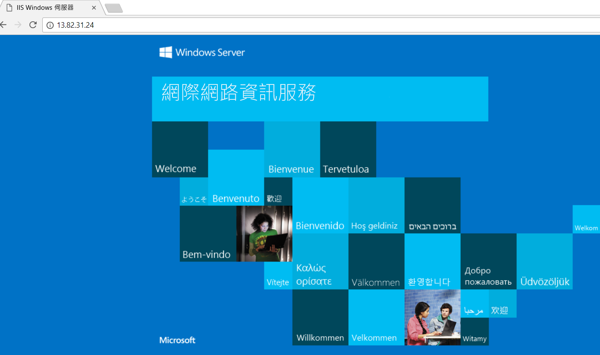

# 快速入門：使用 Azure 入口網站建立標準負載平衡器以平衡 VM 的負載

負載平衡會將傳入要求分散於多部虛擬機器，藉此提供高可用性和範圍。 您可使用 Azure 入口網站建立負載平衡器，以平衡虛擬機器 (VM) 的負載。 本快速入門示範如何使用標準負載平衡器來平衡 VM 的負載。

如果您沒有 Azure 訂用帳戶，請在開始前建立 [免費帳戶](https://azure.microsoft.com/free/?WT.mc_id=A261C142F) 。 

## 登入 Azure

在 [https://portal.azure.com](https://portal.azure.com) 登入 Azure 入口網站。

## 建立標準負載平衡器

在本節中，您會建立標準負載平衡器，以協助平衡虛擬機器的負載。 標準負載平衡器只支援標準公用 IP 位址。 當您建立標準負載平衡器時，也必須建立新的標準公用 IP 位址，而該 IP 位址會設定為標準負載平衡器的前端 (預設的名稱為 LoadBalancerFrontend)。 

1. 在畫面的左上方，選取 [建立資源] > [網路] > [負載平衡器]。
2. 在 [建立負載平衡器] 頁面的 [基本資料] 中，輸入或選取下列資訊、接受其餘設定的預設值，然後選取 [檢閱 + 建立]：

    | 設定                 | 值                                              |
    | ---                     | ---                                                |
    | 訂用帳戶               | 選取您的訂用帳戶。    |    
    | 資源群組         | 選取 [新建]，並在文字方塊中輸入 *myResourceGroupSLB*。|
    | Name                   | *myLoadBalancer*                                   |
    | 區域         | 選取 [西歐]。                                        |
    | 類型          | 選取 [公用]。                                        |
    | SKU           | 選取 [標準]。                          |
    | 公用 IP 位址 | 選取 [建立新的]。 |
    | 公用 IP 位址名稱              | 在文字方塊中輸入 *myPublicIP*。   |
    |可用性區域| 選取 [區域備援]。    |
3. 在 [檢閱 + 建立] 索引標籤中，選取 [建立]。   

    

## 建立負載平衡器資源

在本節中，您會設定後端位址集區的負載平衡器設定、健康狀態探查，並指定平衡器規則。

### 建立後端位址集區

若要將流量分散至 VM，後端位址集區包含已連線至負載平衡器之虛擬 (NIC) 的 IP 位址。 建立後端位址集區 *myBackendPool*，以包含用於平衡網際網路流量負載的虛擬機器。

1. 選取左側功能表中的 [所有服務]、選取 [所有資源]，然後從資源清單中選取 **myLoadBalancer**。
2. 在 [設定] 底下選取 [後端集區]，然後選取 [新增]。
3. 在 [新增後端集區] 頁面上，針對名稱輸入 *myBackEndPool* 作為後端集區的名稱，然後選取 [新增]。

### 建立健康狀態探查

若要讓負載平衡器監視應用程式的狀態，請使用健康狀態探查。 健康狀態探查會根據 VM 對健康情況檢查的回應，以動態方式從負載平衡器輪替中新增或移除 VM。 建立健康狀態探查 myHealthProbe 以監視 VM 的健康狀態。

1. 選取左側功能表中的 [所有服務]、選取 [所有資源]，然後從資源清單中選取 **myLoadBalancer**。
2. 在 [設定] 底下選取 [健康狀態探查]，然後選取 [新增]。
    
    | 設定 | 值 |
    | ------- | ----- |
    | Name | 輸入 *myHealthProbe*。 |
    | 通訊協定 | 選取 [HTTP]。 |
    | Port | 輸入 *80*。|
    | 間隔 | 輸入 *15* 作為探查嘗試之間的 [間隔]  秒數。 |
    | 狀況不良臨界值 | 選取 [2] 作為 [狀況不良閾值] 的數值，或將 VM 視為狀況不良之前，必須達到的連續探查失敗次數。|
    | 健全狀況探查 | 選取 [myHealthProbe]。 |
4. 選取 [確定] 。

### 建立負載平衡器規則
負載平衡器規則用來定義如何將流量分散至 VM。 您可定義連入流量的前端 IP 組態及後端 IP 集區來接收流量，以及所需的來源和目的地連接埠。 建立負載平衡器規則 *myLoadBalancerRuleWeb*，用來接聽前端 *FrontendLoadBalancer* 中的連接埠 80，以及用來將負載平衡的網路流量傳送到後端位址集區 *myBackEndPool* (也是使用連接埠 80)。 

1. 選取左側功能表中的 [所有服務]、選取 [所有資源]，然後從資源清單中選取 **myLoadBalancer**。
2. 在 [設定] 下選取 [負載平衡規則]，然後選取 [新增]。
3. 使用下列值來設定負載平衡規則：
    
    | 設定 | 值 |
    | ------- | ----- |
    | Name | 輸入 *myHTTPRule*。 |
    | 通訊協定 | 選取 [TCP]。 |
    | Port | 輸入 *80*。|
    | 後端連接埠 | 輸入 *80*。 |
    | 後端集區 | 選取 [myBackendPool]。|
    | 健全狀況探查 | 選取 [myHealthProbe]。 |
4. 保留其餘的預設值，然後選取 [確定]。
4. 選取 [確定] 。

## 建立後端伺服器

在本節中，您會建立一個虛擬網路、針對負載平衡器的後端集區建立兩部虛擬機器，然後在虛擬機器上安裝 IIS，協助測試負載平衡器。

### 建立虛擬網路
1. 在畫面的左上方，選取 [建立資源] > [網路] > [虛擬網路]。

1. 在 [建立虛擬網路] 中，輸入或選取這項資訊：

    | 設定 | 值 |
    | ------- | ----- |
    | Name | 輸入 *myVNet*。 |
    | 位址空間 | 輸入 *10.1.0.0/16*。 |
    | 訂用帳戶 | 選取您的訂用帳戶。|
    | 資源群組 | 選取現有的資源 - *myResourceGroupSLB*。 |
    | 位置 | 選取 [西歐]。|
    | 子網路 - 名稱 | 輸入 *myBackendSubnet*。 |
    | 子網路 - 位址範圍 | 輸入 *10.1.0.0/24*。 |
1. 保留其餘的預設值，然後選取 [建立]。

### 建立虛擬機器
標準負載平衡器只支援在後端集區中具有標準 IP 位址的 VM。 在本節中，您將使用兩個不同區域 (*區域 1* 和*區域 2*) 中的標準公用 IP 位址來建立兩部 VM (*myVM1* 和 *myVM2*)，這些區域已新增至稍早建立的標準負載平衡器後端集區。

1. 在入口網站的左上方，選取 [建立資源] > **[計算]** > [Windows Server 2016 Datacenter]。 
   
1. 在 [建立虛擬機器] 中，輸入或選取 [基本資訊] 索引標籤中的下列值：
   - [訂用帳戶] > [資源群組]：選取 [myResourceGroupSLB]。
   - **執行個體詳細資料** > **虛擬機器名稱**：輸入 *myVM1*。
   - [執行個體詳細資料] > [區域] > 選取 [歐洲西部]。
   - [執行個體詳細資料] > [可用性選項] > 選取 [可用性區域]。 
   - [執行個體詳細資料] > [可用性區域] > 選取 [1]。
  
1. 選取 [網路] 索引標籤，或選取 **[下一步：磁碟]**，然後選取 **[下一步：網路]**。 
   
   - 請確定已選取下列項目：
       - **虛擬網路**：*MyVNet*
       - **子網路**：*MyBackendSubnet*
       - [公用 IP] > 選取 [新建]，然後在 [建立公用 IP 位址] 視窗中，針對 [SKU] 選取 [標準]，並針對 [可用性區域] 選取 [區域備援]，然後選取 [確定]。
   - 若要在 [網路安全性群組] 之下建立新的網路安全性群組 (NSG，一種防火牆類型)，請選取 [進階]。 
       1. 在 [設定網路安全性群組] 欄位中，選取 [新建]。 
       1. 輸入 *myNetworkSecurityGroup*，然後選取 [確定]。
   - 若要使 VM 成為負載平衡器後端集區的一部分，請完成下列步驟：
        - 在 [負載平衡] 中，針對 [要將此虛擬機器放在現有負載平衡解決方案後面嗎?] 選取 [是]。
        - 在 [負載平衡設定] 中，針對 [負載平衡選項] 選取 [Azure Load Balancer]。
        - 針對 [選取負載平衡器] 選取 [myLoadBalancer]。 
1. 選取 [管理] 索引標籤，或選取 [下一步] > [管理]。 在 [監視] 下，將 [開機診斷] 設定為 [關閉]。 
1. 選取 [檢閱 + 建立]。   
1. 檢閱設定，然後選取 [建立]。
1. 請依照下列步驟，建立名為 *MyVM2* 的另一部 VM，其 標準 SKU 公用 IP 位址名為 *myVM2-ip*、可用性區域 設定為 **2**，而其他所有設定與 *myVM1* 相同。 

### 建立 NSG 規則

在本節中，您會建立網路安全性群組規則，以允許使用 HTTP 的輸入連線。

1. 選取左側功能表中的 [所有服務]、選取 [所有資源]，然後從資源清單選取 **myResourceGroupSLB** 資源群組中的 [myNetworkSecurityGroup]。
2. 在 [設定] 下，選取 [輸入安全性規則]，然後選取 [新增]。
3. 輸入輸入安全性規則 (名為 myHTTPRule) 的下列值，以允許使用連接埠 80 的輸入 HTTP 連線：
    - 服務標記 - 作為 [來源]。
    - 網際網路 - 作為 [來源服務標記]
    - 80 - 作為 [目的地連接埠範圍]
    - TCP - 作為 [通訊協定]
    - 允許 - 作為 [動作]
    - 100 作為 [優先順序]
    - myHTTPRule 作為名稱
    - 允許 HTTP - 作為描述
4. 選取 [確定] 。
 
### 安裝 IIS

1. 選取左側功能表中的 [所有服務]、選取 [所有資源]，然後從資源清單選取 *myResourceGroupSLB* 資源群組中的 [myVM1]。
2. 在 [概觀] 頁面上，選取 [連線] 以透過 RDP 連入 VM。
3. 以使用者名稱 azureuser 登入 VM。
4. 在伺服器桌面上，瀏覽至 [Windows 系統管理工具]>[伺服器管理員]。
5. 在 [伺服器管理員] 中，選取 [新增角色及功能]。
6. 在 [新增角色及功能精靈] 中，使用下列值：
    - 在 [選取安裝類型] 頁面中，選取 [角色型或功能型安裝]。
    - 在 [選取目的地伺服器] 頁面中，選取 [myVM1]
    - 在 [選取伺服器角色] 頁面中，選取 [網頁伺服器 (IIS)]
    - 依照指示完成精靈的其餘部分 
7. 針對虛擬機器 myVM2 重複步驟 1 到 6。

## 測試負載平衡器
1. 在 [概觀] 畫面上尋找負載平衡器的公用 IP 位址。 選取左側功能表中的 [所有服務]、選取 [所有資源]，然後選取 [myPublicIP]。

2. 將公用 IP 位址複製並貼到您瀏覽器的網址列。 IIS Web 伺服器的預設頁面會顯示在瀏覽器上。

      

若要查看負載平衡器如何將流量分散於執行您應用程式的所有三部 VM，您可以強制重新整理您的網頁瀏覽器。

## 清除資源

若不再需要，可刪除資源群組、負載平衡器和所有相關資源。 若要這樣做，請選取包含負載平衡器的資源群組 (*myResourceGroupSLB*)，然後選取 [刪除]。

## 後續步驟

在本快速入門中，您已建立標準負載平衡器、將 VM 連結到標準負載平衡器、設定負載平衡器流量規則、健康狀態探查，然後測試負載平衡器。 若要深入了解 Azure Load Balancer，請繼續 Azure Load Balancer 的教學課程。

> [!div class="nextstepaction"]
> [Azure Load Balancer 教學課程](tutorial-load-balancer-standard-public-zone-redundant-portal.md)
