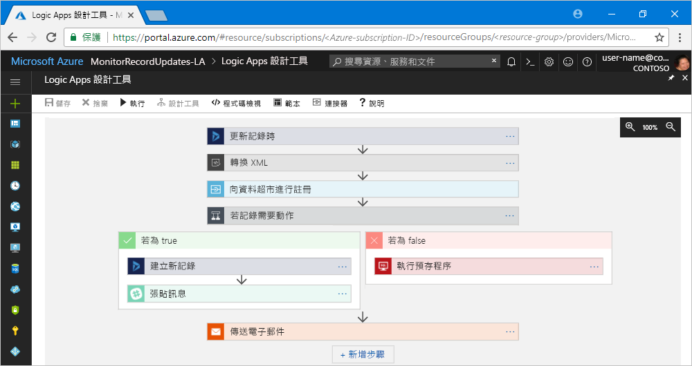

# 什麼是 Azure Logic Apps？

[Azure Logic Apps](https://azure.microsoft.com/services/logic-apps) 是一項雲端服務，可在您需要跨企業或組織整合應用程式、資料、系統和服務時，協助您排程、自動化及協調工作、商務程序和[工作流程](#logic-app-concepts)。 Logic Apps 會簡化設計和建立可調整解決方案的方式，以便在雲端、內部部署環境或兩者中進行應用程式[整合](https://azure.microsoft.com/product-categories/integration/)、資料整合、系統整合、企業應用程式整合 (EAI) 和企業對企業 (B2B) 通訊。

例如，以下是可利用邏輯應用程式自動執行的幾項工作負載：

* 處理並路由傳送跨內部部署系統與雲端服務的訂單。
* 在各種系統、應用程式和服務中發生事件時，透過 Office 365 傳送電子郵件通知。
* 將上傳的檔案從 FTP 或 FTP 伺服器移到 Azure 儲存體。 
* 監視特定主旨的推文、分析情緒，以及針對需要檢閱的項目建立警示或工作。

若要使用 Azure Logic Apps 來建置整合解決方案，您可以從具有 [200 個以上連接器](../connectors/apis-list.md)的成長中資源庫進行選擇，其中包括 Azure 服務匯流排、Functions 和儲存體等服務；SQL、Office 365、Dynamics、Salesforce、BizTalk、SAP、Oracle DB、檔案共用等等。 [連接器](#logic-app-concepts)會提供[觸發程序](#logic-app-concepts)、[動作](#logic-app-concepts)或兩者，以便建立可即時安全地存取及處理資料的邏輯應用程式。

> [!VIDEO https://channel9.msdn.com/Blogs/Azure/Introducing-Azure-Logic-Apps/player]

## Logic Apps 如何運作？ 

每個邏輯應用程式都會使用觸發程序啟動，而該觸發程序會在特定事件發生時，或在可用的新資料符合特定準則時引發。 Logic Apps 中連接器提供的許多觸發程序都包含基本排程功能，以便您設定工作負載定期執行的方式。 如需更複雜的排程或進階的週期，可以在任何工作流程中使用循環觸發程序作為第一步。 深入了解[以排程為基礎的工作流程](../logic-apps/concepts-schedule-automated-recurring-tasks-workflows.md)。

每次引發觸發程序時，Logic Apps 引擎就會建立可執行工作流程動作的邏輯應用程式執行個體。 這些動作也可以包含資料轉換和流程控制，例如條件陳述式、切換陳述式、迴圈和分支。 例如，此邏輯應用程式會使用具有「在記錄更新時」內建準則的 Dynamics 365 觸發程序啟動。 如果觸發程序偵測到符合此準則的事件，則觸發程序會引發並執行工作流程的動作。 這些動作包括 XML 轉換、資料更新、決策分支和電子郵件通知。

您可以使用 Logic Apps 設計工具 (可透過瀏覽器在 Azure 入口網站中和在 Visual Studio 中取得)，以視覺化方式建立邏輯應用程式。 如需更多自訂邏輯應用程式，您可以在「程式碼檢視」編輯器中，以 JavaScript 物件標記法 (JSON) 建立或編輯邏輯應用程式定義。 您也可以對精選工作使用 Azure PowerShell 和 Azure Resource Manager 範本。 Azure 上的邏輯應用程式會在雲端部署並執行。 如需更詳細的簡介，請觀看以下影片：[使用 Azure Enterprise Integration Services 來執行大規模的雲端應用程式](https://channel9.msdn.com/Events/Connect/2017/T119/)

## 為何使用 Logic Apps？

隨著企業邁向數位化，邏輯應用程式可藉由提供預先建置的 API 作為 Microsoft 管理的連接器，協助您更輕鬆快速地與舊有、新式和尖端系統連線。 如此一來，您即可專注於應用程式的商務邏輯與功能。 您不必擔心建置、裝載、調整、管理、維護和監視您的應用程式。 Logic Apps 會為您處理這些疑慮。 再者，根據取用[定價模式](../logic-apps/logic-apps-pricing.md)，您只需針對使用的部分付費。 

在許多情況下，您不需要撰寫程式碼。 但如果您必須撰寫一些程式碼，您可以使用 [Azure Functions](../azure-functions/functions-overview.md) 建立程式碼片段，並依照需求從邏輯應用程式執行該程式碼。 此外，如果您的邏輯應用程式需要與來自 Azure 服務、自訂應用程式或其他解決方案的事件互動，您可以使用 [Azure 事件格線](../event-grid/overview.md)搭配邏輯應用程式來監視、路由傳送及發佈事件。

Logic Apps、Functions 和 Event Grid 都是由 Microsoft Azure 完全管理，您不必擔心建置、裝載、調整、管理、監視和維護您的解決方案。 利用這項功能來建立[「無伺服器」應用程式和解決方案](../logic-apps/logic-apps-serverless-overview.md)，您就可以專注於商務邏輯。 這些服務會自動進行調整，以符合您的需求、加快整合，以及協助您使用最少的程式碼來建置強大的雲端應用程式。 再者，根據取用[定價模式](../logic-apps/logic-apps-pricing.md)，您只需針對使用的部分付費。 

若要了解公司結合 Logic Apps 與其他 Azure 服務和 Microsoft 產品時，如何提升其靈活度及更加著重其核心業務，請參閱這些[客戶案例](https://aka.ms/logic-apps-customer-stories)。

以下是有關 Logic Apps 功能和優點的詳細資訊：

### 使用容易使用的工具以視覺化方式建立工作流程

使用視覺化設計工具，節省時間並簡化複雜程序。 透過瀏覽器在 Azure 入口網站中或在 Visual Studio 中使用 Logic Apps 設計工具，自始至終建立邏輯應用程式。 使用觸發程序啟動您的工作流程，並從[連接器資源庫](../connectors/apis-list.md)新增任意數目的動作。

### 使用邏輯應用程式範本更快入門

當您選擇[範本資源庫](../logic-apps/logic-apps-create-logic-apps-from-templates.md)中預先定義的工作流程時，可以更快速地建立常用的解決方案。 範本涵蓋軟體即服務 (SaaS) 應用程式的簡易連線、進階 B2B 解決方案，以及「有趣的」範本。 了解如何[從預先建置的範本建立邏輯應用程式](../logic-apps/logic-apps-create-logic-apps-from-templates.md)。

### 跨越不同環境連線不同的系統

有些模式和工作流程很輕易描述，但難以在程式碼中實作。 邏輯應用程式可協助您順暢地跨越內部部署和雲端環境連線不同的系統。 例如，您可以將雲端行銷解決方案連線至內部部署計費系統，或使用企業服務匯流排集中處理跨越 API 和系統的傳訊。 邏輯應用程式會提供快速、可靠且一致的方式，為這些案例提供可重複使用並可重新設定的解決方案。

### 企業整合和 B2B 案例的頂級支援

企業和組織可使用業界標準，但不同的訊息通訊協定和格式 (例如 EDIFACT、AS2 和 X12)，以電子方式彼此通訊。 您可以使用[企業整合套件 (EIP)](../logic-apps/logic-apps-enterprise-integration-overview.md) 中的功能來建立邏輯應用程式，以將合作夥伴使用的訊息格式轉換成貴組織的系統可解譯和處理的格式。 Logic Apps 會利用加密與數位簽章，順暢且安全地處理這些交換。

從您目前的系統與服務著手，並以您自己的步調逐漸成長。 當您準備就緒時，Logic Apps 和 EIP 會提供下列功能等，協助您實作及相應增加至更多成熟的整合案例：

* 打造下列產品與服務：

  * [Microsoft BizTalk Server](https://docs.microsoft.com/biztalk/core/introducing-biztalk-server)
  * [Azure 服務匯流排](../service-bus-messaging/service-bus-messaging-overview.md)
  * [Azure Functions](../azure-functions/functions-overview.md)
  * [Azure API 管理](../api-management/api-management-key-concepts.md)

* 處理 [XML 訊息](../logic-apps/logic-apps-enterprise-integration-xml.md)
* 處理[一般檔案](../logic-apps/logic-apps-enterprise-integration-flatfile.md)
* 透過 [EDIFACT](../logic-apps/logic-apps-enterprise-integration-edifact.md)、[AS2](../logic-apps/logic-apps-enterprise-integration-as2.md) 和 [X12](../logic-apps/logic-apps-enterprise-integration-x12.md) 通訊協定交換訊息
* 使用[整合帳戶](../logic-apps/logic-apps-enterprise-integration-accounts.md)集中儲存和管理這些 B2B 成品等：

  * [合作夥伴](../logic-apps/logic-apps-enterprise-integration-partners.md)
  * [合約](../logic-apps/logic-apps-enterprise-integration-agreements.md) 
  * [XML 轉換對應](../logic-apps/logic-apps-enterprise-integration-maps.md)
  * [XML 驗證結構描述](../logic-apps/logic-apps-enterprise-integration-schemas.md)
   
例如，如果您使用 Microsoft BizTalk Server，則邏輯應用程式可以使用 [BizTalk Server 連接器](../connectors/apis-list.md#on-premises-connectors)與您的 BizTalk Server 連線並通訊。 您可以接著在邏輯應用程式中包含[整合帳戶連接器](../connectors/apis-list.md#integration-account-connectors) (可透過企業整合套件取得)，以便擴充或執行類似 BizTalk 的作業。 

BizTalk Server 可以透過另一種方式，使用[適用於 Logic Apps 的 Microsoft BizTalk Server 配接器](https://www.microsoft.com/download/details.aspx?id=54287)連線到邏輯應用程式並且進行通訊。 了解如何在 BizTalk Server 中[設定和使用 BizTalk Server 配接器](https://docs.microsoft.com/biztalk/core/logic-app-adapter)。

### 撰寫一次，經常重複使用

建立您的邏輯應用程式作為範本，您便可跨越多個環境和區域[部署和重新設定應用程式](../logic-apps/logic-apps-create-deploy-template.md)。

### 內建擴充性

如果找不到您想要或執行自訂程式碼所需的連接器，您可以透過 [Azure Functions](../azure-functions/functions-overview.md) 建立自己的程式碼片段並依照需求進行呼叫，以擴充邏輯應用程式。 建立您可以從邏輯應用程式呼叫的自有 [API](../logic-apps/logic-apps-create-api-app.md) 和[自訂連接器](../logic-apps/custom-connector-overview.md)。

### 用多少付多少
  
除非您有先前使用 App Service 方案建立的邏輯應用程式，否則 Logic Apps 會使用以取用量為基礎的[定價和計量](../logic-apps/logic-apps-pricing.md)。

利用下列介紹影片深入了解 Logic Apps：

* [與 Logic Apps 整合 - 從狗熊變英雄](https://channel9.msdn.com/Events/Build/2017/C9R17)
* [利用 Microsoft Azure Logic App 進行企業整合](https://channel9.msdn.com/Events/Ignite/Microsoft-Ignite-Orlando-2017/BRK2188)
* [使用 Logic Apps 建立進階商務程序](https://channel9.msdn.com/Events/Ignite/Microsoft-Ignite-Orlando-2017/BRK3179)

## 主要詞彙

* **工作流程**：視覺化、設計、建立、自動執行商務程序，以及將其部署為一系列的步驟。

* **受控連接器**：邏輯應用程式需要資料、服務和服務的存取權。 您可以使用預先建置並由 Microsoft 管理的連接器，其設計用來連線、存取及使用您的資料。 請參閱[適用於 Azure Logic Apps 的連接器](../connectors/apis-list.md)

* **觸發程序**：由 Microsoft 管理的許多連接器會提供可在事件或新資料符合指定的條件時引發的觸發程序。 比方說，事件可能是收到一封電子郵件，或偵測到您的 Azure 儲存體帳戶有變更。 每次引發觸發程序時，Logic Apps 引擎就會建立可執行工作流程的新邏輯應用程式執行個體。

* **動作**：「動作」是指在觸發程序之後發生的所有步驟。 每個動作通常會對應至受控連接器、自訂 API 或自訂連接器所定義的作業。

* **企業整合套件**：在更進階的整合案例中，Logic Apps 會包含來自 BizTalk Server 的功能。 企業整合套件提供的連接器可協助邏輯應用程式輕鬆地執行驗證、轉換等等。

## Logic Apps 與 Functions、WebJobs 和 Flow 有何不同？

上述這些服務都可協助您一起「黏附」及連線不同的系統。 每個服務都各有其優點，因此把這些服務的功能結合在一起，是快速建置可調式、全功能整合系統的最佳方式。 如需詳細資訊，請參閱[在 Flow、Logic Apps、Functions 和 WebJobs 之間做選擇](../azure-functions/functions-compare-logic-apps-ms-flow-webjobs.md)。

## 開始使用 

Logic Apps 是裝載於 Microsoft Azure 的許多服務之一。 因此開始使用前，您需要有 Azure 訂用帳戶。 如果您沒有訂用帳戶，請[註冊一個免費的 Azure 帳戶](https://azure.microsoft.com/free/)。 

如果您有 Azure 訂用帳戶，請嘗試此[快速入門以建立第一個邏輯應用程式](../logic-apps/quickstart-create-first-logic-app-workflow.md)，該邏輯應用程式會透過 RSS 摘要監視網站上的新內容，以及在新內容出現時傳送電子郵件。

## 後續步驟

* [使用以排程為基礎的邏輯應用程式來檢查流量](../logic-apps/tutorial-build-schedule-recurring-logic-app-workflow.md)
* 深入了解 [Azure 無伺服器解決方案](../logic-apps/logic-apps-serverless-overview.md)
* 深入了解[使用企業整合套件進行 B2B 整合](../logic-apps/logic-apps-enterprise-integration-overview.md)
