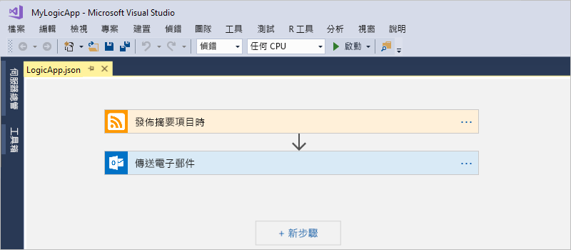
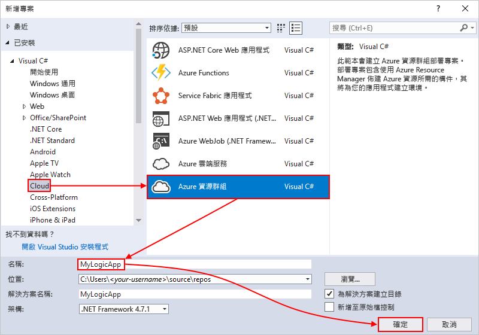
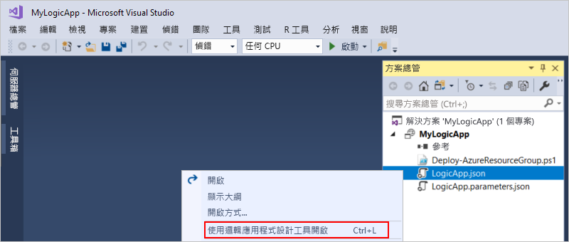
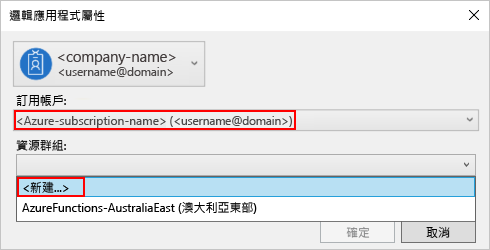
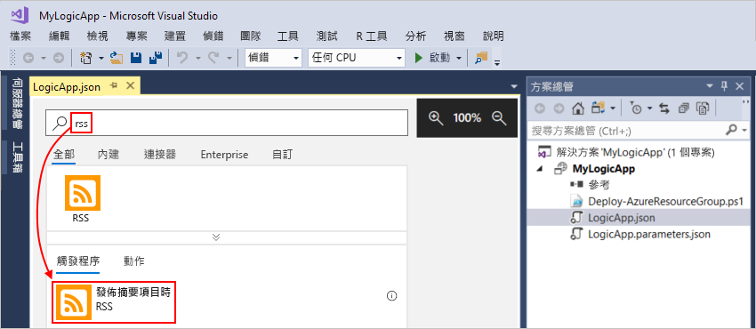
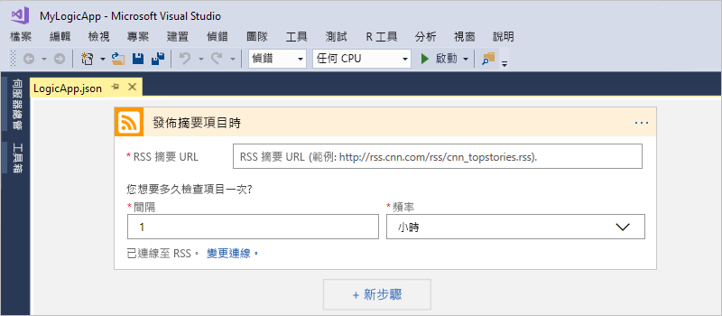
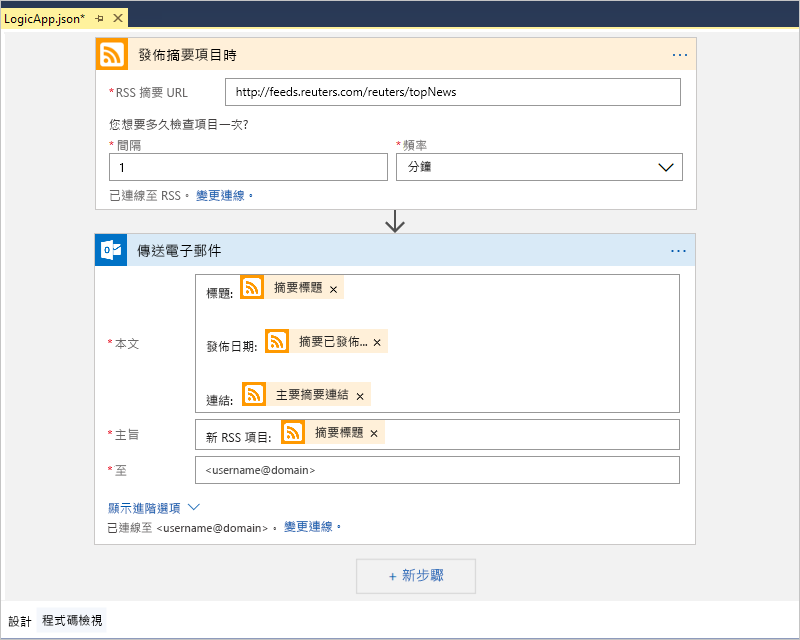
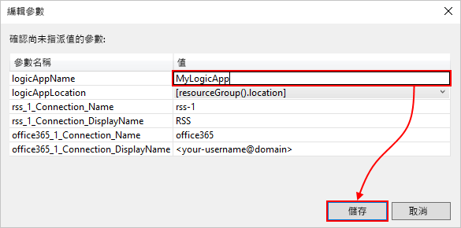
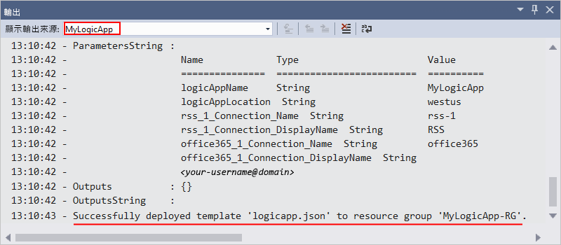
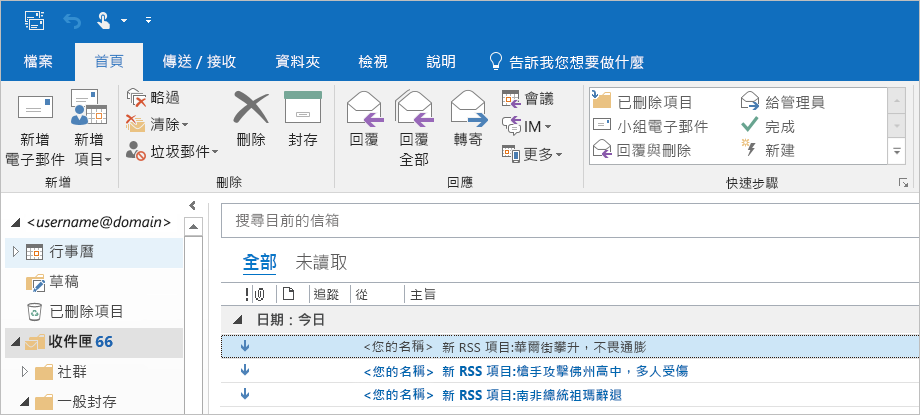

# 快速入門：使用 Azure Logic Apps 建立和自動執行工作、程序和工作流程 - Visual Studio

使用 [Azure Logic Apps](../logic-apps/logic-apps-overview.md) 和 Visual Studio，您可以建立可自動執行工作和程序的工作流程，以便整合各企業和組織的應用程式、資料、系統和服務。 本快速入門示範如何藉由以下方式設計及建立這些工作流程：在 Visual Studio 中建立邏輯應用程式，並將這些應用程式部署至雲端中的 <a href="https://docs.microsoft.com/azure/guides/developer/azure-developer-guide" target="_blank">Azure</a>。 雖然您可以在 <a href="https://portal.azure.com" target="_blank">Azure 入口網站</a>中執行這些工作，但 Visual Studio 可讓您將邏輯應用程式新增至原始檔控制、發佈不同的版本，並針對不同的部署環境建立 Azure Resource Manager 範本。 

如果您還不熟悉 Azure Logic Apps 而只想要基本概念，請改為嘗試[在 Azure 入口網站中建立邏輯應用程式的快速入門](../logic-apps/quickstart-create-first-logic-app-workflow.md)。 在 Azure 入口網站與 Visual Studio 中，邏輯應用程式設計工具的運作方式類似。 

在此，您會建立與 Azure 入口網站快速入門中相同的邏輯應用程式，但與 Visual Studio 不同。 此邏輯應用程式會監視網站的 RSS 摘要，並針對網站上張貼的每個新項目傳送電子郵件。 完成時，您的邏輯應用程式大致如下列高階工作流程所示︰

開始之前，請確定您具有下列項目：

* 如果您沒有 Azure 訂用帳戶，請先<a href="https://azure.microsoft.com/free/" target="_blank">註冊一個免費的 Azure 帳戶</a>。

* 如果您還沒有以下這些工具，請加以下載並安裝： 

  * <a href="https://www.visualstudio.com/downloads" target="_blank">Visual Studio 2017 或 Visual Studio 2015 - Community 版本或更高版本</a>。 
  本快速入門使用免費的 Visual Studio Community 2017。

  * <a href="https://azure.microsoft.com/downloads/" target="_blank">Microsoft Azure SDK for .NET (2.9.1 或更新版本)</a> 和 <a href="https://github.com/Azure/azure-powershell#installation" target="_blank">Azure PowerShell</a>。 
  深入了解 <a href="https://docs.microsoft.com/dotnet/azure/dotnet-tools?view=azure-dotnet">Azure SDK for .NET</a>。

  * <a href="https://marketplace.visualstudio.com/items?itemName=VinaySinghMSFT.AzureLogicAppsToolsforVisualStudio-18551" target="_blank">Azure Logic Apps Tools for Visual Studio 2017</a> 或 <a href="https://marketplace.visualstudio.com/items?itemName=VinaySinghMSFT.AzureLogicAppsToolsforVisualStudio" target="_blank">Visual Studio 2015 版本</a>
  
    您可以直接從 Visual Studio Marketplace 下載並安裝 Azure Logic Apps Tools，或了解<a href="https://docs.microsoft.com/visualstudio/ide/finding-and-using-visual-studio-extensions" target="_blank">如何從 Visual Studio 內部安裝此擴充功能</a>。 
    請務必在完成安裝之後重新啟動 Visual Studio。

* Logic Apps 支援的電子郵件帳戶 (例如 Office 365 Outlook、Outlook.com 或 Gmail)。 對於其他提供者，請<a href="https://docs.microsoft.com/connectors/" target="_blank">檢閱這裡的連接器清單</a>。 此邏輯應用程式會使用 Office 365 Outlook。 如果您使用不同的提供者，則整體步驟相同，但您的 UI 可能稍有不同。

* 使用內嵌的邏輯應用程式設計工具時能夠存取 Web

  設計工具需要網際網路連線才能在 Azure 中建立資源，以及從邏輯應用程式中的連接器讀取屬性和資料。 
  例如，如果您使用 Dynamics CRM Online 連接器，則設計工具會檢查您的 CRM 執行個體，以取得可用的預設和自訂屬性。

## 建立 Azure 資源群組專案

若要開始進行，請建立 [Azure 資源群組專案](../azure-resource-manager/vs-azure-tools-resource-groups-deployment-projects-create-deploy.md)。 深入了解 [Azure 資源群組和資源](../azure-resource-manager/resource-group-overview.md)。

1. 啟動 Visual Studio 並以您的 Azure 帳戶登入。

2. 在 [檔案] 功能表上，選取 [新增] > [專案]。 (鍵盤：Ctrl+Shift+N)

   ![在 [檔案] 功能表上，選取 [新增] > [專案]](./media/quickstart-create-logic-apps-with-visual-studio/create-new-visual-studio-project.png)

3. 在 [已安裝] 之下，選取 **Visual C#** 或 **Visual Basic**。 選取 [雲端] > [Azure 資源群組]。 替您的專案命名，例如：

   

4. 選取 [邏輯應用程式] 範本。 

   ![選取 [邏輯應用程式] 範本](./media/quickstart-create-logic-apps-with-visual-studio/select-logic-app-template.png)

   在 Visual Studio 建立您的專案之後，[方案總管] 隨即開啟並顯示您的方案。 

   ![[方案總管] 會顯示新的邏輯應用程式方案和部署檔案](./media/quickstart-create-logic-apps-with-visual-studio/logic-app-solution-created.png)

   您在方案中，**LogicApp.json** 檔案不只會儲存邏輯應用程式的定義，同時也是您可以設定以供部署的 Azure Resource Manager 範本。

## 建立空白邏輯應用程式

建立 Azure 資源群組專案之後，從 [空白邏輯應用程式] 範本開始建立並建置邏輯應用程式。

1. 在 [方案總管] 中，開啟 LogicApp.json 檔案的捷徑功能表。 選取 [以邏輯應用程式設計工具開啟]。 (鍵盤：Ctrl+L)

   

2. 針對 [訂用帳戶]，選取您要使用的 Azure 訂用帳戶。 針對 [資源群組]，選取 [建立新的...] 以建立新的 Azure 資源群組。 

   

   Visual Studio 需要您的 Azure 訂用帳戶和一個資源群組，以便建立及部署與您的邏輯應用程式相關聯的資源和連線。 

   | 設定 | 範例值 | 說明 | 
   | ------- | ------------- | ----------- | 
   | 使用者設定檔清單 | Contoso   jamalhartnett@contoso.com | 根據預設，用來登入的帳戶 | 
   | **訂用帳戶** | Pay-As-You-Go   (jamalhartnett@contoso.com) | Azure 訂用帳戶的名稱和相關聯的帳戶 |
   | **資源群組** | MyLogicApp-RG   (美國西部) | Azure 資源群組和位置，以供儲存及部署邏輯應用程式的資源 | 
   | **位置** | MyLogicApp-RG2   (美國西部) | 如果您不想要使用資源群組位置，則為不同的位置 |
   ||||

3. Logic Apps 設計工具會開啟並顯示含有簡介影片和常用觸發程序的頁面。 將影片與觸發程序捲動過去。 在 [範本] 底下，選取 [空白邏輯應用程式]。

   ![選取 [空白邏輯應用程式]](./media/quickstart-create-logic-apps-with-visual-studio/choose-blank-logic-app-template.png)

## 建置邏輯應用程式工作流程

接下來，新增可在新的 RSS 摘要項目出現時引發的[觸發程序](../logic-apps/logic-apps-overview.md#logic-app-concepts)。 每個邏輯應用程式都必須使用觸發程序啟動，而該觸發程序會在符合特定條件時引發。 每次引發觸發程序時，Logic Apps 引擎會建立邏輯應用程式執行個體，以執行您的工作流程。

1. 在邏輯應用程式設計工具的搜尋方塊中輸入 "rss"。 選取此觸發程序︰**摘要項目發佈時**

   

   觸發程序現在會出現在設計工具中：

   

2. 若要完成邏輯應用程式的建置，請遵循 [Azure 入口網站快速入門](../logic-apps/quickstart-create-first-logic-app-workflow.md#add-rss-trigger)中的工作流程步驟，然後回到本文。

   當您完成時，邏輯應用程式如此範例所示︰ 

   

3. 若要儲存邏輯應用程式，請儲存您的 Visual Studio 方案。 (鍵盤：Ctrl + S)

現在，將您的應用程式部署到 Azure，您才能測試邏輯應用程式。

## 將邏輯應用程式部署至 Azure

只需幾個步驟，將應用程式從 Visual Studio 部署至 Azure，您才能執行邏輯應用程式。

1. 在 [方案總管] 中，於您的專案捷徑功能表上，選取 [部署] > [新增]。 如果出現提示，登入您的 Azure 帳戶。

   

2. 針對此部署，保留 Azure 訂用帳戶、源群組和其他預設設定。 準備就緒時，請選擇 [部署]。 

   

3. 如果 [編輯參數] 方塊出現，請提供邏輯應用程式在部署時所要使用的資源名稱，然後儲存您的設定，例如：

   

   開始部署時，您應用程式的部署狀態會顯示在 Visual Studio 的 [輸出] 視窗中。 
   如果狀態並未出現，請開啟 [顯示輸出來源] 清單，然後選取您的 Azure 資源群組。

   

   如果您選取的連接器需要您提供任何輸入，則可能會在背景中開啟 PowerShell 視窗，並出現請您提供必要密碼或祕密金鑰的提示。 當您輸入這些資訊之後，部署將會繼續。
   
   
   
   部署完成之後，應用程式邏輯會存留在 Azure 入口網站中，並根據您指定的排程 (每分鐘) 檢查 RSS 摘要。 
   如果 RSS 摘要有新的項目，邏輯應用程式會針對每個新的項目傳送電子郵件。 
   否則，邏輯應用程式會等到下一個間隔，再檢查一次。 

   例如，以下是此邏輯應用程式傳送的範例電子郵件。 
   如果您沒有得到任何電子郵件，請檢查垃圾郵件資料夾。 

   

   技術上，當觸發程序檢查 RSS 摘要並尋找新項目時，觸發程序會引發，而 Logic Apps 引擎會建立邏輯應用程式工作流程的執行個體，以在工作流程中執行動作。
   如果觸發程序找不到新項目，觸發程序並不會引發，而且會「略過」具現化工作流程。

恭喜，您現在已透過 Visual Studio 成功建置和部署您的邏輯應用程式！ 若要管理應用程式邏輯並檢閱其執行歷程記錄，請參閱[使用 Visual Studio 管理邏輯應用程式](../logic-apps/manage-logic-apps-with-visual-studio.md)。

## 清除資源

如果不再需要，請刪除包含邏輯應用程式的資源群組和相關資源。

1. 以用來建立應用程式邏輯的相同帳戶登入 <a href="https://portal.azure.com" target="_blank">Azure 入口網站</a>。 

2. 在 Azure 主功能表上，選取 [資源群組]。
選取您邏輯應用程式的資源群組，然後選取 [概觀]。

3. 在 [概觀] 頁面上，選擇 [刪除資源群組]。 輸入資源群組名稱作為確認，然後選擇 [刪除]。

   ![[資源群組] > [概觀] > [刪除資源群組]](./media/quickstart-create-logic-apps-with-visual-studio/delete-resource-group.png)

4. 刪除本機電腦中的 Visual Studio 解決方案。

## 取得支援

* 如有問題，請瀏覽 <a href="https://social.msdn.microsoft.com/Forums/en-US/home?forum=azurelogicapps" target="_blank">Azure Logic Apps 論壇</a>。
* 若要提交或票選功能構想，請造訪 <a href="http://aka.ms/logicapps-wish" target="_blank">Logic Apps 使用者意見反應網站</a>。

## 後續步驟

本文中，您已使用 Visual Studio 建置、部署及執行邏輯應用程式。 若要深入了解如何使用 Visual Studio 來管理及執行邏輯應用程式的進階部署，請參閱下列文章：

> [!div class="nextstepaction"]
> * [使用 Visual Studio 管理邏輯應用程式](../logic-apps/manage-logic-apps-with-visual-studio.md)
> * [透過 Visual Studio 建立邏輯應用程式的部署範本](../logic-apps/logic-apps-create-deploy-template.md)
