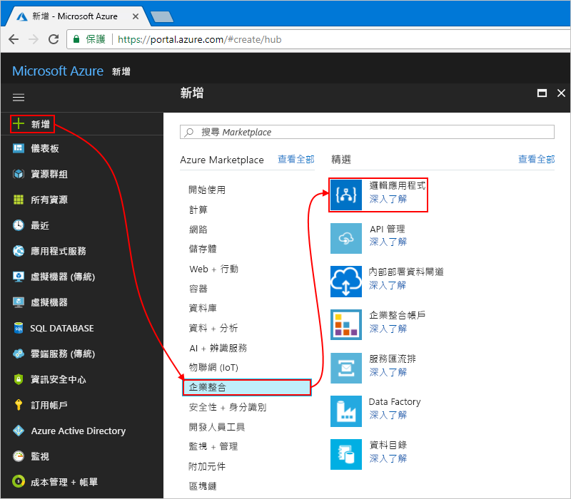
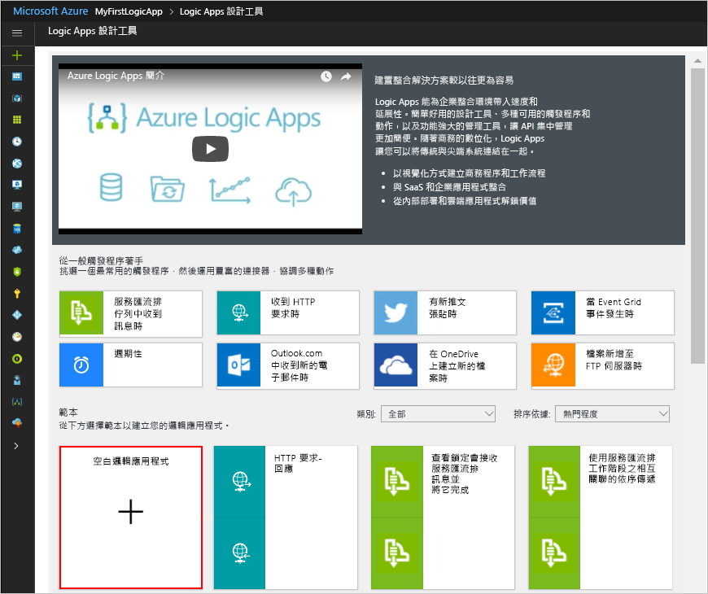

# <a name="manage-mailing-list-requests-with-azure-logic-apps"></a>使用 Azure Logic Apps 來管理郵寄清單要求

Azure Logic Apps 可協助您自動執行工作流程，並整合 Azure 服務、Microsoft 服務和其他軟體即服務 (SaaS) 應用程式與內部部署系統的資料。 本教學課程說明如何建立[邏輯應用程式](../logic-apps/logic-apps-overview.md)，以處理 [MailChimp](https://mailchimp.com/) 服務所管理之郵寄清單的訂閱要求。
此邏輯應用程式會監視這些要求的電子郵件帳戶、傳送這些要求以供核准，並將已核准的成員新增至郵寄清單。

在本教學課程中，您了解如何：

> [!div class="checklist"]
> * 建立空白邏輯應用程式。
> * 新增用來監視訂閱要求之電子郵件的觸發程序。
> * 新增可傳送電子郵件的動作，以便核准或拒絕這些要求。
> * 新增可檢查核准回覆的條件。
> * 新增可將已核准的成員新增至郵寄清單的動作。
> * 新增可檢查這些成員是否成功加入清單的條件。
> * 新增可傳送電子郵件的動作，以確認這些成員是否成功加入清單。

當您完成時，邏輯應用程式大致如下列工作流程所示︰


如果您沒有 Azure 訂用帳戶，請在開始前，先<a href="https://azure.microsoft.com/free/" target="_blank">註冊一個免費的 Azure 帳戶</a>。

## <a name="prerequisites"></a>必要條件

* MailChimp 帳戶。 建立名為 "test-members-ML" 的清單，您的邏輯應用程式可以在其中為已核准的成員新增電子郵件地址。 如果您沒有帳戶，請[註冊一個免費帳戶](https://login.mailchimp.com/signup/)並了解[如何建立清單](https://us17.admin.mailchimp.com/lists/#)。 

* Office 365 Outlook 或 Outlook.com 的電子郵件帳戶，可支援核准工作流程。 本文使用 Office 365 Outlook。 如果您使用不同的電子郵件帳戶，整體步驟將維持不變，但您的 UI 外觀可能會略有不同。

## <a name="sign-in-to-the-azure-portal"></a>登入 Azure 入口網站

使用您的 Azure 帳戶認證登入 <a href="https://portal.azure.com" target="_blank">Azure 入口網站</a>。

## <a name="create-your-logic-app"></a>建立邏輯應用程式

1. 從主要 Azure 功能表，選擇 [建立資源] > [企業整合] > [邏輯應用程式]。

   

2. 在 [建立邏輯應用程式] 下，提供有關於邏輯應用程式的這項資訊，如下所示和描述。 完成時，請選擇 [釘選到儀表板] > [建立]。

   

   | 設定 | 值 | 說明 | 
   | ------- | ----- | ----------- | 
   | **名稱** | LA-MailingList | 邏輯應用程式的名稱 | 
   | **訂用帳戶** | <your-Azure-subscription-name> | Azure 訂用帳戶的名稱 | 
   | **資源群組** | LA-MailingList-RG | 用來組織相關資源之 [Azure 資源群組](../azure-resource-manager/resource-group-overview.md)的名稱 | 
   | **位置** | 美國東部 2 | 用來存放邏輯應用程式相關資訊的區域 | 
   | **Log Analytics** | 關閉 | 保留診斷記錄的 [關閉] 設定。 | 
   |||| 

3. 在 Azure 部署您的應用程式之後，Logic Apps 設計工具隨即開啟，並顯示含有簡介影片和常用邏輯應用程式模式範本的頁面。 在 [範本] 底下，選擇 [空白邏輯應用程式]。

   

接下來，請新增[觸發程序](../logic-apps/logic-apps-overview.md#logic-app-concepts)，用以接聽含有訂閱要求的內送電子郵件。
每個邏輯應用程式都必須使用觸發程序啟動，而該觸發程序會在特定事件發生或新資料符合特定條件時引發。 如需詳細資訊，請參閱[建立您的第一個邏輯應用程式](../logic-apps/quickstart-create-first-logic-app-workflow.md)。

## <a name="add-trigger-to-monitor-emails"></a>新增觸發程序來監視電子郵件

1. 在設計工具的搜尋方塊中，輸入「電子郵件送達時」。 請為您的電子郵件提供者選取此觸發程序：**<*your-email-provider*> - 新的電子郵件送達時**
   
   

   * 對於 Azure 工作或學校帳戶，選取 Office 365 Outlook。
   * 對於個人 Microsoft 帳戶，選取 Outlook.com。

2. 如果系統要求提供認證，請登入您的電子郵件帳戶，讓 Logic Apps 能夠對您的電子郵件帳戶建立連線。

3. 現在，請指定觸發程序簽入所有新電子郵件的準則。

   1. 指定檢查電子郵件的資料夾、間隔和頻率。

      

      | 設定 | 值 | 說明 | 
      | ------- | ----- | ----------- | 
      | **資料夾** | Inbox | 要監視的電子郵件資料夾 | 
      | **間隔** | 1 | 在檢查之間所要等待的間隔數目 | 
      | **頻率** | 小時 | 在檢查之間每個間隔的時間單位  | 
      |  |  |  | 

   2. 選擇 [顯示進階選項]。 在 [主旨篩選條件] 方塊中，針對要在電子郵件主旨中尋找的觸發程序輸入此文字：```subscribe-test-members-ML```

      

4. 若要立即隱藏觸發程序的詳細資料，請按一下觸發程序的標題列。

   

5. 儲存您的邏輯應用程式。 在設計工具的工具列上，選擇 [儲存]。

   邏輯應用程式目前啟用中，但是不會執行檢查內送電子郵以外的任何其他作業。 
   因此，新增會在觸發程序引發時回應的動作。

## <a name="send-approval-email"></a>傳送核准電子郵件

現在您有觸發程序，請新增可傳送電子郵件來核准或拒絕要求的[動作](../logic-apps/logic-apps-overview.md#logic-app-concepts)。 

1. 在觸發程序底下，選擇 [+ 新增步驟] > [新增動作]。 搜尋 [核准]，然後選取此動作：**<your-email-provider> - 傳送核准電子郵件**

   ![選擇 [<your-email-provider> - 傳送核准電子郵件]](./media/tutorial-process-mailing-list-subscriptions-workflow/add-action-send-approval-email.png)

2. 提供此動作的資訊，如下所示和描述： 

   

   | 設定 | 值 | 說明 | 
   | ------- | ----- | ----------- | 
   | **To** | <approver-email-address> | 核准者的電子郵件地址。 為了測試用途，您可以使用自己的地址。 | 
   | **使用者選項** | 核准、拒絕 | 核准者可以選擇的回應選項。 根據預設，核准者可以選擇 [核准] 或 [拒絕] 作為其回應。 | 
   | **主旨** | 核准 test-members-ML 的成員要求 | 描述性電子郵件主旨 | 
   |  |  |  | 

   現在，請忽略當您在特定編輯方塊內按一下時所顯示的動態內容清單或內嵌參數清單。 
   這份清單可讓您選取先前動作中的參數，以作為工作流程中的輸入。 
   您的瀏覽器寬度可決定哪一份清單會出現。 
 
4. 儲存您的邏輯應用程式。

接下來，新增一個條件以檢查核准者所選的回覆。

## <a name="check-approval-response"></a>檢查核准回覆

1. 在 [傳送核准電子郵件] 之下，選擇 [+ 新增步驟] > [新增條件]。

   條件圖形隨即出現，連同您可在工作流程中納為輸入的任何可用參數。 

2. 以更適當的描述為條件重新命名。

   1. 在條件的標題列上，選擇 **省略符號** (**...**) 按鈕 > [重新命名]。

      例如，如果您的瀏覽器以窄型檢視呈現：

      

      如果您的瀏覽器以寬型檢視呈現，且動態內容清單阻礙了對省略符號按鈕的存取，請選擇條件內的 [新增動態內容] 以關閉清單。

   2. 以下列描述為條件重新命名：```If request approved```

3. 建立可檢查核准者是否已選取 [核准] 的條件：

   1. 在此條件內，按一下位於左邊 (寬型瀏覽器檢視) 或頂端 (窄型瀏覽器檢視) 的 [選擇值] 方塊內部。
   從參數清單或動態內容清單中，選取 [傳送核准電子郵件] 下方的 [SelectedOption] 欄位。

      比如說，如果您在寬型檢視中作業，您的條件看起來就像下面這個範例︰

      ![在 [傳送核准電子郵件] 下選取 [SelectedOption]](./media/tutorial-process-mailing-list-subscriptions-workflow/build-condition-check-approval-response.png)

   2. 在比較運算子方塊中，選取此運算子：**等於**

   3. 在右側 (寬型檢視) 或底部 (窄型檢視) 的 [選擇值] 方塊中，輸入此值：```Approve```

      當您完成時，您的條件看起來就像下面這個範例︰

      

4. 儲存您的邏輯應用程式。

接下來，指定當檢閱者核准要求時邏輯應用程式執行的動作。 

## <a name="add-member-to-mailchimp-list"></a>將成員新增至 MailChimp 清單

現在，新增可將已核准的成員新增至郵寄清單的動作。

1. 在條件的 [若為 true] 分支中，選擇 [新增動作]。
搜尋 "mailchimp"，然後選取此動作：**MailChimp - 將成員新增至清單**

   ![選取 [MailChimp - 將成員新增至清單]](./media/tutorial-process-mailing-list-subscriptions-workflow/add-action-mailchimp-add-member.png)

3. 如果系統要求您登入您的 MailChimp 帳戶，請以您的 MailChimp 認證登入。

4. 提供此動作的資訊，如下所示和描述：

   ![提供 [將成員新增至清單] 的資訊](./media/tutorial-process-mailing-list-subscriptions-workflow/add-action-mailchimp-add-member-settings.png)

   | 設定 | 值 | 說明 | 
   | ------- | ----- | ----------- | 
   | **清單識別碼** | test-members-ML | MailChimp 郵寄清單的名稱 | 
   | **狀態** | 已訂閱 | 新成員的訂閱狀態。 如需詳細資訊，請參閱<a href="https://developer.mailchimp.com/documentation/mailchimp/guides/manage-subscribers-with-the-mailchimp-api/" target="_blank">使用 MailChimp API 管理訂閱者</a>。 | 
   | **電子郵件地址** | <new-member-email-address> | 從參數清單或動態內容清單中，選取 [新的電子郵件送達時] 下方的 [寄件者]，以傳入新成員的電子郵件地址。 
   |  |  |  | 

5. 儲存您的邏輯應用程式。

接下來，新增條件，以便檢查新成員是否已成功加入郵寄清單。 如此一來，邏輯應用程式會通知您這項作業成功或失敗。

## <a name="check-for-success-or-failure"></a>檢查成功或失敗

1. 在 [若為 true] 分支中，於 [將成員新增至清單] 動作之下，選擇 [更多...] > [新增條件]。

2. 以下列描述為條件重新命名：```If add member succeeded```

3. 建立可檢查已核准的成員加入郵寄清單成功或失敗的條件：

   1. 在此條件內，按一下位於左邊 (寬型瀏覽器檢視) 或頂端 (窄型瀏覽器檢視) 的 [選擇值] 方塊內部。
   從參數清單或動態內容清單中，選取 [將成員新增至清單] 下方的 [狀態] 欄位。

      比如說，如果您在寬型檢視中作業，您的條件看起來就像下面這個範例︰

      ![在 [將成員新增至清單] 下選取 [狀態]](./media/tutorial-process-mailing-list-subscriptions-workflow/build-condition-check-added-member.png)

   2. 在比較運算子方塊中，選取此運算子：**等於**

   3. 在右側 (寬型檢視) 或底部 (窄型檢視) 的 [選擇值] 方塊中，輸入此值：```subscribed```

   當您完成時，您的條件看起來就像下面這個範例︰

   

接下來，設定要在已核准的成員加入郵寄清單成功或失敗時傳送的電子郵件。

## <a name="send-email-if-member-added"></a>如果已新增成員則傳送電子郵件

1. 在 [如果新增成員成功] 條件的 [若為 true] 分支中，選擇 [新增動作]。

   ![在條件的 [若為 true] 分支中，選擇 [新增動作]](./media/tutorial-process-mailing-list-subscriptions-workflow/add-action-email-success.png)

2. 搜尋 [outlook 傳送電子郵件]，然後選取此動作：**<*your-email-provider*> - 傳送電子郵件**

   ![新增 [傳送電子郵件] 動作](./media/tutorial-process-mailing-list-subscriptions-workflow/add-action-email-success-2.png)

3. 以下列描述為動作重新命名：```Send email on success```

4. 提供此動作的資訊，如下所示和描述：

   

   | 設定 | 值 | 說明 | 
   | ------- | ----- | ----------- | 
   | **To** | <your-email-address> | 要傳送成功電子郵件的電子郵件地址。 為了測試用途，您可以使用自己的電子郵件地址。 | 
   | **主旨** | <subject-for-success-email> | 成功電子郵件的主旨。 在此教學課程中，輸入以下文字，然後從參數清單或動態內容清單中選取 [將成員新增至清單] 底下指定的欄位： <p>「成功！ 成員已新增至 'test-members-ML'：**電子郵件地址**」 | 
   | **內文** | <body-for-success-email> | 成功電子郵件的內文內容。 在此教學課程中，輸入以下文字，然後從參數清單或動態內容清單中選取 [將成員新增至清單] 底下指定的欄位：  <p>「新成員已加入 'test-members-ML'：**電子郵件地址**」</br>「成員選擇加入狀態：**狀態**」 | 
   | | | | 

5. 儲存您的邏輯應用程式。

## <a name="send-email-if-member-not-added"></a>如果未新增成員則傳送電子郵件

1. 在 [如果新增成員成功] 條件的 [若為 false] 分支中，選擇 [新增動作]。

   ![在條件的 [若為 false] 分支中，選擇 [新增動作]](./media/tutorial-process-mailing-list-subscriptions-workflow/add-action-email-failed.png)

2. 搜尋 [outlook 傳送電子郵件]，然後選取此動作：**<*your-email-provider*> - 傳送電子郵件**

   ![新增 [傳送電子郵件] 動作](./media/tutorial-process-mailing-list-subscriptions-workflow/add-action-email-failed-2.png)

3. 以下列描述為動作重新命名：```Send email on failure```

4. 提供此動作的資訊，如下所示和描述：

   

   | 設定 | 值 | 說明 | 
   | ------- | ----- | ----------- | 
   | **To** | <your-email-address> | 要傳送失敗電子郵件的電子郵件地址。 為了測試用途，您可以使用自己的電子郵件地址。 | 
   | **主旨** | <subject-for-failure-email> | 失敗電子郵件的主旨。 在此教學課程中，輸入以下文字，然後從參數清單或動態內容清單中選取 [將成員新增至清單] 底下指定的欄位： <p>「失敗，成員未新增至 'test-members-ML'：**電子郵件地址**」 | 
   | **內文** | <body-for-failure-email> | 失敗電子郵件的內文內容。 在本教學課程中，請輸入此文字： <p>「成員可能已經存在。 請檢查您的 MailChimp 帳戶。」 | 
   | | | | 

5. 儲存您的邏輯應用程式。 

接著請測試您的邏輯應用程式，此時它看起來類似下列範例：

 

## <a name="run-your-logic-app"></a>執行邏輯應用程式

1. 將加入郵寄清單的電子郵件要求傳送給自己。
等候此要求出現在您的收件匣中。

3. 若要手動啟動邏輯應用程式，在設計工具工具列上，選擇 [執行]。 

   如果您的電子郵件主旨符合觸發程序的主旨篩選條件，則邏輯應用程式會傳送電子郵件給您，以核准訂閱要求。

4. 在核准電子郵件中，選擇 [核准]。

5. 如果訂閱者的電子郵件地址不存在於郵寄清單，則邏輯應用程式會新增該人員的電子郵件地址，並將如下面範例所示的電子郵件傳送給您：

   

   如果您的邏輯應用程式無法新增訂閱者，您會收到如下面範例所示的電子郵件：

   

   若未收到任何電子郵件，請檢查電子郵件的垃圾郵件資料夾。 
   您的垃圾電子郵件篩選器可能會重新導向這類郵件。 
   或者，如果您不確定邏輯應用程式是否正確執行，請參閱[針對邏輯應用程式進行疑難排解](../logic-apps/logic-apps-diagnosing-failures.md)。

恭喜，您現在已建立並執行可跨越 Azure、Microsoft 服務和其他 SaaS 應用程式整合資訊的邏輯應用程式。

## <a name="clean-up-resources"></a>清除資源

如果不再需要，請刪除包含邏輯應用程式的資源群組和相關資源。 在 Azure 主要功能表上，移至 [資源群組]，然後選取您邏輯應用程式的資源群組。 選擇 [刪除資源群組]。 輸入資源群組名稱作為確認，然後選擇 [刪除]。

![[概觀] > [刪除資源群組]](./media/tutorial-process-mailing-list-subscriptions-workflow/delete-resource-group.png)

## <a name="get-support"></a>取得支援

* 如有問題，請瀏覽 [Azure Logic Apps 論壇](https://social.msdn.microsoft.com/Forums/en-US/home?forum=azurelogicapps)。
* 若要提交或票選功能構想，請造訪 [Logic Apps 使用者意見反應網站](https://aka.ms/logicapps-wish)。

## <a name="next-steps"></a>後續步驟

在此教學課程中，您已建立可管理郵寄清單要求核准的邏輯應用程式。 現在，藉由 Azure 服務 (例如 Azure 儲存體和 Azure Functions) 的整合，了解如何建立可處理及儲存電子郵件附件的邏輯應用程式。

> [!div class="nextstepaction"]
> [處理電子郵件附件](../logic-apps/tutorial-process-email-attachments-workflow.md)