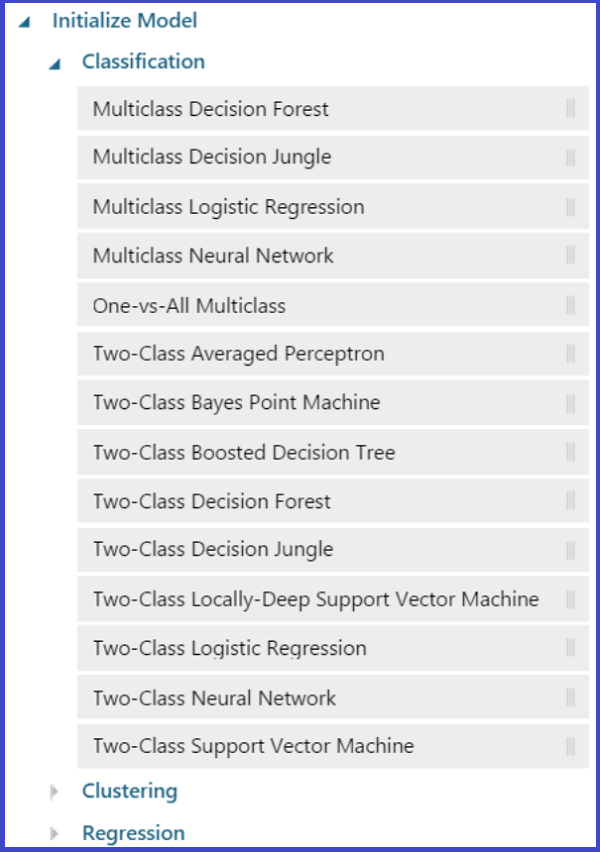

<properties 
	title="" 
	pageTitle="如何在 Azure Machine Learning 中選擇演算法 | Azure" 
	description="說明如何在 Azure Machine Learning 中選擇演算法。" 
	services="machine-learning"
	documentationCenter="" 
	authors="bradsev" 
	manager="paulettm" 
	editor="cgronlun"/>

<tags 
	ms.service="machine-learning" 
	ms.workload="data-services" 
	ms.tgt_pltfrm="na" 
	ms.devlang="na" 
	ms.topic="article" 
	ms.date="02/9/2015" 
	ms.author="bradsev" />

# 如何在 Azure Machine Learning 中選擇演算法

本主題說明機器學習方法的基本層面和輪廓，尤其是如何選取適當的演算法來分析指定類型的資料、如何回答提出的問題、如何完成指定的作業，或提供進行決策的準則。使用機器學習進行分析時，我們通常會面臨兩個問題： 

* 我們需要對可用的資料進行何種分析來達成我們的目的？ 
* 進行這項分析最適當的演算法或模型為何？

我們將討論三種類型的分析，並比較它們的使用案例： 

* 分類 
* 迴歸 
* 群集

也會討論每一種分析類型的各種演算法和 Azure Machine Learning 中包含這些可用演算法的模組。 

## **機器學習**

「機器學習」是一門專業領域，研究以資料為導向的演算法類別，這些演算法專門設計來從資料中學習，不會利用特定、預先定義的模型來測試資料。其概念是要藉由檢查資料集的模式，以更為歸納的方式取得知識，而不是使用所謂的假設-演繹方法，嘗試先猜測適合整個資料集的模型，然後再對資料集進行實證測試。這種從資料的學習有兩種類型：經過指導的學習和未經過指導的學習。 

## **經過指導的學習**  

經過指導的學習需要妥善定義目標變項，並且提供足夠數目的變項值。 

經過指導的學習是當要輸入的訓練實例已知正確的輸出結果 (或目標變項) 所進行的學習類型。訓練機器學習演算法的目標在於要尋找可將輸入對應到已知輸出值的模型 (也就是規則或函數)。這就像是有一個指導者能告訴演算法代理程式，它是否正確將輸入對應到輸出。一旦學習程序完成且有可用的模型時，它就可以套用到新的輸入資料來預測預期的輸出，這時和訓練資料集不同，目標值事先是未知的。

目標變項的本質會決定模型的類型。

有兩種分析類型採用經過指導的學習：分類和迴歸。經過指導的學習在 *classification problems*中相當常見，因為目標往往是要讓電腦學習我們建立的分類系統。回應通常只是幾個已知的值 (標籤)，例如  'true' 或  'false'。分類演算法適用名目、非序數的回應值。數字辨識是分類學習的常見範例。更廣泛來說，分類學習適用於演繹出一個分類很有用，且分類很容易決定的任何問題。

在經過指導的學習中，要調查的變項可以分成兩個群組：解釋變項 (也稱為預測項) 和依變項 (也稱為應變項)。當 *regression analysis*完成分析時，分析的目標是要指定解釋變項與依變項之間的關係。必須得知足夠大的資料集的依變項值。在迴歸中，回應或輸出變項要採用連續值，例如某台汽車每加侖汽油所跑的英哩數，一個人的年齡等等。

經過指導的學習也是訓練類神經網路和決策樹最常見的技術。這兩種技術都高度依賴預先決定的分類所提供的資訊。 

* 在類神經網路的案例中，分類可用來判斷網路的錯誤，然後調整網路將錯誤減少到最低。 
* 在決策樹的案例中，分類則用來判斷哪些屬性能提供最多的資訊來解決分類問題。  

這兩種範例都需要經過一些「指導」，亦即它們都取決於預先決定的分類所提供的資訊。 

使用隱藏 Markov 模型和 Bayesian 網路的語音辨識也依賴指導的項目，以便調整參數將指定輸入的錯誤降到最低。 

## **未經指導的學習**

在機器學習中，未經指導的學習的問題是要在未標記的資料中尋找模式或隱藏的結構。模型事先並不會獲得要訓練的資料集的「正確結果」。由於提供給學習者的學習範例並沒有任何標記，所以沒有任何錯誤或獎勵的訊號可評估可能的解決方案。目標是要讓電腦學習如何進行我們不明確告訴它怎麼做的事情！在未經指導的學習的情況中，可以相同方式對待所有變項。解釋變項和依變項之間沒有任何區別。不過，仍然有一些目標需要達成。目標可能只是減少資料，或像是尋找群集等比較特定的工作。 

在 Azure Machine Learning 中，我們可以透過**分類**、**群集**、**迴歸**，執行未經指導和經過指導的學習。

   

## **群集**  
群集是未經指導的學習的一個範例。在這種學習中，目標是要在訓練資料中尋找相似之處，並將資料集分割成幾個可由這些相似特性區分的子集。我們預期，透過這些資料導向的程序所發現的最重要群集，可以經常 (但未必永遠) 與我們直覺的分類一致。 

雖然演算法不會對這些群集指派適當的名稱，但是它還是可以產生群集，然後把這些群集分類成最適合的群集，使用這些群集來預測新範例中預期出現的相似性。這種資料導向的方法即使沒有足夠的資料，也能夠運作得很好。舉例來說，社交資訊篩選演算法 (例如 Amazon.com 用來建議書籍的演算法)，就是根據尋找相似人員的群組，然後將新的使用者指派給這些群組以提供建議。

Azure Machine Learning 中可用的群集演算法是 K-means 群集。

在未經指導的學習演算法中，K-means 是其中一個最簡單的演算法，可解決已知的群集問題。KMeans 演算法群集資料的方法是，嘗試將樣本分成 N 個相等變異的群組，條件是獲得最小的慣量或群集內平方總和。此演算法必須指定群集數目。它可以適用大量樣本數的情況，在許多不同的領域中也有非常廣泛的應用。

實作 K-means 演算法的 **K-Means 群集**模組會傳回未訓練的 K-means 群集模型，可傳遞至**訓練群集模型**進行訓練。

本圖顯示使用 K-Means 群集時要設定的選項。K-means 方法會對一組 D 維度的資料點尋找指定的群集數目。從 *initial set of K centroids*開始，此方法會使用 Lloyd 的演算法來反覆縮小質量中心的位置。演算法會在質量中心穩定時或 *specified number of iterations*完成時終止。
模組會使用最終的質量中心 (定義在 N 個資料點中找到的 K 個群集) 初始化一個 K x D 的陣列。演算法也會使用一個長度為 N 的向量，將每個資料點指派到 K 個群集中的一個群集。
如果要尋找特定的群集數 (K)，模組會依序將前 K 個資料點指派到 K 個群集。
此模組也接受使用或產生初始點來定義其初始群集組態。
*度量*定義用來測量資料點與質量中心點之間距離的方法。
每個資料點都會指派到其質量中心最接近資料點的群集。根據預設，此方法會使用 *Euclidean metric*。您可以指定 *cosine metric*做為方法的替代度量。
請注意，K-means 方法只會針對資料集尋找本機最佳的群集組態。指定不同的初始組態，方法可能會找到不同的 (可能更好) 的組態。

## **分類**  
在分類分析中，我們將樣本分成幾個類別，然後使用一組先前加上標記且訓練過的資料。此技術是用來預測資料實例的群組成員資格。 
在 Azure Machine Learning 中，可使用下列分類演算法。

 *Two-Class algorithms*用於二進位應變項 (是或否、0 或 1，true 或 false 等等)，而 *Multiclass algorithms*則用於將實例分類成兩個以上類別的任何名目應變項

### 選取分類演算法的指導方針
這一長串的演算法產生了一系列問題： 

* 您如何得知這當中的哪一個分類器對於某個特定資料集是最好的？ 
* 是否有任何情況可以「自然」選擇某一種演算法？ 
* 選擇該演算法的原則有哪些？

建議的方法之一是測試幾種不同的分類器，以及在每個演算法內測試不同的參數集，然後使用交叉驗證選取最佳的演算法。以下是一些通用的指導方針，提供您思考的起點。選擇要使用的演算法時，請考慮下列問題：

**有多少訓練資料？**
如果訓練集很小，而且您要訓練經過指導的分類器，機器學習理論建議您使用高偏差/低變異 (例如單純貝氏 (Naive Bayes)) 的分類器。這些演算法優於低偏差/高變異的分類器，例如 kNN，因為後者傾向過度擬合。但是當您的訓練集越來越大 (漸進錯誤越少)，低偏差/高變異的分類器就開始有機會勝出，因為高偏差的分類器沒有強大到足以提供正確的模型。有理論和實際結果指出，單純貝氏 (Naive Bayes) 在這類情況下也運作得很好。但是請注意，好的資料通常勝過好的演算法，而且設計良好的功能可提供更重要的優點。如果您的資料集很大，您使用何種分類演算法，其分類的結果表現可能差異不大。因此您最好改根據容易調整規模大小、  速度或使用難易度來選擇您的演算法。

**您需要以遞增方式或在批次模式中進行訓練嗎？** 
如果您需要經常使用新資料更新您的分類器 (或者您有大量資料)，您可能要使用容易更新的貝氏演算法。類神經網路和 SVM 都需要在批次模式中運用訓練資料。

**您的資料專門屬於某些分類，或者專門屬於數值資料，或者混合這兩種類型嗎？** 
貝氏對於分類/二項式資料效果最佳。決策樹無法預測數值。

**您或您的對象需要了解分類器的運作方式嗎？**  如果是，請使用貝氏或決策樹，因為這兩者對大部分的人來說都很容易理解。類神經網路和 SVM 就像「黑盒子」一般，您無法實際看到它們分類資料的方式。

**產生分類所需的速度？** 
如果要進行分類，SVM 非常快，因為它們只需要判斷您的資料位於某條「界線」的哪一側。決策樹可能會很慢，尤其是複雜 (例如很多分支) 的決策樹。

**問題呈現和需要的複雜度？**類神經網路和 SVM 可以處理複雜的非線性分類。

### 分類演算法的優點和缺點
這些分類演算法都有一些優點和  一些缺點：

**邏輯迴歸的優點和缺點：**   
邏輯迴歸分析是將結果的機率計算為具有結果的機率除以沒有結果的機率的比率。邏輯模型  是參數化的模型，因此優點是它可以讓人了解每個預測項對於應變項的影響。有了自然的機率詮釋 (不同於決策樹或 SVM)，我們可以輕鬆地更新我們的模型來納入新的資料。有很多方式可以將我們的模型正規化，所以您不需要太擔心您正在進行關聯的特徵，就像您使用單純貝氏一樣。邏輯迴歸很有用， 

* 如果我們想要一個機率架構，可以很容易在我們不確定或者要取得信賴區間時調整分類臨界值 
* 如果我們預期未來會獲得更多訓練資料，我們想要能夠快速整合到我們的模型。 

邏輯迴歸能夠比高維度資料的決策樹運作得更好。例如，在文字分類中，您有超過十萬份文件，有五十萬個相異的字詞 (特徵)。此時最好能夠有一個簡單的規則，像是線性超平面的學習，因為決策樹有太多的自由度，容易過度擬合。您可以對文字資料選擇特徵來使用決策樹，但是若挑選太過精簡的特徵，文字分類將會遺失許多寶貴的資訊。當學習模型搭配高維度資料使用時，也非常容易讓變異型的錯誤變多，因此有較高偏差的簡單模型反而更好。 

邏輯迴歸的一個缺點是當一個預測項幾乎可以解釋應變項時會變得很不穩定，因為這個變項的係數會變得很大。

**決策樹的優點和缺點：**   
[決策樹](http://research.microsoft.com/pubs/155552/decisionForests_MSR_TR_2011_114.pdf)很容易理解和說明。決策樹可以輕鬆處理特徵互動，而且不是參數化的模型，所以您不需擔心極端值，或者資料是否以線性方式分隔 (例如，決策樹可以輕鬆處理某個特徵 x 的低端有類別 A，特徵 x 的中間範圍有類別 B，以及高端又有 A 的狀況)。決策樹會產生如規則的輸出，以及如支持度、信心和增益的度量。 

其中一項缺點是，決策樹不支援線上學習，因此當出現新的範例時，您必須重新建立您的樹狀結構。另一項缺點是，決策樹很容易過度擬合，但是這正是如隨機森林 (或推進式決策樹) 可產生效用之處。此外，隨機森林通常能夠處理分類中的眾多問題。它們通常略勝於 SVM：快速、可調整，而且您不需擔心要像使用 SVM 時微調一堆參數。

**SVM 的優點和缺點：**   
支援向量機器 (Support Vector Machine，SVM) 在高維度空間中非常有效。即使維度數目大於樣本數目，SVM 仍然有效。不過，如果特徵數目遠大於樣本數目，方法執行的結果會比較差。SVM 使用記憶體的方式也很有效率，因為它在決策函數 (又稱為支援向量) 中使用訓練點的子集。它非常靈活：決策函數可以指定不同的核心函數。提供通用的核心，但也可以指定自訂的核心。核心函數可用來將低維度的訓練樣本轉換到較高的維度，這對於線性可分性問題很好用。 

不過，SVM 並不直接提供機率估計值。這些估計值要使用昂貴的五折交叉驗證計算。如果有高度的正確性、對於過度擬合有可信賴的理論保證，以及適當的核心，即使資料在基底特徵空間中沒有以線性方式分隔，SVM 也可以運作得很好。在極高維度空間的文字分類問題中，SVM 特別受到歡迎。與森林不同的地方在於，SVM 一開始就是雙類別分類器，不過最近已能搭配多個類別運作。我們可以使用類似「一對多」(one-vs-rest) 的訓練來產生不太理想的多類別分類器。因為 SVM 只能處理雙類別輸出 (亦即 2 種的類別輸出變項)，使用 N 類別，它就會學習 N 個 SVM (SVM 1 學習 "Output==1" 與 "Output != 1"、SVM 2 學習 "Output==2" 與"Output != 2"、SVM N 學習 "Output==N" 與"Output != N")。然後若要預測新輸入的輸出，它只要使用每個 SVM 進行預測，並找出哪一個 SVM 可以將最遠的預測放入正數區域。

**單純貝氏 (Naive Bayes) 的優點和缺點：**   
[單純貝氏 (Naive Bayes)](http://www.aaai.org/Papers/FLAIRS/2004/Flairs04-097.pdf) (NB) 分類器是分類問題的常見選項。它們假設特徵都是獨立無關的 - 這是技術的主要核心 'naive'。如果 NB 的條件式獨立性假設能真正滿足，單純貝氏 (Naive Bayes) 分類器將會比區別模型 (例如邏輯迴歸) 還要更容易收斂。因此，在這種情況下，您會需要較少的訓練資料。 

即使 NB 假設無法滿足，NB 分類器在實務上依然很有威力。這表示，貝氏不僅在特徵互相獨立時很好用，當特徵彼此之間的相依性在特徵之間彼此類似時，也一樣好用。所以如果想要執行起來又快速又簡單，NB 就是很好的方法。

其主要的缺點是它無法了解特徵之間的互動 (例如，它無法得知您雖然分別喜愛演員 A 和演員 B 所主演的電影，但是您卻不喜歡他們兩人同時主演的電影)。

**一對多 (One vs all)：**  
「一對多」(One vs all) 是一種策略，將多類別分類的問題縮減為一組二進位分類的問題。策略包括每個類別訓練單一分類器，該類別的樣本做為正數的樣本，而所有其他樣本則做為負數樣本。此策略需要基底的分類器對其決策產生真實值的信賴分數，而不是只有類別標籤。在對單一樣本預測多個類別時，只有抽象的類別標籤可能會導致模稜兩可。	

## **迴歸**  
在迴歸分析中，我們根據過去的推理預測新值。依變項的新值會根據一或多個測量屬性的值來計算。Azure Machine Learning 中提供下列各種迴歸演算法：

根據使用案例和既有的資料，我們會選擇其中一個演算法/模組。下面我們將說明一些迴歸演算法及其主要使用案例。

**Bayesian 線性迴歸**                      
Bayesian 線性迴歸是一種在 Bayesian 推理脈絡中執行統計分析的線性迴歸方法。當迴歸模型具有常態分佈的錯誤，而且特別是可以事先假設分佈時，模型參數的事後機率分佈可以獲得明確的結果。

**推進式決策樹迴歸**  
迴歸會計算預測項和應變項之間的關係。迴歸樹狀結構很類似分類樹狀結構。終端節點是預測的函數 (模型) 值。預測的值僅限於終端節點中的值。使用決策樹的優點包括： 

* 很容易解釋決策規則 
* 不使用參數，因此很容易和某個數值或類別範圍的資料層結合，不需要選取單一形式的訓練資料 
* 不會受到訓練資料中極端值的影響 
* 一旦發展出規則，分類就非常快速 

使用決策樹的幾個缺點是，決策樹傾向過度擬合訓練資料，在套用到完整的資料集時，這會產生不良的結果，而且不可能預測訓練資料中超過應變項的最小限制和最大限制。

**決策森林迴歸**  
決策森林可應用在分類 (類別變項) 或迴歸 (連續變項)。迴歸森林可用於提供獨立的輸入時，依變項的非線性迴歸。輸入和輸出兩者都可以是多維度。比起分類森林，迴歸森林較不常使用。主要的差異在於決策森林要與輸入資料相關聯的輸出標籤，以及訓練標籤，必須是連續的。因此必須適當地採用目標函數。迴歸森林同時擁有許多分類森林的優點，例如效率和彈性。

**線性迴歸**  
線性迴歸經常用來對純量依變項 Y 與一或多個解釋變項 X 之間的關係建構模型。它可以 (而且通常) 用來進行預測、預報或簡化。它可以用來對 Y 和 X 值的觀察資料集擬合出一個預測的模型。線性迴歸假設 Y 的基礎結構是 X 變項的線性組合。如果指定另一個 X 值卻沒有伴隨的 y 值，則擬合的線性迴歸模型就可用來預測該 Y 值。線性迴歸模型通常使用最小平方法來進行擬合，但也有其他選項可用來測量哪一種擬合為最佳結果。

**類神經網路迴歸**  
類神經網路對於非參數型迴歸是很有用的統計工具。非參數型迴歸解決問題的方式是，嘗試擬合出變項 Y 的模型 (針對一組可能的解釋變項 X1; :：：;Xp，其中 X 和 Y 之間的關係可能比簡單的線性關係更複雜。

**序數迴歸**   
序數迴歸是一種用來建立模型或預測序數依變項的迴歸分析。對於序數依變項，您可以將值排序，但是類別之間的實際距離則未知。不同值之間，只有相對順序才重要。由於標籤或目標值有自然的順序或等級，任何數值資料行都可以做為序數目標。數字的自然順序可用來將數字排序。將疾病分等級時，可以從最不嚴重到最嚴重。問卷受訪者選擇答案時可以從強烈同意到強烈不同意。學生成績可以從 A 到 F。不過基本上，序數迴歸是一種延伸的邏輯迴歸，根據成比例的機率模型。

**Poisson 迴歸**  
Poisson 迴歸通常用於建構計數資料的模型。Poisson 迴歸假設應變項都具有 Poisson 分佈。Poisson 分佈的資料在本質上為整數值 (分散且為正數)，因此可用於計數資料。提供訓練資料集，Poisson 迴歸會嘗試尋找最佳的值，讓輸入參數的對數可能值最大化。參數的可能值是從使用這些參數的分佈取樣訓練資料的機率。例如，Poisson 迴歸會適用於： 

* 建構與飛機航班數相關聯的冷天日數模型 
* 估計與事件或促銷相關的通話數目 
* 建立列聯表

<!--HONumber=49-->