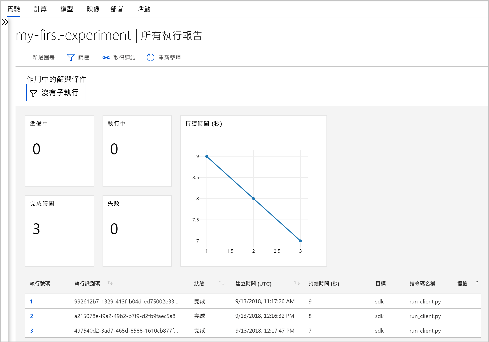
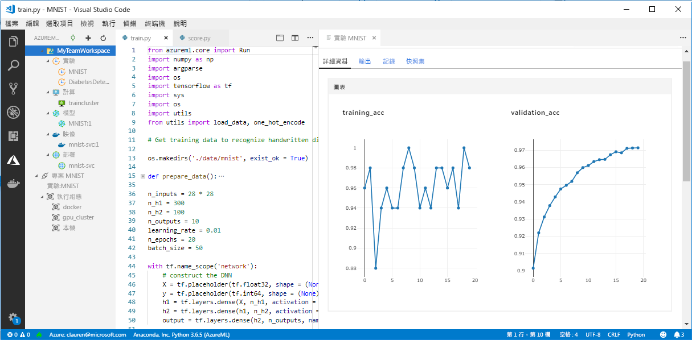

# Azure Machine Learning 服務中的 Machine Learning Workbench 發生什麼事？

Azure Machine Learning Workbench 應用程式和一些其他早期的功能已在 2018 年 9 月版本中淘汰並由其他項目取代，以便為改善的[架構](concept-azure-machine-learning-architecture.md)做準備。 為了改善您的體驗，該版本中包含了許多由客戶意見反應所促成的重大更新。 從實驗執行到模型部署的核心功能沒有變更。 但您現在可以使用健全的 <a href="https://aka.ms/aml-sdk" target="_blank">SDK</a> 和 [Azure CLI](reference-azure-machine-learning-cli.md) 來完成機器學習工作和管線。  

在本文中，您會了解變更的項目為何，以及它們如何影響使用 Azure Machine Learning Workbench 和其 API 的既有工作。

## 變更的項目為何？

最新版的 Azure Machine Learning 服務包括下列功能：
+ [簡化的 Azure 資源模型](concept-azure-machine-learning-architecture.md)。
+ [新的入口網站 UI](how-to-track-experiments.md)，可管理您的實驗和計算目標。
+ 全新且更全面的 Python <a href="https://aka.ms/aml-sdk" target="_blank">SDK</a>。
+ 全新且經過擴充的適用於機器學習的 [Azure CLI 擴充功能](reference-azure-machine-learning-cli.md)。

[架構](concept-azure-machine-learning-architecture.md)已經過重新設計，以方便您使用。 您只需要一個 [Azure Machine Learning 服務工作區](concept-azure-machine-learning-architecture.md#workspace)，而不是多個 Azure 資源和帳戶。 您可以在 [Azure 入口網站](quickstart-get-started.md)中快速建立工作區。 藉由使用工作區，多個使用者可以儲存定型和部署計算目標、模型實驗、Docker 映像、已部署的模型等等。

雖然目前的版本中有改善的新 CLI 和 SDK 用戶端，但桌面工作區應用程式本身已被淘汰。 您現在可以[在 Azure 入口網站中的工作區儀表板](how-to-track-experiments.md#view-the-experiment-in-the-azure-portal)中監視您的實驗。 使用儀表板來取得實驗記錄、管理附加到工作區的計算目標、管理模型和 Docker 映像，甚至可以部署 Web 服務。

## 我應如何移轉？

在舊版 Azure Machine Learning 服務中建立的大部分成品都儲存在您的本機或雲端儲存體。 這些成品永遠不會消失。 若要遷移，您需要使用更新的 Azure Machine Learning 服務再次登錄成品。 在這篇[遷移文章](how-to-migrate.md)中了解您可遷移的項目和遷移的方法。

## 支援時間表

在 2018 年 9 月之後，您仍可使用 Machine Learning 測試和模型管理帳戶與 Machine Learning Workbench 應用程式。 發行後三到四個月內會逐漸移除對下列資源的支援。 您仍然可以在[目錄](../desktop-workbench/tutorial-classifying-iris-part-1.md)底部的＜資源＞一節中，找到舊版功能的文件。

|淘汰&nbsp;階段|舊版功能的支援詳細資料|
|:---:|----------------|
|2018 年 12 月 4 日|已終止在 Azure 入口網站中或從 CLI 端建立 Azure Machine Learning 測試和模型管理帳戶的能力。 從 CLI 建立 Machine Learning Compute 環境的能力也已終止。 如果您目前有帳戶，CLI 和桌面 Machine Learning Workbench 在此階段會繼續運作。|
|2019 年 1 月 9 日|其他一切功能會在這一天結束支援。 範例包括其餘的 API 和桌面 Machine Learning Workbench。|

立即[開始遷移](how-to-migrate.md)。 使用新的 <a href="https://aka.ms/aml-sdk" target="_blank">SDK</a>、[CLI](reference-azure-machine-learning-cli.md) 和[入口網站](quickstart-get-started.md)即可使用所有最新功能。

## 那麼執行歷程記錄呢？

執行歷程記錄的功能會可供存取一段時間。 當您準備要移動到 Azure Machine Learning 服務更新版時，如果您想要保留這些執行歷程記錄的複本，您可以將它們匯出。

執行歷程記錄在目前的版本中稱為「實驗」。 您可以使用 SDK、CLI 或 Azure 入口網站來收集模型的實驗和探索它們。

只有在 Microsoft Edge、Chrome 和 Firefox 上才支援入口網站的工作區儀表板：

[ ] (./media/overview-what-happened-to-workbench/image001.png#lightbox)

## 我是否仍可以準備資料？

您現有的資料準備檔案無法攜帶到最新的版本，因為我們已經沒有 Machine Learning Workbench。 不過您仍然可以準備模型化要用的資料。  

對於任何規模的資料集，您可以藉由撰寫 Python 程式碼，使用 [Azure Machine Learning 資料準備 SDK](http://aka.ms/data-prep-sdk) 在模型化之前快速準備您的資料。 

您可以遵循[本教學課程](tutorial-data-prep.md)，來深入了解如何使用 Azure Machine Learning 資料準備 SDK。

## 專案是否會保存？

您不會遺失任何程式碼或作品。 在舊版中，專案是具有本機目錄的雲端實體。 在最新版中，您將使用本機設定檔將本機目錄附加到 Azure Machine Learning 服務工作區。 [請參閱最新架構的圖表](concept-azure-machine-learning-architecture.md)。

大部分專案內容都已經在您的本機電腦上。 因此，您只需要在該目錄中建立設定檔，並在您的程式碼中參照它，就能連線到您的工作區。 了解如何[遷移您現有的專案](how-to-migrate.md#projects)。

了解如何[透過主要 SDK](quickstart-create-workspace-with-python.md) 或使用 [Azure 入口網站](quickstart-get-started.md)來開始使用 Python。

## 那麼我的註冊模型和映像呢？
 
如果您要繼續使用在舊模型登錄中註冊的模型，您必須將它們遷移到新工作區。 若要遷移模型，請[下載模型並在新的工作區中重新註冊它們](how-to-migrate.md)。 

您在舊映像登錄中建立的映像，必須在新工作區中重新建立才能繼續使用它們。 您可以按照[設定與建立映像](how-to-deploy-and-where.md#configureimage)章節中的步驟來重新建立這些映像。 

## 那麼已部署的 Web 服務呢？

只要 Azure Container Service 仍受支援，您使用 Machine Learning 模型管理帳戶部署為 Web 服務的模型就會繼續運作。 那些 Web 服務甚至會在對 Machine Learning 模型管理帳戶的支援結束之後繼續運作。 不過，當對舊 CLI 的支援結束時，您管理那些 Web 服務的能力也會結束。

在較新的版本中，模型會當作 Web 服務，部署至 Azure Container Instances 或 Azure Kubernetes Service (AKS) 叢集。 您也可以部署至 FPGA 或 Azure IoT Edge。 如需詳細資訊，請參閱有關[如何部署和部署位置](how-to-deploy-and-where.md)的文章。 您可以使用新的 SDK 或 CLI 重新部署您的模型，而不用變更任何評分檔案、相依性和結構描述。 

## 那麼舊的 SDK 和 CLI 呢？

是，它們會繼續運作到一月。 請參閱上述的[時間表](#timeline)。 建議您開始使用最新的 SDK 或 CLI 來建立新的實驗和模型。

藉由使用最新版本中的新 Python SDK，您可以在任何 Python 環境中與 Azure Machine Learning 服務互動。 了解如何安裝最新的 <a href="https://aka.ms/aml-sdk" target="_blank">SDK</a>。 您也可以使用更新的 [Azure Machine Learning CLI 擴充功能](reference-azure-machine-learning-cli.md)，其中包含豐富的 `az ml` 命令集，可在任何命令列環境 (包括 Azure Cloud Shell) 中與服務互動。

## 那麼適用於 Visual Studio Code 的 Azure Machine Learning 呢？

在這個最新版本中，適用於 Visual Studio Code 的 Azure Machine Learning 已經過擴充和改善，可與上述的新功能搭配運作。

[ ] (./media/overview-what-happened-to-workbench/vscode-big.png#lightbox)

## 那麼領域套件呢？

適用於[電腦視覺、文字分析和預測](../desktop-workbench/reference-python-package-overview.md)的領域套件無法與最新版的 Azure Machine Learning 搭配使用。 不過，您仍然可以使用最新版的 Azure Machine Learning Python <a href="https://aka.ms/aml-sdk" target="_blank">SDK</a> 來建置電腦視覺、文字和預測模型，以及將它們定型。 若要了解如何遷移使用電腦視覺、文字分析和預測套件建置的現有模型，請連絡 [AML-Packages@microsoft.com](mailto:AML-Packages@microsoft.com)。

## 後續步驟

了解 [Azure Machine Learning 服務的最新架構](concept-azure-machine-learning-architecture.md)。 請嘗試進行下列其中一個快速入門或教學課程：

* [什麼是 Azure Machine Learning 服務？](overview-what-is-azure-ml.md)
* [快速入門：使用 Python 來建立工作區](quickstart-get-started.md)
* [教學課程：將模型定型](tutorial-train-models-with-aml.md)
