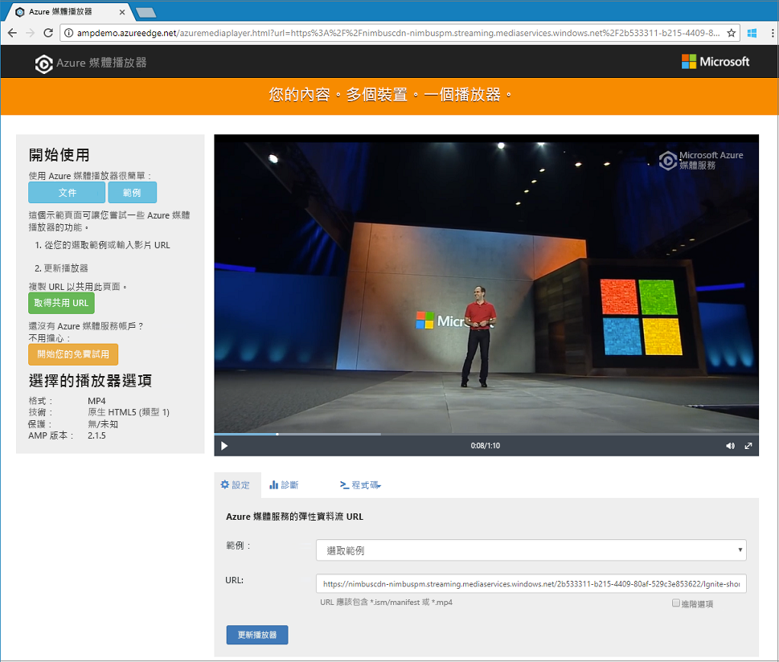

# <a name="quickstart-stream-video-files---net"></a>快速入門：串流視訊檔案 - .NET

> [!NOTE]
> Azure 媒體服務的最新版本處於預覽狀態，且會以 v3 稱呼它。 若要開始使用 v3 API，您應該建立新的媒體服務帳戶，如本快速入門中所述。 

本快速入門說明使用 Azure 媒體服務開始在各種不同的瀏覽器和裝置上串流視訊是多麼容易。 

完成快速入門時，您將能夠串流視訊。  



[!INCLUDE [quickstarts-free-trial-note](../../../includes/quickstarts-free-trial-note.md)]

## <a name="prerequisites"></a>先決條件

如果沒有安裝 Visual Studio，您可以取得 [Visual Studio Community 2017](https://www.visualstudio.com/thank-you-downloading-visual-studio/?sku=Community&rel=15)。

## <a name="download-the-sample"></a>下載範例

使用以下命令將包含串流 .NET 範例的 GitHub 存放庫複製到您的機器：  

 ```bash
 git clone https://github.com/Azure-Samples/media-services-v3-dotnet-quickstarts.git
 ```

如需範例中的每個函式作用的相關說明，請檢查程式碼並查看[這個原始程式檔](https://github.com/Azure-Samples/media-services-v3-dotnet-quickstarts/blob/master/AMSV3Quickstarts/EncodeAndStreamFiles/Program.cs) \(英文\) 中的註解。

## <a name="log-in-to-azure"></a>登入 Azure

登入 [Azure 入口網站](http://portal.azure.com)。

[!INCLUDE [cloud-shell-try-it.md](../../../includes/cloud-shell-try-it.md)]

[!INCLUDE [media-services-cli-create-v3-account-include](../../../includes/media-services-cli-create-v3-account-include.md)]

[!INCLUDE [media-services-v3-cli-access-api-include](../../../includes/media-services-v3-cli-access-api-include.md)]

## <a name="run-the-sample-app"></a>執行範例應用程式

當您執行應用程式時，會顯示可以使用其他不同通訊協定播放該影片的 URL。 

1. 按下 Ctrl+F5 來執行 *EncodeAndStreamFiles* 應用程式。
2. 選擇 Apple 的 **HLS** 通訊協定 (結尾是 *manifest(format=m3u8-aapl)*) 並從主控台複製串流 URL。


在此範例的[原始程式碼](https://github.com/Azure-Samples/media-services-v3-dotnet-quickstarts/blob/master/AMSV3Quickstarts/EncodeAndStreamFiles/Program.cs)中，您可以看到建置 URL 的方式。 若要建置它，您需要串連串流端點主機名稱和串流定位器路徑。  

## <a name="test-with-azure-media-player"></a>使用 Azure 媒體播放器測試

本文使用 Azure 媒體播放器測試串流。 

> [!NOTE]
> 如果播放程式裝載在 HTTPS 網站上，請務必將 URL 更新為 "https"。

1. 開啟瀏覽器並巡覽至 [https://aka.ms/azuremediaplayer/](https://aka.ms/azuremediaplayer/)。
2. 在 [URL:] 方塊中，貼上您在執行應用程式時取得的其中一個串流 URL 值。 
3. 按一下 [更新播放程式]。

Azure 媒體播放器可以用於測試，但不應用於生產環境。 

## <a name="clean-up-resources"></a>清除資源

如果您不再需要資源群組中的任何資源 (包含在此快速入門中建立的媒體服務和儲存體帳戶)，請將資源群組刪除。 您可以使用 [CloudShell] 工具。

在 **CloudShell** 中，執行以下命令：

```azurecli-interactive
az group delete --name amsResourceGroup
```

## <a name="examine-the-code"></a>檢查程式碼

如需範例中的每個函式作用的相關說明，請檢查程式碼並查看[這個原始程式檔](https://github.com/Azure-Samples/media-services-v3-dotnet-quickstarts/blob/master/AMSV3Quickstarts/EncodeAndStreamFiles/Program.cs) \(英文\) 中的註解。

[上傳、編碼和串流檔案](stream-files-tutorial-with-api.md)教學課程提供更進階的串流範例與詳細說明。 

## <a name="multithreading"></a>多執行緒

Azure Media Services v3 SDK 不是安全執行緒。 當使用多執行緒應用程式時，您應該為每個執行緒產生新的 AzureMediaServicesClient 物件。

## <a name="next-steps"></a>後續步驟

> [!div class="nextstepaction"]
> [教學課程：上傳、編碼和串流檔案](stream-files-tutorial-with-api.md)
