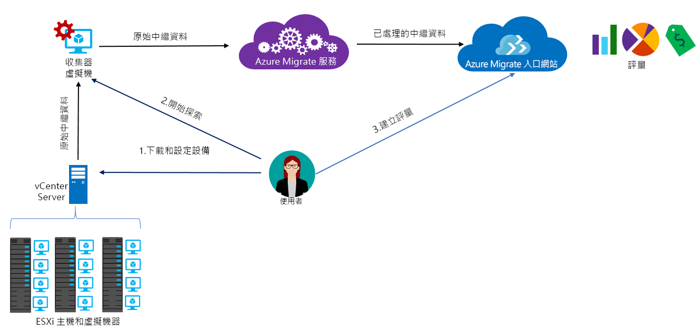

# 關於 Azure Migrate

Azure Migrate 服務會評估要移轉至 Azure 的內部部署工作負載。 此服務會評估內部部署機器的移轉適用性、執行以效能為依據的大小調整，並提供在 Azure 中執行內部部署機器的成本估計。 如果您正打算進行隨即移轉，或者正處於移轉的早期評估階段，此服務很適合您。 評估之後，您可以使用 [Azure Site Recovery](https://docs.microsoft.com/azure/site-recovery/site-recovery-overview) 和 [Azure 資料庫移轉服務](https://docs.microsoft.com/azure/dms/dms-overview)等服務，將機器移轉至 Azure。

## 為何使用 Azure Migrate？

Azure Migrate 可協助您：

- **評估 Azure 整備程度**：評估內部部署機器是否適合在 Azure 中執行。
- **取得大小建議**：根據內部部署 VM 的效能歷程記錄，取得 Azure VM 的大小建議。
- **預估每月成本**：取得在 Azure 中執行內部部署機器的估計成本。  
- **安心地移轉**：將內部部署機器的相依性視覺化，以建立您將一起評估和移轉的機器群組。

## 目前的限制

- 您只能針對那些要移轉到 Azure VM 的內部部署 VMware 虛擬機器 (VM) 進行評估。 VMware VM 必須由 vCenter Server (5.5、6.0、6.5 或 6.7 版) 管理。
- HYPER-V 支援目前的生產環境支援為預覽狀態，如果您有興趣試用看看，請[在這裡](https://aka.ms/migratefuture)註冊。
- 若要評估實體伺服器，可利用我們的[合作夥伴工具](https://azure.microsoft.com/migration/partners/)。
- 您可以在單一探索中和單一專案中探索多達 1500 個 VM。 我們有提供預覽版本，可允許在使用單一設備的單一專案中探索多達 10,000 個 VMware VM，如果您有興趣試用看看，請登入[這裡。](https://aka.ms/migratefuture)
- 如果您想要探索較大的環境，您可以分割探索並建立多個專案。 [深入了解](how-to-scale-assessment.md)。 Azure Migrate 支援每個訂閱最多 20 個專案。
- Azure Migrate 只支援將受控磁碟用於進行移轉評估。
-  您只能在下列地理位置建立 Azure Migrate 專案。 不過，這不會限制您建立其他目標 Azure 位置評量的能力。

    **[地理位置]** | **儲存位置**
    --- | ---
    Azure Government | 美國政府維吉尼亞州
    亞洲 | 東南亞或東亞
    歐洲 | 北歐或西歐
    美國 | 美國東部或美國中西部

    與移轉專案相關聯的地理位置會用來儲存在內部部署環境中發現的中繼資料。 中繼資料會根據針對移轉專案指定的地理位置，儲存在其中一個區域。 如果您藉由建立新的 Log Analytics 工作區來使用相依性視覺效果，則會在與專案相同的區域中建立工作區。
- 在 Azure Government 中無法使用相依性視覺效果功能。

## 我需要支付多少費用？

[深入了解](https://azure.microsoft.com/pricing/details/azure-migrate/) Azure Migrate 定價。

## 評估包含什麼？

您可以根據本身的需求自訂評估設定。 評估屬性彙整於下表中。

**屬性** | **詳細資料**
--- | ---
**目標位置** | 要作為移轉目的地的 Azure 位置。  Azure Migrate 目前支援 33 個區域作為移轉目標位置。 [查看區域](https://azure.microsoft.com/global-infrastructure/services/)。 根據預設，目標區域會設定為美國東部。
**儲存體類型** | 您想要為屬於評估的所有 VM 配置的受控磁碟類型。 如果調整大小準則為「作為內部部署調整大小」，您可以將目標磁碟類型指定為進階磁碟 (預設值)、標準 SSD 磁碟或標準 HDD 磁碟。 對於「效能型調整大小」，以及上述選項，您也可以選取 [自動] 選項，該選項會確保根據 VM 的效能資料自動建議磁碟大小。 例如，如果您想要達成 [99.9% 的單一執行個體 VM SLA](https://azure.microsoft.com/support/legal/sla/virtual-machines/v1_8/)，則可能需要將儲存體類型指定為進階受控磁碟，如此可確保將評估中的所有磁碟建議為進階受控磁碟。 請注意，Azure Migrate 只支援將受控磁碟用於進行移轉評估。
**保留執行個體** |  您在 Azure 中是否有[保留執行個體](https://azure.microsoft.com/pricing/reserved-vm-instances/)。 Azure Migrate 會據以預估成本。
**調整大小準則** | 您可以根據內部部署 VM (預設值) 的**效能歷程記錄**來調整大小，或使用**作為內部部署**，而不考量效能歷程記錄。
**效能歷程記錄** | 根據預設，Azure Migrate 會使用最後一天的效能歷程記錄 (95% 百分位數值) 來評估內部部署機器的效能。
**緩和因數** | Azure Migrate 會在評估期間考量緩衝區 (緩和因數)。 此緩衝區適用於 VM 的機器使用量資料 (CPU、記憶體、磁碟和網路)。 緩和因數會考量各個問題，例如季節性使用量、簡短的效能歷程記錄，以及未來可能增加的使用量。   以 10 核心的 VM 為例，如果使用率為 20%，一般即相當於一個 2 核心的 VM。 但如果緩和因數為 2.0 x，則結果為 4 核心的 VM。 預設緩和設定為 1.3x。
**VM 系列** | 用來估計大小的 VM 系列。 例如，如果您不打算將生產環境移轉至 Azure 中的 A 系列虛擬機器，則可以從清單或系列排除 A 系列。 大小調整只會根據選取的系列執行。   
**貨幣** | 帳單貨幣。 預設值為美元。
**折扣 (%)** | 針對 Azure 供應項目所能獲得的任何訂用帳戶特定折扣。 預設設定為 0%。
**VM 運作時間** | 如果 VM不會在 Azure 中全天候執行，您可以指定其執行的持續時間 (每月天數和每天時數)，成本預估會據此來計算。 預設值是每月 31 天和每天 24 小時。
**Azure 供應項目** | 您所註冊的 [Azure 供應項目](https://azure.microsoft.com/support/legal/offer-details/)。 Azure Migrate 會據以預估成本。
**Azure Hybrid Benefit** | 您是否擁有軟體保證，以及是否符合 [Azure Hybrid Benefit](https://azure.microsoft.com/pricing/hybrid-use-benefit/) 的資格而享有折扣。

## Azure Migrate 如何運作？

1. 您可建立 Azure Migrate 專案。
2. Azure Migrate 會使用稱為收集器設備的內部部署 VM，探索您的內部部署機器相關資訊。 若要建立設備，您可下載開放虛擬化設備 (.ova) 格式的安裝檔案，然後將它匯入為內部部署 vCenter Sever 上的 VM。
3. 您會從 vCenter Server 連線至 VM，並在連線時為其指定新密碼。
4. 您會在 VM 上執行收集器以起始探索。
5. 收集器會使用 VMware PowerCLI Cmdlet 來收集 VM 中繼資料。 探索是無代理程式的，而且不會在 VMware 主機或 VM 上安裝任何項目。 所收集的中繼資料包含 VM 資訊 (核心、記憶體、磁碟、磁碟大小和網路介面卡。 它也會收集 VM 的效能資料，包括 CPU 和記憶體使用量、磁碟 IOPS、磁碟輸送量 (MBps) 以及網路輸出 (MBps)。
5. 中繼資料會推送至 Azure Migrate 專案。 您可以在 Azure 入口網站中檢視它。
6. 基於評估目的，您會將探索到的 VM 集合成群組。 例如，您可將執行相同應用程式的 VM 群組在一起。 如需更精確的群組，您可以使用相依性視覺效果來檢視特定機器的相依性，或檢視群組中所有機器的相依性並調整群組。
7. 群組定義之後，您會為其建立評估。
8. 評估完成後，您可以在入口網站中進行檢視，或以 Excel 格式進行下載。

   

## 連接埠需求為何？

下表摘要說明 Azure Migrate 通訊所需的連接埠。

| 元件 | 通訊對象 |  詳細資料 |
| --- | --- |--- |
|收集器  | Azure Migrate 服務 | 收集器會透過 SSL 連接埠 443 連線至服務。|
|收集器 | vCenter Server | 根據預設，收集器會連線到連接埠 443 上的 vCenter Server。 如果伺服器接聽不同的連接埠，請將其設定為收集器 VM 上的傳出連接埠。|
|內部部署 VM | Log Analytics 工作區 | [Microsoft Monitoring Agent (MMA)](../log-analytics/log-analytics-windows-agent.md) 會使用 TCP 連接埠 443 連線至 Azure 監視器記錄。 如果您使用相依性視覺效果，因而需要 MMA 代理程式時，您只需要此連接埠。|

## 評估後會發生什麼事？

在評估內部部署機器之後，您可以使用一些工具來執行移轉：

- **Azure Site Recovery**：您可以使用 Azure Site Recovery 來移轉至 Azure。 若要這樣做，您必須[準備所需的 Azure 元件](../site-recovery/tutorial-prepare-azure.md)，包括儲存體帳戶和虛擬網路。 在內部部署中，您必須[準備 VMware 環境](../site-recovery/vmware-azure-tutorial-prepare-on-premises.md)。 在一切都準備就緒後，您設定並啟用對 Azure 的複寫，並移轉 VM。 [深入了解](../site-recovery/vmware-azure-tutorial.md)。
- **Azure 資料庫移轉**：如果您的內部部署機器正在執行 SQL Server、MySQL 或 Oracle 等資料庫，您可以使用 [Azure 資料庫移轉服務](../dms/dms-overview.md)將資料庫移轉至 Azure。

## 想要向社群專家進一步學習嗎？
請瀏覽 [Azure Migrate MSDN 論壇](https://social.msdn.microsoft.com/Forums/home?forum=AzureMigrate&filter=alltypes&sort=lastpostdesc)或 [Stack Overflow](https://stackoverflow.com/search?q=azure+migrate)

## 需要協助嗎？ 與我們連絡。  
如果您有問題或需要協助，請[建立支援要求](https://ms.portal.azure.com/#blade/Microsoft_Azure_Support/HelpAndSupportBlade/newsupportrequest)。 如果您的支援要求需要深入的技術指引，請瀏覽 [Azure 支援方案](https://azure.microsoft.com/support/plans/)     

## 後續步驟

- [遵循教學課程](tutorial-assessment-vmware.md)以建立內部部署 VMware VM 的評估。
- 針對 Azure Migrate [檢閱相關常見問題](resources-faq.md)。
