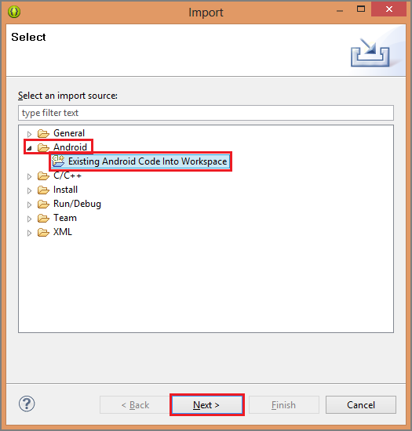
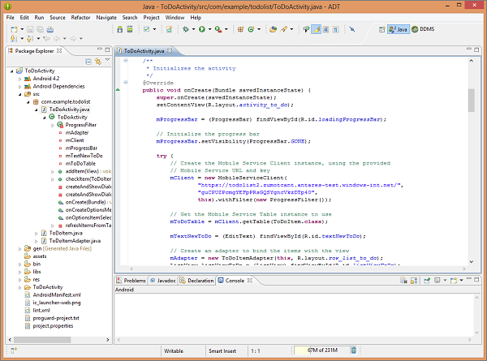

<properties  pageTitle="Get Started with Azure Mobile Services for Android apps" metaKeywords="Azure android application, mobile service android, getting started Azure android, azure droid, getting started droid windows" description="Follow this tutorial to get started using Azure Mobile Services for Android development." metaCanonical="" services="" documentationCenter="Mobile" title="Get started with Mobile Services" authors="glenga" solutions="" manager="" editor="" />

# 開始使用行動服務

 

	<a href="/en-us/documentation/articles/mobile-services-windows-store-get-started" title="Windows 市集">Windows 市集</a> <a href="/en-us/documentation/articles/mobile-services-windows-phone-get-started" title="Windows Phone">Windows Phone</a> <a href="/en-us/documentation/articles/mobile-services-ios-get-started" title="iOS">iOS</a> <a href="/en-us/documentation/articles/mobile-services-android-get-started" title="Android" class="current">Android</a> <a href="/en-us/documentation/articles/mobile-services-html-get-started" title="HTML">HTML</a> <a href="/en-us/documentation/articles/partner-xamarin-mobile-services-ios-get-started" title="Xamarin.iOS">Xamarin.iOS</a> <a href="/en-us/documentation/articles/partner-xamarin-mobile-services-android-get-started" title="Xamarin.Android">Xamarin.Android</a> <a href="/en-us/documentation/articles/partner-sencha-mobile-services-get-started/" title="Sencha">Sencha</a> <a href="/en-us/documentation/articles/mobile-services-javascript-backend-phonegap-get-started/" title="PhoneGap">PhoneGap</a>

 

	<a href="/en-us/documentation/articles/mobile-services-dotnet-backend-android-get-started/" title=".NET 後端">.NET 後端</a> | <a href="/en-us/documentation/articles/mobile-services-android-get-started/" title="JavaScript 後端" class="current">JavaScript 後端</a>

 

本教學課程顯示如何使用 Azure 行動服務，將雲端型後端服務新增到 Android 應用程式。在本教學課程中，您將建立新的行動服務和簡單的<em>待辦事項清單</em>應用程式，後者會在前者儲存應用程式資料。

以下是完成之應用程式的螢幕擷取畫面：

 

<a href="http://channel9.msdn.com/Series/Windows-Azure-Mobile-Services/Android-Support-in-Windows-Azure-Mobile-Services" target="_blank" class="label">觀看教學課程</a> <a style="background-image: url('/media/devcenter/mobile/videos/mobile-get-started-android-180x120.png') !important;" href="http://channel9.msdn.com/Series/Windows-Azure-Mobile-Services/Android-Support-in-Windows-Azure-Mobile-Services" target="_blank" class="dev-onpage-video">播放影片</a>7:26

 

完成本教學課程需要 [Android Developer Tools][1]，其中包含 Eclipse 整合式開發環境 (IDE)、Android Developer Tools (ADT) 外掛程式，以及最新版 Android 平台。需要 Android 4.2 或以上的版本。

下載的快速入門專案包含 Mobile Services SDK for Android。雖然這個專案需要 Android 4.2 或以上的版本，不過行動服務 SDK 只需要 Android 2.2 或以上的版本。

<strong>注意</strong> 
若要完成此教學課程，您需要 Azure 帳戶。如果您沒有帳戶，只需要幾分鐘的時間就可以建立免費試用帳戶。如需詳細資訊，請參閱 <a href="http://www.windowsazure.com/en-us/pricing/free-trial/?WT.mc_id=AE564AB28" target="_blank">Azure 免費試用</a>。

## 建立新的行動服務

[WACOM.INCLUDE [mobile-services-create-new-service](../includes/mobile-services-create-new-service.md)]

## <h2>建立新的應用程式建立新的 Android 應用程式</h2>

建立行動服務後，您可以遵循管理入口網站中的簡易快速入門來建立新的應用程式，或修改現有的應用程式以連線到行動服務。

在本節中，您將建立與行動服務連線的新 Android 應用程式。

1.  在管理入口網站中，按一下 **行動服務**，然後按一下您剛剛建立的行動服務。

2.  在快速入門索引標籤中，按一下 **Choose platform** 下的 **Android**，並展開 **Create a new Android app**。
    
      ![][6]
        
      此處顯示建立與行動服務連線的 Android 應用程式的 3 個簡單步驟。

 	 

1.  如果您尚未這麼做，請在您的本機電腦或虛擬機器下載並安裝 [Android Developer Tools][1]。

2.  按一下 **Create TodoItem table** 來建立儲存應用程式資料的資料表。

3.  在 **Download and run your app** 下，按一下 **下載**。

 這將下載與行動服務連線的範例*待辦事項清單*應用程式專案。將壓縮的專案檔案儲存到本機電腦，並記下您儲存的位置。 

## 執行您的 Android 應用程式

本教學課程的最後步驟，是建置並執行您的新應用程式。

1.  瀏覽到您儲存壓縮專案檔案的位置，並在您的電腦上將檔案展開。

2.  在 Eclipse 中，按一下 **File**，接著按一下 **Import**，並展開 **Android**，接著按一下 **Existing Android Code into Workspace**，然後按一下 **Next**。

 	

1.  按一下 [瀏覽** 瀏覽到展開的專案檔案位置，並且按一下 **確定** 確定已勾選 TodoActivity 專案，然後按一下 **完成**。

 	     
	這會將專案檔案匯入到目前的工作區。

 	

1.  從 [執行** 功能表中，按一下 **執行** 在 Android 模擬器中啟動專案。
	
<strong>注意</strong> 
若要能夠在 Android 模擬器中執行專案，您必須至少定義一個 Android 虛擬裝置 (AVD)。請使用 AVD Manager 來建立和管理這些裝置。

2.  在應用程式中，輸入有意義的文字，例如*完成教學課程*，然後按一下 **新增**。
    
	![][10]
        
    這會將 POST 要求傳送到 Azure 中代管的新行動服務。來自要求的資料將會插入到TodoItem 資料表中。行動服務會傳回資料表中儲存的項目，並且在清單中顯示資料。

	
<strong>注意</strong> 
	
您可以檢閱存取行動服務來查詢和插入資料的程式碼，這可以在 ToDoActivity.java 檔案中找到。

	

3.  回到管理入口網站，按一下 **資料** 索引標籤，然後按一下 **TodoItems** 資料表。
    
	![][11]
        
	這可以讓您瀏覽應用程式插入資料表中的資料。
        
	![][12]

## 後續步驟

完成快速入門後，請了解如何在行動服務中執行其他重要工作：

* [開始使用資料](/en-us/develop/mobile/tutorials/get-started-with-data-android)
  
  深入了解使用行動服務儲存和查詢資料。

* [開始使用驗證](/en-us/develop/mobile/tutorials/get-started-with-users-android)
  
  了解如何向身分識別提供者驗證應用程式的使用者。

* [開始使用推播通知](/en-us/develop/mobile/tutorials/get-started-with-push-android)
  
  了解如何將極為基本的推播通知傳送到應用程式。

<!-- Anchors. -->

<!-- Images. -->

<!-- URLs. -->

[1]: https://go.microsoft.com/fwLink/p/?LinkID=280125
[6]: ./media/mobile-services-android-get-started/mobile-portal-quickstart-android.png
[7]: ./media/mobile-services-android-get-started/mobile-quickstart-steps-android.png
[8]: ./media/mobile-services-android-get-started/mobile-eclipse-quickstart.png

[10]: ./media/mobile-services-android-get-started/mobile-quickstart-startup-android.png
[11]: ./media/mobile-services-android-get-started/mobile-data-tab.png
[12]: ./media/mobile-services-android-get-started/mobile-data-browse.png

[14]: ./media/mobile-services-android-get-started/mobile-services-import-android-workspace.png
[15]: ./media/mobile-services-android-get-started/mobile-services-import-android-project.png