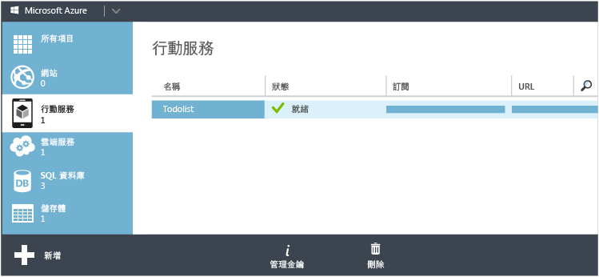

<properties urlDisplayName="Get Started with Push" pageTitle="開始使用推播 (Android) | 行動開發人員中心" metaKeywords="" description="Learn how to use Azure Mobile Services to send push notifications to your Android .Net app." metaCanonical="" services="mobile-services,notification-hubs" documentationCenter="Mobile" title="Get started with push notifications in Mobile Services" authors="ricksal" solutions="" manager="dwrede" editor="" />

<tags ms.service="mobile-services" ms.workload="mobile" ms.tgt_pltfrm="Mobile-Android" ms.devlang="Java" ms.topic="article" ms.date="09/26/2014" ms.author="ricksal" />

# 將推播通知新增至行動服務應用程式

[WACOM.INCLUDE [mobile-services-selector-get-started-push](../includes/mobile-services-selector-get-started-push.md)]

本主題說明如何使用 Azure 行動服務傳送推播通知至 Android 應用程式。在本教學課程中，您會使用 Google 雲端通訊 (GCM) 將推播通知新增至快速入門專案。完成後，行動服務就會在每次插入記錄時傳送推播通知。 

本教學課程將逐步引導您完成下列步驟：

1. [啟用 Google 雲端通訊](#register)
2. [設定行動服務以傳送推播要求](#configure)
5. [更新伺服器以傳送推播通知](#update-server)
7. [將推播通知新增至應用程式](#update-app)
8. [啟用推播通知以進行本機測試](#local-testing)
9. [對已發佈的行動服務進行應用程式測試]

本教學課程會以行動服務快速入門為基礎。開始本教學課程之前，您必須先完成[開始使用行動服務]或[開始使用資料]，將您的專案連接到行動服務。同樣地，本教學課程也需要 Visual Studio 2013。 

>[WACOM.NOTE]若要完成此教學課程，您需要 Azure 帳戶。如果您沒有帳戶，只需要幾分鐘的時間就可以建立免費試用帳戶。如需詳細資訊，請參閱 <a href="http://www.windowsazure.com/zh-tw/pricing/free-trial/?WT.mc_id=AE564AB28&returnurl=http%3A%2F%2Fwww.windowsazure.com%2Fzh-tw%2Fdocumentation%2Farticles%2Fmobile-services-dotnet-backend-windows-store-dotnet-get-started-data%2F" target="_blank">Azure 免費試用</a>。 

##啟用 Google 雲端通訊

[WACOM.INCLUDE [啟用 GCM](../includes/mobile-services-enable-Google-cloud-messaging.md)]

##設定行動服務傳送推播要求

1. 登入 [Azure 管理入口網站]，按一下 [**行動服務**]，然後按一下您的應用程式。

   	

2. 按一下 [**推播**] 索引標籤，輸入在先前程序中從 GCM 取得的 **API 金鑰**值，然後按一下 [**儲存**]。

   	

    
<b>重要事項</b>
	
如果您在入口網站的 [推播] 索引標籤中設定進階推播通知的 GCM 認證，這些認證將會與通知中心共用，以設定您的應用程式適用的通知中心。

    

您的行動服務現在已設定成使用 GCM 和通知中心。

<h2>將服務下載至您的本機電腦</h2>

[WACOM.INCLUDE [mobile-services-download-service-locally](../includes/mobile-services-download-service-locally.md)]

<h2>測試行動服務</h2>

[WACOM.INCLUDE [mobile-services-dotnet-backend-test-local-service](../includes/mobile-services-dotnet-backend-test-local-service.md)]

##更新伺服器以傳送推播通知

1. 在 Visual Studio 的 [方案總管] 中，展開行動服務專案中的 **Controllers** 資料夾。開啟 TodoItemController.cs。在檔案的頂端，新增下列 `using` 陳述式：

		using System;
		using System.Collections.Generic;

2. 使用下列程式碼更新 `PostTodoItem` 方法定義：  

        public async Task<IHttpActionResult> PostTodoItem(TodoItem item)
        {
            TodoItem current = await InsertAsync(item);

            Dictionary<string, string> data = new Dictionary<string, string>()
            {
                { "message", item.Text}
            };
            GooglePushMessage message = new GooglePushMessage(data, TimeSpan.FromHours(1));

            try
            {
                var result = await Services.Push.SendAsync(message);
                Services.Log.Info(result.State.ToString());
            }
            catch (System.Exception ex)
            {
                Services.Log.Error(ex.Message, null, "Push.SendAsync Error");
            }
            return CreatedAtRoute("Tables", new { id = current.Id }, current);
        }

    此程式碼會在插入 Todo 項目之後傳送推播通知 (含所插入項目的文字)。如果發生錯誤，程式碼將會新增可透過管理入口網站從行動服務的 [**記錄檔**] 索引標籤來檢視的錯誤記錄項目。

<h2>將行動服務發佈至 Azure</h2>

[WACOM.INCLUDE [mobile-services-dotnet-backend-publish-service](../includes/mobile-services-dotnet-backend-publish-service.md)]

##將推播通知新增至應用程式

###驗證 Android SDK 版本

[WACOM.INCLUDE [mobile-services-verify-android-sdk-version](../includes/mobile-services-verify-android-sdk-version.md)]

下一個步驟是安裝 Google Play 服務。Google 雲端通訊在開發和測試方面有一些 API 層級的最低需求，這些是資訊清單中的 **minSdkVersion** 屬性所必須遵守。 

如果您要以較舊的裝置進行測試，請參考[設定 Google Play 服務 SDK]，以確認此值可以設得多低，並加以適當設定。

###新增 Google Play 服務至專案

[WACOM.INCLUDE [新增 Play 服務](../includes/mobile-services-add-Google-play-services.md)]

###新增程式碼

[WACOM.INCLUDE [mobile-services-android-getting-started-with-push](../includes/mobile-services-android-getting-started-with-push.md)]

<h2>對已發佈的行動服務進行應用程式測試</h2>

您可以使用 USB 纜線直接連接 Android 手機，或使用模擬器中的虛擬裝置，對應用程式進行測試。

###如果您使用模擬器進行測試...

請務必使用支援 Google API 的 Android 虛擬裝置 (AVD)。

1. 從 [**視窗**] 中，選取 [**Android Virtual Device Manager**]，選取您的裝置，按一下 [**編輯** (或者，如果尚無任何裝置，請按一下 [**新增**])。

	

2. 在 [**目標**] 中，選取 [**Google API** (或 [**Google API x86**])，然後按一下 [確定]。

   	

	如此會使 AVD 變成使用 Google API。如果您安裝了數個版本的 Android SDK，請確定 API 層級符合您先前在專案屬性中設定的層級。

### 啟用推播通知以進行本機測試

[WACOM.INCLUDE [mobile-services-dotnet-backend-configure-local-push](../includes/mobile-services-dotnet-backend-configure-local-push.md)]

###執行測試

1. 在 Eclipse 中，從 [**執行**] 功能表中，按一下 [**執行**] 來啟動應用程式。

2. 在應用程式中，輸入有意義的文字，例如 _A new Mobile Services task_，然後按一下 [**加入**] 按鈕。

  	

3. 從螢幕頂端向下撥動將裝置的通知中心開啟，以檢視通知。

您已成功完成此教學課程。

## 後續步驟

<!---This tutorial demonstrated the basics of enabling an Android app to use Mobile Services and Notification Hubs to send push notifications. Next, consider completing the next tutorial, [Send push notifications to authenticated users], which shows how to use tags to send push notifications from a Mobile Service to only an authenticated user.

+ [Send push notifications to authenticated users]
	 了解如何使用標記從行動服務將推播通知只傳送給已驗證的使用者。

+ [將廣播通知傳送給訂閱者]
	 了解使用者如何註冊及接收他們所需類別的推播通知。

+ [將範本型通知傳送給訂閱者]
	 了解如何使用範本從行動服務傳送推播通知，但不必在您的後端製作平台特定裝載。
-->
在下列主題中深入了解行動服務和通知中心：

* [開始使用資料]
   進一步了解使用行動服務來儲存和查詢資料。

* [開始使用驗證]
   了解如何使用行動服務以不同帳戶類型驗證應用程式的使用者。

* [什麼是通知中心？]
   深入了解通知中樞如何跨所有主要用戶端平台將通知傳遞到您的應用程式。

* [偵錯通知中樞應用程式](http://go.microsoft.com/fwlink/p/?linkid=386630)
   取得通知中樞解決方案的疑難排解和偵錯指引。 

* [如何使用行動服務的 Android 用戶端程式庫]
   深入了解如何搭配使用行動服務與 Android。  
  
<!-- Anchors. -->

[建立新的行動服務]: #create-service
[在本機下載服務]: #download-the-service-locally
[測試行動服務]: #test-the-service
[下載 GetStartedWithData 專案]: #download-app
[更新應用程式以使用行動服務進行資料存取]: #update-app
[對本機代管的服務測試 Android 應用程式]: #test-locally-hosted
[將行動服務發佈至 Azure]: #publish-mobile-service
[對 Azure 代管的服務測試 Android 應用程式]: #test-azure-hosted
[對已發佈的行動服務進行應用程式測試]: #test-app
[後續步驟]:#next-steps

<!-- Images. -->
[0]: ./media/mobile-services-dotnet-backend-windows-store-dotnet-get-started-data/app-view.png
[1]: ./media/mobile-services-dotnet-backend-windows-store-dotnet-get-started-data/mobile-data-sample-download-dotnet-vs13.png
[2]: ./media/mobile-services-dotnet-backend-windows-store-dotnet-get-started-data/mobile-service-overview-page.png
[3]: ./media/mobile-services-dotnet-backend-windows-store-dotnet-get-started-data/download-service-project.png
[4]: ./media/mobile-services-dotnet-backend-windows-store-dotnet-get-started-data/add-service-project-to-solution.png
[5]: ./media/mobile-services-dotnet-backend-windows-store-dotnet-get-started-data/download-publishing-profile.png
[6]: ./media/mobile-services-dotnet-backend-windows-store-dotnet-get-started-data/add-existing-project-dialog.png
[7]: ./media/mobile-services-dotnet-backend-windows-store-dotnet-get-started-data/vs-manage-nuget-packages.png
[8]: ./media/mobile-services-dotnet-backend-windows-store-dotnet-get-started-data/manage-nuget-packages.png
[9]: ./media/mobile-services-dotnet-backend-windows-store-dotnet-get-started-data/copy-mobileserviceclient-snippet.png
[10]: ./media/mobile-services-dotnet-backend-windows-store-dotnet-get-started-data/vs-pasted-mobileserviceclient.png
[11]: ./media/mobile-services-dotnet-backend-windows-store-dotnet-get-started-data/vs-build-solution.png
[12]: ./media/mobile-services-dotnet-backend-windows-store-dotnet-get-started-data/vs-run-solution.png
[13]: ./media/mobile-services-dotnet-backend-windows-store-dotnet-get-started-data/new-local-todoitem.png
[14]: ./media/mobile-services-dotnet-backend-windows-store-dotnet-get-started-data/vs-show-local-table-data.png
[15]: ./media/mobile-services-dotnet-backend-windows-store-dotnet-get-started-data/local-item-checked.png
[16]: ./media/mobile-services-dotnet-backend-windows-store-dotnet-get-started-data/azure-items.png
[17]: ./media/mobile-services-dotnet-backend-windows-store-dotnet-get-started-data/manage-sql-azure-database.png
[18]: ./media/mobile-services-dotnet-backend-windows-store-dotnet-get-started-data/sql-azure-query.png

[20]: ./media/mobile-services-dotnet-backend-windows-store-dotnet-get-started-data/vs-build-service-project.png
[21]: ./media/mobile-services-dotnet-backend-windows-store-dotnet-get-started-data/vs-start-debug-service-project.png
[22]: ./media/mobile-services-dotnet-backend-windows-store-dotnet-get-started-data/service-welcome-page.png
[23]: ./media/mobile-services-dotnet-backend-windows-store-dotnet-get-started-data/iis-express-tray.png

[26]: ./media/mobile-services-dotnet-backend-windows-store-dotnet-get-started-data/copy-service-and-packages-folder.png

<!-- URLs. -->
[使用指令碼驗證和修改資料]: /zh-tw/develop/mobile/tutorials/validate-modify-and-augment-data-dotnet
[使用分頁縮小查詢範圍]: /zh-tw/develop/mobile/tutorials/add-paging-to-data-dotnet
[開始使用行動服務]: /zh-tw/documentation/articles/mobile-services-dotnet-backend-android-get-started
[開始使用資料]: /zh-tw/documentation/articles/mobile-services-dotnet-backend-android-get-started-data
[開始使用驗證]: /zh-tw/documentation/articles/mobile-services-dotnet-backend-android-get-started-users
[JavaScript 和 HTML]: /zh-tw/develop/mobile/tutorials/get-started-with-data-js
[JavaScript 後端版本]: /zh-tw/develop/mobile/tutorials/get-started-with-data-android
[Azure 管理入口網站]: https://manage.windowsazure.com/
[管理入口網站]: https://manage.windowsazure.com/
[行動服務 SDK]: http://go.microsoft.com/fwlink/p/?LinkId=257545
[開發人員程式碼範例網站]:  http://go.microsoft.com/fwlink/p/?LinkId=328660
[行動服務 .NET 作法概念性參考]: /zh-tw/develop/mobile/how-to-guides/work-with-net-client-library
[MobileServiceClient 類別]: http://go.microsoft.com/fwlink/p/?LinkId=302030

[如何使用行動服務的 Android 用戶端程式庫]: /zh-tw/documentation/articles/mobile-services-android-how-to-use-client-library

[傳送推播通知給已驗證的使用者]: /zh-tw/documentation/articles/mobile-services-dotnet-backend-android-push-notifications-app-users/

[什麼是通知中樞？]: /zh-tw/documentation/articles/notification-hubs-overview/
[將廣播通知傳送給訂閱者]: /zh-tw/documentation/articles/notification-hubs-windows-store-dotnet-send-breaking-news/
[將範本型通知傳送給訂閱者]: /zh-tw/documentation/articles/notification-hubs-windows-store-dotnet-send-localized-breaking-news/
[Azure 管理入口網站]: https://manage.windowsazure.com/
