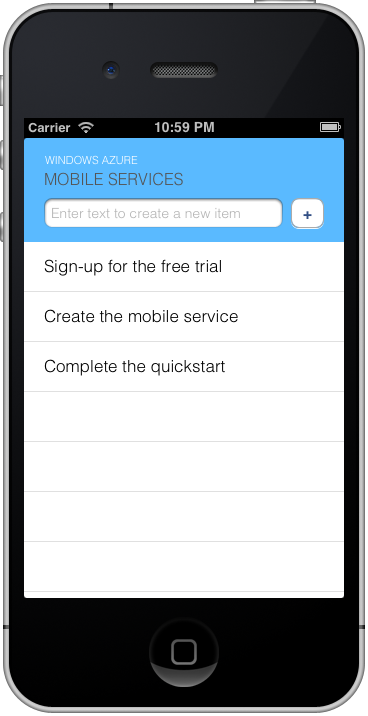

<properties 
	pageTitle="使用 Active Directory Authentication Library 單一登入驗證您的應用程式 (iOS) | 行動開發人員中心" 
	description="了解如何在 iOS 應用程式中驗證使用者的單一登入。" 
	documentationCenter="ios" 
	authors="mattchenderson" 
	manager="dwrede" 
	editor="" 
	services="mobile-services"/>

<tags 
	ms.service="mobile-services" 
	ms.workload="mobile" 
	ms.tgt_pltfrm="mobile-ios" 
	ms.devlang="objective-c" 
	ms.topic="article" 
	ms.date="04/29/2015" 
	ms.author="mahender"/>

# 使用 Active Directory Authentication Library 單一登入驗證您的應用程式

[AZURE.INCLUDE [mobile-services-selector-adal-sso](../includes/mobile-services-selector-adal-sso.md)]

##概觀

在本教學課程中，您會使用 Active Directory Authentication Library 將驗證新增至快速入門專案。

要能夠驗證使用者，您必須向 Azure Active Directory (AAD) 註冊您的應用程式。此作業有兩個階段。第一，您必須註冊行動服務，並公開其權限。第二，您必須註冊 iOS 應用程式，並為其授與對這些權限的存取權

>[AZURE.NOTE]本教學課程旨在協助您深入了解如何透過行動服務，為 iOS 應用程式執行單一登入 Azure Active Directory 驗證。如果這是您第一次接觸行動服務，請先完成教學課程[開始使用行動服務]。

##必要條件

本教學課程需要下列各項：

* XCode 4.5 和 iOS 6.0 (或更新版本)
* 完成[開始使用行動服務]或[開始使用資料]教學課程。
* Microsoft Azure 行動服務 SDK
* [Active Directory Authentication Library for iOS]

[AZURE.INCLUDE [mobile-services-dotnet-adal-register-client](../includes/mobile-services-dotnet-adal-register-client.md)]

##將行動服務設定為需要驗證

[AZURE.INCLUDE [mobile-services-restrict-permissions-dotnet-backend](../includes/mobile-services-restrict-permissions-dotnet-backend.md)]

##將驗證程式碼新增至用戶端應用程式

1. 下載 [Active Directory Authentication Library for iOS]，並將其納入您的專案中。請務必同時從 ADAL 來源新增腳本。

2. 在 QSTodoListViewController 中，使用下列程式碼納入 ADAL：

        #import "ADALiOS/ADAuthenticationContext.h"

2. 然後，新增下列方法：

        - (void) loginAndGetData
        {
            MSClient *client = self.todoService.client;
            if (client.currentUser != nil) {
                return;
            }

            NSString *authority = @"<INSERT-AUTHORITY-HERE>";
            NSString *resourceURI = @"<INSERT-RESOURCE-URI-HERE>";
            NSString *clientID = @"<INSERT-CLIENT-ID-HERE>";
            NSString *redirectURI = @"<INSERT-REDIRECT-URI-HERE>";

            ADAuthenticationError *error;
            ADAuthenticationContext *authContext = [ADAuthenticationContext authenticationContextWithAuthority:authority error:&error];
            NSURL *redirectUri = [[NSURL alloc]initWithString:redirectURI];

            [authContext acquireTokenWithResource:resourceURI clientId:clientID redirectUri:redirectUri completionBlock:^(ADAuthenticationResult *result) {
                if (result.tokenCacheStoreItem == nil)
                {
                    return;
                }
                else
                {
                    NSDictionary *payload = @{
                        @"access_token" : result.tokenCacheStoreItem.accessToken
                    };
                    [client loginWithProvider:@"windowsazureactivedirectory" token:payload completion:^(MSUser *user, NSError *error) {
                        [self refresh];
                    }];
                }
            }];
        }

6. 在上述 `loginAndGetData` 方法的程式碼中，將 **INSERT-AUTHORITY-HERE** 替換為您佈建應用程式的租用戶名稱，其格式應為 https://login.windows.net/tenant-name.onmicrosoft.com。此值可從 [Azure 管理入口網站]複製到 Azure Active Directory 的 [網域] 索引標籤以外。

7. 在上述 `loginAndGetData` 方法的程式碼中，將 **INSERT-RESOURCE-URI-HERE** 替換為您行動服務的「應用程式識別碼 URI」****。如果您依照[如何向 Azure Active Directory 註冊]主題的內容操作，您的應用程式識別碼 URI 應類似於 https://todolist.azure-mobile.net/login/aad。

8. 在上述 `loginAndGetData` 方法的程式碼中，將 **INSERT-CLIENT-ID-HERE** 替換為您從原生用戶端應用程式中複製的用戶端識別碼。

9. 在上述 `loginAndGetData` 方法的程式碼中，將 **INSERT-REDIRECT-URI-HERE** 替換為您行動服務的 /login/done 端點。此項目應與 https://todolist.azure-mobile.net/login/done 類似。

3. 在 QSTodoListViewController 中，使用以下內容取代 `[self refresh]`，以修改 `ViewDidLoad`：

        [self loginAndGetData];

##使用驗證測試用戶端

1. 從 [產品] 功能表中按一下 [執行]，以啟動應用程式
2. 您會看見登入 Azure Active Directory 的提示。  
3. 應用程式會驗證並傳回 todo 項目。

   

<!-- URLs. -->
[開始使用資料]: mobile-services-ios-get-started-data.md
[開始使用行動服務]: mobile-services-dotnet-backend-ios-get-started.md
[如何向 Azure Active Directory 註冊]: mobile-services-how-to-register-active-directory-authentication.md
[Azure 管理入口網站]: https://manage.windowsazure.com/
[Active Directory Authentication Library for iOS]: https://github.com/MSOpenTech/azure-activedirectory-library-for-ios

<!--HONumber=54-->