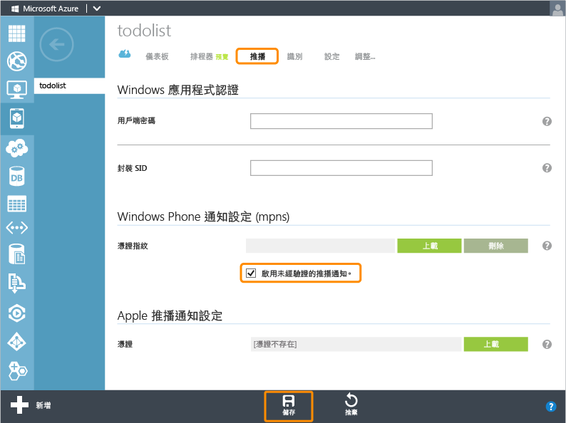

<properties pageTitle="Get started with push notification hubs using .NET runtime mobile services" metaKeywords="" description="Learn how to use Windows Azure .Net runtime mobile services and Notification Hubs to send push notifications to your Windows phone app." metaCanonical="" services="mobile" documentationCenter="Mobile" title="Get started with push notifications in Mobile Services" authors="wesmc" solutions="" writer="wesmc" manager="" editor="" />

開始使用推播通知行動服務
========================

[Windows 市集 C\#](/en-us/documentation/articles/mobile-services-dotnet-backend-windows-store-dotnet-get-started-push "Windows 市集 C#") [Windows 市集 JavaScript](/en-us/documentation/articles/mobile-services-dotnet-backend-windows-store-javascript-get-started-push "Windows 市集 JavaScript") [Windows Phone](/en-us/documentation/articles/mobile-services-dotnet-backend-windows-phone-get-started-push "Windows Phone")

[.NET 後端](/en-us/documentation/articles/mobile-services-dotnet-backend-windows-phone-get-started-push ".NET 後端") | [JavaScript 後端](/en-us/documentation/articles/mobile-services-javascript-backend-windows-phone-get-started-push/ "JavaScript 後端")

本主題說明如何使用 Windows Azure .Net 執行階段行動服務傳送推播通知至 Windows Phone 8 應用程式。在本教學課程中，您會啟用透過 Windows Azure 通知中心將推播通知傳送至快速入門專案的功能。完成後，您的 .Net 執行階段行動服務就會在每次插入記錄時使用通知中心傳送推播通知。您所建立的通知中心可透過行動服務免費使用、可在行動服務以外個別管理，並且可供其他應用程式和服務使用。

本教學課程會逐步引導您完成啟用推播通知的基本步驟：

1.  [更新應用程式以註冊通知](#update-app)
2.  [更新伺服器以傳送推播通知](#update-server)
3.  [插入資料以接收推播通知](#test)

本教學課程是以行動服務快速入門為基礎。開始本教學課程之前，您必須先完成[開始使用行動服務](/en-us/documentation/articles/mobile-services-windows-store-get-started)或[開始使用資料](/en-us/documentation/articles/mobile-services-dotnet-backend-windows-phone-get-started-data)，將您的專案連接到行動服務。

更新應用程式以註冊通知
----------------------

您必須先註冊通知通道，您的應用程式才能接收推播通知。

1.  在 Visual Studio 中開啟 App.xaml.cs 檔案，並新增下列 `using` 陳述式：

         using Microsoft.Phone.Notification;

2.  將下列 `AcquirePushChannel` 方法新增至 `App` 類別：

         private void AcquirePushChannel()
         {
        CurrentChannel = HttpNotificationChannel.Find("MyPushChannel");
        if (CurrentChannel == null)
             {
        CurrentChannel = new HttpNotificationChannel("MyPushChannel");
        CurrentChannel.Open();
        CurrentChannel.BindToShellToast();
             }
        CurrentChannel.ChannelUriUpdated +=
        new EventHandler<NotificationChannelUriEventArgs>(async (o, args) =>
                 {
        // Register for notifications using the new channel
        System.Exception exception = null;
        try
                     {
        await MobileService.GetPush()
        .RegisterNativeAsync(CurrentChannel.ChannelUri.ToString());
                     }
        catch (System.Exception ex)
                     {
        CurrentChannel.Close();
        exception = ex;
                     }
        if (exception != null)
                     {
        Deployment.Current.Dispatcher.BeginInvoke(() =>
                         {
        MessageBox.Show(exception.Message, 
        "Registering for Push Notifications",
        MessageBoxButton.OK);
                         });
                     }
             });
        CurrentChannel.ShellToastNotificationReceived += 
        new EventHandler<NotificationEventArgs>((o, args) =>
                 {
        string message = "";
        foreach (string key in args.Collection.Keys)
                     {
        message += key + " :" + args.Collection[key] + ", ";
                     }
        Deployment.Current.Dispatcher.BeginInvoke(() =>
                     {
        MessageBox.Show(message);
                     });
             });
         }

    此程式碼會擷取應用程式的通道 URI (如果存在)。如果不存在，則會加以建立。接著，URI 將會開啟並繫結，以供快顯通知使用。在通道 URI 完全開啟後，將會呼叫 `ChannelUriUpdated` 方法的處理常式以註冊通道，使其可接收推播通知。如果註冊失敗，通道將會關閉，使後續的應用程式執行可重新嘗試註冊。此時會設定 `ShellToastNotificationReceived` 處理常式，使應用程式可在執行時接收及處理推播通知。

3.  在 App.xaml.cs 的 `Application_Launching` 事件處理常式中，將下列呼叫新增至新的 `AcquirePushChannel` 方法中：

         AcquirePushChannel();

    這會確使在每次載入應用程式時都會要求註冊。在您的應用程式中，您可能只想定期進行此註冊，以確保註冊是最新的。

4.  按 **F5** 鍵以執行應用程式。包含註冊金鑰的快顯對話方塊隨即顯示。

5.  在 Visual Studio 中開啟 Package.appxmanifest 檔案，並在 **[應用程式 UI]** 索引標籤上確認 **[支援快顯通知]** 設為 **[是]**。

   	![][1]

   	“如此可確定您的應用程式可以提出快顯通知。” 

更新伺服器以傳送推播通知
------------------------

[WACOM.INCLUDE [mobile-services-dotnet-backend-update-server-push](../includes/mobile-services-dotnet-backend-update-server-push.md)]

1.  登入 [Windows Azure 管理入口網站](%20https://manage.windowsazure.com/)，按一下 **[行動服務]**，然後按一下您的應用程式。

2.  按一下 **[推播]** 索引標籤，核取 **[Enable unauthenticated push notifications]**，然後按一下 **[儲存]**。

> [WACOM.NOTE]本教學課程使用未經驗證模式的 MPNS。在此模式中，MPNS 會限制可傳送至裝置通道的通知數。若要移除此限制，您必須按一下 **[上傳]** 並選取憑證，以產生憑證並加以上傳。如需產生憑證的詳細資訊，請參閱[設定已驗證的 Web 服務以傳送 Windows Phone 的推播通知](http://msdn.microsoft.com/zh-tw/library/windowsphone/develop/ff941099(v=vs.105).aspx) (英文)。

這會使行動服務以未經驗證的模式連接到 MPNS，以傳送推播通知。

在應用程式中測試推播通知
------------------------

1.  在 Visual Studio 中，按 F5 鍵以執行此應用程式。

2.  在應用程式中，於文字方塊輸入文字 "hello push"，然後按一下 **[儲存]**。

   	![][2]

   	如此會傳送插入要求給行動服務來儲存新增的項目。請留意到，應用程式會接收到顯示 **hello push** 的快顯通知。

後續步驟
--------

本教學課程示範讓 Windows 市集應用程式能夠在行動服務中處理資料的基本概念。接下來，考慮完成本教學課程中採用 GetStartedWithData 應用程式所建立的下列其中一個教學課程：

-   [開始使用通知中心](/en-us/manage/services/notification-hubs/getting-started-windows-dotnet/)
    了解如何在 Windows 市集應用程式中利用通知中心。

-   [將通知傳送給訂閱者](/en-us/manage/services/notification-hubs/breaking-news-dotnet/)
    了解使用者如何註冊及接收其所需類別的推播通知。

-   [將通知傳送給使用者](/en-us/manage/services/notification-hubs/notify-users/)
    了解如何將推播通知從行動服務傳送給任何裝置上的特定使用者。

-   [將交叉平台通知傳送給使用者](/en-us/manage/services/notification-hubs/notify-users-xplat-mobile-services/)
    了解如何使用範本從行動服務傳送推播通知，但不必在您的後端製作平台特定裝載。

考慮更深入了解下列行動服務主題：

-   [開始使用資料](/en-us/documentation/articles/mobile-services-dotnet-backend-windows-phone-get-started-data)
    深入了解如何 .Net 執行階段使用行動服務儲存和查詢資料。

-   [開始使用驗證](/en-us/documentation/articles/mobile-services-dotnet-backend-windows-phone-get-started-users)
    了解如何使用 .Net 執行階段行動服務驗證使用不同帳戶類型的應用程式使用者。

-   [行動服務伺服器指令碼參考](http://go.microsoft.com/fwlink/?LinkId=262293)
    深入了解如何註冊和使用伺服器指令碼。

-   [行動服務 .NET 作法概念性參考](/en-us/documentation/articles/mobile-services-windows-dotnet-how-to-use-client-library)
    深入了解如何搭配使用行動服務與 .NET。

<!-- Images. -->

[1]: ./media/mobile-services-dotnet-backend-windows-phone-get-started-push/mobile-app-enable-push-wp8.png
[2]: ./media/mobile-services-dotnet-backend-windows-phone-get-started-push/mobile-quickstart-push3-wp8.png
[3]: ./media/mobile-services-dotnet-backend-windows-phone-get-started-push/mobile-quickstart-push4-wp8.png
[4]: ./media/mobile-services-dotnet-backend-windows-phone-get-started-push/mobile-push-tab.png
