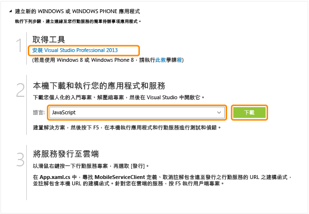

<properties linkid="develop-mobile-tutorials-get-started" urlDisplayName="Get Started" pageTitle="Get Started with Mobile Services for Windows Store apps | Mobile Dev Center" metaKeywords="" description="Follow this tutorial to get started using Azure Mobile Services for Windows Store development in C#, VB, or JavaScript. " metaCanonical="" services="" documentationCenter="Mobile" title="Get started with Mobile Services" authors="glenga" solutions="" manager="" editor="" />

開始使用行動服務
================

[Windows 市集 C\#](/zh-tw/documentation/articles/mobile-services-dotnet-backend-windows-store-dotnet-get-started "Windows 市集 C#")[Windows 市集 JavaScript](/zh-tw/documentation/articles/mobile-services-dotnet-backend-windows-store-javascript-get-started "Windows 市集 JavaScript")[Windows Phone](/zh-tw/documentation/articles/mobile-services-dotnet-backend-windows-phone-get-started "Windows Phone")[iOS](/zh-tw/documentation/articles/mobile-services-dotnet-backend-ios-get-started "iOS") [Android](/zh-tw/documentation/articles/mobile-services-dotnet-backend-android-get-started "Android")

[.NET 後端](/zh-tw/documentation/articles/mobile-services-dotnet-backend-windows-store-javascript-get-started/ ".NET 後端") | [JavaScript 後端](/zh-tw/documentation/articles/mobile-services-windows-store-get-started/ "JavaScript 後端")

本教學課程顯示如何使用 Azure 行動服務，將雲端型後端服務新增到 Windows 應用程式。在本教學課程中，您將以 HTML 和 JavaSript 建立新的行動服務，以及可在新的行動服務中儲存應用程式資料的簡易*待辦事項*應用程式。您所將建立的行動服務，會使用 Visual Studio 與支援的 .NET 語言撰寫伺服器端商務邏輯，並管理行動服務。若要建立可讓您以 JavaScript 撰寫伺服器端商務邏輯的行動服務，請參閱本主題的 [JavaScript 版本](/zh-tw/documentation/articles/mobile-services-windows-store-get-started)。

以下是完成應用程式的螢幕擷取畫面：


完成本教學課程是 Windows 市集應用程式所有其他行動服務教學課程的先決條件。

> [WACOM.NOTE] 若要完成此教學課程，您需要 Azure 帳戶。如果您沒有帳戶，只需要幾分鐘的時間就可以建立免費試用帳戶。如需詳細資訊，請參閱 [Azure 免費試用](http://www.windowsazure.com/zh-tw/pricing/free-trial/?WT.mc_id=A0E0E5C02&returnurl=http%3A%2F%2Fwww.windowsazure.com%2Fen-us%2Fdocumentation%2Farticles%2Fmobile-services-dotnet-backend-windows-store-javascript-get-started%2F)。
> 本教學課程需要 [Visual Studio Professional 2013](https://go.microsoft.com/fwLink/p/?LinkID=257546)。您可以使用免費試用版。

建立新的行動服務
----------------

[WACOM.INCLUDE [mobile-services-dotnet-backend-create-new-service](../includes/mobile-services-dotnet-backend-create-new-service.md)]

建立新的 Windows 市集應用程式
-----------------------------

在建立您的行動服務之後，您可以依照 [管理入口網站] 中的簡易快速入門，來建立新的應用程式或修改現有的應用程式，以連接到您的行動服務。

在本節中，您將建立與行動服務連線的新 Windows 市集應用程式。

1.  在管理入口網站中，按一下 **[行動服務]**，然後按一下您剛剛建立的行動服務。

2.  在快速入門索引標籤中，按一下 **[Choose platform]** 下的 **[Windows]**，並展開 **[Create a new Windows Store app]**。

   	![][6]

   	This displays the three easy steps to create a Windows Store app connected to your mobile service.

  	

1.  在您的本機電腦或虛擬機器下載並安裝 [Visual Studio Professional 2013](https://go.microsoft.com/fwLink/p/?LinkID=257546) (如果您尚未這麼做)。

2.  在 **[Download and run your app and service locally]** 中，選取 Windows 市集應用程式的語言，然後按一下 **[下載]**。

   	這會下載一個方案，其中包含行動服務的專案，以及與行動服務連接的範例*待辦事項*應用程式的專案。將此壓縮專案檔案儲存到您的本機電腦，並記錄儲存位置。

1.  在 **[Publish your service to the cloud]** 下，按一下 [下載] 以下載您的發佈設定檔。請將下載的儲存至本機電腦，並記下儲存位置。

    **安全性注意事項**

    在匯入發佈設定檔之後，請考慮刪除下載的檔案，因為其中包含他人可用來存取您的服務的資訊。

對本機行動服務進行應用程式測試
------------------------------

[WACOM.INCLUDE [mobile-services-dotnet-backend-test-local-service-dotnet](../includes/mobile-services-dotnet-backend-test-local-service-dotnet.md)]

> [WACOM.NOTE]您可以檢閱存取行動服務來查詢和插入資料的程式碼，這可以在 default.js 檔案中找到。

發佈行動服務
------------

[WACOM.INCLUDE [mobile-services-dotnet-backend-publish-service](../includes/mobile-services-dotnet-backend-publish-service.md)]

1.  在 Windows 市集應用程式專案中開啟 App.xaml.cs 檔案、找出建立 [MobileServiceClient](http://msdn.microsoft.com/zh-tw/library/Windowsazure/microsoft.windowsazure.mobileservices.mobileserviceclient.aspx) 執行個體的程式碼、使用 *localhost* 將建立此用戶端的程式碼註解化，然後使用遠端行動服務 URL 將建立此用戶端程式碼取消註解，如下所示：

    ``` {}
    var client = new WindowsAzure.MobileServiceClient(
    "https://todolist.azure-mobile.net/",
    "XXXXXX-APPLICATION-KEY-XXXXXX"
            );
    ```

    此時，用戶端會存取發佈至 Azure 的行動服務。

2.  按 **F5** 鍵，以重建專案並啟動應用程式。

3.  在應用程式的 **[Insert a TodoItem]** 中輸入有意義的文字 (例如*完成教學課程*)，然後按一下 **[儲存]**。

    This sends a POST request to the new mobile service hosted in Azure.


後續步驟
--------

請注意，您已完成快速入門，並了解如何執行行動服務中的其他重要工作：

-   [開始使用資料](/zh-tw/documentation/articles/mobile-services-dotnet-backend-windows-store-javascript-get-started-data)
    深入了解如何使用行動服務儲存和查詢資料。

-   [開始使用驗證](/zh-tw/documentation/articles/mobile-services-dotnet-backend-windows-store-javascript-get-started-users)
    了解如何向身分識別提供者驗證應用程式的使用者。

-   [開始使用推播通知](/zh-tw/documentation/articles/mobile-services-dotnet-backend-windows-store-javascript-get-started-push)
    了解如何將極為基本的推播通知傳送到應用程式。

<!-- Images. -->
[0]: ./media/mobile-services-dotnet-backend-windows-store-javascript-get-started/mobile-quickstart-completed.png

[6]: ./media/mobile-services-dotnet-backend-windows-store-javascript-get-started/mobile-portal-quickstart.png
[7]: ./media/mobile-services-dotnet-backend-windows-store-javascript-get-started/mobile-quickstart-steps.png
[8]: ./media/mobile-services-dotnet-backend-windows-store-javascript-get-started/mobile-service-startup.png

[10]: ./media/mobile-services-dotnet-backend-windows-store-javascript-get-started/mobile-quickstart-startup.png
[11]: ./media/mobile-services-dotnet-backend-windows-store-javascript-get-started/mobile-quickstart-publish.png
[12]: ./media/mobile-services-dotnet-backend-windows-store-javascript-get-started/mobile-data-browse.png
