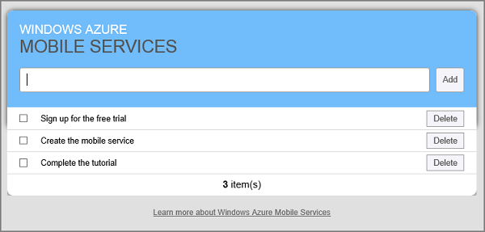
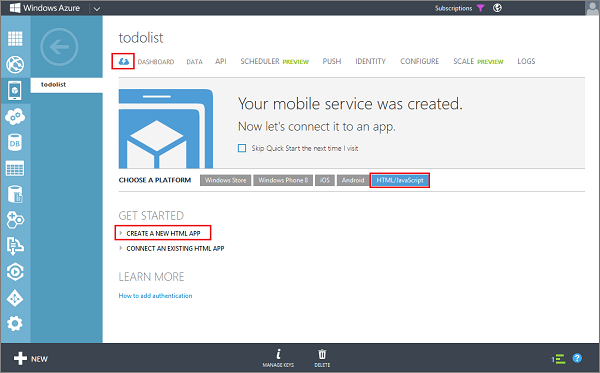

<properties pageTitle="Get Started with Azure Mobile Services for HTML 5 apps" metaKeywords="" description="Follow this tutorial to get started using Azure Mobile Services for HTML development. " metaCanonical="" services="" documentationCenter="Mobile" title="Get started with Mobile Services" authors="glenga" solutions="" manager="" editor="" />

行動服務入門
============

[Windows 市集](/zh-tw/documentation/articles/mobile-services-windows-store-get-started "Windows 市集") [Windows Phone](/zh-tw/documentation/articles/mobile-services-windows-phone-get-started "Windows Phone") [iOS](/zh-tw/documentation/articles/mobile-services-ios-get-started "iOS") [Android](/zh-tw/documentation/articles/mobile-services-android-get-started "Android") [HTML](/zh-tw/documentation/articles/mobile-services-html-get-started "HTML") [Xamarin.iOS](/zh-tw/documentation/articles/partner-xamarin-mobile-services-ios-get-started "Xamarin.iOS") [Xamarin.Android](/zh-tw/documentation/articles/partner-xamarin-mobile-services-android-get-started "Xamarin.Android") [Sencha](/zh-tw/documentation/articles/partner-sencha-mobile-services-get-started/ "Sencha") [PhoneGap](/zh-tw/documentation/articles/mobile-services-javascript-backend-phonegap-get-started/ "PhoneGap")

本教學課程說明如何使用 Azure行動服務在 HTML 應用程式中新增雲端型後端服務。在本教學課程中，您將建立新的行動服務和簡單的 *To do list* 應用程式，後者會在前者儲存應用程式資料。您可以按一下右方的短片，來檢視本教學課程的影片版。

[觀看教學課程](http://go.microsoft.com/fwlink/?LinkId=287040) [播放影片](http://go.microsoft.com/fwlink/?LinkId=287040) 3:51

以下是完成之應用程式的螢幕擷取畫面：

此教學課程是 HTML 應用程式其他所有行動服務教學課程的先修課程。

**注意**

若要完成此教學課程，您需要 Azure 帳戶。如果您沒有帳戶，只需要幾分鐘的時間就可以建立免費試用帳戶。如需詳細資訊，請參閱 [Azure 免費試用](http://www.windowsazure.com/zh-tw/pricing/free-trial/?WT.mc_id=A0E0E5C02&returnurl=http%3A%2F%2Fwww.windowsazure.com%2Fen-us%2Fdevelop%2Fmobile%2Ftutorials%2Fget-started-html%2F)。

### 其他需求

-   本教學課程需要您的本機電腦正在執行下列其中一部網頁伺服器：

    -   **在 Windows 上**：IIS Express。IIS Express 是由 [Microsoft Web Platform Installer](http://go.microsoft.com/fwlink/p/?LinkId=286333) 所安裝。
    -   **在 MacOS X 上**：Python (應該已安裝)。
    -   **在 Linux 上**：Python。您必須安裝[最新版本的 Python](http://go.microsoft.com/fwlink/p/?LinkId=286342) (英文)。

    您可以使用任何網頁伺服器來裝載應用程式，但是這些網頁伺服器需受所下載的指令碼支援。

-   支援 HTML5 的網頁瀏覽器。

建立新的行動服務
----------------

[WACOM.INCLUDE [mobile-services-create-new-service](../includes/mobile-services-create-new-service.md)]

建立新的應用程式建立新的 HTML 應用程式
-----------------------------------------------------------------------

建立行動服務後，您可以使用管理入口網站中簡單的快速入門步驟，建立新的應用程式或者修改現有應用程式為連線至該行動服務。

在本節中，您將建立連線至您行動服務的新 HTML 應用程式。

1.  在管理入口網站中，按一下 **[行動服務]**，然後按一下您剛剛建立的行動服務。

2.  在 [快速入門] 索引標籤中，按一下 **[Choose platform]** 下的 **[Windows]**，然後展開 **[Create a new HTML app]**。

       

       這會顯示三個簡單的步驟來建立及裝載與您行動服務連線的 HTML 應用程式。

       

3.  按一下 **[Create TodoItems table]** 建立資料表來儲存應用程式資料。

4.  在 **[Download and run your app]** 下，按 **[下載]**。

 如此會下載與行動服務連線連線之範例 *To do list* 應用程式的網站檔案。請將壓縮檔儲存至本機電腦，並記下儲存位置。

5.  在 **[設定]** 索引標籤中，確認 `localhost` 已列在 **[Cross-Origin Resource Sharing (CORS)]** 下的 **[Allow requests from host names]** 清單中。如果沒有，請在 **[主機名稱]** 欄位中輸入 `localhost`，然後按一下 **[儲存]**。

 

    
<b>注意</b>
        
如果您將快速入門應用程式部署到 localhost 以外的網頁伺服器，則必須將該網頁伺服器的主機名稱新增至 [Allow requests from host names]<strong></strong> 清單。如需詳細資訊，請參閱<a href="http://msdn.microsoft.com/zh-tw/library/windowsazure/dn155871.aspx" target="_blank">跨來源資源分享</a> (英文)。

裝載並執行 HTML 應用程式
------------------------

本教學課程的最後步驟，是在本機電腦上裝載並執行您的新應用程式。

1.	 瀏覽至儲存壓縮專案檔的位置，在電腦上將檔案解壓縮，然後從 **server** 子資料夾中啟動下列其中一個命令檔。

    -   **launch-windows** (Windows 電腦)
    -   **launch-mac.command** (Mac OS X 電腦)
    -   **launch-linux.sh** (Linux 電腦)

    **注意**

    在 Windows 電腦上，當 PowerShell 要求您確認要執行指令碼時，請輸入 'R'。因為指令碼是下載自網際網路，所以網頁瀏覽器可能會警告您不要執行指令碼。發生此情況時，您必須要求瀏覽器繼續載入指令碼。

    如此會在本機電腦上啟動網頁伺服器來裝載新的應用程式。

2. 在網頁瀏覽器中開啟 URL <http://localhost:8000/> 以啟動應用程式。

3.	在應用程式中，於 **[Enter new task]** 中輸入有意義的文字 (例如 *Complete the tutorial*)，然後按一下 **[新增]**。

       

       如此會傳送 POST 要求給裝載於 Azure 中的新行動服務。要求中的資料會插入至 TodoItem 資料表中。行動服務會傳回資料表中儲存的項目，而該資料會顯示在應用程式的第二欄。

    **注意**

    您可以檢閱造成存取您行動服務來進行查詢和插入資料的程式碼，該程式碼位於 app.js 檔案中。

4.	回到管理入口網站，按一下 **[資料]** 索引標籤，然後按一下 **[TodoItems]** 資料表。

       

       如此可讓您瀏覽應用程式插入到資料表中的資料。

       

後續步驟
--------

您已完成快速入門，現在可以了解如何在行動服務中執行其他重要工作：

-   **[開始使用資料](/en-us/develop/mobile/tutorials/get-started-with-data-html)**
    深入了解使用行動服務來儲存及查詢資料。

-   **[開始使用驗證](/en-us/develop/mobile/tutorials/get-started-with-users-html)**
    了解如何以身分識別提供者驗證您的應用程式使用者。

-   **[行動服務 HTML/JavaScript 作法概念參考](/en-us/develop/mobile/how-to-guides/work-with-html-js-client)**
    深入了解如何搭配使用行動服務與 HTML/JavaScript

