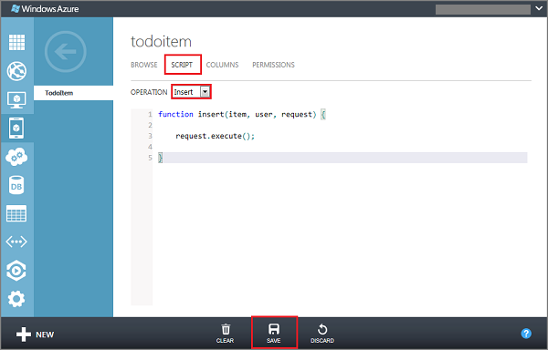

<properties pageTitle="Service-side authorization (iOS) | Mobile Dev Center" metaKeywords="" description="Learn how to authorize users in the JavaScript backend of Azure Mobile Services." metaCanonical="" services="" documentationCenter="Mobile" title="Service-side authorization of Mobile Services users" authors="glenga" solutions="" manager="" editor="" />

行動服務使用者的伺服器端授權
============================

[Windows 市集 C\#](/en-us/documentation/articles/mobile-services-windows-store-dotnet-authorize-users-in-scripts "Windows 市集 C#")[Windows 市集 JavaScript](/en-us/documentation/articles/mobile-services-windows-store-javascript-authorize-users-in-scripts "Windows 市集 JavaScript")[Windows Phone](/en-us/documentation/articles/mobile-services-windows-phone-authorize-users-in-scripts "Windows Phone")[iOS](/en-us/documentation/articles/mobile-services-ios-authorize-users-in-scripts "iOS")[Android](/en-us/documentation/articles/mobile-services-android-authorize-users-in-scripts "Android")[HTML](/en-us/documentation/articles/mobile-services-html-authorize-users-in-scripts "HTML")[Xamarin.iOS](/en-us/documentation/articles/partner-xamarin-mobile-services-ios-authorize-users-in-scripts "Xamarin.iOS")[Xamarin.Android](/en-us/documentation/articles/partner-xamarin-mobile-services-android-authorize-users-in-scripts "Xamarin.Android")

[.NET 後端](/en-us/documentation/articles/mobile-services-dotnet-backend-ios-authorize-users-in-scripts/ ".NET 後端") | [JavaScript 後端](/en-us/documentation/articles/mobile-services-ios-authorize-users-in-scripts/ "JavaScript 後端")

本主題說明如何使用伺服器指令碼為已驗證的使用者授權，使其可從 iOS 應用程式存取 Azure 行動服務中的資料。在本教學課程中，您將在行動服務中註冊指令碼，根據經驗證使用者的 userId 篩選查詢，確保每位使用者只能看到他們自己的資料。

本教學課程會以行動服務快速入門為基礎，並依據上一個[開始使用驗證](/en-us/develop/mobile/tutorials/get-started-with-users-ios)教學課程建立。開始此教學課程之前，您必須先完成[開始使用驗證](/en-us/develop/mobile/tutorials/get-started-with-users-ios)。

註冊指令碼
----------

由於快速入門應用程式會讀取與插入資料，您必須對 TodoItem 資料表註冊這些作業的指令碼。

1.  登入 [Azure 管理入口網站](https://manage.windowsazure.com/)，按一下 **[行動服務]**，然後按一下您的應用程式。

	

2.  按一下 **[資料]** 索引標籤，然後按一下 **[TodoItem]** 資料表。

	

3.  按一下 **[指令碼]**，然後選取 **[插入]** 作業。

	

4.  以下列函數取代現有的指令碼，然後按一下 **[儲存]**。

        function insert(item, user, request) {
          item.userId = user.userId;    
          request.execute();
        }

    在將 userId 值 (這就是經驗證使用者的使用者識別碼) 插入 TodoItem 資料表之前，此指令碼會先將此值新增至項目。

    **注意**

    首次執行插入指令碼時，必須啟用動態結構描述。在已啟用動態結構描述的情況下，行動服務會在首次執行時將 **userId** 資料行自動新增至 **TodoItem** 資料表。依預設，新行動服務的動態結構描述為已啟用，您應該先將它停用之後再將應用程式發行至 Windows 市集。

5.  重複步驟 3 和 4，以下列函數取代現有的 **Read** 作業：

        function read(query, user, request) {
           query.where({ userId:user.userId});    
           request.execute();
        }

	此指令碼會篩選傳回的 TodoItem 物件，因此每位使用者只會收到他們所插入的項目。

測試應用程式
------------

1.  在 Xcode 中，開啟您完成教學課程[開始使用驗證](/en-us/develop/mobile/tutorials/get-started-with-users-ios)時所修改的專案。

2.  按 **[執行]** 按鈕以建置專案，並在 iPhone 模擬器中啟動應用程式，然後使用您選擇的身分識別提供者進行登入。

	請注意，雖然已有先前教學課程中在 TodoItem 資料表中輸入的項目，依然不會傳回任何項目。因為之前的項目插入時沒有 userID 資料欄，而現在有 Null 值。

3.  在應用程式的 **[Insert a TodoItem]** 中輸入文字，然後按一下 **[儲存]**。

	

	如此會在行動服務中的 TodoItem 資料表中插入文字及 userId。因為新的項目具有正確的 userID 值，所以會由行動服務傳回並顯示在第二個資料欄中。

4.  返回[管理入口網站](https://manage.windowsazure.com/)的 **todoitem** 資料表中，按一下 **[瀏覽]** 並驗證每個新增項目現在是否具有關聯的 userId 值。

5.  (選用) 如果您有其他登入帳戶，您可以驗證使用者是否只能看到自己的資料，方法是關閉此應用程式然後重新執行。顯示登入認證對話方塊時，請輸入不同的登入，然後驗證是否不會顯示在上一個帳戶下所輸入的項目。

後續步驟
--------

這將結束示範使用驗證基本概念的教學課程。考慮更深入了解下列行動服務主題：

-   [開始使用資料](/en-us/develop/mobile/tutorials/get-started-with-data-ios)
   深入了解如何使用行動服務儲存和查詢資料。

-   [開始使用推播通知](/en-us/develop/mobile/tutorials/get-started-with-push-ios)
   了解如何將極為基本的推播通知傳送到應用程式。

-   [行動服務伺服器指令碼參考](http://go.microsoft.com/fwlink/p/?LinkId=262293)
   深入了解如何註冊和使用伺服器指令碼。

