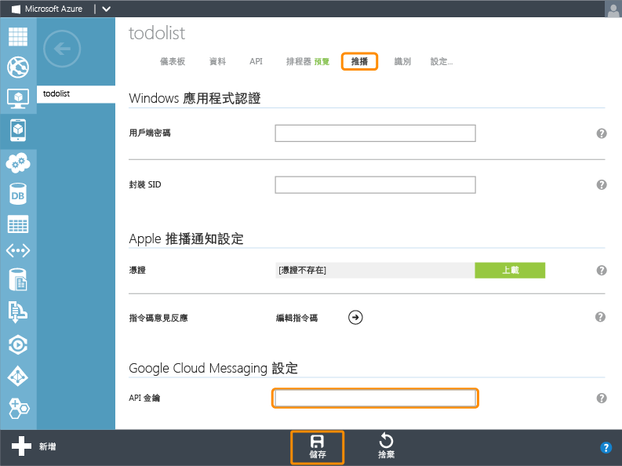

<properties linkid="develop-mobile-tutorials-get-started-with-push-js-vs2013" urlDisplayName="Get Started with Push (JS)" pageTitle="Get started with push notifications (Android JavaScript) | Mobile Dev Center" metaKeywords="" description="Learn how to use Windows Azure Mobile Services to send push notifications to your Android JavaScript app." metaCanonical="http://www.windowsazure.com/zh-tw/develop/mobile/tutorials/get-started-with-push-dotnet/" services="" documentationCenter="Mobile" title="Get started with push notifications in Mobile Services" authors="ricksal" solutions="" writer="ricksal" manager="" editor="" />

開始在行動服務中使用推播通知
============================

[Windows 市集 C\#](/zh-tw/documentation/articles/mobile-services-javascript-backend-windows-store-dotnet-get-started-push "Windows 市集 C#") [Windows 市集 JavaScript](/zh-tw/documentation/articles/mobile-services-javascript-backend-windows-store-javascript-get-started-push "Windows 市集 JavaScript") [Windows Phone](/zh-tw/documentation/articles/mobile-services-javascript-backend-windows-phone-get-started-push "Windows Phone") [iOS](/zh-tw/documentation/articles/mobile-services-ios-get-started-push "iOS") [Android](/zh-tw/documentation/articles/mobile-services-javascript-backend-android-get-started-push "Android")

本主題說明如何使用 Azure 行動服務傳送推播通知至 Android 應用程式。在本教學課程中，您會使用 Google 雲端通訊 (GCM) 將推播通知新增至快速入門專案。完成後，行動服務就會在每次插入記錄時傳送推播通知。

[WACOM.NOTE]本教學課程將示範如何整合行動服務與通知中心，目前這是預覽版中的功能。依預設不會啟用從 JavaScript 後端使用通知中心傳送推播通知的功能。新的通知中心一旦建立後，整合程序將無法回復。目前，iOS 的推播通知只能透過[此版本的主題](/zh-tw/documentation/articles/mobile-services-android-get-started-push/)所說明的預設推播支援來使用。

本教學課程會逐步引導您完成啟用推播通知的基本步驟：

1.  [啟用 Google 雲端通訊](#register)
2.  [設定行動服務](#configure)
3.  [將推播通知新增至應用程式](#add-push)
4.  [更新指令碼來傳送推播通知](#update-scripts)
5.  [插入資料以接收通知](#test)

本教學課程是以行動服務快速入門為基礎。開始本教學課程之前，您必須先完成[開始使用行動服務](/en-us/develop/mobile/tutorials/get-started/)或[開始使用資料](/en-us/develop/mobile/tutorials/get-started-with-data-js/)，將您的專案連接到行動服務。

啟用 Google 雲端通訊
--------------------

[WACOM.INCLUDE [啟用 GCM](../includes/mobile-services-enable-Google-cloud-messaging.md)]

接下來，您將使用此 API 金鑰值，讓行動服務能夠使用 GCM 進行驗證並代表您的應用程式傳送推播通知。

設定行動服務來傳送推播要求
--------------------------

1.  登入 [Windows Azure 管理入口網站](https://manage.windowsazure.com/)，按一下 **[行動服務]**，然後按一下您的應用程式。

	

2.  依序按一下 **[推播]** 索引標籤、**[Enable enhanced push]** 和 **[是]**，以接受組態變更。

    

    

    這會更新行動服務的組態，以使用通知中心所提供的增強式推播通知功能。您可在付費的行動服務中免費使用部分通知中心功能。如需詳細資訊，請參閱[行動服務定價詳細資料](http://go.microsoft.com/fwlink/p/?LinkID=311786)。

    **重要事項**

    此作業會重設您的推播認證，並在您的指令碼中變更推播方法的行為。這些變更無法回復。請不要使用此方法將通知中心新增至生產行動服務。如需如何在生產行動服務中啟用增強式推播通知的指引，請參閱[此指引](http://go.microsoft.com/fwlink/p/?LinkId=391951)。

3.  輸入前一個程序中從 GCM 取得的 **[API Key]** 值，然後按一下 **[儲存]**。

	

    **重要事項**

    如果您在入口網站的 [推播] 索引標籤中設定進階推播通知的 GCM 認證，這些認證將會與通知中心共用，以設定您的應用程式適用的通知中心。

您的行動服務和應用程式現在都已完成設定，而可與 GCM 和通知中心搭配使用。

新增推播通知至應用程式
----------------------

### 驗證 Android SDK 版本

[WACOM.INCLUDE [Verify SDK](../includes/mobile-services-verify-android-sdk-version.md)]

下一個步驟是安裝 Google Play 服務。Google 雲端通訊在開發和測試方面有一些 API 層級的最低需求，這些是資訊清單中的 **minSdkVersion** 屬性所必須遵守。

如果您要以較舊的裝置進行測試，請參考[設定 Google Play 服務 SDK](http://go.microsoft.com/fwlink/?LinkId=389801)，以確認此值可以設得多低，並加以適當設定。

### 新增 Google Play 服務至專案

[WACOM.INCLUDE [新增 Play 服務](../includes/mobile-services-add-Google-play-services.md)]

### 新增程式碼

1.  開啟 `AndroidManifest.xml` 檔案。在下兩個步驟的程式碼中，以專案的應用程式套件名稱 (即 `manifest` 標籤中的 `package` 屬性值) 取代 _`**my_app_package**`_。

2.  在現有 `uses-permission` 元素後新增下列新權限：

         <permission android:name="**my_app_package**.permission.C2D_MESSAGE" 
        android:protectionLevel="signature" />
        <uses-permission android:name="**my_app_package**.permission.C2D_MESSAGE" /> 
        <uses-permission android:name="com.google.android.c2dm.permission.RECEIVE" />
        <uses-permission android:name="android.permission.GET_ACCOUNTS" />
        <uses-permission android:name="android.permission.WAKE_LOCK" />

3.  在 `application` 起始標籤後新增下列程式碼：

         <receiver android:name="com.microsoft.windowsazure.notifications.NotificationsBroadcastReceiver"
                                    android:permission="com.google.android.c2dm.permission.SEND">
        <intent-filter>
        <action android:name="com.google.android.c2dm.intent.RECEIVE" />
        <category android:name="**my_app_package**" />
        </intent-filter>
        </receiver>

4.  下載並解壓縮 [行動服務 Android SDK]，開啟 **notifications** 資料夾，將 **notifications-1.0.1.jar** 檔案複製到 Eclipse 專案的 *libs* 資料夾，然後重新整理 *libs* 資料夾。

    **注意**

    檔案名稱結尾的數字在後續 SDK 版本中可能會變更。

5.  開啟 *ToDoItemActivity.java* 檔案，新增下列 import 陳述式：

        import com.microsoft.windowsazure.notifications.NotificationsManager;

6.  新增下列私用變數至類別，其中 *`<PROJECT_NUMBER>`* 是先前程序中由 Google 指派給您應用程式的專案編號：

        public static final String SENDER_ID = "<PROJECT_NUMBER>";

7.  在 **onCreate** 方法中，在 MobileServiceClient 具現化之前，新增此程式碼來註冊裝置的通知處理常式：

        NotificationsManager.handleNotifications(this, SENDER_ID, MyHandler.class);

    稍後我們會定義此程式碼中參考的 MyHandler.class。

8.  在 Package Explorer 中，以滑鼠右鍵按一下封裝 (在 [src]`` 節點下)，按一下 **[New]**，按一下 **[Class]**。

9.  在 **[Name]** 輸入 `MyHandler`，在 **[Superclass]** 輸入 `com.microsoft.windowsazure.notifications.NotificationsHandler`，然後按一下 **[Finish]**

    

    如此即會建立新的 MyHandler 類別。

10. 新增下列 import 陳述式：

        import android.content.Context;

11. 接著，將下列程式碼新增至此類別：

        public static final int NOTIFICATION_ID = 1;
        private NotificationManager mNotificationManager;
        NotificationCompat.Builder builder;
        Context ctx;

12. 新增下列程式碼，以覆寫 **OnRegistered** 方法：(此方法會對行動服務通知中心註冊您的裝置)。

        @Override
        public void onRegistered(Context context, String gcmRegistrationId) {
        super.onRegistered(context, gcmRegistrationId);
                
        ToDoActivity.mClient.getPush().register(gcmRegistrationId, null, new RegistrationCallback() {
        @Override
        public void onRegister(Registration registration, Exception exception) {
        if (exception != null) {
        // handle error
                      }
                }
            });
        }

13. 新增下列程式碼，以覆寫 **onReceive** 方法 (此方法會使通知被接收到時隨即顯示)。

        @Override
        public void onReceive(Context context, Bundle bundle) {
        ctx = context;
        String nhMessage = bundle.getString("message");

        sendNotification(nhMessage);
        }

        private void sendNotification(String msg) {
        mNotificationManager = (NotificationManager)
        ctx.getSystemService(Context.NOTIFICATION_SERVICE);

        PendingIntent contentIntent = PendingIntent.getActivity(ctx, 0,
        new Intent(ctx, ToDoActivity.class), 0);

        NotificationCompat.Builder mBuilder =
        new NotificationCompat.Builder(ctx)
        .setSmallIcon(R.drawable.ic_launcher)
        .setContentTitle("Notification Hub Demo")
        .setStyle(new NotificationCompat.BigTextStyle()
        .bigText(msg))
        .setContentText(msg);

        mBuilder.setContentIntent(contentIntent);
        mNotificationManager.notify(NOTIFICATION_ID, mBuilder.build());
        }

您的應用程式現在已更新為支援推播通知。

在管理入口網站中更新已註冊的 insert 指令碼
------------------------------------------

1.  在管理入口網站中，按一下 **[資料]** 索引標籤，然後按一下 **[TodoItem]** 資料表。

	

2.  在 **[todoitem]** 中，按一下 **[指令碼]** 索引標籤，然後選取 **[插入]**。

	 

	這會顯示 **[TodoItem]** 資料表中發生插入時所叫用的函數。

1.  使用下列程式碼來取代 insert 函數，然後按一下 **[儲存]**：

         function insert(item, user, request) {
        // Define a payload for the Google Cloud Messaging toast notification.
        var payload = 
        '{"data":{"message" :"Hello from Mobile Services!"}}';
            
        request.execute({
        success:function(){
        // If the insert succeeds, send a notification.
        push.gcm.send(null, payload, {
        success:function(pushResponse) {
        console.log("Sent push:", pushResponse, payload);
        request.respond();
                         },              
        error:function(pushResponse) {
        console.log("Error Sending push:", pushResponse);
        request.respond(500, { error:pushResponse });
                         }
                     });
                 },
        error:function(err) {
        console.log("request.execute error", err)
        request.respond();
             }
           });
         }

	如此即會註冊新的 insert 指令碼，該指令碼會在插入成功之後，使用 [gcm object] 將推播通知傳送給所有已註冊的裝置。 

在應用程式中測試推播通知
------------------------

您可以使用 USB 纜線直接連接 Android 手機，或使用模擬器中的虛擬裝置，對應用程式進行測試。

### 設定用於測試的模擬器

當您在模擬器中執行此應用程式時，請務必使用支援 Google API 的 Android 虛擬裝置 (AVD)。

1.  重新啟動 Eclipse，然後在 Package Explorer 中以滑鼠右鍵按一下專案，按一下 **[Properties]**，按一下 **[Android]**，核取 **[Google API]**，然後按一下 **[OK]**。

    

	如此會使專案的目標變成 Google API。

1.  從 **[Window]** 中選取 **[Android Virtual Device Manager]**，選取您的裝置，按一下 **[Edit]**。

    

2.  在 **[Target]** 中選取 **[Google API]**，然後按一下 [OK]。

	

    如此會使 AVD 變成使用 Google API。

### 執行測試

1.  在 Eclipse 的 **[執行]** 功能表中按一下 **[執行]**，以啟動應用程式。

2.  在應用程式中，輸入有意義的文字，如 *A new Mobile Services task*，然後按一下 **[加入]** 按鈕。

	

1.  從螢幕頂端向下撥動將裝置的通知中心開啟，以檢視通知。

您已順利完成本教學課程。

後續步驟
--------

本教學課程將示範行動服務所提供的基本推播通知功能。如果您的應用程式需要更進階的功能，例如傳送跨平台通知、訂閱型路由或是極大的磁碟區，請考慮在您的行動服務中使用 Windows Azure 通知中心。如需詳細資訊，請參閱下列通知中心主題：

-   [開始使用通知中心](/en-us/manage/services/notification-hubs/getting-started-windows-dotnet/)
    了解如何在 Android 應用程式中使用通知中心。

-   [將通知傳送給訂閱者](/en-us/manage/services/notification-hubs/breaking-news-dotnet/)
    了解使用者如何註冊及接收其所需類別的推播通知。

-   [將通知傳送給使用者](/en-us/manage/services/notification-hubs/notify-users/)
    了解如何將推播通知從行動服務傳送給任何裝置上的特定使用者。

-   [將交叉平台通知傳送給使用者](/en-us/manage/services/notification-hubs/notify-users-xplat-mobile-services/)
    了解如何使用範本從行動服務傳送推播通知，但不必在您的後端製作平台特定裝載。

考慮更深入了解下列行動服務主題：

-   [開始使用資料](/en-us/develop/mobile/tutorials/get-started-with-data-js/)
    深入了解如何使用行動服務儲存和查詢資料。

-   [開始使用驗證](/en-us/develop/mobile/tutorials/get-started-with-users-js)
    了解如何使用 Windows 帳戶驗證您的應用程式的使用者。

-   [行動服務伺服器指令碼參考](http://go.microsoft.com/fwlink/?LinkId=262293)
    深入了解如何註冊和使用伺服器指令碼。

-   [行動服務 HTML/JavaScript 作法概念參考](/en-us/develop/mobile/how-to-guides/work-with-html-js-client/)
    深入了解如何將行動服務搭配 HTML 及 JavaScript 使用。

