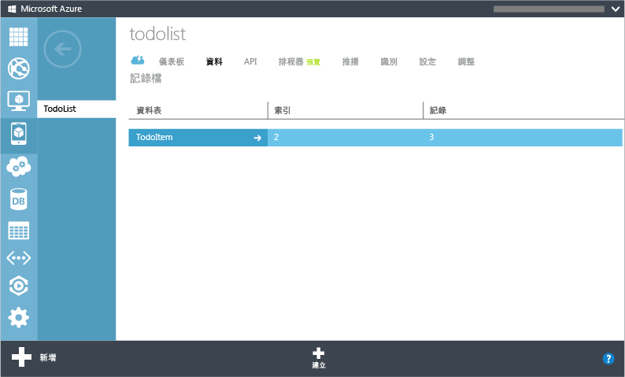
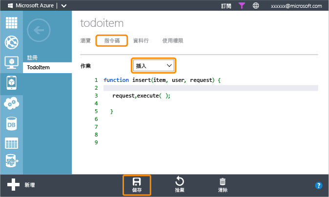

<properties pageTitle="開始使用推播通知 (Android JavaScript) | 行動開發人員中心" description="了解如何使用 Azure 行動服務傳送推播通知至 Android JavaScript 應用程式。" services="mobile-services, notification-hubs" documentationCenter="android" authors="RickSaling" writer="ricksal" manager="dwrede" editor=""/>

<tags ms.service="mobile-services" ms.workload="mobile" ms.tgt_pltfrm="Mobile-Android" ms.devlang="Java" ms.topic="article" ms.date="10/16/2014" ms.author="ricksal"/>

# 將推播通知新增至行動服務應用程式

[AZURE.INCLUDE [mobile-services-selector-get-started-push](../includes/mobile-services-selector-get-started-push.md)]

本主題說明如何搭配使用 Azure 行動服務和 Google 雲端通訊 (GCM)，將推播通知傳送至 Android 應用程式。在本教學課程中，您會啟用透過 Azure 通知中心將推播通知傳送至快速入門專案的功能。完成後，行動服務就會在每次插入記錄時傳送推播通知。

本教學課程將逐步引導您完成下列啟用推播通知的基本步驟：

1. [啟用 Google 雲端通訊](#register)
2. [設定行動服務](#configure)
3. [將推播通知新增至應用程式](#add-push)
4. [更新指令碼來傳送推播通知](#update-scripts)
5. [插入資料以接收通知](#test)

>[AZURE.NOTE] 如果您想查看已完成之應用程式的原始程式碼，請移至<a href="https://github.com/RickSaling/mobile-services-samples/tree/futures/GettingStartedWithPush/Android" target="_blank">這裡</a>。

##必要條件

[AZURE.INCLUDE [mobile-services-android-prerequisites](../includes/mobile-services-android-prerequisites.md)]

##啟用 Google 雲端通訊

>[AZURE.NOTE]若要完成此程序，您必須要有已通過電子郵件地址驗證的 Google 帳戶。若要建立新的 Google 帳戶，請前往 <a href="http://go.microsoft.com/fwlink/p/?LinkId=268302" target="_blank">accounts.google.com</a>。

[AZURE.INCLUDE [Enable GCM](../includes/mobile-services-enable-Google-cloud-messaging.md)]

接下來，您將使用此 API 金鑰值，讓行動服務能夠使用 GCM 進行驗證，並代表您的應用程式傳送推播通知。

##設定行動服務傳送推播要求

1. 登入 [Azure 管理入口網站]，按一下 [行動服務]****，然後按一下您的應用程式。

   	

2. 按一下 [**推播**] 索引標籤，輸入前一個程序中從 GCM 取得的 [**API Key**] 值，然後按一下 [**儲存**]。

	>[AZURE.NOTE]當您使用舊版行動服務完成這個教學課程時，可能會在 [**推播**] 索引標籤底部看見名為 [**啟用進階推播**] 的連結。立即按一下這個連結，即可升級您的行動服務來與通知中心整合。這個變更無法回復。如需如何在生產行動服務中啟用進階推播通知的詳細資料，請參閱<a href="http://go.microsoft.com/fwlink/p/?LinkId=391951">此指引</a>。

   	

	> [AZURE.IMPORTANT] 如果您在入口網站的 [推播] 索引標籤中設定進階推播通知的 GCM 認證，這些認證將會與通知中心共用，以設定您的應用程式適用的通知中心。

您的行動服務和應用程式現在都已完成設定，而可與 GCM 和通知中心搭配使用。

##將推播通知新增至應用程式

###驗證 Android SDK 版本

[AZURE.INCLUDE [Verify SDK](../includes/mobile-services-verify-android-sdk-version.md)]

下一個步驟是安裝 Google Play 服務。Google 雲端通訊在開發和測試方面有一些 API 層級的最低需求，這是資訊清單中的 **minSdkVersion** 屬性所必須遵守的。 

如果您要以較舊的裝置進行測試，請參考 [[設定 Google Play 服務 SDK]]，以確認此值可以設得多低，並加以適當設定。

###新增 Google Play 服務至專案

[AZURE.INCLUDE [Add Play Services](../includes/mobile-services-add-Google-play-services.md)]

###新增程式碼

[AZURE.INCLUDE [mobile-services-android-getting-started-with-push](../includes/mobile-services-android-getting-started-with-push.md)]

##在管理入口網站中更新已註冊的插入指令碼

1. 在管理入口網站中，按一下 [**資料**] 索引標籤，然後按一下 [**TodoItem**] 資料表。 

   	

2. 在 [**TodoItem**] 中，按一下 [**指令碼**] 索引標籤，然後選取 [**插入**]。
   
  	

   	這會顯示 [**TodoItem**] 資料表中發生插入時所叫用的函數。

3. 使用下列程式碼來取代 insert 函數，然後按一下 [**儲存**]：

		function insert(item, user, request) {
		// Define a payload for the Google Cloud Messaging toast notification.
		var payload = {
		    data: {
		        message: item.text 
		    }
		};		
		request.execute({
		    success: function() {
		        // If the insert succeeds, send a notification.
		        push.gcm.send(null, payload, {
		            success: function(pushResponse) {
		                console.log("Sent push:", pushResponse, payload);
		                request.respond();
		                },              
		            error: function (pushResponse) {
		                console.log("Error Sending push:", pushResponse);
		                request.respond(500, { error: pushResponse });
		                }
		            });
		        },
		    error: function(err) {
		        console.log("request.execute error", err)
		        request.respond();
		    }
		  });
		}

   	如此即會註冊新的 insert 指令碼，該指令碼會在插入成功之後，使用 [gcm 物件]將推播通知傳送給所有已註冊的裝置。 

##在應用程式中測試推播通知

您可以使用 USB 纜線直接連接 Android 手機，或使用模擬器中的虛擬裝置，對應用程式進行測試。

###設定用於測試的模擬器

當您在模擬器中執行此應用程式時，請務必使用支援 Google API 的 Android 虛擬裝置 (AVD)。

1. 重新啟動 Eclipse，然後在封裝總管中，以滑鼠右鍵按一下專案，再依序按一下 [**屬性**] 及 [**Android**]，核取 [**Google API**]，然後按一下 [**確定**]。

	

  	如此會使專案的目標變成 Google API。

2. 從 [**Window**] 中選取 [**Android Virtual Device Manager**]，選取您的裝置，按一下 [**Edit**]。

	

3. 在 [**Target**] 中選取 [**Google API**]，然後按一下 [OK]。

   	

	如此會使 AVD 變成使用 Google API。

###執行測試

1. 在 Eclipse 的 [**執行**] 功能表中按一下 [**執行**]，以啟動應用程式。

2. 在應用程式中，輸入有意義的文字，如 A new Mobile Services task，然後按一下 [**新增**] 按鈕。

  	

3. 從螢幕頂端向下撥動將裝置的通知中心開啟，以檢視通知。

您已成功完成此教學課程。

## 後續步驟

<!---本教學課程說明啟用 Android 應用程式，以使用行動服務和通知中心傳送推播通知的基本概念。接下來，請考慮閱讀下個教學課程[將推播通知傳送給驗證的使用者]，此課程說明如何使用標籤將行動服務中的推播通知指定傳送給驗證的使用者。

+ [將推播通知傳送給驗證的使用者]
	 了解如何利用標籤，從行動服務將推播通知只傳送給驗證的使用者。

+ [將廣播通知傳送給訂閱者]
	 了解使用者如何註冊及接收其所需類別的推播通知。

+ [將範本型通知傳送給訂閱者]
	 了解如何使用範本從行動服務傳送推播通知，但不必在您的後端製作平台特定裝載。
-->

在下列主題中深入了解行動服務和通知中心：

* [開始使用資料]
   深入了解如何使用行動服務儲存和查詢資料。

* [開始使用驗證]
   了解如何使用行動服務驗證使用不同帳戶類型的應用程式使用者。

* [什麼是通知中心？]
   深入了解通知中心如何跨所有主要用戶端平台將通知傳遞到您的應用程式。

* [偵錯通知中心應用程式](http://go.microsoft.com/fwlink/p/?linkid=386630)
   取得指引疑難排解和偵錯通知中心解決方案。 

* [如何使用行動服務的 Android 用戶端程式庫]
   深入了解如何搭配使用行動服務與 Android。

* [行動服務伺服器指令碼參考]
   深入了解如何在您的行動服務中實作商務邏輯。

<!-- Anchors. -->
[針對推播通知註冊您的應用程式及設定行動服務]: #register
[更新產生的推播通知程式碼]: #update-scripts
[插入資料以接收通知]: #test
[後續步驟]:#next-steps

<!-- Images. -->
[13]: ./media/mobile-services-windows-store-javascript-get-started-push/mobile-quickstart-push1.png
[14]: ./media/mobile-services-windows-store-javascript-get-started-push/mobile-quickstart-push2.png

<!-- URLs. -->
[提交應用程式頁面]: http://go.microsoft.com/fwlink/p/?LinkID=266582
[我的應用程式]: http://go.microsoft.com/fwlink/p/?LinkId=262039
[Live SDK for Windows]: http://go.microsoft.com/fwlink/p/?LinkId=262253
[開始使用行動服務]: /zh-tw/documentation/articles/mobile-services-android-get-started/
[開始使用資料]: /zh-tw/documentation/articles/mobile-services-android-get-started-data/
[開始使用驗證]: /zh-tw/documentation/articles/mobile-services-android-get-started-users
[開始使用推播通知]: /zh-tw/develop/mobile/tutorials/get-started-with-push-js
[推播通知給應用程式使用者]: /zh-tw/develop/mobile/tutorials/push-notifications-to-users-js
[使用指令碼授權使用者]: /zh-tw/develop/mobile/tutorials/authorize-users-in-scripts-js
[JavaScript and HTML]: /zh-tw/develop/mobile/tutorials/get-started-with-push-js
[設定 Google Play 服務 SDK]: http://go.microsoft.com/fwlink/?LinkId=389801
[Azure 管理入口網站]: https://manage.windowsazure.com/
[如何使用行動服務的 Android 用戶端程式庫]: /zh-tw/documentation/articles/mobile-services-android-how-to-use-client-library

[gcm 物件]: http://go.microsoft.com/fwlink/p/?LinkId=282645

[行動服務伺服器指令碼參考]: http://go.microsoft.com/fwlink/?LinkId=262293

[將推播通知傳送給驗證的使用者]: /zh-tw/documentation/articles/mobile-services-javascript-backend-android-push-notifications-app-users/

[什麼是通知中心？]: /zh-tw/documentation/articles/notification-hubs-overview/
[將廣播通知傳送給訂閱者]: /zh-tw/documentation/articles/notification-hubs-android-send-breaking-news/
[將範本型通知傳送給訂閱者]: /zh-tw/documentation/articles/notification-hubs-android-send-localized-breaking-news/

<!--HONumber=42-->
