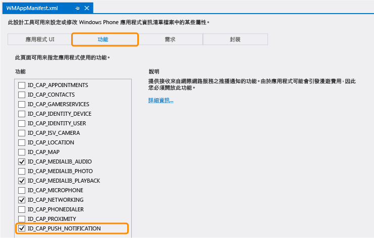

<properties pageTitle="Get started with push notifications (Windows Store) | Mobile Dev Center" metaKeywords="" description="Learn how to use Azure Mobile Services and Notification Hubs to send push notifications to your Windows Store app." metaCanonical="" services="mobile" documentationCenter="Mobile" title="Get started with push notifications in Mobile Services" authors="glenga" solutions="" manager="" editor="" />

開始在行動服務中使用推播通知
============================

[Windows 市集 C\#](/zh-tw/documentation/articles/mobile-services-javascript-backend-windows-store-dotnet-get-started-push "Windows 市集 C#")[Windows 市集 JavaScript](/zh-tw/documentation/articles/mobile-services-javascript-backend-windows-store-javascript-get-started-push "Windows 市集 JavaScript")[Windows Phone](/zh-tw/documentation/articles/mobile-services-javascript-backend-windows-phone-get-started-push "Windows Phone")[iOS](/zh-tw/documentation/articles/mobile-services-ios-get-started-push "iOS")[Android](/zh-tw/documentation/articles/mobile-services-javascript-backend-android-get-started-push "Android")

[.NET 後端](/zh-tw/documentation/articles/mobile-services-dotnet-backend-windows-phone-get-started-push/ ".NET 後端") | [JavaScript 後端](/zh-tw/documentation/articles/mobile-services-javascript-backend-windows-phone-get-started-push/ "JavaScript 後端")

本主題說明如何使用 Azure 行動服務傳送推播通知至 Windows 市集應用程式。在本教學課程中，您會啟用透過 Azure 通知中心將推播通知傳送至快速入門專案的功能。完成後，您的行動服務就會在每次插入記錄時使用通知中心傳送推播通知。您所建立的通知中心可透過行動服務免費使用、可在行動服務以外個別管理，並且可供其他應用程式和服務使用。

> [WACOM.NOTE]本教學課程將示範如何整合行動服務與通知中心，目前這是預覽版中的功能。依預設不會啟用從 JavaScript 後端使用通知中心傳送推播通知的功能。新的通知中心一旦建立後，整合程序將無法回復。目前，iOS 和 Android 的推播通知只能透過[此版本的主題](/zh-tw/documentation/articles/mobile-services-windows-phone-get-started-push/)所說明的預設推播支援來使用。

本教學課程會逐步引導您完成啟用推播通知的基本步驟：

1.  [更新應用程式以註冊通知](#update-app)
2.  [更新伺服器指令碼以傳送推播通知](#update-scripts)
3.  [插入資料以接收推播通知](#test)

本教學課程是以行動服務快速入門為基礎。開始本教學課程之前，您必須先完成[開始使用行動服務](/zh-tw/documentation/articles/mobile-services-windows-phone-get-started)或[開始使用資料](/zh-tw/documentation/articles/mobile-services-windows-phone-get-started-data)，將您的專案連接到行動服務。若未連接行動服務，[新增推播通知] 精靈會為您建立此連線。

更新應用程式以註冊通知
----------------------

您必須先註冊通知通道，您的應用程式才能接收推播通知。

1.  在 Visual Studio 中開啟 App.xaml.cs 檔案，並新增下列 `using` 陳述式：

         using Microsoft.Phone.Notification;

2.  新增下列程式碼至 App.xaml.cs：

         public static HttpNotificationChannel CurrentChannel { get; private set; }

        private void AcquirePushChannel()
         {
        CurrentChannel = HttpNotificationChannel.Find("MyPushChannel");

        if (CurrentChannel == null)
             {
        CurrentChannel = new HttpNotificationChannel("MyPushChannel");
        CurrentChannel.Open();
        CurrentChannel.BindToShellToast();
             }

        CurrentChannel.ChannelUriUpdated +=
        new EventHandler<NotificationChannelUriEventArgs>(async (o, args) =>
                 {

        // Register for notifications using the new channel
        await MobileService.GetPush()
        .RegisterNativeAsync(CurrentChannel.ChannelUri.ToString());
                 });
         }

    此程式碼會從 WNS 中擷取應用程式的 ChannelURI，然後為推播通知註冊該 ChannelURI。

    > [WACOM.NOTE]在本教學課程中，行動服務會傳送快顯通知給裝置。傳送磚通知時，您必須在通道上改為呼叫 **BindToShellTile** 方法。

3.  在 App.xaml.cs 中的 **Application\_Launching** 事件處理常式最前面，在新的 **AcquirePushChannel** 方法中新增下列呼叫：

         AcquirePushChannel();

    這會確使在每次載入頁面時都會要求註冊。在您的應用程式中，您可能只想定期進行此註冊，以確保註冊是最新的。

4.  按 **F5** 鍵以執行應用程式。包含註冊金鑰的快顯對話方塊隨即顯示。

5.  在方案總管中展開 **[屬性]**，開啟 WMAppManifest.xml 檔案，按一下 **[功能]** 索引標籤，確定已核取 **[ID\_\_*CAP*\_\_PUSH\_NOTIFICATION]** 功能。

   	

   	“如此可確定您的應用程式可以提出快顯通知。”

更新伺服器指令碼以傳送推播通知
------------------------------

最後，您必須在 TodoItem 資料表上更新對插入作業註冊的指令碼，以傳送通知。

1.  按一下 **[TodoItem]**，按一下 **[指令碼]**，然後選取 **[插入]**。

   	![][10]

2.  使用下列程式碼來取代 insert 函數，然後按一下 **[儲存]**：

         function insert(item, user, request) {
        // Define a payload for the Windows Phone toast notification.
        var payload = '<
         xml version="1.0" encoding="utf-8"
         >' +
        '<wp:Notification xmlns:wp="WPNotification"><wp:Toast>' +
        '<wp:Text1>New Item</wp:Text1><wp:Text2>' + item.text + 
        '</wp:Text2></wp:Toast></wp:Notification>';
            
        request.execute({
        success:function(){
        // If the insert succeeds, send a notification.
            push.mpns.send(null, payload, 'toast', 22, {
        success:function(pushResponse) {
        console.log("Sent push:", pushResponse);
        request.respond();
                         },              
        error:function(pushResponse) {
        console.log("Error Sending push:", pushResponse);
        request.respond(500, { error:pushResponse });
                             }
                         });
                     }
                 });      
         }

    這個 insert 指令碼會在插入成功後，傳送推播通知 (含所插入項目的文字) 給 Windows Phone 應用程式註冊。

3.  按一下 **[推播]** 索引標籤，核取 **[Enable unauthenticated push notifications]**，然後按一下 **[儲存]**。

    

    這會使行動服務以未經驗證的模式連接到 MPNS，以傳送推播通知。

    > [WACOM.NOTE]本教學課程使用未經驗證模式的 MPNS。在此模式中，MPNS 會限制可傳送至裝置通道的通知數。若要移除此限制，您必須按一下 **[上傳]** 並選取憑證，以產生憑證並加以上傳。如需產生憑證的詳細資訊，請參閱[設定已驗證的 Web 服務以傳送 Windows Phone 的推播通知](http://msdn.microsoft.com/zh-tw/library/windowsphone/develop/ff941099(v=vs.105).aspx) (英文)。

在應用程式中測試推播通知
------------------------

1.  在 Visual Studio 中，按 F5 鍵以執行此應用程式。

2.  在應用程式中，於文字方塊輸入文字 "hello push"，然後按一下 **[儲存]**。

   	![][4]

   	如此會傳送插入要求給行動服務來儲存新增的項目。請留意到，應用程式會接收到顯示 **hello push** 的快顯通知。

後續步驟
--------

本教學課程示範讓 Windows 市集應用程式能夠在行動服務中處理資料的基本概念。接下來，考慮完成本教學課程中採用 GetStartedWithData 應用程式所建立的下列其中一個教學課程：

-   [開始使用通知中心](/en-us/manage/services/notification-hubs/getting-started-windows-dotnet/)
    了解如何在 Windows 市集應用程式中利用通知中心。

-   [將通知傳送給訂閱者](/en-us/manage/services/notification-hubs/breaking-news-dotnet/)
    了解使用者如何註冊及接收其所需類別的推播通知。

-   [將通知傳送給使用者](/en-us/manage/services/notification-hubs/notify-users/)
    了解如何將推播通知從行動服務傳送給任何裝置上的特定使用者。

-   [將交叉平台通知傳送給使用者](/en-us/manage/services/notification-hubs/notify-users-xplat-mobile-services/)
    了解如何使用範本從行動服務傳送推播通知，但不必在您的後端製作平台特定裝載。

考慮更深入了解下列行動服務主題：

-   [開始使用資料](/zh-tw/documentation/articles/mobile-services-windows-phone-get-started-data)
    深入了解如何使用行動服務儲存和查詢資料。

-   [開始使用驗證](/zh-tw/documentation/articles/mobile-services-windows-phone-get-started-users)
    了解如何使用 Windows 帳戶驗證您的應用程式的使用者。

-   [行動服務伺服器指令碼參考](http://go.microsoft.com/fwlink/?LinkId=262293)
    深入了解如何註冊和使用伺服器指令碼。

-   [行動服務 .NET 作法概念性參考](/zh-tw/documentation/articles/mobile-services-windows-dotnet-how-to-use-client-library)
    深入了解如何搭配使用行動服務與 .NET。

<!-- Images. -->
[1]: ./media/mobile-services-javascript-backend-windows-phone-get-started-push/mobile-app-enable-push-wp8.png
[2]: ./media/mobile-services-javascript-backend-windows-phone-get-started-push/mobile-quickstart-push1-wp8.png
[3]: ./media/mobile-services-javascript-backend-windows-phone-get-started-push/mobile-quickstart-push2-wp8.png
[4]: ./media/mobile-services-javascript-backend-windows-phone-get-started-push/mobile-quickstart-push3-wp8.png
[5]: ./media/mobile-services-javascript-backend-windows-phone-get-started-push/mobile-quickstart-push4-wp8.png
[10]: ./media/mobile-services-javascript-backend-windows-phone-get-started-push/mobile-insert-script-push2.png
[11]: ./media/mobile-services-javascript-backend-windows-phone-get-started-push/mobile-push-tab.png