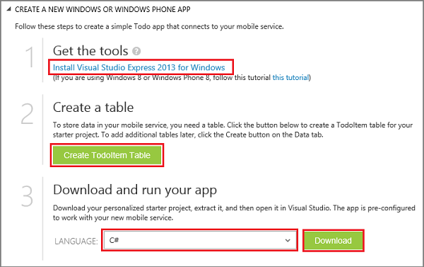

<properties pageTitle="開始使用 Windows 市集應用程式的行動服務 | 行動開發人員中心" metaKeywords="" description="Follow this tutorial to get started using Azure Mobile Services for Windows Store development in C# or JavaScript. " metaCanonical="" services="mobile-services" documentationCenter="Mobile" title="Get started with Mobile Services" authors="glenga" solutions="" manager="dwrede" editor="" />

<tags ms.service="mobile-services" ms.workload="mobile" ms.tgt_pltfrm="mobile-windows-store" ms.devlang="dotnet" ms.topic="hero-article" ms.date="08/18/2014" ms.author="glenga" />

# 開始使用行動服務

[WACOM.INCLUDE [mobile-services-selector-get-started](../includes/mobile-services-selector-get-started.md)]

本教學課程顯示如何使用 Azure 行動服務，將雲端型後端服務新增到通用 Windows 應用程式。通用 Windows 應用程式解決方案包括 Windows 市集 8.1 和 Windows Phone 市集 8.1 應用程式的專案，以及一般共用專案。如需詳細資訊，請參閱[建置目標為 Windows 和 Windows Phone 的通用 Windows 應用程式](http://msdn.microsoft.com/zh-tw/library/windows/apps/xaml/dn609832.aspx)。

在本教學課程中，您將建立新的行動服務，並建立可在新的行動服務中儲存應用程式資料的簡單*待辦事項清單*應用程式。您將建立的行動服務會使用 JavaScript 建立伺服器端商務邏輯。若要建立可讓您使用 Visual Studio 並以支援的 .NET 語言來撰寫伺服器端商務邏輯的行動服務，請參閱本主題的 .NET 後端版本。

>[WACOM.NOTE]本主題將說明如何使用 Azure 管理入口網站建立新的行動服務專案和通用 Windows 應用程式。使用 Visual Studio 2013，可讓您將新的行動服務專案新增至現有的 Visual Studio 方案。如需詳細資訊，請參閱 Windows 開發人員中心的[快速入門：新增行動服務 (JavaScript 後端)](http://msdn.microsoft.com/zh-tw/library/windows/apps/xaml/dn263180.aspx)。

>若要將行動服務新增至 Windows Phone 8.0 或 Windows Phone 市集 8.1 應用程式專案，請參閱[開始使用 Windows Phone 的資料](/zh-tw/documentation/articles/mobile-services-windows-phone-get-started-data)。

[WACOM.INCLUDE [mobile-services-windows-universal-get-started](../includes/mobile-services-windows-universal-get-started.md)]

若要完成此教學課程，您需要下列項目：

* 使用中的 Azure 帳戶。如果您沒有帳戶，可以註冊 Azure 試用版並取得多達 10 個免費的行動服務，即使在試用期結束之後仍可繼續使用這些服務。如需詳細資訊，請參閱 [Azure 免費試用](http://www.windowsazure.com/zh-tw/pricing/free-trial/?WT.mc_id=A0E0E5C02&returnurl=http%3A%2F%2Fazure.microsoft.com%2Fzh-tw%2Fdocumentation%2Farticles%2Fmobile-services-javascript-backend-windows-store-javascript-get-started%2F)。
* [Visual Studio 2013 Express for Windows] 

## 建立新的行動服務

[WACOM.INCLUDE [mobile-services-create-new-service](../includes/mobile-services-create-new-service.md)]

## 建立新的通用 Windows 應用程式

在建立您的行動服務之後，您可以依照 [管理入口網站] 中的簡易快速入門，來建立新的通用 Windows 應用程式或修改現有的 Windows 市集或 Windows Phone 應用程式專案，以連接到您的行動服務。 

在本節中，您將建立與行動服務連線的新通用 Windows 應用程式。

1.  在管理入口網站中，按一下 [**行動服務**]，然後按一下您剛剛建立的行動服務。

   
2. 在 [快速入門] 索引標籤中，按一下 [**選擇平台**] 下的 [**Windows**]，然後展開 [**建立新的 Windows 市集應用程式**]。

   	

   	這將顯示三個簡單步驟，可用來建立連接到您行動服務的 Windows 市集應用程式。

  	

3. 如果您尚未這麼做，請在您的本機電腦或虛擬機器下載並安裝 [Visual Studio 2013 Express for Windows]。

4. 按一下 [**建立 TodoItem 資料表**]，以建立儲存應用程式資料的資料表。

5. 在 [**下載及執行您的應用程式**] 下，選取應用程式的語言，然後按一下 [**下載**]。 

  	這將會下載與行動服務連接的範例*待辦事項清單*應用程式的專案。將此壓縮專案檔案儲存到您的本機電腦，並記錄儲存位置。

## 執行您的 Windows 應用程式

[WACOM.INCLUDE [mobile-services-javascript-backend-run-app](../includes/mobile-services-javascript-backend-run-app.md)]

>[WACOM.NOTE]您可以檢閱存取行動服務來查詢和插入資料的程式碼，這可以在 MainPage.xaml.cs 檔案中找到。

## 後續步驟
請注意，您已完成快速入門，並了解如何執行行動服務中的其他重要工作： 

* [開始使用資料]
   進一步了解使用行動服務來儲存和查詢資料。

* [開始使用離線資料同步]
   了解如何使用離線資料同步處理，建立可快速回應和功能強大的應用程式。

* [開始使用驗證]
   了解如何透過身分識別提供者來驗證您的應用程式使用者。

* [開始使用推播通知] 
   了解如何將非常基本的推播通知傳送至您的應用程式。

如需通用 Windows 應用程式的詳細資訊，請參閱[從單一行動服務支援多重裝置平台](/zh-tw/documentation/articles/mobile-services-how-to-use-multiple-clients-single-service#shared-vs)。

<!-- Anchors. -->
[開始使用行動服務]:#getting-started
[建立新的行動服務]:#create-new-service
[定義行動服務執行個體]:#define-mobile-service-instance
[後續步驟]:#next-steps

<!-- Images. -->

<!-- URLs. -->
[開始使用資料]: /zh-tw/documentation/articles/mobile-services-javascript-backend-windows-universal-dotnet-get-started-data
[開始使用資料]: /zh-tw/documentation/articles/mobile-services-windows-store-dotnet-get-started-data
[開始使用離線資料同步]: /zh-tw/documentation/articles/mobile-services-windows-store-dotnet-get-started-offline-data
[開始使用驗證]: /zh-tw/documentation/articles/mobile-services-windows-store-dotnet-get-started-users
[開始使用推播通知]: /zh-tw/documentation/articles/mobile-services-javascript-backend-windows-store-dotnet-get-started-push
[Visual Studio 2013 Express for Windows]: http://go.microsoft.com/fwlink/?LinkId=257546
[行動服務 SDK]: http://go.microsoft.com/fwlink/?LinkId=257545
[管理入口網站]: https://manage.windowsazure.com/
[開始以 Visual Studio 2012 使用行動服務中的資料]: /zh-tw/documentation/articles/mobile-services-windows-store-dotnet-get-started-data-vs2012
