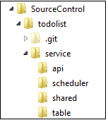

<properties linkid="develop-mobile-tutorials-store-scripts-in-source-control" urlDisplayName="Store server scripts in source control" pageTitle="Store server scripts in source control - Azure Mobile Services" metaKeywords="" description="Learn how to store your server script files and modules in a local Git repo on your computer." metaCanonical="" services="" documentationCenter="Mobile" title="Store server scripts in source control" authors="glenga" solutions="" manager="" editor="" />

在原始檔控制中儲存伺服器指令碼
==============================

本主題說明如何在 Azure 行動服務中首次設定原始檔控制，以便在 Git 儲存機制中儲存伺服器指令碼。指令碼和其他 JavaScript 程式碼檔案可以從本機儲存機制升級到生產行動服務。它還說明如何定義多個指令碼所需的共用程式碼，以及如何上傳 Node.js 模組。

本教學課程將引導您完成下列步驟：

1.  [在行動服務中啟用原始檔控制](#enable-source-control)。
2.  [安裝 Git 與建立本機儲存機制](#clone-repo)。
3.  [將更新指令碼檔案部署到行動服務](#deploy-scripts)。
4.  [在伺服器指令碼中運用共用程式碼和 Node.js 模組](#use-npm)。

若要完成本教學課程，您必須已經建立行動服務，方法是完成[開始使用行動服務](/en-us/develop/mobile/tutorials/get-started)或[開始使用資料](/en-us/develop/mobile/tutorials/get-started-with-data-dotnet)教學課程。

啟用原始檔控制在行動服務中啟用原始檔控制
----------------------------------------

1.  登入 [Azure 管理入口網站](https://manage.windowsazure.com/)，按一下 **[行動服務]**，然後按一下您的行動服務。

    

2.  按一下 **[儀表板]** 索引標籤，然後按一下 **[Quick glance]** 下的 **[Set up source control]**，並按一下 **[是]** 以確認。

    

    > [WACOM.NOTE] 原始檔控制是一項預覽功能。即使這些檔案儲存在行動服務中，我們仍然建議您定期備份指令碼檔案。

3.  提供 **[使用者名稱]**、**[新密碼]**，並確認密碼，然後按一下核取按鈕。

    

    您的行動服務中便會建立 Git 儲存機制。記下您剛才提供的認證；您將利用他們來存取此儲存機制。

4.  按一下 [設定] 索引標籤，並注意新的 **[原始檔控制]** 欄位。

    

    顯示出此 Git 儲存機制的 URL。您將使用此 URL 來將儲存機制複製到本機電腦。

您已在行動服務中啟用原始檔控制，現在可以開始使用 Git 來將儲存機制複製到本機電腦。

複製儲存機制安裝 Git 與建立本機儲存機制
---------------------------------------

1.  在您的本機電腦上安裝 Git。

    安裝 Git 所需的步驟會因作業系統而有所不同。如需作業系統特定的發佈和安裝指引，請參閱[安裝 Git](http://git-scm.com/book/en/Getting-Started-Installing-Git)。

    > [WACOM.NOTE] 在某些作業系統上，可提供 Git 的命令列和 GUI 兩種版本。本文提供的指示將使用命令列版本。

2.  開啟命令列，例如 **GitBash** (Windows) 或 **Bash** (Unix Shell)。在 OS X 系統上，您可以透過 **[終端機]** 應用程式來存取命令列。

3.  在命令列中，切換至您要儲存指令碼的目錄。例如，`cd SourceControl`。

4.  使用下列命令建立新 Git 儲存機制的本機複本，以行動服務的 Git 儲存機制 URL 取代 `<your_git_URL>`：

         git clone <your_git_URL>

5.  出現提示時，請輸入您在行動服務中啟用原始檔控制時所設定的使用者名稱和密碼。在成功驗證之後，您將會看到如下所示的一連串回應：

         remote:Counting objects:8, done.
        remote:Compressing objects:100% (4/4), done.
        remote:Total 8 (delta 1), reused 0 (delta 0)
        Unpacking objects:100% (8/8), done.

6.  瀏覽至您執行 `git clone` 命命的目錄，並注意下列目錄結構：

    

    在此案例中，會建立以此行動服務的名稱命名的新目錄，這裡就是資料服務的本機儲存機制。

7.  開啟 .\\service\\table 子資料夾並注意其中包含 TodoItem.json 檔案，這是 TodoItem 資料表上操作權限的 JSON 表示。

    當在此資料表上定義伺服器指令碼時，您也會有一或多個名為 `TodoItem._<operation>_.js` 的檔案，檔案中包含了指定資料表作業的指令碼。排程器和自訂 API 指令碼會在名為排程器和自訂 API 指令碼的個別資料夾中分別進行維護。如需詳細資訊，請參閱[原始檔控制](http://msdn.microsoft.com/en-us/library/windowsazure/c25aaede-c1f0-4004-8b78-113708761643)。

現在您已建立本機儲存機制，您可以對伺服器指令碼進行變更，並將變更推送回行動服務。

部署指令碼將更新指令碼檔案部署到行動服務
----------------------------------------

1.  瀏覽至 .\\service\\table 子資料夾，如果 todoitem.insert.js 檔案不存在，請立即建立此檔案。

2.  在文字編輯器中開啟新檔案 todoitem.insert.js，貼上下列程式碼並儲存變更：

         function insert(item, user, request) {
        request.execute();
        console.log(item);
         }

    此程式碼僅會將插入項目寫入記錄。如果此檔案已包含程式碼，則直接在此檔案中新增一些有效的 JavaScript 程式碼 (例如，呼叫 `console.log()`)，然後儲存變更。

3.  在 Git 命令提示字元中，輸入下列命令以開始追蹤新的指令碼檔案：

         $ git add .

4.  輸入下列命令以認可變更：

         $ git commit -m "updated the insert script"

5.  輸入下列命令以將變更上傳至遠端儲存機制：

         $ git push origin master

    您應會看到一連串命令，指出已將認可部署到行動服務。

6.  回到管理入口網站中，按一下 **[資料]** 索引標籤，然後按一下 **[TodoItem]** 資料表。

    

7.  按一下 **[指令碼]**，然後選取 **[插入]** 作業。

    

    請注意，顯示的插入作業指令碼會與您剛才上傳至儲存機制的 JavaScript 程式碼相同。

共用程式碼和模組在伺服器指令碼中運用共用程式碼和 Node.js 模組
-------------------------------------------------------------

行動服務提供整組核心 Node.js 模組的存取權，透過 **require** 函數，您可以在您的程式碼中使用這些模組。行動服務也可以使用不是核心 Node.js 封裝一部分的 Node.js 模組，您甚至可以將自己的共用程式碼定義為 Node.js 模組。如需關於建立模組的詳細資訊，請參閱 Node.js API 參考文件中的[模組](http://nodejs.org/api/modules.html) (英文)。

接著，您可以在行動服務中新增 [node-uuid](https://npmjs.org/package/node-uuid) Node.js 模組，方法是使用原始檔控制和 Node.js 封裝管理員 (NPM)。接著便可使用此模組，來為插入項目上的 **uuid** 屬性產生新的 GUID 值。

1.  如果您尚未這麼做，請依照 [Node.js 網站](http://nodejs.org/) (英文) 上的步驟，在您的本機電腦上安裝 Node.js。

2.  瀏覽至本機 Git 儲存機制的 `.\service` 資料夾，然後在命令提示字元中執行下列命令：

         npm install node-uuid

    NPM 會在目前位置中建立 `node_modules` 目錄，並在 `\node-uuid` 子目錄中安裝 [node-uuid](https://npmjs.org/package/node-uuid) 模組。

    **注意**

    若目錄階層中已有 `node_modules`，NPM 將改為建立在 `\node-uuid` 子目錄中，而不是在儲存機制中建立新的 `node_modules`。在此情況下，只要刪除現有的 `node_modules` 目錄。

3.  現在，請瀏覽到 .\\service\\table 子資料夾，開啟並修改 todoitem.insert.js 檔案，如下所示：

         function insert(item, user, request) {
        var uuid = require('node-uuid');
        item.uuid = uuid.v1();
        request.execute();
        console.log(item);
         }

    此程式碼會在資料表中新增 uuid 資料行，並填入唯一的 GUID 識別碼。

4.  如上一節所示，請在 Git 命令提示字元中輸入下列命令：

         $ git add .
        $ git commit -m "added node-uuid module"
        $ git push origin master

    這會新增檔案、認可變更，並將新的 node-uuid 模組和變更推送到行動服務的 todoitem.insert.js 指令碼。

後續步驟
--------

現在，您已完成本教學課程，您知道如何在原始檔控制中儲存指令碼。請考慮了解更多有關使用伺服器指令碼和自訂 API 的詳細資料：

-   [在行動服務中使用伺服器指令碼](/en-us/develop/mobile/how-to-guides/work-with-server-scripts)
    說明如何使用伺服器指令碼、工作排程器和自訂 API。

-   [定義支援提取通知的自訂 API](/en-us/develop/mobile/tutorials/create-pull-notifications-dotnet)
    說明如何使用自訂 API，支援可更新 Windows 市集應用程式中動態磚的定期通知。

