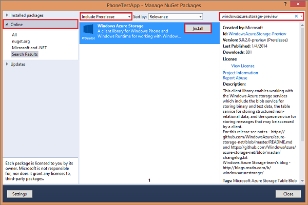

<properties pageTitle="Use Mobile Services to upload images to blob storage (Windows Phone) | Mobile Services" metaKeywords="" description="Learn how to use Mobile Services to upload images to Azure Blob Storage." metaCanonical="" disqusComments="0" umbracoNaviHide="1" documentationCenter="Mobile" title="Upload images to Azure Storage by using Mobile Services" authors="glenga" writer="glenga" />

使用行動服務上傳影像至 Azure 儲存體
===================================

[Windows 市集 C\#](/en-us/documentation/articles/mobile-services-windows-store-dotnet-upload-data-blob-storage "Windows 市集 C#")[Windows Phone](/en-us/documentation/articles/mobile-services-windows-phone-upload-data-blob-storage "Windows Phone")

本主題將示範如何使用 Azure 行動服務，讓應用程式在 Azure 儲存體中上傳並儲存使用者產生的影像。行動服務會使用 SQL Database 儲存資料。不過，在 Azure Blob 儲存服務中可以更有效地儲存二進位大型物件 (BLOB) 資料。

您無法使用用戶端應用程式安全地散佈認證，認證需要以安全的方式上傳資料至 Blob 儲存服務。相反地，您必須將認證儲存在行動服務中，並使用這些認證來產生用來上傳新影像的共用存取簽章 (SAS)。SAS 是一種到期時間短暫的認證 (在此案例中為 5 分鐘)，行動服務會以安全的方式將 SAS 傳回用戶端應用程式。應用程式會接著使用這個暫時認證來上傳影像。在此範例中，從 Blob 服務的下載會是公用項目。

在此教學課程中，您可以將功能新增至行動服務快速入門應用程式，並透過行動服務所產生的 SAS 來拍照並上傳影像至 Azure。本教學課程將逐步引導您完成下列更新行動服務快速入門的基本步驟，進而將影像上傳至 Blob 儲存服務：

1.  [安裝儲存用戶端程式庫](#install-storage-client)
2.  [更新 insert 指令碼以產生 SAS](#update-scripts)
3.  [更新用戶端應用程式以擷取影像](#add-select-images)
4.  [上傳影像以測試應用程式](#test)

本教學課程需要下列項目：

-   Microsoft Visual Studio 2012 Express for Windows 8 或更新版本
-   [Windows Phone SDK 8.0](http://www.microsoft.com/en-us/download/details.aspx?id=35471) (英文) 或更高版本
-   已安裝適用於 Microsoft Visual Studio 的 Nuget Package Manager
-   [Azure 儲存體帳戶](/en-us/manage/services/storage/how-to-create-a-storage-account)

本教學課程以行動服務快速入門為基礎。在開始本教學課程之前，您必須首先完成[開始使用行動服務](/en-us/documentation/articles/mobile-services-windows-phone-get-started)。

安裝 Windows 市集應用程式的儲存體用戶端
---------------------------------------

若要能夠使用 SAS 來將影像上傳至 Blob 儲存，您必須首先新增 NuGet 封裝，以安裝適用於 Windows 市集應用程式的儲存體用戶端程式庫。

1.  在 Visual Studio 的 **[方案總管]** 中以滑鼠右鍵按一下專案名稱，然後選取 **[管理 NuGet 封裝]**。

2.  在左側窗格中依序選取 **[線上]** 類別、**[Include Prerelease]**，搜尋 **WindowsAzure.Storage-Preview**，並按一下 **[Azure Storage]** 封裝上的 **[安裝]**，然後接受授權協定。

 
這會將 Azure 儲存體服務的用戶端程式庫新增至專案。

接著，您將更新快速入門應用程式來擷取並上傳影像。

在管理入口網站中更新已註冊的 insert 指令碼
------------------------------------------

[WACOM.INCLUDE [mobile-services-configure-blob-storage](../includes/mobile-services-configure-blob-storage.md)]

[WACOM.INCLUDE [mobile-services-windows-phone-upload-to-blob-storage](../includes/mobile-services-windows-phone-upload-to-blob-storage.md)]

後續步驟
--------

現在透過整合行動服務與 Blob 服務，您可以安全地上傳影像，查看一些其他後端服務和整理主題：

-   [使用 SendGrid 從行動服務傳送電子郵件](/en-us/develop/mobile/tutorials/send-email-with-sendgrid/)

    了解如何使用 SendGrid 電子郵件服務，來將電子郵件功能新增至行動服務。本主題將示範如何新增伺服器端指令碼，來使用 SendGrid 傳送電子郵件。

-   [在行動服務中排定後端工作](/en-us/develop/mobile/tutorials/schedule-backend-tasks/)

    了解如何使用行動服務工作排程器功能，以根據您所定義的排程來，從而定義要執行的伺服器指令碼。

-   [行動服務伺服器指令碼參照 (英文)](http://go.microsoft.com/fwlink/p/?LinkId=262293)

    使用伺服器指令碼執行伺服器端工作，以及與其他 Azure 元件和外部資源整合等相關資訊的參照主題。

-   [行動服務 .NET 作法概念參考資料](/en-us/develop/mobile/how-to-guides/work-with-net-client-library)

    深入了解如何使用搭配 .NET 的行動服務

