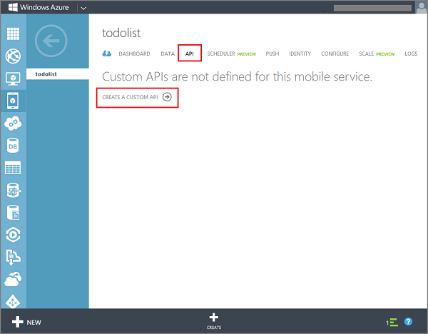
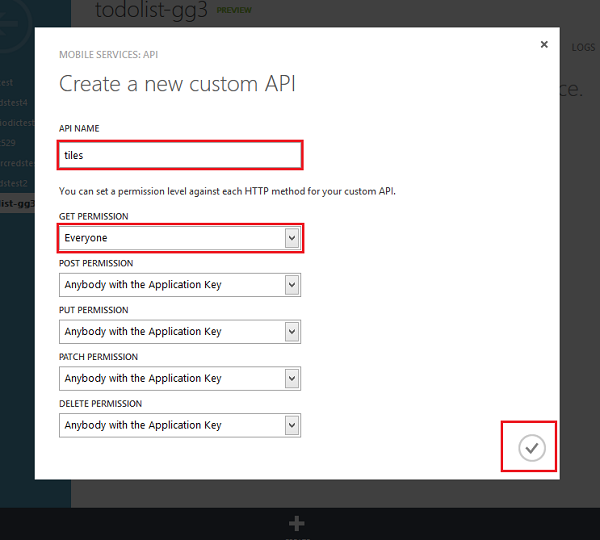

<properties linkid="develop-mobile-tutorials-create-pull-notifications-dotnet" urlDisplayName="Define a custom API that supports pull notifications" pageTitle="Define a custom API that supports pull notifications - Azure Mobile Services" metaKeywords="" description="Learn how to Define a custom API that supports periodic notifications in Windows Store apps that use Azure Mobile Services." metaCanonical="" services="" documentationCenter="" title="Define a custom API that supports periodic notifications" authors="glenga" solutions="" manager="" editor="" />

定義支援定期通知的自訂 API
==========================

[Windows 市集 C\#](/en-us/develop/mobile/tutorials/create-pull-notifications-dotnet "Windows 市集 C#")[Windows 市集 JavaScript](/en-us/develop/mobile/tutorials/create-pull-notifications-js "Windows 市集 JavaScript")

本主題將示範如何使用自訂 API 來支援 Windows 市集應用程式中的定期通知。在啟用定期通知的情況下，Windows 將定期存取您的自訂 API 端點，並使用傳回的 XML (採用磚的特定格式) 來更新開始功能表上的應用程式磚。如需詳細資訊，請參閱[定期通知](http://msdn.microsoft.com/en-us/library/windows/apps/jj150587.aspx)。

將此功能新增至您在完成[開始使用行動服務](/en-us/develop/mobile/tutorials/get-started/#create-new-service)或[開始使用資料](/en-us/develop/mobile/tutorials/get-started-with-data-dotnet)教學課程時所建立的應用程式。若要達到此目的，您將需要完成下列步驟：

1.  [定義自訂 API](#define-custom-api)
2.  [更新應用程式以開啟定期通知](#update-app)
3.  [測試應用程式](#test-app)

本教學課程會以行動服務快速入門為基礎。在開始本教學課程之前，您必須首先完成[開始使用行動服務](/en-us/develop/mobile/tutorials/get-started/#create-new-service)或[開始使用資料](/en-us/develop/mobile/tutorials/get-started-with-data-dotnet)。

定義自訂 API
------------

1.  登入 [Azure 管理入口網站](https://manage.windowsazure.com/)，按一下 **[行動服務]**，然後按一下您的應用程式。

   

2.  按一下 **[API]** 索引標籤，然後按一下 **[Create a custom API]**。

   

    這樣做會顯示 **[Create a new custom API]** 對話方塊。

3.  將 **[取得權限]** 變更為 **[所有人]**，並且在 **[API name]** 中輸入 *tiles*，然後按一下核取按鈕。

   

    這樣做會使用公開 GET 存取來建立新的 API。

4.  按一下 API 資料表中新的磚項目。

    

5.  按一下 **[指令碼]** 索引標籤，並使用下列程式碼來取代現有程式碼：

		exports.get = function(request, response) {
		    var wns = require('wns');
		    var todoItems = request.service.tables.getTable('TodoItem');
		    todoItems.where({
		        complete: false
		    }).read({
		        success: sendResponse
		    });
		
		    function sendResponse(results) {
		        var tileText = {
		            text1: "My todo list"
		        };
		        var i = 0;
		        console.log(results)
		        results.forEach(function(item) {
		            tileText["text" + (i + 2)] = item.text;
		            i++;
		        });
		        var xml = wns.createTileSquareText01(tileText);
		        response.set('content-type', 'application/xml');
		        response.send(200, xml);
		    }
		};

    此程式碼將傳回 TodoItem 資料表中前 3 個未完成的項目，然後將這些項目載入至 **wns**.**createTileSquareText01** 函數中所傳遞的 JSON 物件。此函數將傳回下列磚範本 XML：

		<tile>
			<visual>
				<binding template="TileSquareText01">
					<text id="1">My todo list</text>
					<text id="2">Task 1</text>
					<text id="3">Task 2</text>
					<text id="4">Task 3</text>
				</binding>
			</visual>
		</tile>

    由於用戶端將傳送存取磚範本的 GET 要求，因此將使用 **exports.get** 函數。

   	
<b>Note</b>
   		
This custom API script uses the Node.js <a href="http://go.microsoft.com/fwlink/p/?LinkId=306750">wns module</a>, which is referenced by using the <strong>require</strong> function. This module is different from the <a href="http://go.microsoft.com/fwlink/p/?LinkId=260591">wns object</a> returned by the <a href="http://msdn.microsoft.com/en-us/library/windowsazure/jj554217.aspx">push object</a>, which is used to send push notifications from server scripts.

   	

接著，您將修改快速入門應用程式，要求新的自訂 API 來啟動會使動態磚更新的定期通知。

更新應用程式更新應用程式以開啟定期通知
--------------------------------------

1.  在 Visual Studio 中，按 F5 鍵執行上一個教學課程中的快速入門應用程式。

2.  確定至少顯示一個項目。如果沒有任何項目，請在 **[Insert a TodoItem]** 中輸入文字，然後按一下 **[儲存]**。

3.  在 Visual Studio 中，開啟 App.xaml.cs 專案檔案，並新增下列 using 陳述式：

        using Windows.UI.Notifications;

4.  將下列程式碼新增至 **OnLaunched** 事件處理常式：

        TileUpdateManager.CreateTileUpdaterForApplication().StartPeriodicUpdate(
            new System.Uri(MobileService.ApplicationUri, "/api/tiles"),
            PeriodicUpdateRecurrence.Hour
        );

    此程式碼將開啟定期通知，以向新的 **tiles** 自訂 API 要求磚範本資料。選取最適合您資料更新頻率的 [PeriodicUpdateRecurrance] 值。

測試應用程式
------------

1.  在 Visual Studio 中，按 F5 鍵再次執行應用程式。

    這將開啟定期通知。

2.  瀏覽到 [開始] 畫面，找出應用程式的動態磚，並注意動態磚中現已顯示該項目資料。

 

後續步驟
--------

您已建立定期通知，現在請考慮搜尋有關下列行動服務主題的更多資訊：

-   [開始使用推播通知](/en-us/develop/mobile/tutorials/get-started-with-push-dotnet)
    定期通知由 Windows 管理，並且按照預先定義的排程發生。推播通知可以由行動服務隨選傳送，而且可以是快顯通知、磚和原始通知。

-   [行動服務伺服器指令碼參照](http://go.microsoft.com/fwlink/?LinkId=262293)
     (英文) 深入了解建立自訂 API。

-   [行動服務 .NET 作法概念參考資料](/en-us/develop/mobile/how-to-guides/work-with-net-client-library)
    深入了解如何使用搭配 .NET 的行動服務。

