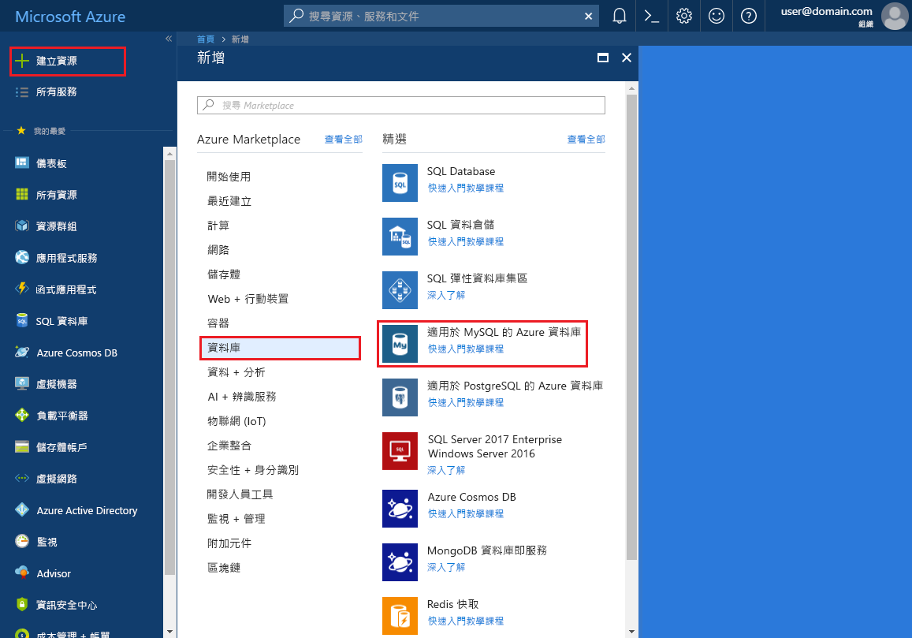

# <a name="create-an-azure-database-for-mysql-server-using-azure-portal"></a>使用 Azure 入口網站建立 Azure Database for MySQL 伺服器
本文逐步引導您使用 Azure 入口網站在五分鐘內建立 Azure Database for MySQL 伺服器。 

如果您沒有 Azure 訂用帳戶，請在開始前建立[免費帳戶](https://azure.microsoft.com/free/) 。

## <a name="log-in-to-azure"></a>登入 Azure
開啟 Web 瀏覽器並瀏覽至 [Microsoft Azure 入口網站](https://portal.azure.com/)。 輸入您的認證來登入此入口網站。 預設檢視是您的服務儀表板。

## <a name="create-azure-database-for-mysql-server"></a>建立 Azure Database for MySQL 伺服器
1. 按一下 Azure 入口網站左上角的 [新增] 按鈕。

2. 從 [新增] 頁面中選取 [資料庫]，然後從 [資料庫] 頁面中選取 [適用於 MySQL 的 Azure 資料庫]。 您也可以在新頁面搜尋方塊中輸入 **MySQL** 以找到此服務。


3. 在新伺服器詳細資料表單中填入下列資訊，如上圖所示︰

| **設定** | **建議的值** | **欄位描述** |
|---|---|---|
| *伺服器名稱* | myserver4demo  | 伺服器名稱必須是全域唯一的。 |
| *訂用帳戶* | mysubscription | 從下拉式清單中選取訂用帳戶。 |
| *資源群組* | myresourcegroup | 建立資源群組或使用現有的資源群組。 |
| *伺服器管理員登入* | myadmin | 指定帳戶名稱作為 MySQL 引擎中的管理員。 |
| *密碼* |  | 設定強式管理帳戶密碼。 |
| *確認密碼* |  | 確認管理帳戶密碼。 |
| *Location* |  | 選取可用的區域。 |
| *版本* | 5.7 | 選擇最新版本。 |
| 定價層 | 基本, 50 計算單位, 50 個儲存體 (GB)  | 選擇 [定價層]、[計算單位]、[儲存體] \(GB)，然後按一下 [確定]。 |
| 釘選到儀表板 | 勾選 | 建議您核取此方塊，讓您在稍後能輕鬆地找到伺服器 |

   按一下 [定價層] 指定新資料庫的定價層和效能等級。 針對本快速入門，選取 [基本] 層、[50 個計算單位] 及 [50 GB] 的內含儲存體。 然後按一下 [確定] 以儲存定價層。
   
   

   然後按一下 [建立] 。 在一兩分鐘內，新的「適用於 MySQL 的 Azure 資料庫」伺服器就會在雲端執行。 按一下工具列上的 [通知] \(鈴鐺圖示) 按鈕來監視部署程序。

## <a name="configure-the-firewall"></a>設定防火牆
第一次連線到 Azure Database for MySQL 之前，傾設定防火牆，並將用戶端的公用網路的 IP 位址 (或一個範圍) 新增至允許清單。

1. 完成部署之後，從左側功能表中按一下 [所有資源]，然後輸入名稱 **myserver4demo** 來搜尋新建立的伺服器。 按一下搜尋結果中列出的伺服器名稱。 伺服器的 [概觀] 頁面隨即開啟，並提供可進行進一步設定的選項。

2. 在伺服器刀鋒視窗中，選取 [連線安全性]。

3. 按一下 [新增我的 IP] 來新增本機電腦的 IP 位址，或設定 IP 位址範圍。 請記得在建立規則後按一下 [儲存]。
  

## <a name="get-connection-information"></a>取得連線資訊
在 Azure 入口網站中取得 Azure MySQL 伺服器的完整伺服器名稱。 您可使用 **mysql.exe** 命令列工具，使用此完整網域名稱連線到您的伺服器。

1.  在 [Azure 入口網站](https://portal.azure.com/)中，按一下左側功能表中的 [所有資源]，然後按一下您的 Azure Database for MySQL 伺服器。

2.  按一下 [內容] 。 記下 [伺服器名稱] 和 [伺服器管理員登入]。
在此範例中，伺服器名稱為 myserver4demo.mysql.database.azure.com，而伺服器管理員登入為 myadmin@myserver4demo。

## <a name="connect-to-the-server-using-mysqlexe-command-line-tool"></a>使用 mysqlexe 命令列工具連線到伺服器
使用 [mysql 命令列工具](https://dev.mysql.com/doc/refman/5.7/en/mysql.html)來建立對「適用於 MySQL 的 Azure 資料庫」伺服器的連線。 您可以使用 Azure Cloud Shell，在瀏覽器中執行 mysql 命令列工具，或使用本機安裝的 mysql 工具，從您自己的電腦啟動它。 若要啟動 Azure Cloud Shell，請按一下本文中程式碼區塊的 `Try It` 按鈕，或請造訪 [Azure 入口網站](https://portal.azure.com)並按一下頂端右側工具列的 `>_` 圖示。 

1. 輸入要連線的命令：
```azurecli-interactive
mysql -h myserver4demo.mysql.database.azure.com -u myadmin@myserver4demo -p
```

2. 檢視伺服器狀態來確保連線可運作。 一旦它連線後，在 mysql> 提示輸入 `status`。
```sql
status
```

   

   > [!TIP]
   > 如需其他命令，請參閱 [MySQL 5.7 參考手冊 - 第 4.5.1 章](https://dev.mysql.com/doc/refman/5.7/en/mysql.html)。

3. 在 mysql> 提示字元輸入 `CREATE DATABASE` 命令來建立空的資料庫。

   ```sql
   CREATE DATABASE quickstartdb;
   ```

   在適用於 MySQL Server 的 Azure 資料庫內，您可以擁有一個或多個資料庫。 您可以選擇在每個伺服器建立單一資料庫以利用所有資源，或建立多個資料庫來共用資源。 可以建立的資料庫數目沒有限制，但多個資料庫會共用相同的伺服器資源。  

4. 在 mysql> 提示字元輸入 `SHOW DATABASES` 命令來列出資料庫。

   ```sql
   SHOW DATABASES;
   ```

## <a name="connect-to-the-server-using-the-mysql-workbench-gui-tool"></a>使用 MySQL Workbench GUI 工具連線到伺服器
1.  在您的用戶端電腦上啟動 MySQL Workbench 應用程式。 您可以從[這裡](https://dev.mysql.com/downloads/workbench/)下載並安裝 MySQL Workbench。

2.  在 [設定新連線] 對話方塊的 [參數] 索引標籤上輸入下列資訊︰

   

| **設定** | **建議的值** | **欄位描述** |
|---|---|---|
|   連線名稱 | 示範連線| 指定此連線的標籤。 |
| 連線方式 | 標準 (TCP/IP) | 標準 (TCP/IP) 就足夠了。 |
| 主機名稱 | myserver4demo.mysql.database.azure.com | 使用您伺服器的完整伺服器名稱。 |
| *連接埠* | 3306 | 使用預設連接埠 3306。 |
| *使用者名稱* | myadmin@myserver4demo  | 使用您先前記下的伺服器管理員登入與 @ 字元和伺服器名稱。 |
| *密碼* | 您的密碼 | 按一下 [儲存在保存庫...] 按鈕以儲存密碼。 |

按一下 [測試連線] 以測試所有參數是否都已設定正確。 按一下 [確定] 可儲存連線。 

> [!NOTE]
> 預設會在您的伺服器上強制執行 SSL，該伺服器需要額外的設定才能連線成功。 請參閱[在您的應用程式中設定 SSL 連線能力，以安全地連線至適用於 MySQL 的 Azure 資料庫](./howto-configure-ssl.md)。  如果您想要停用這個快速入門的 SSL，請造訪 Azure 入口網站，然後按一下 [連線安全性] 頁面，以停用強制 SSL 連線切換按鈕。

## <a name="clean-up-resources"></a>清除資源
刪除 [Azure 資源群組](../azure-resource-manager/resource-group-overview.md)以清除您在快速入門中建立的所有資源。

> [!TIP]
> 此集合中的其他快速入門會以本快速入門為基礎。 如果您打算繼續進行後續的快速入門，請勿清除在此快速入門中建立的資源。 如果您不打算繼續，請使用下列步驟，在 Azure 入口網站中刪除本快速入門所建立的所有資源。

1.  從 Azure 入口網站的左側功能表中，依序按一下 [資源群組] 和 [myresourcegroup]。
2.  在資源群組頁面上，按一下 [刪除]，在文字方塊中輸入 **myresourcegroup**，然後按一下 [刪除]。

如果您想要刪除新建立的伺服器：
1.  從 Azure 入口網站的左側功能表中，按一下 PostgreSQL 伺服器，然後搜尋您剛建立的伺服器
2.  在 [概觀] 頁面上，按一下上方窗格的 [刪除] 按鈕
3.  確認您要刪除的伺服器名稱，並且會顯示其底下受到影響的資料庫。 在文字方塊中輸入 **myserver4demo**，然後按一下 [刪除]。


## <a name="next-steps"></a>後續步驟

> [!div class="nextstepaction"]
> [設計您的第一個 Azure Database for MySQL 資料庫](./tutorial-design-database-using-portal.md)


