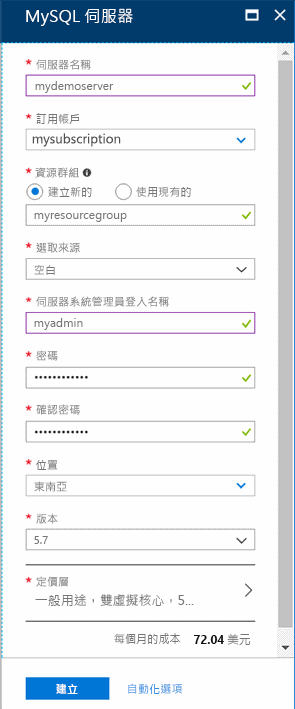
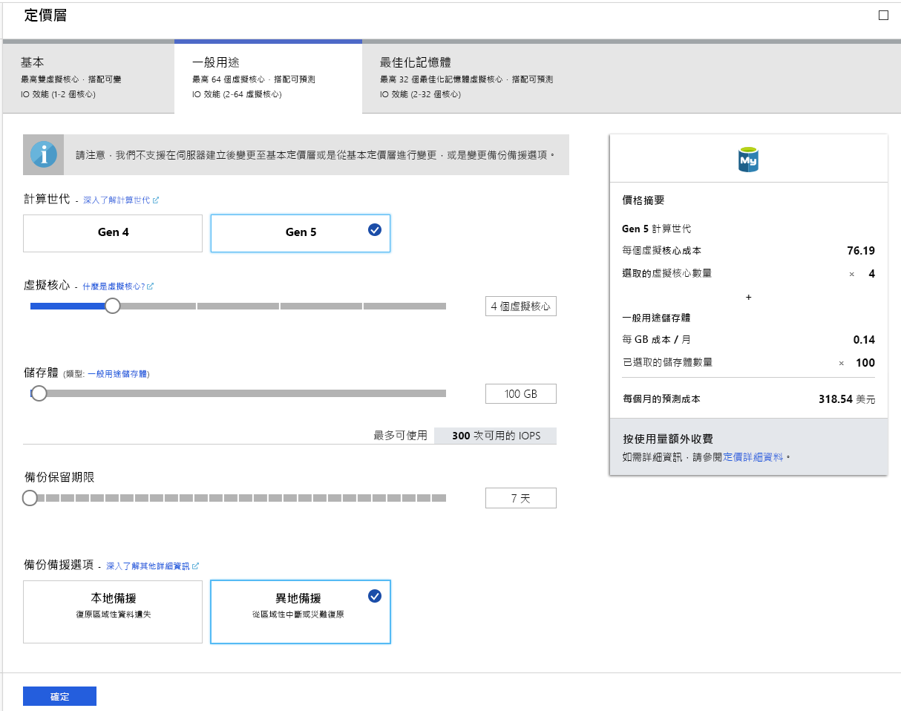

# <a name="create-an-azure-database-for-mysql-server-by-using-the-azure-portal"></a>使用 Azure 入口網站建立 Azure Database for MySQL 伺服器

適用於 MySQL 的 Azure 資料庫是一個受控服務，您可用來在雲端執行、管理及調整高可用性 MySQL 資料庫。 本快速入門說明如何使用 Azure 入口網站，在大約五分鐘內建立適用於 MySQL 的 Azure 資料庫伺服器。  

如果您沒有 Azure 訂用帳戶，請在開始前建立[免費 Azure 帳戶](https://azure.microsoft.com/free/)。

## <a name="sign-in-to-the-azure-portal"></a>登入 Azure 入口網站
開啟 Web 瀏覽器，然後移至 [Azure 入口網站](https://portal.azure.com/)。 輸入您的認證來登入此入口網站。 預設檢視是您的服務儀表板。

## <a name="create-an-azure-database-for-mysql-server"></a>建立適用於 MySQL 的 Azure 資料庫伺服器
您可使用一組已定義的[計算和儲存體](./concepts-compute-unit-and-storage.md)資源來建立 Azure Database for MySQL 伺服器。 您可在 [Azure 資源群組](../azure-resource-manager/resource-group-overview.md)內建立伺服器。

請依照下列步驟來建立 Azure Database for MySQL 伺服器：

1. 選取入口網站左上角的 [建立資源] 按鈕 (+)。

2. 選取 [資料庫] > [Azure Database for MySQL]。 您也可以在搜尋方塊中輸入 **MySQL** 以尋找此服務。

   

3. 在新伺服器詳細資料表單中填寫下列資訊︰
   
   

    **設定** | **建議的值** | **欄位描述** 
    ---|---|---
    伺服器名稱 | 唯一的伺服器名稱 | 選擇可識別 Azure Database for MySQL 伺服器的唯一名稱。 例如，mydemoserver。 網域名稱 .mysql.database.azure.com 已附加至您提供的伺服器名稱。 伺服器名稱只能包含小寫字母、數字及連字號 (-) 字元。 此名稱必須包含 3 到 63 個字元。
    訂用帳戶 | 您的訂用帳戶 | 選取您要用於伺服器的 Azure 訂用帳戶。 如果您有多個訂用帳戶，請選擇資源計費的訂用帳戶。
    資源群組 | *myresourcegroup* | 提供新的或現有的資源群組名稱。    資源群組|*myresourcegroup*| 新的資源群組名稱，或您訂用帳戶中現有的資源群組名稱。
    選取來源 | 空白 | 選取 [空白]，從頭開始建立新的伺服器。 (如果您要從現有「適用於 MySQL 的 Azure 資料庫」伺服器的異地備份建立伺服器，請選取 [備份])。
    伺服器管理員登入 | myadmin | 當您連線至伺服器時所要使用的登入帳戶。 系統管理員登入名稱不能是 **azure_superuser**、**admin**、**administrator**、**root**、**guest** 或 **public**。
    密碼 | 您的選擇 | 為伺服器管理帳戶提供新密碼。 此密碼必須包含 8 到 128 個字元。 您的密碼必須包含下列類別中三種類別的字元：英文大寫字母、英文小寫字母、數字 (0-9) 及非英數字元 (!、$、#、% 等等)。
    確認密碼 | 您的選擇| 確認管理帳戶密碼。
    位置 | *最接近使用者的區域*| 選擇最靠近您的使用者或其他 Azure 應用程式的位置。
    版本 | *最新主要版本*| 最新主要版本 (除非您有需要另一個版本的特定需求)。
    定價層 | **一般用途**、**Gen 4**、**2 個虛擬核心**、**5GB**、**7 天**、**異地備援** | 新伺服器的計算、儲存體和備份組態。 選取 [定價層]。 接下來，選取 [一般用途] 索引標籤。Gen 4、2 個虛擬核心、5 GB 和 7 天是**計算世代**、**虛擬核心**、**儲存體**和**備份保留期限**。 您可以讓這些滑桿保留原狀。 若要啟用異地備援儲存體中的伺服器備份，請從 [備份備援選項] 中選取 [異地備援]。 若要儲存此定價層選取項目，請選取 [確定]。 下方螢幕擷取畫面會擷取這些選取項目。
  
    > [!IMPORTANT]
    > 需要伺服器系統管理員登入以及您在此處指定的密碼，稍後才能在本快速入門中登入伺服器及其資料庫。 請記住或記錄此資訊，以供稍後使用。
    > 

   

4.  選取 [建立] 以佈建伺服器。 佈建作業可能需要多達 20 分鐘的時間。
   
5.  在工具列上選取 [通知] \(鈴鐺圖示) 以監視部署程序。
   
  根據預設，您的伺服器底下會建立下列資料庫：**information_schema**、**mysql**、**performance_schema** 和 **sys**。

## <a name="configure-a-server-level-firewall-rule"></a>設定伺服器層級防火牆規則

Azure Database for MySQL 服務會在伺服器層級建立防火牆。 它會防止外部應用程式和工具連線到伺服器及伺服器上的任何資料庫，除非已建立防火牆規則以針對特定的 IP 位址開啟防火牆。 

1.   在部署完成之後，找出您的伺服器。 如有需要，您可以搜尋它。 例如，從左側功能表選取 [所有資源]。 然後輸入伺服器名稱 (例如 **mydemoserver**) 來搜尋新建立的伺服器。 從搜尋結果清單中選取伺服器名稱。 伺服器的 [概觀] 頁面隨即開啟，並提供可進行進一步設定的選項。

2. 在伺服器頁面上，選取 [連線安全性]。

3.  在 [防火牆規則] 標題之下，選取 [規則名稱] 欄中的空白文字方塊，開始建立防火牆規則。 輸入將存取此伺服器之用戶端的精確 IP 範圍。
   
   


4. 在 [連線安全性] 頁面的工具列上，選取 [儲存]。 等到陳述更新已成功完成的通知出現，您才能繼續進行。 

   > [!NOTE]
   > Azure Database for MySQL 的連線透過連接埠 3306 進行通訊。 如果您嘗試從公司網路內進行連線，可能不允許透過連接埠 3306 的輸出流量。 若是如此，除非 IT 部門開啟連接埠 3306，否則您無法連線到您的伺服器。
   > 

## <a name="get-the-connection-information"></a>取得連線資訊
若要連線到您的資料庫伺服器，您需要完整伺服器名稱和系統管理員登入認證。 您稍早可能已在快速入門文章中記下這些值。 若未這麼做，您可以從 Azure 入口網站的伺服器 [概觀] 或 [屬性] 頁面輕鬆尋找伺服器名稱和登入資訊。

若要尋找這些值，請採取下列步驟： 

1. 開啟伺服器的 [概觀] 頁面。 記下 [伺服器名稱] 和 [伺服器管理員登入名稱]。 

2. 將您的游標停留在每個欄位上，複製圖示就會出現在文字右邊。 視需要選取複製圖示來複製值。

在此範例中，伺服器名稱為 **mydemoserver.mysql.database.azure.com**，而伺服器管理員登入為 **myadmin@mydemoserver**。

## <a name="connect-to-mysql-by-using-the-mysql-command-line-tool"></a>使用 mysql 命令列工具連線到 MySQL
使用 **mysql.exe** 命令列工具連線到伺服器。 您可以從[這裡](https://dev.mysql.com/downloads/)下載 MySQL，再將它安裝於電腦上。 

1. 若要利用 mysql 公用程式連線到 Azure Database for MySQL 伺服器，請使用下列格式：

    ```bash
    mysql --host <fully qualified server name> --user <server admin login name>@<server name> -p
    ```

    例如，下列命令會連線至我們的範例伺服器：

    ```bash
    mysql --host mydemoserver.mysql.database.azure.com --user myadmin@mydemoserver -p
    ```

    mysql 參數 |建議的值|說明
    ---|---|---
    --host | *伺服器名稱* | 您稍早建立 Azure Database for MySQL 伺服器時所用的伺服器名稱值。 範例伺服器是 **mydemoserver.mysql.database.azure.com**。 使用如範例所示的完整網域名稱 (**\*.mysql.database.azure.com**)。 如果您不記得您的伺服器名稱，請依照上一節中的步驟執行，以取得連線資訊。 
    --user | 伺服器管理員登入名稱 |您稍早建立 Azure Database for MySQL 時所提供的伺服器管理員登入使用者名稱。 如果您不記得使用者名稱，請依照上一節中的步驟執行，以取得連線資訊。 格式為 *username@servername*。
    -p | 等到出現提示為止 |出現提示時，提供您在建立伺服器時所提供的相同密碼。 請注意，輸入的密碼字元不會顯示在 bash 提示字元上。 您已輸入密碼之後，請選取 **Enter**。

   連線之後，mysql 公用程式會顯示 `mysql>` 提示字元，供您鍵入命令。 

   以下是範例 mysql 輸出：

    ```bash
    Welcome to the MySQL monitor.  Commands end with ; or \g.
    Your MySQL connection id is 65505
    Server version: 5.6.26.0 MySQL Community Server (GPL)
    
    Copyright (c) 2000, 2017, Oracle and/or its affiliates. All rights reserved.
    
    Oracle is a registered trademark of Oracle Corporation and/or its
    affiliates. Other names may be trademarks of their respective
    owners.

    Type 'help;' or '\h' for help. Type '\c' to clear the current input statement.
    
    mysql>
    ```
    > [!TIP]
    > 如果未將防火牆設定為允許用戶端的 IP 位址，就會發生下列錯誤：
    >
    > 錯誤 2003 (28000)：不允許 IP 位址 123.456.789.0 的用戶端存取伺服器。
    >
    > 若要解決此錯誤，請確定伺服器組態符合本文「設定伺服器層級防火牆規則」一節中的步驟。

4. 若要確保連線可運作，請在 mysql > 提示字元鍵入 `status`，以檢視伺服器狀態。

    ```sql
    status
    ```

   > [!TIP]
   > 如需其他命令，請參閱 [MySQL 5.7 參考手冊 -- 第 4.5.1 章](https://dev.mysql.com/doc/refman/5.7/en/mysql.html)。

5.  在 **mysql>** 提示字元輸入下列命令以建立空白的資料庫︰
    ```sql
    CREATE DATABASE quickstartdb;
    ```
    此命令可能需要一些時間才能完成。 

    在適用於 MySQL Server 的 Azure 資料庫內，您可以建立一個或多個資料庫。 您可以選擇在每個伺服器建立單一資料庫以利用所有資源，或建立多個資料庫來共用資源。 您可以建立的資料庫數目沒有限制，但多個資料庫會共用相同的伺服器資源。 

6. 在 **mysql>** 提示字元輸入下列命令以列出資料庫︰

    ```sql
    SHOW DATABASES;
    ```

7.  鍵入 `\q`，然後選取 **Enter** 結束 mysql 工具。 

現在您已連線到 Azure Database for MySQL 伺服器，並已建立空白的使用者資料庫。 繼續下一節，進行類似的練習。 下一個練習會使用其他常見工具 (MySQL Workbench) 連線到相同的伺服器。

## <a name="connect-to-the-server-by-using-the-mysql-workbench-gui-tool"></a>使用 MySQL Workbench GUI 工具連線到伺服器
若要使用 GUI 工具 MySQL Workbench 來連線到伺服器，請採取下列步驟：

1.  在您的用戶端電腦上開啟 MySQL Workbench 應用程式。 您可以從[下載 MySQL Workbench](https://dev.mysql.com/downloads/workbench/)下載並安裝 MySQL Workbench。

2. 建立新的連線。 按一下 [MySQL 連線] 標題旁邊的加號 (+) 圖示。

3. 在 [設定新連線] 對話方塊的 [參數] 索引標籤上，輸入您的伺服器連線資訊。預留位置值會顯示為範例。 以您自己的值來取代 [主機名稱]、[使用者名稱] 和 [密碼]。

   

    |設定 |建議的值|欄位描述|
    |---|---|---|
     連接名稱 | 示範連線 | 此連線的標籤。 |
    連線方式 | 標準 (TCP/IP) | 標準 (TCP/IP) 就足夠了。 |
    主機名稱 | *伺服器名稱* | 您稍早建立 Azure Database for MySQL 伺服器時所用的伺服器名稱值。 範例伺服器是 **mydemoserver.mysql.database.azure.com**。 使用如範例所示的完整網域名稱 (**\*.mysql.database.azure.com**)。 如果您不記得您的伺服器名稱，請依照上一節中的步驟執行，以取得連線資訊。|
     Port | 3306 | 連線至 Azure Database for MySQL 伺服器時所要使用的連接埠。 |
    使用者名稱 |  伺服器管理員登入名稱 | 您稍早建立 Azure Database for MySQL 時所提供的伺服器管理員登入資訊。 我們的範例使用者名稱為 **myadmin@mydemoserver**。 如果您不記得使用者名稱，請依照上一節中的步驟執行，以取得連線資訊。 格式為 *username@servername*。
    密碼 | *您的密碼* | 選取 [儲存在保存庫...] 按鈕以儲存密碼。 |

4. 選取 [測試連線] 以測試所有參數是否都已設定正確。 然後選取 [確定] 可儲存連線。 

    > [!NOTE]
    > 預設會在您的伺服器上強制執行 SSL，該伺服器需要額外的設定才能連線成功。 如需詳細資訊，請參閱[在您的應用程式中設定 SSL 連線能力，以安全地連線至適用於 MySQL 的 Azure 資料庫](./howto-configure-ssl.md)。 若要在本快速入門中停用 SSL，請前往 Azure 入口網站。 然後選取 [連線安全性] 頁面，以停用 [強制 SSL] 連線切換按鈕。

## <a name="clean-up-resources"></a>清除資源
您有兩種方式可以清除您在本快速入門中建立的資源。 您可以刪除 [Azure 資源群組](../azure-resource-manager/resource-group-overview.md)，其中包括資源群組中的所有資源。 如果您想要讓其他資源保持不變，只要刪除一個伺服器資源。

> [!TIP]
> 此集合中的其他快速入門會以本快速入門為基礎。 如果您打算繼續進行快速入門，請勿清除您在此快速入門中建立的資源。 如果您不打算繼續，請使用下列步驟，刪除您在本快速入門中建立的所有資源。
>

若要刪除整個資源群組 (包括新建立的伺服器)，請採取下列步驟：

1.  在 Azure 入口網站中找出您的資源群組。 在左側的功能表上，選取 [資源群組]，然後選取您的資源群組名稱 (例如範例中的 **myresourcegroup**)。

2.  在資源群組頁面上，選取 [刪除]。 接著在方塊中輸入您的資源群組名稱 (例如 **myresourcegroup**) 以確認刪除，然後選取 [刪除]。

若只要刪除新建立的伺服器，請採取下列步驟：

1.  在 Azure 入口網站中找出您的伺服器 (如果您尚未將它開啟)。 從 Azure 入口網站左側的功能表中，選取 [所有資源]。 然後搜尋您所建立的伺服器。

2.  在 [概觀] 頁面上，按一下 [刪除]。 

   

3.  確認您要刪除的伺服器名稱，並且會顯示其下受影響的資料庫。 在方塊中輸入您的伺服器名稱 (例如 **mydemoserver**)。 選取 [刪除] 。

## <a name="next-steps"></a>後續步驟

> [!div class="nextstepaction"]
> [設計您的第一個 Azure Database for MySQL 資料庫](./tutorial-design-database-using-portal.md)

