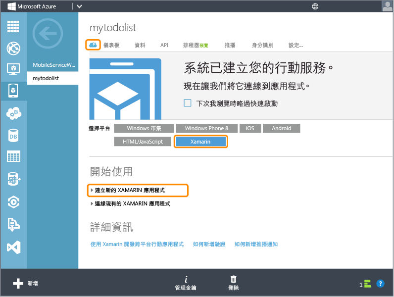
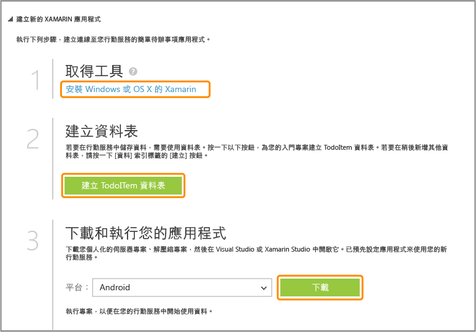
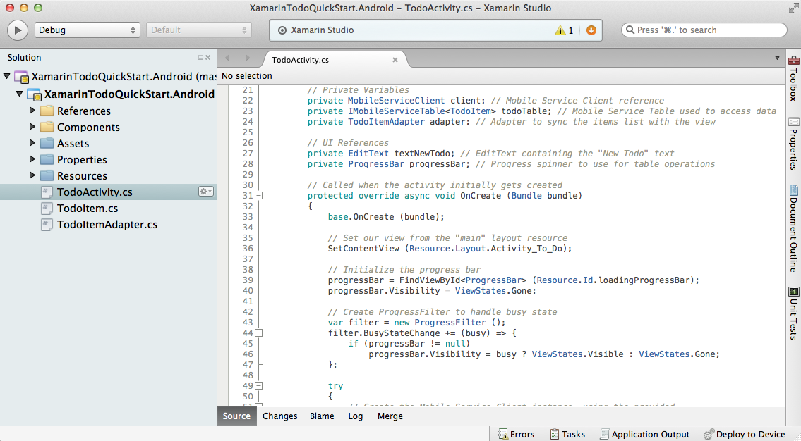
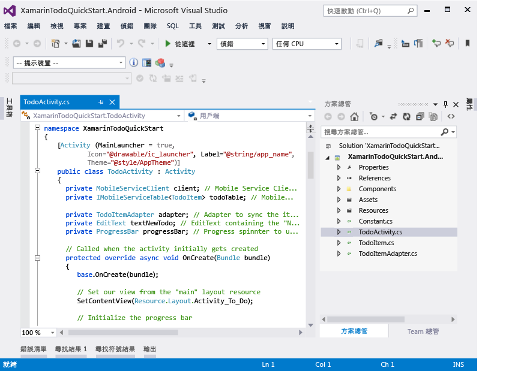
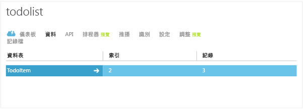

<properties pageTitle="Get Started with Mobile Services for Xamarin.Android" metaKeywords="Azure Xamarin.Android application, mobile service XamarinAndroid, getting started Azure Xamarin.Android" writer="craigd" description="Learn how to use Azure Mobile Services with your Xamarin.Android app." metaCanonical="" documentationCenter="Mobile" title="Get started with Mobile Services" />

開始使用行動服務
================

[Windows 市集](/en-us/documentation/articles/mobile-services-windows-store-get-started "Windows 市集") [Windows Phone](/en-us/documentation/articles/mobile-services-windows-phone-get-started "Windows Phone") [iOS](/en-us/documentation/articles/mobile-services-ios-get-started "iOS") [Android](/en-us/documentation/articles/mobile-services-android-get-started "Android") [HTML](/en-us/documentation/articles/mobile-services-html-get-started "HTML") [Xamarin.iOS](/en-us/documentation/articles/partner-xamarin-mobile-services-ios-get-started "Xamarin.iOS") [Xamarin.Android](/en-us/documentation/articles/partner-xamarin-mobile-services-android-get-started "Xamarin.Android") [Sencha](/en-us/documentation/articles/partner-sencha-mobile-services-get-started/ "Sencha") [PhoneGap](/en-us/documentation/articles/mobile-services-javascript-backend-phonegap-get-started/ "PhoneGap")

本教學課程將示範如何使用 Azure 行動服務，以將雲端後端服務新增至 Xamarin.Android 應用程式。在本教學課程中，您將建立新的行動服務，並建立可在新的行動服務中儲存應用程式資料的簡單*待辦事項*應用程式。

以下是完成應用程式的螢幕擷取畫面：

[觀看教學課程](http://channel9.msdn.com/Series/Windows-Azure-Mobile-Services/Getting-Started-with-Xamarin-and-Windows-Azure-Mobile-Services) [播放影片](http://channel9.msdn.com/Series/Windows-Azure-Mobile-Services/Getting-Started-with-Xamarin-and-Windows-Azure-Mobile-Services) 10:05

完成本教學課程需要 [Xamarin.Android](http://xamarin.com/download)，Xamarin.Android 將安裝 Xamarin Studio 和 Visual Studio 外掛程式 (在 Windows 上) 以及最新的 Android 平台。需要 Android 4.2 SDK 或更新版本。

下載的快速入門專案包含適用於 Xamarin.Android 的 Azure 行動服務元件。此專案主要是針對 Android 4.2 或更新版本，而行動服務 SDK 只需要 Android 2.2 或更新版本。

**注意**

若要完成此教學課程，您需要 Azure 帳戶。如果您沒有帳戶，只需要幾分鐘的時間就可以建立免費試用帳戶。如需詳細資訊，請參閱 [Azure 免費試用](http://www.windowsazure.com/zh-tw/pricing/free-trial/?WT.mc_id=A9C9624B5)。

建立新的行動服務
----------------

[WACOM.INCLUDE [mobile-services-create-new-service](../includes/mobile-services-create-new-service.md)]

建立新的應用程式建立新的 Xamarin.Android 應用程式
----------------------------------------------------------------------------------

在建立您的行動服務之後，您可以依照 [管理入口網站] 中的簡易快速入門，來建立新的應用程式或修改現有的應用程式，以連接到您的行動服務。

在本節中，您將建立可連接到您行動服務的新 Xamarin.Android 應用程式。

1.  在管理入口網站中，按一下 **[行動服務]**，然後按一下您剛剛建立的行動服務。

2.  在快速入門索引標籤中，按一下 **[Choose platform]** 下的 **[Xamarin.Android]**，並展開 **[Create a new Android app]**。

    

    這將顯示三個簡單步驟，可用來建立連接到您行動服務的 Xamarin.Android 應用程式。

    

3.  按一下 **[Create TodoItem table]** 以建立儲存應用程式資料的資料表。

4.  按一下 **[Download and run app]** 下的 **[下載]**。

    這將會下載與行動服務連接的範例*待辦事項*應用程式專案。將此壓縮專案檔案儲存到您的本機電腦，並記錄儲存位置。

執行您的 Android 應用程式
-------------------------

本教學課程的最後階段是建立並執行新的應用程式。

1.  瀏覽至您儲存此壓縮專案檔案的位置，並在您的電腦上展開檔案。

2.  在 Xamarin Studio 或 Visual Studio 中，依序按一下 **[檔案]**、**[開啟]**，瀏覽至未壓縮的範例檔案，並選取 **XamarinTodoQuickStart.Android.sln** 以將其開啟。

 	

	

1.  按 **[執行]** 按鈕，以建立專案並啟動應用程式。系統將要求您選取模擬器或連接的 USB 裝置。

    **注意**

    若要能夠在 Android 模擬器中執行此專案，您必須至少定義一個 Android 虛擬裝置 (AVD)。請使用 AVD 管理員來建立和管理這些裝置。

2.  在應用程式中輸入有意義的文字 (例如 *Complete the tutorial*)，然後按一下 **[新增]**。

    

    這會傳送 POST 要求到 Azure 中所代管的新行動服務。要求中的資料會被插入 TodoItem 資料表。行動服務會傳回資料表中儲存的項目，並將資料顯示在清單中。

    > [WACOM.NOTE]
    > 您可以檢閱存取行動服務以查詢與插入資料的程式碼，您可在 ToDoActivity.cs C\# 檔案中找到此程式碼。

3.  回到管理入口網站中，按一下 **[資料]** 索引標籤，然後按一下 **[TodoItems]** 資料表。

    

    這可讓您瀏覽應用程式插入此資料表的資料。

    

後續步驟
--------

請注意，您已完成快速入門，並了解如何執行行動服務中的其他重要工作：

-   [開始使用資料](/en-us/develop/mobile/tutorials/get-started-with-data-xamarin-android)
    
    深入了解使用行動服務來儲存與查詢資料。

-   [開始使用驗證](/en-us/develop/mobile/tutorials/get-started-with-users-xamarin-android)
    
    了解如何向身分識別提供者驗證應用程式的使用者。

-   [開始使用推播通知](/en-us/develop/mobile/tutorials/get-started-with-push-xamarin-android)
    
     了解如何將非常基本的推播通知傳送到應用程式。

