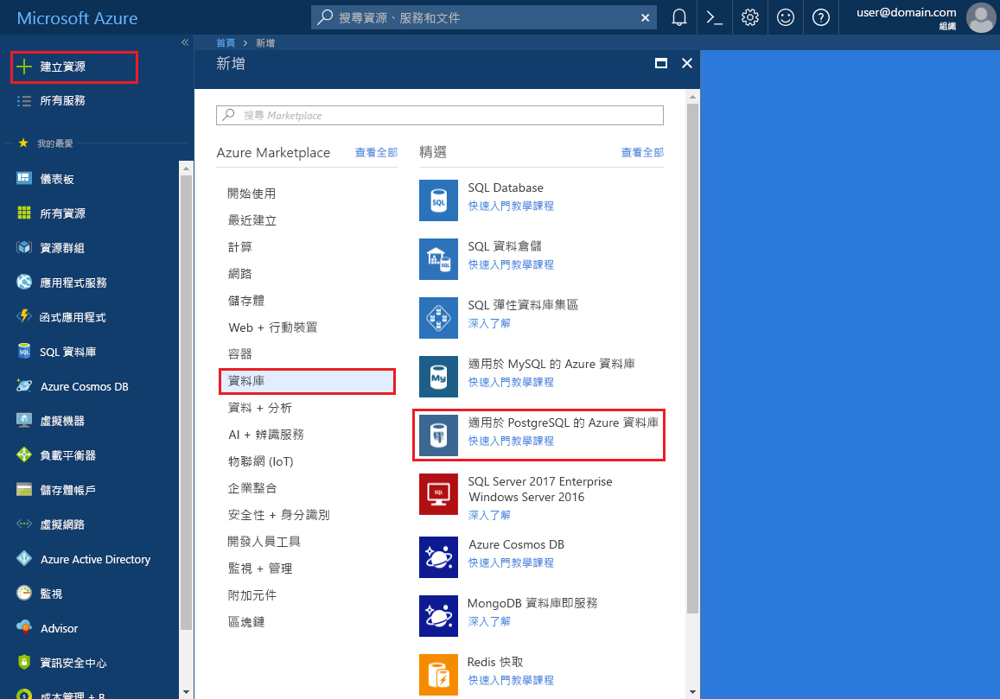

# <a name="create-an-azure-database-for-postgresql-in-the-azure-portal"></a>在 Azure 入口網站中建立適用於 PostgreSQL 的 Azure 資料庫

「適用於 PostgreSQL 的 Azure 資料庫」是一種受管理的服務，可讓您在雲端執行、管理及調整高可用性的 PostgreSQL 資料庫。 本快速入門說明如何使用 Azure 入口網站，以建立適用於 PostgreSQL 的 Azure 資料庫伺服器。

如果您沒有 Azure 訂用帳戶，請在開始前建立[免費帳戶](https://azure.microsoft.com/free/) 。

## <a name="log-in-to-the-azure-portal"></a>登入 Azure 入口網站

登入 [Azure 入口網站](https://portal.azure.com)。

## <a name="create-an-azure-database-for-postgresql"></a>建立適用於 PostgreSQL 的 Azure 資料庫

「適用於 PostgreSQL 的 Azure 資料庫」伺服器是以一組已定義的[計算和儲存體資源](./concepts-compute-unit-and-storage.md)所建立。 伺服器會建立在 [Azure 資源群組](../azure-resource-manager/resource-group-overview.md)內。

請依照下列步驟來建立「適用於 PostgreSQL 的 Azure 資料庫」伺服器：
1.  按一下 Azure 入口網站左上角的 [新增] 按鈕。
2.  從 [新增] 頁面中選取 [資料庫]，然後從 [資料庫] 頁面中選取 [適用於 PostgreSQL 的 Azure 資料庫]。
 

3.  在新伺服器詳細資料表單中填入下列資訊，如上圖所示︰
    - 伺服器名稱：**mypgserver-20170401** (伺服器的名稱會與 DNS 名稱對應，因此必須是全域唯一的) 
    - 訂用帳戶：如果您有多個訂用帳戶，請選擇資源所在或作為計費對象的適當訂用帳戶。
    - 資源群組︰**myresourcegroup**
    - 您選擇的伺服器管理員登入和密碼
    - 位置
    - PostgreSQL 版本

  > [!IMPORTANT]
  > 需要伺服器系統管理員登入以及您在此處指定的密碼，稍後才能在本快速入門中登入伺服器及其資料庫。 請記住或記錄此資訊，以供稍後使用。

4.  按一下 [定價層] 指定新資料庫的服務層和效能等級。 針對本快速入門，選取 [基本] 層、[50 個計算單位] 及 [50 GB] 的內含儲存體。
 
5.  按一下 [確定] 。
6.  按一下 [建立] 以佈建伺服器。 佈建需要幾分鐘的時間。

  > [!TIP]
  > 選取 [釘選到儀表板] 選項以輕鬆追蹤部署。

7.  在工具列上，按一下 [通知] 以監視部署程序。
 
   
  根據預設，**postgres** 資料庫會建立在您的伺服器底下。 [postgres](https://www.postgresql.org/docs/9.6/static/app-initdb.html) 資料庫是要供使用者、公用程式及協力廠商應用程式使用的預設資料庫。 

## <a name="configure-a-server-level-firewall-rule"></a>設定伺服器層級防火牆規則

「適用於 PostgreSQL 的 Azure 資料庫」服務會在伺服器層級建立防火牆。 此防火牆會防止外部應用程式和工具連線到伺服器及伺服器上的任何資料庫，除非已建立防火牆規則以針對特定的 IP 位址開啟防火牆。 

1.  完成部署之後，從左側功能表中按一下 [所有資源]，然後輸入名稱 **mypgserver-20170401** 來搜尋新建立的伺服器。 按一下搜尋結果中列出的伺服器名稱。 伺服器的 [概觀] 頁面隨即開啟，並提供可進行進一步設定的選項。
 
 

2.  在伺服器刀鋒視窗中，選取 [連線安全性]。 
3.  在 [規則名稱] 底下的文字方塊中按一下，然後新增新的防火牆規則，以將 IP 範圍加入白名單來獲得連線能力。 針對本快速入門，我們將輸入**規則名稱 = AllowAllIps**、**起始 IP = 0.0.0.0** 及**結尾 IP = 255.255.255.255**，然後按一下 [儲存]，來允許所有 IP。 您可以設定一個防火牆規則，來涵蓋能夠從您網路連線的 IP 範圍。

 

4.  按一下 [儲存]，然後按一下 [X]，以關閉 [連線安全性] 頁面。

  > [!NOTE]
  > Azure PostgreSQL 伺服器會透過連接埠 5432 進行通訊。 如果您嘗試從公司網路內進行連線，您網路的防火牆可能不允許透過連接埠 5432 的輸出流量。 若是如此，除非 IT 部門開啟連接埠 5432，否則您將無法連線到 Azure SQL Database 伺服器。
  >

## <a name="get-the-connection-information"></a>取得連線資訊

當我們建立「適用於 PostgreSQL 的 Azure 資料庫」伺服器時，會一併建立預設的 **postgres** 資料庫。 若要連線到您的資料庫伺服器，您必須提供主機資訊和存取認證。

1. 從 Azure 入口網站的左側功能表中，按一下 [所有資源]，然後搜尋您剛建立的伺服器 **mypgserver-20170401**。

  

2. 按一下伺服器名稱 [mypgserver-20170401]。
3. 選取伺服器的 [概觀] 頁面。 記下 [伺服器名稱] 和 [伺服器管理員登入名稱]。

 

## <a name="connect-to-postgresql-database-using-psql-in-cloud-shell"></a>在 Cloud Shell 中使用 psql 來連線到 PostgreSQL 資料庫

現在我們將使用 psql 命令列公用程式來連線到「適用於 PostgreSQL 的 Azure 資料庫」伺服器。 
1. 透過頂端瀏覽窗格上的終端機圖示啟動 Azure Cloud Shell。

   

2. Azure Cloud Shell 會在您的瀏覽器中開啟，讓您能夠輸入 bash 命令。

   

3. 在 Cloud Shell 提示字元處，使用 psql 命令來連線到「適用於 PostgreSQL 的 Azure 資料庫」伺服器。 下列格式可用來透過 [psql](https://www.postgresql.org/docs/9.6/static/app-psql.html) 公用程式連線到「適用於 PostgreSQL 的 Azure 資料庫」伺服器：
   ```bash
   psql --host=<myserver> --port=<port> --username=<server admin login> --dbname=<database name>
   ```

   例如，下列命令會使用存取認證，連線到 PostgreSQL 伺服器 **mypgserver-20170401.postgres.database.azure.com** 上名為 **postgres** 的預設資料庫。 在系統提示時輸入您的伺服器管理員密碼。

   ```bash
   psql --host=mypgserver-20170401.postgres.database.azure.com --port=5432 --username=mylogin@mypgserver-20170401 --dbname=postgres
   ```
4.  連線到伺服器之後，在提示字元建立空白資料庫。
```bash
CREATE DATABASE mypgsqldb;
```

5.  在提示字元，執行下列命令以將連線切換到新建立的資料庫 **mypgsqldb**。
```bash
\c mypgsqldb
```

## <a name="connect-to-postgresql-database-using-pgadmin"></a>使用 pgAdmin 連線到 PostgreSQL 資料庫

使用 GUI 工具 _pgAdmin_ 連線到 Azure PostgreSQL 伺服器
1.  在您的用戶端電腦上啟動 _pgAdmin_ 應用程式。 您可以從 http://www.pgadmin.org/ 安裝 _pgAdmin_。
2.  從 [Quick Links (快速連結)] 功能表選擇 [Add New Server (新增伺服器)]。
3.  在 [Create - Server (建立 - 伺服器)] 對話方塊的 [General (一般)] 索引標籤上，輸入伺服器的唯一易記名稱，例如 **Azure PostgreSQL Server 伺服器**。

4.  在 [Create - Server (建立 - 伺服器)] 對話方塊中的 [Connection (連線)] 索引標籤，使用如指定的設定，然後按一下 [Save (儲存)]。
   
    - **Host Name/Address (主機名稱/位址)**：mypgserver-20170401.postgres.database.azure.com 
        - 完整伺服器名稱。
    - **Port (連接埠)：**5432
        - 此資料庫伺服器所使用的連接埠號碼是 5432。
    - **Maintenance Database (維護資料庫)**：postgres 
        - 預設系統產生的資料庫名稱。
    - **User Name (使用者名稱)：**mylogin@mypgserver-20170401 
        - 在本快速入門稍早取得的伺服器管理員登入 (user@mypgserver)。
    - **Password (密碼)**：您在本快速入門稍早建立伺服器時所選擇的密碼。
    - **SSL Mode (SSL 模式)**：Require
        - 根據預設，所有的 Azure PostgreSQL 伺服器建立時都會開啟強制使用 SSL。 若要關閉強制使用 SSL，請參閱[強制使用 SSL](./concepts-ssl-connection-security.md) 中的詳細資訊。
5.  按一下 [儲存] 。
6.  在左側的 [Browser (瀏覽器)] 窗格中，展開 [Server Groups (伺服器群組)]。 選擇您的伺服器 [Azure PostgreSQL 伺服器]。
7.  選擇您連線到的 [Server (伺服器)]，然後選擇其下的 [Databases (資料庫)]。 
8.  以滑鼠右鍵按一下 [Databases (資料庫)] 以建立資料庫。
9.  選擇資料庫名稱 **mypgsqldb** 以及其擁有者作為伺服器管理員登入 **mylogin**。
10. 按一下 [Save (儲存)] 以建立空白資料庫。
11. 在 [Browser (瀏覽器)] 中展開 [Server (伺服器)]。 展開您所建立的伺服器，並查看其下的資料庫 **mypgsqldb**。
 


## <a name="clean-up-resources"></a>清除資源
刪除 [Azure 資源群組](../azure-resource-manager/resource-group-overview.md)以清除您在快速入門中建立的所有資源。

> [!TIP]
> 此集合中的其他快速入門會以本快速入門為基礎。 如果您打算繼續進行後續的快速入門，請勿清除在此快速入門中建立的資源。 如果您不打算繼續，請使用下列步驟，在 Azure 入口網站中刪除本快速入門所建立的所有資源。

1.  從 Azure 入口網站的左側功能表中，依序按一下 [資源群組] 和 [myresourcegroup]。
2.  在資源群組頁面上，按一下 [刪除]，在文字方塊中輸入 **myresourcegroup**，然後按一下 [刪除]。

如果您只想要刪除新建立的伺服器：
1.  從 Azure 入口網站的左側功能表中，按一下 PostgreSQL 伺服器，然後搜尋您剛建立的伺服器
2.  在 [概觀] 頁面上，按一下上方窗格的 [刪除] 按鈕 
3.  確認您要刪除的伺服器名稱，並且會顯示其底下受到影響的資料庫。 在文字方塊中輸入 **mypgserver-20170401**，然後按一下 [刪除]。

## <a name="next-steps"></a>後續步驟
- 使用[匯出和匯入](./howto-migrate-using-export-and-import.md)或[傾印和還原](./howto-migrate-using-dump-and-restore.md)來移轉資料庫。
- 若要使用 Azure CLI 建立適用於 PostgreSQL 的 Azure 資料庫，請參閱[建立 PostgreSQL 伺服器 - CLI](./quickstart-create-server-database-azure-cli.md)。
- 如需技術概觀，請參閱[關於適用於 PostgreSQL 的 Azure 資料庫服務](./overview.md)。
