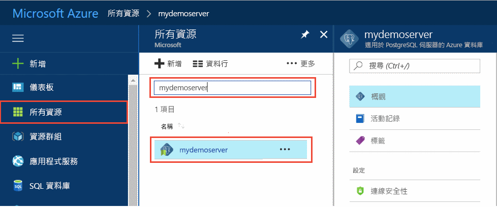

# <a name="quickstart-create-an-azure-database-for-postgresql-server-in-the-azure-portal"></a>快速入門：在 Azure 入口網站中建立適用於 PostgreSQL 的 Azure 資料庫伺服器

Azure Database for PostgreSQL 是一種受控服務，您用來在雲端執行、管理及調整高可用性的 PostgreSQL 資料庫。 本快速入門說明如何使用 Azure 入口網站，在大約五分鐘內建立適用於 PostgreSQL 的 Azure 資料庫伺服器。

如果您沒有 Azure 訂用帳戶，請在開始前建立[免費 Azure 帳戶](https://azure.microsoft.com/free/)。

## <a name="sign-in-to-the-azure-portal"></a>登入 Azure 入口網站
開啟 Web 瀏覽器，然後移至[入口網站](https://portal.azure.com/)。 輸入您的認證來登入此入口網站。 預設檢視是您的服務儀表板。

## <a name="create-an-azure-database-for-postgresql-server"></a>建立適用於 PostgreSQL 的 Azure 資料庫伺服器

「適用於 PostgreSQL 的 Azure 資料庫」伺服器是以一組已設定的[計算和儲存體資源](./concepts-pricing-tiers.md)所建立。 伺服器會建立在 [Azure 資源群組](../azure-resource-manager/resource-group-overview.md)內。

若要建立 Azure Database for PostgreSQL 伺服器，請採取下列步驟：
1. 選取入口網站左上角的 [建立資源] 按鈕 (+)。

2. 選取 [資料庫] > [Azure Database for PostgreSQL]。

    

3. 在新伺服器詳細資料表單中填寫下列資訊︰

    

    設定|建議的值|說明
    ---|---|---
    伺服器名稱 |*mydemoserver*|可識別 Azure Database for PostgreSQL 伺服器的唯一名稱。 網域名稱 postgres.database.azure.com 已附加至您提供的伺服器名稱。 伺服器只能包含小寫字母、數字及連字號 (-) 字元。 它必須包含至少 3 到 63 個字元。
    訂用帳戶|您的訂用帳戶名稱|您要用於伺服器的 Azure 訂用帳戶。 如果您有多個訂用帳戶，請選擇資源計費的訂用帳戶。
    資源群組|*myresourcegroup*| 新的資源群組名稱，或您訂用帳戶中現有的資源群組名稱。
    選取來源 | 空白 | 選取 [空白]，從頭開始建立新的伺服器。 (如果您要從現有「適用於 PostgreSQL 的 Azure 資料庫」伺服器的異地備份建立伺服器，可以選取 [備份])。
    伺服器管理員登入 |myadmin| 連線至伺服器時所要使用之自己的登入帳戶。 管理員登入名稱不能是 **azure_superuser**、**azure_pg_admin****admin****administrator****root****guest** 或 **public**。 它不能以 **pg_** 開頭。
    密碼 |您的密碼| 伺服器管理帳戶的新密碼。 其必須包含 8 到 128 個字元。 您的密碼必須包含下列三個類別的字元：英文大寫字母、英文小寫字母、數字 (0 到 9) 和非英數字元 (!、$、#、% 等)。
    位置|最接近使用者的區域| 最靠近您使用者的位置。
    版本|最新版本| 最新 PostgreSQL 版本 (除非您有其他特定需求)。
    定價層 | **一般用途**、**Gen 4**、**2 個虛擬核心**、**5GB**、**7 天**、**異地備援** | 新伺服器的計算、儲存體和備份組態。 選取 [定價層]。 接下來，選取 [一般用途] 索引標籤。Gen 4、2 個虛擬核心、5 GB 和 7 天是**計算世代**、**虛擬核心**、**儲存體**和**備份保留期限**。 您可以讓這些滑桿保留原狀。 若要啟用異地備援儲存體中的伺服器備份，請從 [備份備援選項] 中選取 [異地備援]。 若要儲存此定價層選取項目，請選取 [確定]。 下方螢幕擷取畫面會擷取這些選取項目。

    > [!IMPORTANT]
    > 需要伺服器系統管理員登入以及您在此處指定的密碼，稍後才能在本快速入門中登入伺服器及其資料庫。 請記住或記錄此資訊，以供稍後使用。

    ![[定價層] 窗格](./media/quickstart-create-database-portal/2-pricing-tier.png)

4. 選取 [建立] 以佈建伺服器。 這項作業可能需要幾分鐘的時間。

5. 在工具列上，選取 [通知] 圖示 (鈴鐺) 以監視部署程序。 完成部署後，您可以選取 [釘選到儀表板]，在 Azure 入口網站儀表板上建立此伺服器的圖格，以作為伺服器 [概觀] 頁面的捷徑。 選取 [移至資源] 會開啟伺服器的 [概觀] 頁面。

    ![[通知] 窗格](./media/quickstart-create-database-portal/3-notifications.png)
   
   根據預設，**postgres** 資料庫會建立在您的伺服器底下。 [postgres](https://www.postgresql.org/docs/9.6/static/app-initdb.html) 資料庫是要供使用者、公用程式及第三方應用程式使用的預設資料庫。 (其他預設資料庫是 **azure_maintenance**。 其功能是分隔受控服務處理程序和使用者動作。 您無法存取此資料庫。)

## <a name="configure-a-server-level-firewall-rule"></a>設定伺服器層級防火牆規則

Azure Database for PostgreSQL 會在伺服器層級建立防火牆。 它會防止外部應用程式和工具連線到伺服器及伺服器上的任何資料庫，除非您建立規則以針對特定 IP 位址開啟防火牆。 

1. 在部署完成之後，找出您的伺服器。 如有需要，您可以搜尋它。 例如，在左側功能表上選取 [所有資源]。 輸入您的伺服器名稱 (例如範例中的 **mydemoserver**)，以搜尋新建立的伺服器。 從搜尋結果清單中選取伺服器名稱。 伺服器的 [概觀] 頁面隨即開啟，並提供可進行進一步設定的選項。
 
    

2. 在伺服器頁面上，選取 [連線安全性]。

3. 在 [防火牆規則] 之下，選取 [規則名稱] 欄中的空白文字方塊，開始建立防火牆規則。 

    在本快速入門中，我們可允許所有 IP 位址連到伺服器。 使用下列值填入每個資料行中的文字方塊：

    規則名稱 | 起始 IP | 結束 IP 
    ---|---|---
    AllowAllIps | 0.0.0.0 | 255.255.255.255

     

4. 在 [連線安全性] 頁面的工具列上，選取 [儲存]。 等到陳述連線安全性更新已成功完成的通知出現，您才能繼續進行。

    > [!NOTE]
    > 您的 Azure Database for PostgreSQL 伺服器連線會透過連接埠 5432 通訊。 如果您嘗試從公司網路內進行連線，您網路的防火牆可能不允許透過連接埠 5432 的輸出流量。 若是如此，除非 IT 部門開啟連接埠 5432，否則您無法連線到您的伺服器。
    >

## <a name="get-the-connection-information"></a>取得連線資訊

當您建立 Azure Database for PostgreSQL 伺服器時，系統會建立名為 **postgres** 的預設資料庫。 若要連線到您的資料庫伺服器，您需要完整伺服器名稱和系統管理員登入認證。 您稍早可能已在快速入門文章中記下這些值。 若未這麼做，您可以在 Azure 入口網站的伺服器 [概觀] 頁面輕鬆尋找伺服器名稱和登入資訊。

開啟伺服器的 [概觀] 頁面。 記下 [伺服器名稱] 和 [伺服器管理員登入名稱]。 將您的游標停留在每個欄位上，複製符號就會出現在文字右邊。 視需要選取複製符號來複製值。

 ![伺服器 [概觀] 頁面](./media/quickstart-create-database-portal/6-server-name.png)

## <a name="connect-to-the-postgresql-database-by-using-psql-in-cloud-shell"></a>在 Cloud Shell 中使用 psql 來連線到 PostgreSQL 資料庫

您可以使用一些應用程式來連線到您的 Azure Database for PostgreSQL 伺服器。 我們將使用 psql 命令列公用程式來說明如何連線到該伺服器。 您可以如這裡所描述使用網頁瀏覽器和 Azure Cloud Shell，而不需要安裝任何其他軟體。 如果您自己的電腦本機上已安裝 psql 公用程式，您也可以從該處進行連線。

1. 在上方導覽窗格中，選取終端符號以開啟 Cloud Shell。

   

2. Cloud Shell 會在您的瀏覽器中開啟，您可在其中鍵入 Bash shell 命令。

   

3. 在 Cloud Shell 提示字元，鍵入 psql 命令列，以連線到 Azure Database for PostgreSQL 伺服器。

    若要透過 [psql](https://www.postgresql.org/docs/9.6/static/app-psql.html) 公用程式連線到 Azure Database for PostgreSQL 伺服器，請使用下列格式：
    ```bash
    psql --host=<yourserver> --port=<port> --username=<server admin login> --dbname=<database name>
    ```

    例如，下列命令會連線至範例伺服器：

    ```bash
    psql --host=mydemoserver.postgres.database.azure.com --port=5432 --username=myadmin@mydemoserver --dbname=postgres
    ```

    psql 參數 |值|說明
    ---|---|---
    --host | 伺服器名稱 | 您稍早建立 Azure Database for PostgreSQL 伺服器時所用的伺服器名稱值。 顯示的範例伺服器是 **mydemoserver.postgres.database.azure.com**。 使用如範例所示的完整網域名稱 (**\*.postgres.database.azure.com**)。 如果您不記得您的伺服器名稱，請依照上一節中的步驟執行，以取得連線資訊。 
    --port | 5432 | 當您連線至 Azure Database for PostgreSQL 伺服器時所要使用的連接埠。 
    --username | 伺服器管理員登入名稱 |您稍早建立 Azure Database for PostgreSQL 時所提供的伺服器管理員登入使用者名稱。 如果您不記得使用者名稱，請依照上一節中的步驟執行，以取得連線資訊。 格式為 *username@servername*。
    --dbname | *postgres* | 針對第一次連線所建立之系統產生的預設資料庫名稱。 您稍後會建立自己的資料庫。

    使用您自己的參數值執行 psql 命令之後，系統會提示您輸入伺服器管理員密碼。 這是您在建立伺服器時所提供的相同密碼。 

    psql 參數 |建議的值|說明
    ---|---|---
    password | 您的系統管理員密碼 | 輸入的密碼字元不會顯示在 bash 提示字元上。 在您輸入所有字元之後，按 Enter 鍵以進行驗證和連線。

    連線之後，psql 公用程式會顯示 postgres 提示字元，供您鍵入 sql 命令。 在初始連線輸出中，可能會因為 Cloud Shell 中的 psql 版本與適用於 PostgreSQL 的 Azure 資料庫伺服器版本不同，而顯示警告。 
    
    psql 輸出範例：
    ```bash
    psql (9.5.7, server 9.6.2)
    WARNING: psql major version 9.5, server major version 9.6.
        Some psql features might not work.
    SSL connection (protocol: TLSv1.2, cipher: ECDHE-RSA-AES256-SHA384, bits: 256, compression: off)
    Type "help" for help.
   
    postgres=> 
    ```

    > [!TIP]
    > 如果未將防火牆設定為允許 Cloud Shell 的 IP 位址，就會發生下列錯誤：
    > 
    > "psql: FATAL:  no pg_hba.conf entry for host "0.0.0.0", user "myadmin", database "postgres", SSL on FATAL：需要 SSL 連線。 指定 SSL 選項，然後再試一次。
    > 
    > 若要解決此錯誤，請確定伺服器組態符合本文的「設定伺服器層級防火牆規則」一節中的步驟。

4. 在提示字元輸入下列命令以建立名為 "mypgsqldb" 的空白資料庫︰
    ```bash
    CREATE DATABASE mypgsqldb;
    ```
    此命令可能需要幾分鐘才能完成。 

5. 在提示字元，執行下列命令將連線切換到新建立的資料庫 **mypgsqldb**：
    ```bash
    \c mypgsqldb
    ```

6. 輸入 `\q`，然後選取 Enter 鍵結束 psql。 完成之後，您可以關閉 Cloud Shell。

您已在 Cloud Shell 中透過 psql 連線到適用於 PostgreSQL 的 Azure 資料庫伺服器，並已建立空白的使用者資料庫。 繼續進行下一節，以使用另一個常見工具 pgAdmin 連線。

## <a name="connect-to-the-postgresql-server-using-pgadmin"></a>使用 pgAdmin 連線到 PostgreSQL 伺服器

pgAdmin 是搭配 PostgreSQL 使用的開放原始碼工具。 您可以從 [pgAdmin 網站](http://www.pgadmin.org/)安裝 pgAdmin。 您使用的 pgAdmin 版本可能不同於本快速入門中使用的版本。 如果您需要其他指引，請閱讀 pgAdmin 文件。

1. 在您的用戶端電腦上開啟 pgAdmin 應用程式。

2. 移至工具列中的 [物件]，將滑鼠停留在 [建立] 上方，然後選取 [伺服器]。

3. 在 [建立 - 伺服器] 對話方塊的 [一般] 索引標籤上，輸入伺服器的唯一易記名稱，例如 **mydemoserver**。

    ![[一般] 索引標籤](./media/quickstart-create-database-portal/9-pgadmin-create-server.png)

4. 在 [建立 - 伺服器] 對話方塊的 [連線] 索引標籤上，填寫設定資料表。

   ![[連線] 索引標籤](./media/quickstart-create-database-portal/10-pgadmin-create-server.png)

    pgAdmin 參數 |值|說明
    ---|---|---
    主機名稱/位址 | 伺服器名稱 | 您稍早建立 Azure Database for PostgreSQL 伺服器時所用的伺服器名稱值。 我們的範例伺服器是 **mydemoserver.postgres.database.azure.com**。 使用如範例所示的完整網域名稱 (**\*.postgres.database.azure.com**)。 如果您不記得您的伺服器名稱，請依照上一節中的步驟執行，以取得連線資訊。 
    Port | 5432 | 當您連線至 Azure Database for PostgreSQL 伺服器時所要使用的連接埠。 
    維護資料庫 | *postgres* | 系統產生的預設資料庫名稱。
    使用者名稱 | 伺服器管理員登入名稱 | 您稍早建立 Azure Database for PostgreSQL 時所提供的伺服器管理員登入使用者名稱。 如果您不記得使用者名稱，請依照上一節中的步驟執行，以取得連線資訊。 格式為 *username@servername*。
    密碼 | 您的系統管理員密碼 | 您在本快速入門稍早建立伺服器時所選擇的密碼。
    角色 | 保留空白 | 此時不需要提供角色名稱。 將欄位保留空白。
    SSL 模式 | *必要* | 您可以在 pgAdmin 的 [SSL] 索引標籤中設定 SSL 模式。根據預設，所有適用於 PostgreSQL 的 Azure 資料庫伺服器建立時都會開啟強制執行 SSL。 若要關閉強制執行 SSL，請參閱[強制執行 SSL](./concepts-ssl-connection-security.md)。
    
5. 選取 [ **儲存**]。

6. 在左側的 [瀏覽器] 窗格中，展開 [伺服器] 節點。 選取您的伺服器，例如 **mydemoserver**。 按一下以連線到它。

7. 展開伺服器節點，然後展開其下的 [資料庫]。 此清單應包含現有 postgres 資料庫和其他您已建立的資料庫。 您可以使用適用於 PostgreSQL 的 Azure 資料庫，為每一部伺服器建立多個資料庫。

8. 以滑鼠右鍵按一下 [資料庫]，選擇 [建立] 功能表，然後選取 [資料庫]。

9. 在 [資料庫] 欄位中輸入您選擇的資料庫名稱，例如 **mypgsqldb2**。

10. 從清單方塊中選取資料庫的 [擁有者]。 選擇您的伺服器管理員登入名稱，例如範例中的 **my admin**。

   

11. 選取 [儲存] 以建立新的空白資料庫。

12. 在 [瀏覽器] 窗格中，您可以在伺服器名稱之下的 [資料庫] 清單中看到您所建立的資料庫。


## <a name="clean-up-resources"></a>清除資源
您有兩種方式可以清除您在本快速入門中建立的資源。 您可以刪除 [Azure 資源群組](../azure-resource-manager/resource-group-overview.md)，其中包括資源群組中的所有資源。 如果您想要讓其他資源保持不變，則只刪除該伺服器資源。

> [!TIP]
> 此集合中的其他快速入門會以本快速入門為基礎。 如果您打算繼續進行快速入門，請勿清除您在此快速入門中建立的資源。 如果您不打算繼續，請遵循下列步驟，在入口網站中刪除本快速入門所建立的資源。

若要刪除整個資源群組 (包括新建立的伺服器)：
1. 在入口網站中找出您的資源群組。 在左側功能表中，選取 [資源群組]。 然後選取您的資源群組名稱，例如範例中的 **myresourcegroup**。

2. 在資源群組頁面上，選取 [刪除]。 在文字方塊中輸入您的資源群組名稱 (例如範例中的 **myresourcegroup**)，以確認刪除。 選取 [刪除] 。

若要刪除新建立的伺服器：
1. 請在入口網站中找出您的伺服器 (如果您未將它開啟)。 在左側功能表上選取 [所有資源]。 然後搜尋您所建立的伺服器。

2. 在 [概觀] 頁面上，按一下 [刪除]。

    ![[刪除] 按鈕](./media/quickstart-create-database-portal/12-delete.png)

3. 確認您要刪除的伺服器名稱，並且會檢視其下受影響的資料庫。 在文字方塊中輸入您的伺服器名稱，例如範例中的 **mydemoserver**。 選取 [刪除] 。

## <a name="next-steps"></a>後續步驟
> [!div class="nextstepaction"]
> [使用匯出和匯入來移轉資料庫](./howto-migrate-using-export-and-import.md)
