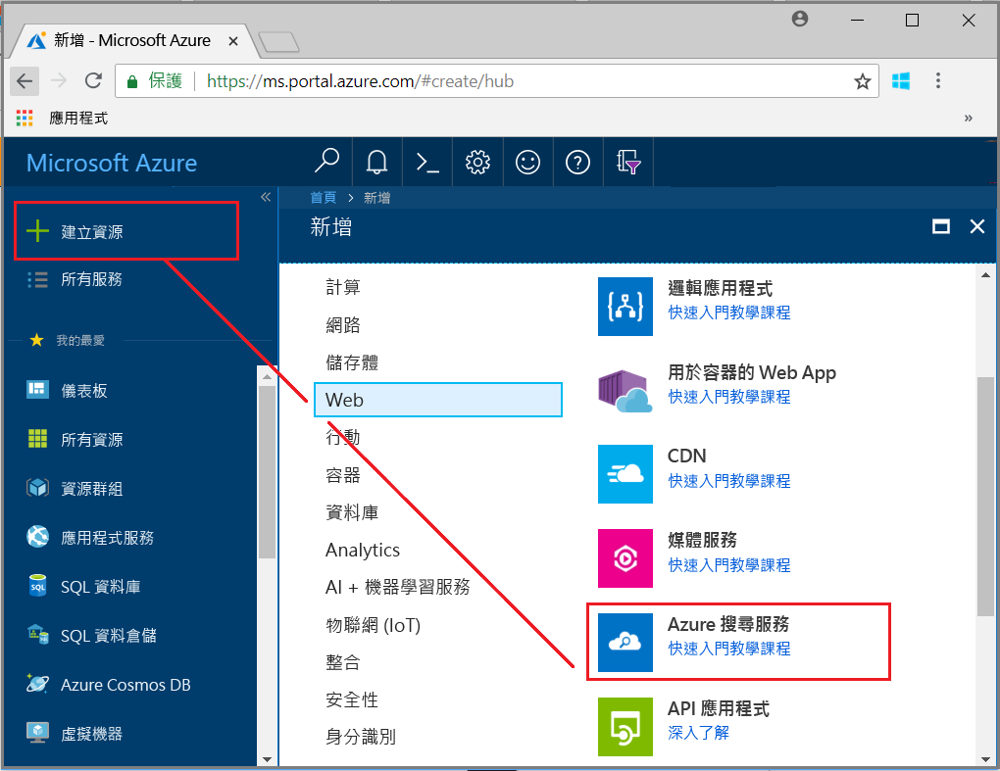
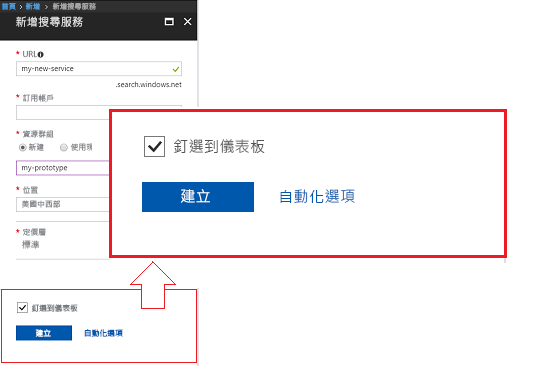

# 在入口網站中建立 Azure 搜尋服務

Azure 搜尋服務是一項可用來在自訂應用程式中插入搜尋體驗的獨立資源。 雖然 Azure 搜尋服務可與其他 Azure 服務輕易整合，但您也可以單獨使用、將其與網路伺服器上的應用程式搭配使用，或與其他雲端平台上執行的軟體搭配使用。 

在本文中，請了解如何在 [Azure 入口網站](https://portal.azure.com/)中建立 Azure 搜尋服務資源。 

是否偏好使用 PowerShell？ 請使用 Azure Resource Manager [服務範本](https://azure.microsoft.com/resources/templates/101-azure-search-create/)。 如需入門說明，請參閱[使用 PowerShell 管理 Azure 搜尋服務](search-manage-powershell.md)。

## 訂閱 (免費或付費)

[開啟免費的 Azure 帳戶](https://azure.microsoft.com/pricing/free-trial/?WT.mc_id=A261C142F)，並使用免費信用額度來試用付費的 Azure 服務。 當您用完信用額度之後，請保留帳戶，並繼續使用免費的 Azure 服務，例如網站。 除非您明確變更您的設定且同意付費，否則我們絕對不會從您的信用卡收取任何費用。

或者，請[啟用 MSDN 訂閱者權益](https://azure.microsoft.com/pricing/member-offers/msdn-benefits-details/?WT.mc_id=A261C142F)。 MSDN 訂用帳戶每月會提供您信用額度，讓您可以用於 Azure 付費服務。 

## 尋找 Azure 搜尋服務
1. 登入 [Azure 入口網站](https://portal.azure.com/)。
2. 按一下左上角的加號 (「+ 建立資源」)。
3. 使用搜尋列尋找「Azure 搜尋服務」，或透過 [Web] > [Azure 搜尋服務] 瀏覽至資源。

## 為服務和 URL 端點命名

服務名稱是 URL 端點的一部分，API 呼叫是根據此端點所發出：`https://your-service-name.search.windows.net`。 在 [URL] 欄位中輸入您的服務名稱。

例如，如果您所需的端點是 `https://my-app-name-01.search.windows.net`，則應輸入 `my-app-name-01`。

服務名稱需求：
   * 此名稱在 search.windows.net 命名空間中必須是唯一名稱
   * 長度為 2 到 60 個字元
   * 使用小寫字母、數字或連字號 ("-")
   * 前 2 個字元或最後一個字元不可使用連字號 ("-")
   * 不能連續使用破折號 ("--")

## 選取一個訂用帳戶
如果您有一個以上的訂用帳戶，請選擇一個同樣具有資料或檔案儲存體服務的訂用帳戶。 Azure 搜尋服務可以透過[索引子](search-indexer-overview.md)自動偵測 Azure 資料表和 Blob 儲存體、SQL Database 和 Azure Cosmos DB 以進行索引編製，但只會針對相同訂用帳戶中的服務。

## 選取資源群組
資源群組是一起使用之 Azure 服務和資源的集合。 例如，如果您使用 Azure 搜尋服務來編製 SQL 資料庫的索引，則這兩個服務應該屬於同一個資源群組。

如果您不想將資源結合成單一群組，或現有的資源群組中有許多資源用於不相關的解決方案中，請為您的 Azure 搜尋服務資源建立專屬的新資源群組。

> [!TIP]
> 刪除資源群組也會刪除其中的服務。 針對使用多個服務的原型專案，將它們全部放入同一個資源群組，在專案結束之後就能更容易清除。 

## 選取裝載位置 
做為 Azure 服務，Azure 搜尋服務可以裝載於世界各地的資料中心。 各地理位置的[價格可能不同](https://azure.microsoft.com/pricing/details/search/)。

如果您打算使用認知搜尋，請選擇[功能的適用區域](cognitive-search-quickstart-blob.md#supported-regions)。

## 選取定價層 (SKU)
[Azure 搜尋服務目前提供多個定價層](https://azure.microsoft.com/pricing/details/search/)︰免費、基本或標準。 每一層都有自己的[容量和限制](search-limits-quotas-capacity.md)。 請參閱[選擇定價層或 SKU](search-sku-tier.md) 以取得指導方針。

一般對於生產工作負載通常會選擇標準服務，但大部分的客戶一開始都會使用免費服務。

服務建立之後便無法變更定價層。 如果您稍後需要高或較低的定價層，必須重新建立服務。

## 建立您的服務

請記得將您的服務釘選到儀表板，以方便在登入時存取。

## 取得金鑰和 URL 端點

除了少數例外狀況以外，使用新服務時，您需要提供 URL 端點和授權 API 金鑰。 快速入門、教學課程 (例如[探索 Azure 搜尋服務 REST API (Postman)](search-fiddler.md) 和[如何從 .NET 使用 Azure 搜尋服務](search-howto-dotnet-sdk.md))、範例和自訂程式碼全都需要端點和金鑰，才能在特定資源上執行。

1. 在服務概觀頁面中，找出並複製頁面左側的 URL 端點。 

   

2. 在左側導覽窗格中選取 [金鑰]，然後複製任一系統管理員金鑰 (它們是相等的)。 在您的服務上建立、更新及刪除物件時，需要系統管理員 API 金鑰。

   

入口網站工作不需要端點和金鑰。 入口網站已透過系統管理員權限連結至您的 Azure 搜尋服務資源。 如需入口網站教學課程，請開始使用[教學課程：Azure 搜尋服務中的匯入、索引和查詢](search-get-started-portal.md)。

## 調整您的服務
可能需要幾分鐘的時間來建立服務 (視層級而定，15 分鐘或更多)。 佈建完您的服務之後，您可以調整它以符合您的需求。 由於您為「Azure 搜尋服務」選擇了「標準」層，因此您可以在兩個維度調整服務︰複本和資料分割。 如果您選擇的是「基本」層，則只能新增複本。 如果您佈建的是免費服務，則無法進行調整。

「資料分割」允許您的服務儲存及搜尋更多文件。

「複本」允許服務來處理更高的搜尋查詢負載。

新增資源會增加每月的帳單。 [定價計算機](https://azure.microsoft.com/pricing/calculator/)可協助您了解新增資源對帳單的影響。 請記住，您可以根據負載來調整資源。 例如，您可增加資源來建立完整的初始索引，並於稍後將資源減少到較適合累加式編製索引的層級。

> [!Important]
> 服務必須具有 [2 個唯讀 SLA 的複本和 3 個讀/寫 SLA 的複本](https://azure.microsoft.com/support/legal/sla/search/v1_0/)。

1. 在 Azure 入口網站中移至您的搜尋服務頁面。
2. 在左導覽窗格中，選取 [設定] > [調整]。
3. 您可以使用滑桿來新增任何一種類型的資源。

> [!Note] 
> 關於單一服務中允許的搜尋單位總數 (複本 * 分割區 = 搜尋單位總數)，每一層各有不同的[限制](search-limits-quotas-capacity.md)。

## 新增第二個服務的時機

大部分的客戶都是使用在提供[正確資源平衡](search-sku-tier.md)的層次上佈建的單一服務。 單一服務可以裝載多個索引 (數量受限於[所選層的最大限制](search-capacity-planning.md))，且每個索引都互相隔離。 在 Azure 搜尋服務中，要求只能導向到單一索引，以降低意外或刻意從相同服務的其他索引中擷取資料的機會。

雖然大部分的客戶只使用單一服務，但如果操作需求包含下列項目，則可能需要服務備援：

+ 災害復原 (資料中心中斷)。 Azure 搜尋服務在中斷時不會提供即時容錯移轉。 如需建議和指導方針，請參閱[服務管理](search-manage.md)。
+ 您的多租用戶模型調查判斷額外服務為最佳化設計。 如需詳細資訊，請參閱[針對多租用戶設計](search-modeling-multitenant-saas-applications.md)。
+ 針對全球部署的應用程式，您在多個區域可能都需要 Azure 搜尋服務執行個體，以降低應用程式國際流量的延遲。

> [!NOTE]
> 在 Azure 搜尋服務中，您無法區隔索引和查詢工作負載，因此您永遠不會針對區隔的工作負載建立多重服務。 一律是在建立索引的服務上查詢該索引 (您無法在某個服務中建立索引，並將它複製到另一個服務)。
>

不需要第二個服務即可獲得高可用性。 當您在同一個服務中使用 2 個或更多的複本，查詢就會達到高可用性。 複本更新是循序的，這表示當服務更新推出時，至少會有一個複本是可運作的。如需執行時間的詳細資訊，請參閱[服務等級協定](https://azure.microsoft.com/support/legal/sla/search/v1_0/)。

## 後續步驟
佈建 Azure 搜尋服務之後，您可以繼續在入口網站中建立第一個索引。

> [!div class="nextstepaction"]
> [教學課程：在入口網站中匯入資料、編製索引並執行查詢](search-get-started-portal.md)
