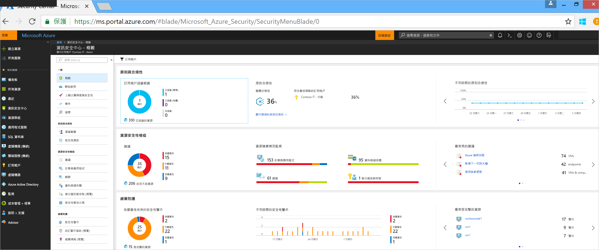
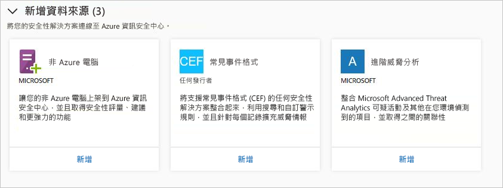
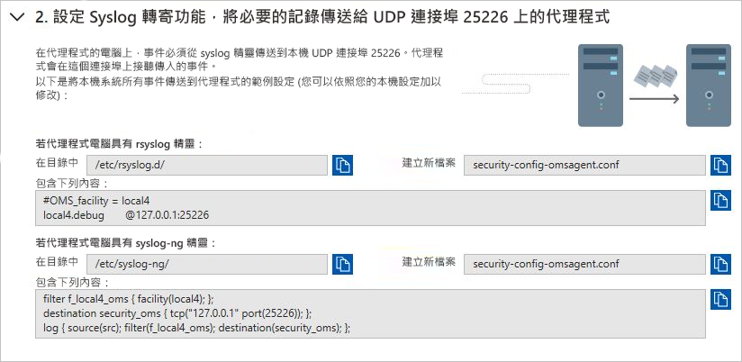
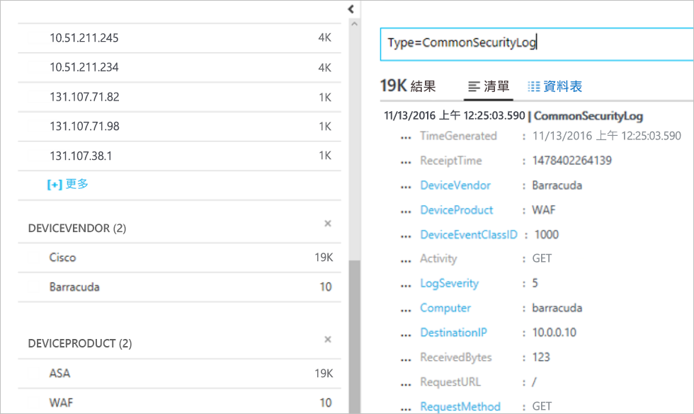

# 在 Azure 資訊安全中心整合安全性解決方案
這份文件可協助您管理已連線到 Azure 資訊安全中心的安全性解決方案，並且新增新的項目。

## 整合式 Azure 安全性解決方案
資訊安全中心可以使得在 Azure 中啟用整合式安全性解決方案變得簡單。 優點包括：

- **簡化部署**：資訊安全中心提供整合式合作夥伴解決方案的精簡佈建。 針對像是反惡意程式碼軟體和弱點評量的解決方案，資訊安全中心可以在您的虛擬機器上佈建所需的代理程式，針對防火牆應用裝置，資訊安全中心可以處理大部分所需的網路設定。
- **整合偵測**：來自夥伴解決方案的安全性事件會自動收集、彙總以及顯示為資訊安全中心警示和事件的一部分。 這些事件也會與來自其他來源的偵測整合，以提供進階的威脅偵測功能。
- **統一的健全狀況監視與管理**：客戶可使用整合式的健全狀況事件，一眼監視所有夥伴解決方案。 提供基本管理功能，而且可以讓您輕鬆使用夥伴解決方案存取進階設定。

目前整合式安全性解決方案包括：

- Web 應用程式防火牆 ([Barracuda](https://www.barracuda.com/products/webapplicationfirewall)、[F5](https://support.f5.com/kb/en-us/products/big-ip_asm/manuals/product/bigip-ve-web-application-firewall-microsoft-azure-12-0-0.html)、[Imperva](https://www.imperva.com/Products/WebApplicationFirewall-WAF)、[Fortinet](https://www.fortinet.com/products.html)，以及 [Azure 應用程式閘道](https://azure.microsoft.com/blog/azure-web-application-firewall-waf-generally-available/))
- 新一代防火牆 ([Check Point](https://www.checkpoint.com/products/vsec-microsoft-azure/)、[Barracuda](https://campus.barracuda.com/product/nextgenfirewallf/article/NGF/AzureDeployment/)、[Fortinet](http://docs.fortinet.com/d/fortigate-fortios-handbook-the-complete-guide-to-fortios-5.2)、[Cisco](http://www.cisco.com/c/en/us/td/docs/security/firepower/quick_start/azure/ftdv-azure-qsg.html) 和 [Palo Alto Networks](https://www.paloaltonetworks.com/products))
- 弱點評量 ([Qualys](https://www.qualys.com/public-clouds/microsoft-azure/) 和 [Rapid7](https://www.rapid7.com/products/insightvm/))

> [!NOTE]
> 資訊安全中心不會在合作夥伴虛擬設備上安裝 Microsoft Monitoring Agent，因為大部分的安全防護廠商都禁止在其設備上執行的外部代理程式。
>
>

## 安全性解決方案如何整合
從資訊安全中心部署的 Azure 安全性解決方案會自動連線。 您也可以連線其他安全性資料來源，包括：

- Azure AD Identity Protection
- 在內部部署或其他雲端中執行的電腦
- 支援常見事件格式 (CEF) 的安全性解決方案
- Microsoft Advanced Threat Analytics

## 管理整合式 Azure 安全性解決方案和其他資料來源

1. 登入 [Azure 入口網站](https://azure.microsoft.com/features/azure-portal/)。

2. 在 [Microsoft Azure] 功能表中，選取 [資訊安全中心]。 [資訊安全中心 - 概觀] 隨即開啟。

3. 在 [資訊安全中心] 功能表下，選取 [安全性解決方案]。

  

在 [安全性解決方案] 之下，您可以檢視整合式 Azure 安全性解決方案的健康情況相關資訊，並且執行基本管理工作。 您也可以連線其他類型的安全性資料來源，例如常見事件格式 (CEF) 的 Azure Active Directory Identity Protection 警示和防火牆記錄。

### 連線的解決方案

[連線的解決方案] 區段包含目前連線到資訊安全中心的安全性解決方案，和每個解決方案健康情況狀態的的資訊。  

合作夥伴解決方案的狀態可以是︰

* 狀況良好 (綠色) - 沒有任何健康問題。
* 狀況不良 (紅色) - 有需要立即注意的健康狀態問題。
* 健康情況問題 (橘色) - 解決方案已停止報告其健康情況。
* 未報告 (灰色) - 解決方案尚未報告任何狀態，如果解決方案最近連線且仍在部署中，或者沒有健康情況資料可用，則可能未報告解決方案的狀態。

> [!NOTE]
> 如果健康情況狀態資料無法使用，資訊安全中心就會顯示最後收到之事件的日期和時間，以指出解決方案是否進行報告。 如果沒有健康情況資料可用，且過去 14 天內未收到任何警示，則資訊安全中心會表示解決方案狀況不良或未報告。
>
>

2. 選取 [檢視] 以取得其他資訊和選項，包括：

  - **解決方案主控台**。 開啟這個解決方案的管理體驗。
  - **連結 VM**。 開啟 [連結應用程式] 刀鋒視窗。 您可以在這裡將資源連接到合作夥伴解決方案。
  - **刪除解決方案**。
  - **設定**。

   

### 探索到的解決方案

資訊安全中心會自動探索在 Azure 中執行但未連線到資訊安全中心的安全性解決方案，並且在 [搜索到的解決方案] 區段中顯示解決方案。 這包括 Azure 解決方案，例如 [Azure AD Identity Protection](https://docs.microsoft.com/azure/active-directory/active-directory-identityprotection)，以及在合作夥伴解決方案。

> [!NOTE]
> 已探索解決方案功能的訂用帳戶層級需要資訊安全中心的標準層。 若要深入了解資訊安全中心的定價層，請參閱[價格](security-center-pricing.md)。
>
>

選取解決方案下方的 [連線] 來與資訊安全中心整合，並可收到安全性警示通知。

資訊安全中心也會探索訂用帳戶中能夠轉寄通用事件格式 (CEF) 記錄的已部署解決方案。 了解如何[將安全性解決方案連線](quick-security-solutions.md) 到資訊安全中心，而該解決方案會使用 CEF 記錄。

### 新增資料來源

[新增資料來源] 區段包含可以連線的其他可用資料來源。 如需從這些來源新增資料的指示，請按一下 [新增]。

### 連線外部解決方案

除了從電腦收集安全性資料，您還可以整合來自各種其他安全性解決方案的安全性資料，包括支援常見事件格式 (CEF) 的任何安全性解決方案。 CEF 是一種以 Syslog 訊息為基礎的業界標準格式，許多安全性廠商使用此格式來讓事件可在不同平台之間整合。

本快速入門示範如何：
- 使用 CEF 記錄將安全性解決方案連線到資訊安全中心
- 驗證與安全性解決方案的連線

#### 必要條件
若要開始使用資訊安全中心，您必須有 Microsoft Azure 訂用帳戶。 如果您沒有訂用帳戶，可以註冊[免費帳戶](https://azure.microsoft.com/free/)。

請確認您是在資訊安全中心的標準定價層，才可按照本快速入門逐步進行。 您可以免費試用資訊安全中心標準層。 [將 Azure 訂用帳戶上架到資訊安全中心標準定價層](security-center-get-started.md)快速入門會為您逐步解說如何升級至「標準」定價層。 若要深入了解，請參閱[價格頁面](https://azure.microsoft.com/pricing/details/security-center/)。

您也需要 [Linux 機器](https://docs.microsoft.com/azure/log-analytics/log-analytics-agent-linux)，其中包含已連線到資訊安全中心的 Syslog 服務。

#### 使用 CEF 連線解決方案

1. 登入 [Azure 入口網站](https://azure.microsoft.com/features/azure-portal/)。
2. 在 [Microsoft Azure] 功能表中，選取 [資訊安全中心]。 [資訊安全中心 - 概觀] 隨即開啟。

      

3. 在 [資訊安全中心] 主功能表下，選取 [安全性解決方案]。
4. 在 [安全性解決方案] 頁面的 [新增資料來源 (3)] 之下，按一下 [常見事件格式] 之下的 [新增]。

    

5. 在 [常見事件格式記錄] 頁面中，展開第二個步驟 (**設定 Syslog 轉寄功能，將必要的記錄傳送給 UDP 連接埠 25226 上的代理程式**)，並且在您的 Linux 電腦中遵循下列指示：

    

6. 展開第三個步驟 (**將代理程式設定檔置於代理程式電腦上**)，並且在您的 Linux 電腦中遵循下列指示：

    

7. 展開第四個步驟 (**重新啟動 Syslog 精靈與代理程式**)，並且在您的 Linux 電腦中遵循下列指示：

    

#### 驗證連線

您必須等到 syslog 開始向資訊安全中心回報，才能繼續進行下列步驟。 這可能需要一些時間，而且會根據環境大小而有所不同。

1.  在 [資訊安全中心] 儀表板的左面板中，按一下 [搜尋]。
2.  選取 Syslog (Linux 電腦) 所連線的工作區。
3.  輸入 CommonSecurityLog，然後按一下 [搜尋] 按鈕。

下列範例會顯示這些步驟的結果：

#### 清除資源
此集合中的其他快速入門和教學課程會以本快速入門為基礎。 如果您打算繼續處理後續的快速入門和教學課程，請繼續執行標準層，並保持將自動佈建維持為啟用狀態。 如果您不打算繼續，或是要返回免費層：

1. 返回 [資訊安全中心] 主功能表，並選取 [安全性原則]。
2. 選取您需要返回免費層的訂用帳戶或原則。 [安全性原則] 隨即開啟。
3. 在 [原則元件] 下，選取 [定價層]。
4. 選取 [免費] 以將訂用帳戶從標準層變更為免費層。
5. 選取 [ **儲存**]。

如果您需要停用自動佈建：

1. 返回 [資訊安全中心] 主功能表，並選取 [安全性原則]。
2. 選取您想要停用自動佈建的訂用帳戶。
3. 在 [安全性原則 - 資料收集] 下，選取 [上架] 底下的 [關閉] 以停用自動佈建。
4. 選取 [ **儲存**]。

>[!NOTE]
> 停用自動佈建不會從已佈建代理程式的 Azure VM 移除 Microsoft Monitoring Agent。 停用自動佈建會限制對資源的安全性監視。
>

## 將資料匯出至 SIEM

系統會將由 Azure 資訊安全中心所產生的已處理事件發行到 Azure [活動記錄](../monitoring-and-diagnostics/monitoring-overview-activity-logs.md)，此為可透過 Azure 監視器取得的記錄類型之一。 Azure 監視器提供合併的管線，將您的所有監視資料路由傳送至 SIEM 工具。 完成此動作的方式是將該資料串流到事件中樞，然後將它提取至合作夥伴工具。

這個管道會使用 [Azure 監視單一管線](../azure-monitor/platform/stream-monitoring-data-event-hubs.md)，從您的 Azure 環境存取監視資料。 這可讓您輕鬆地設定 SIEM 和監視工具來取用資料。

以下幾節說明如何設定資料以串流到事件中樞。 這些步驟假設您已經在 Azure 訂用帳戶中設定 Azure 資訊安全中心。

高階概述

### 公開至 SIEM 的 Azure 安全性資料為何？

在此版本中，我們會公開[安全性警示](../security-center/security-center-managing-and-responding-alerts.md)。 在即將發行版本中，我們將使用安全性建議來擴充此資料集。

### 如何設定管線

#### 建立事件中心

開始之前，您必須[建立事件中樞命名空間](../event-hubs/event-hubs-create.md)。 此命名空間和事件中樞是所有監視資料的目的地。

#### 將 Azure 活動記錄檔串流至事件中樞

請參閱[將活動記錄串流至事件中樞](../azure-monitor/platform/activity-logs-stream-event-hubs.md)一文

#### 安裝合作夥伴 SIEM 連接器 

使用 Azure 監視器將監視資料路由傳送到事件中樞，可讓您輕鬆地與合作夥伴 SIEM 和監視工具整合。

請參閱下列連結，以查看[支援的 SIEM](../azure-monitor/platform/stream-monitoring-data-event-hubs.md#what-can-i-do-with-the-monitoring-data-being-sent-to-my-event-hub) 清單

### 查詢資料範例 

以下是幾個可讓您用來提取警示資料的 Splunk 查詢：

| **查詢描述** | **查詢** |
|----|----|
| 所有警示| index=main Microsoft.Security/locations/alerts|
| 依作業名稱對作業計數進行總結| index=main sourcetype="amal:security" \| table operationName \| stats count by operationName|
| 取得警示資訊：時間、名稱、狀態、識別碼和訂用帳戶 | index=main Microsoft.Security/locations/alerts \| table \_time, properties.eventName, State, properties.operationId, am_subscriptionId |

## 後續步驟

在本文中，您已了解如何在資訊安全中心中整合夥伴解決方案。 如要深入了解資訊安全中心，請參閱下列文章：

* [將 Microsoft Advanced Threat Analytics 連線至 Azure 資訊安全中心](security-center-ata-integration.md)
* [將 Azure Active Directory Identity Protection 連線至 Azure 資訊安全中心](security-center-aadip-integration.md)
* [資訊安全中心的安全性健康情況監視](security-center-monitoring.md)。 了解如何監視 Azure 資源的健全狀況。
* [使用資訊安全中心監視合作夥伴解決方案](security-center-partner-solutions.md)。 了解如何監視合作夥伴解決方案的健全狀態。
* [Azure 資訊安全中心常見問題](security-center-faq.md)。 取得有關使用資訊安全中心常見問題的答案。
* [Azure 安全性部落格](https://blogs.msdn.com/b/azuresecurity/)。 尋找有關 Azure 安全性與相容性的部落格文章。
