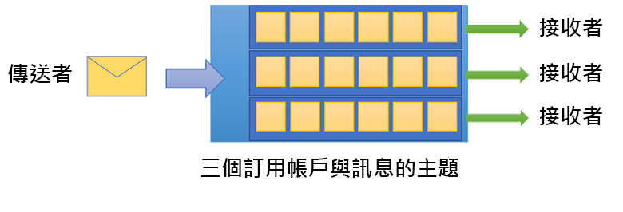

# 什麼是 Azure 服務匯流排？

Microsoft Azure 服務匯流排是完全受控的企業[整合](http://azure.com/integration)訊息代理程式。 服務匯流排最常用來讓應用程式和服務彼此分離，對於非同步的資料和狀態傳輸來說，是可靠且安全的平台。 資料會使用「訊息」在不同的應用程式和服務之間傳輸。 訊息使用的是二進位格式，可包含 JSON、XML 或純文字。 

一些常見的傳訊案例如下：

* 傳訊：傳輸業務資料，例如銷售額、採購訂單、日誌或庫存進出狀況。
* 將應用程式分離：提升應用程式和服務的可靠性與延展性 (用戶端和服務不需要同時在線上)。
* 主題和訂用帳戶：讓「發行者」和「訂閱者」之間有 1:n 關聯性。
* 訊息工作階段：實作需要訊息排序或訊息延遲的工作流程。

## 命名空間

命名空間是所有傳訊元件的範圍容器。 多個佇列和主題可以位於單一命名空間，而且命名空間通常會做為應用程式容器。

## 佇列

「佇列」會收發訊息。 在接收端應用程式有空接收並處理訊息之前，佇列可讓您先儲存訊息。

佇列中的訊息會進行排序並加上抵達時間戳記。 訊息一經接受就會安全地保存在備援儲存體中。 訊息會採用「提取」 ** 模式來傳遞，此模式會在收到要求時傳遞訊息。

## 主題

您也可以使用「主題」來收送訊息。 佇列通常用於點對點通訊，主題則適用於發佈/訂閱案例。

主題可以有多個獨立的訂用帳戶。 主題的訂閱者會收到該主題所接收每則訊息的複本。 訂用帳戶是具名實體，會以永久存在的方式建立，但您可以選擇讓其過期或自動刪除。

在某些案例中，您或許不會想要讓個別訂用帳戶接收某個主題所收到的所有訊息。 如果是這樣，您可以使用[規則和篩選](topic-filters.md)來定義各種條件，以觸發選擇性[動作](topic-filters.md#actions)、篩選指定訊息，以及設定或修改訊息屬性。

## 進階功能

服務匯流排也有進階功能可讓您解決更複雜的傳訊問題。 下列幾節會說明這些重要功能：

### 訊息工作階段

若要在服務匯流排中實現先進先出 (FIFO) 保證，請使用工作階段。 [訊息工作階段](message-sessions.md)能夠聯合和依序處理未繫結的相關訊息序列。 

### 自動轉寄

[自動轉寄](service-bus-auto-forwarding.md)功能可讓您將佇列或訂用帳戶鏈結至另一個屬於相同命名空間的佇列或主題。 啟用自動轉寄後，服務匯流排會自動移除放在第一個佇列或訂用帳戶 (來源) 中的訊息，然後將它們放入第二個佇列或主題 (目的地) 中。

### 無效信件處理

服務匯流排支援[無效信件佇列](service-bus-dead-letter-queues.md) (DLQ)，以便保留無法傳遞至任何收件者的訊息，或是無法加以處理的訊息。 您隨後可以從 DLQ 移除訊息並加以檢查。

### 排程傳遞

您可以將訊息提交到佇列或主題，以利[延遲處理](message-sequencing.md#scheduled-messages)。例如，排定作業讓系統在某個時間處理。

### 訊息延遲

當佇列或訂用帳戶用戶端接收到其願意處理的訊息，但目前因為應用程式內部的特殊情況而無法進行處理時，該實體可以選擇在稍後某個時點才[延遲擷取訊息](message-deferral.md)。 訊息會保留於佇列或訂用帳戶中，但會將它擱置於一旁。

### 批次處理

[用戶端批次處理](service-bus-performance-improvements.md#client-side-batching)可讓佇列或主題用戶端將訊息的傳送延遲一段時間。 如果用戶端在此期間傳送其他訊息，它將以單一批次傳輸訊息。 

### 交易

[交易](service-bus-transactions.md)會將兩個以上的作業一起分組到執行範圍。 服務匯流排支援交易範圍內單一傳訊實體 (佇列、主題、訂用帳戶) 的分組作業。

### 篩選和動作

訂閱者可以定義他們想要接收某個主題的哪些訊息。 這些訊息會以一或多個[具名訂用帳戶規則](topic-filters.md)的形式來指定。 對於每個比對規則條件，訂用帳戶會產生一份能針對每條比對規則加上不同註解的訊息。

### 閒置時自動刪除

[閒置時自動刪除](/dotnet/api/microsoft.servicebus.messaging.queuedescription.autodeleteonidle)可讓您指定閒置間隔，此時間過後就自動刪除佇列。 最小持續期間為 5 分鐘。

### 重複偵測

如果發生錯誤而導致用戶端對於傳送作業結果有疑慮，[重複偵測](duplicate-detection.md)能透過讓寄件者重新傳送同樣的訊息，將這些情況下的疑慮排除，而佇列或主題則會捨棄任何重複的複本。

### SAS、RBAC 和 Azure 資源的受控識別

服務匯流排支援安全性通訊協定，例如[共用存取簽章](service-bus-sas.md) (SAS)、[角色型存取控制](service-bus-role-based-access-control.md) (RBAC) 和[Azure 資源的受控識別](service-bus-managed-service-identity.md)。

### 異地災害復原

當 Azure 區域或資料中心遇到停機時，[異地災害復原](service-bus-geo-dr.md)能繼續在不同的區域或資料中心進行資料處理。

### 安全性

服務匯流排支援標準的 [AMQP 1.0](service-bus-amqp-overview.md) 和 [HTTP/REST](/rest/api/servicebus/) 通訊協定。

## 用戶端程式庫

服務匯流排支援 [.NET](https://github.com/Azure/azure-service-bus-dotnet/tree/master)、[Java](https://github.com/Azure/azure-service-bus-java/tree/master)、[JMS](https://github.com/Azure/azure-service-bus/tree/master/samples/Java/qpid-jms-client) 用戶端程式庫。

## 整合

服務匯流排可與下列 Azure 服務完全整合︰

- [Event Grid](https://azure.microsoft.com/services/event-grid/) 
- [Logic Apps](https://azure.microsoft.com/services/logic-apps/) 
- [函式](https://azure.microsoft.com/services/functions/) 
- [Dynamics 365](https://dynamics.microsoft.com)
- [串流分析](https://azure.microsoft.com/services/stream-analytics/)
 
## 後續步驟

若要開始使用服務匯流排傳訊，請參閱下列文章：

* [比較 Azure 傳訊服務](../event-grid/compare-messaging-services.md?toc=%2fazure%2fservice-bus-messaging%2ftoc.json&bc=%2fazure%2fservice-bus-messaging%2fbreadcrumb%2ftoc.json)
* 深入了解 Azure 服務匯流排的[標準和進階](https://azure.microsoft.com/pricing/details/service-bus/)層及其定價
* [Azure 服務匯流排進階層的效能和延遲](https://blogs.msdn.microsoft.com/servicebus/2016/07/18/premium-messaging-how-fast-is-it/)
* 在 [.NET](service-bus-quickstart-powershell.md)、[Java](service-bus-quickstart-powershell.md) 或 [JMS](service-bus-quickstart-powershell.md) 中嘗試快速入門
