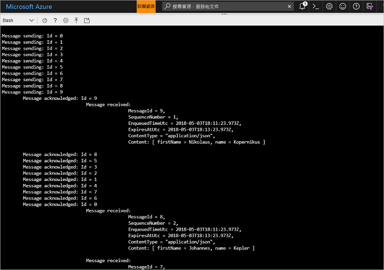

# <a name="quickstart-use-the-azure-cli-to-create-a-service-bus-queue"></a>快速入門：使用 Azure CLI 建立服務匯流排佇列

Microsoft Azure 服務匯流排是一項企業整合訊息代理程式，可提供安全的傳訊和可靠性。 典型的服務匯流排案例通常會牽涉到將兩個或更多應用程式、服務或程序彼此分開處理 (應用程式不需要同時上線)、傳輸狀態或資料變更，以及在應用程式之間傳送訊息。 

例如，零售公司可能會將其銷售點資料傳送至後端辦公室或區域配送中心，以進行補貨和庫存更新。 在此案例中，用戶端應用程式會對服務匯流排佇列傳送及接收訊息：


本快速入門說明如何使用 Azure CLI 和服務匯流排 Java 程式庫，透過服務匯流排傳送和接收訊息。 最後，如果您想要取得更多技術性的細節，您可以針對範例程式碼的關鍵元素[閱讀說明](#understand-the-sample-code)。

如果您沒有 Azure 訂用帳戶，您可以在開始前建立[免費帳戶][]。

[!INCLUDE [cloud-shell-try-it.md](../../includes/cloud-shell-try-it.md)]

## <a name="log-in-to-azure"></a>登入 Azure

在 Azure 入口網站右上角的功能表中按一下 [Cloud Shell] 按鈕，然後從 [選取環境] 下拉式清單中選取 [Bash]。 

## <a name="use-the-azure-cli-to-create-resources"></a>使用 Azure CLI 來建立資源

在 Cloud Shell 中，從 Bash 提示字元發出下列命令，以佈建服務匯流排資源。 請務必將所有預留位置取代為適當的值。

```azurecli-interactive
# Create a resource group
az group create --name myResourceGroup --location eastus

# Create a Service Bus messaging namespace with a unique name
namespaceName=myNameSpace$RANDOM
az servicebus namespace create \
   --resource-group myResourceGroup \
   --name $namespaceName \
   --location eastus

# Create a Service Bus queue
az servicebus queue create --resource-group myResourceGroup \
   --namespace-name $namespaceName \
   --name myQueue

# Get the connection string for the namespace
connectionString=$(az servicebus namespace authorization-rule keys list \
   --resource-group myResourceGroup \
   --namespace-name $namespaceName \
   --name RootManageSharedAccessKey \
   --query primaryConnectionString --output tsv)
```

在最後一個命令執行之後，請將連接字串與您選取的佇列名稱複製並貼到暫存位置，例如 [記事本]。 您在下一個步驟將會用到這些資料。

## <a name="send-and-receive-messages"></a>傳送及接收訊息

在您建立命名空間和佇列，且您已擁有必要的認證之後，您即可傳送和接收訊息。 您可以在[此 GitHub 範例資料夾](https://github.com/Azure/azure-service-bus/tree/master/samples/Java/azure-servicebus/TopicFilters)中查看程式碼。

1. 確定 Cloud Shell 已開啟並顯示 Bash 提示字元。

2. 發出下列命令，以複製[服務匯流排 GitHub 存放庫](https://github.com/Azure/azure-service-bus/)︰

   ```bash
   git clone https://github.com/Azure/azure-service-bus.git
   ```

2. 使用正斜線作為路徑分隔符號，將您目前的目錄變更為範例資料夾：

   ```bash
   cd azure-service-bus/samples/Java/quickstarts-and-tutorials/quickstart-java 
   ```

3. 發出下列命令以建置應用程式：
   
   ```bash
   mvn clean package -DskipTests
   ```

4. 若要執行程式，請發出下列命令。 只要您未重新啟動 Bash 殼層，就會自動取代包含連接字串值的變數：

   ```bash
   java -jar ./target/samples.quickstart-1.0.0-jar-with-dependencies.jar -c $connectionString -q myQueue
   ```

6. 觀察 10 個傳送至佇列的訊息。 請注意，訊息順序並不固定，但您可以看到在傳送後受到認可並接收的訊息，以及承載資料：

   

## <a name="clean-up-resources"></a>清除資源

執行下列命令以移除資源群組、命名空間和所有相關資源：

```azurecli-interactive
az group delete --resource-group myResourceGroup
```

## <a name="understand-the-sample-code"></a>了解範例程式碼

本節將詳細說明範例程式碼的重要部分。 您可以在[這裡](https://github.com/Azure/azure-service-bus/tree/master/samples/Java/azure-servicebus/TopicFilters)瀏覽位於 GitHub 存放庫中的程式碼。

### <a name="get-connection-string-and-queue"></a>取得連接字串和佇列

首先，程式碼會宣告兩個字串變數，以傳至程式作為命令列上的引數：

```java
String ConnectionString = null;
String QueueName = null;
```

這些值會透過參數新增，並配置在 `runApp()` 方法中：

```java
public static void main(String[] args) {
    SendAndReceiveMessages app = new SendAndReceiveMessages();
    try {
        app.runApp(args);
        app.run();
    } catch (Exception e) {
        System.out.printf("%s", e.toString());
    }
    System.exit(0);
}

public void runApp(String[] args) {
    try {
        // parse connection string from command line             
        Options options = new Options();
        options.addOption(new Option("c", true, "Connection string"));
        options.addOption(new Option("q", true, "Queue Name"));
        CommandLineParser clp = new DefaultParser();
        CommandLine cl = clp.parse(options, args);
        if (cl.getOptionValue("c") != null && cl.getOptionValue("q") != null) {
            ConnectionString = cl.getOptionValue("c");
            QueueName =  cl.getOptionValue("q");
        }
        else
        {
            HelpFormatter formatter = new HelpFormatter();
            formatter.printHelp("run jar with", "", options, "", true);
        }

    } catch (Exception e) {
        System.out.printf("%s", e.toString());
    }
}
```

### <a name="create-queue-clients-to-send-and-receive"></a>建立用於傳送和接收的佇列用戶端

若要傳送和接收訊息，`run()` 方法會建立從連接字串和佇列名稱建構的佇列用戶端執行個體。 此程式碼會建立兩個佇列用戶端，分別用於傳送和接收：

```java
public void run() throws Exception {
// Create a QueueClient instance for receiving using the connection string builder
// We set the receive mode to "PeekLock", meaning the message is delivered
// under a lock and must be acknowledged ("completed") to be removed from the queue
QueueClient receiveClient = new QueueClient(new ConnectionStringBuilder(ConnectionString, QueueName), ReceiveMode.PEEKLOCK);
this.registerReceiver(receiveClient);

// Create a QueueClient instance for sending and then asynchronously send messages.
QueueClient sendClient = new QueueClient(new ConnectionStringBuilder(ConnectionString, QueueName), ReceiveMode.PEEKLOCK);
```

`run()` 方法也會啟動非同步訊息傳送作業，並在傳送作業完成後關閉傳送者：

```java
this.sendMessagesAsync(sendClient).thenRunAsync(() -> sendClient.closeAsync());
``` 

### <a name="construct-and-send-messages"></a>建構和傳送訊息

`sendMessagesAsync()` 方法會建立以 10 個為一組的訊息，並使用佇列用戶端以非同步方式加以傳送：

```java
CompletableFuture<Void> sendMessagesAsync(QueueClient sendClient) {
List<HashMap<String, String>> data =
        GSON.fromJson(
                "[" +
                        "{'name' = 'Einstein', 'firstName' = 'Albert'}," +
                        "{'name' = 'Heisenberg', 'firstName' = 'Werner'}," +
                        "{'name' = 'Curie', 'firstName' = 'Marie'}," +
                        "{'name' = 'Hawking', 'firstName' = 'Steven'}," +
                        "{'name' = 'Newton', 'firstName' = 'Isaac'}," +
                        "{'name' = 'Bohr', 'firstName' = 'Niels'}," +
                        "{'name' = 'Faraday', 'firstName' = 'Michael'}," +
                        "{'name' = 'Galilei', 'firstName' = 'Galileo'}," +
                        "{'name' = 'Kepler', 'firstName' = 'Johannes'}," +
                        "{'name' = 'Kopernikus', 'firstName' = 'Nikolaus'}" +
                        "]",
                new TypeToken<List<HashMap<String, String>>>() {}.getType());

List<CompletableFuture> tasks = new ArrayList<>();
for (int i = 0; i < data.size(); i++) {
    final String messageId = Integer.toString(i);
    Message message = new Message(GSON.toJson(data.get(i), Map.class).getBytes(UTF_8));
    message.setContentType("application/json");
    message.setLabel("Scientist");
    message.setMessageId(messageId);
    message.setTimeToLive(Duration.ofMinutes(2));
    System.out.printf("\nMessage sending: Id = %s", message.getMessageId());
    tasks.add(
            sendClient.sendAsync(message).thenRunAsync(() -> {
                System.out.printf("\n\tMessage acknowledged: Id = %s", message.getMessageId());
            }));
}
return CompletableFuture.allOf(tasks.toArray(new CompletableFuture<?>[tasks.size()]));
```

### <a name="receive-messages"></a>接收訊息

`registerReceiver()` 方法會註冊 `RegisterMessageHandler` 回呼，並設定一些訊息處理常式選項：

```java
void registerReceiver(QueueClient queueClient) throws Exception {
    // register the RegisterMessageHandler callback
    queueClient.registerMessageHandler(new IMessageHandler() {
                           // callback invoked when the message handler loop has obtained a message
                           public CompletableFuture<Void> onMessageAsync(IMessage message) {
                               // receives message is passed to callback
                               if (message.getLabel() != null &&
                                       message.getContentType() != null &&
                                       message.getLabel().contentEquals("Scientist") &&
                                       message.getContentType().contentEquals("application/json")) {
                                    byte[] body = message.getBody();
                                   Map scientist = GSON.fromJson(new String(body, UTF_8), Map.class);

                                   System.out.printf(
                                           "\n\t\t\t\tMessage received: \n\t\t\t\t\t\tMessageId = %s, \n\t\t\t\t\t\tSequenceNumber = %s, \n\t\t\t\t\t\tEnqueuedTimeUtc = %s," +
                                                   "\n\t\t\t\t\t\tExpiresAtUtc = %s, \n\t\t\t\t\t\tContentType = \"%s\",  \n\t\t\t\t\t\tContent: [ firstName = %s, name = %s ]\n",
                                           message.getMessageId(),
                                           message.getSequenceNumber(),
                                           message.getEnqueuedTimeUtc(),
                                           message.getExpiresAtUtc(),
                                           message.getContentType(),
                                           scientist != null ? scientist.get("firstName") : "",
                                           scientist != null ? scientist.get("name") : "");
                               }
                               return CompletableFuture.completedFuture(null);
                           }

                           // callback invoked when the message handler has an exception to report
                           public void notifyException(Throwable throwable, ExceptionPhase exceptionPhase) {
                               System.out.printf(exceptionPhase + "-" + throwable.getMessage());
                           }
                       },
    // 1 concurrent call, messages are auto-completed, auto-renew duration
    new MessageHandlerOptions(1, true, Duration.ofMinutes(1)));

}
```

## <a name="next-steps"></a>後續步驟

在本文中，您已建立從佇列傳送和接收訊息所需的服務匯流排命名空間和其他資源。 若要深入了解如何撰寫用來傳送和接收訊息的程式碼，請繼續進行服務匯流排的下列教學課程：

> [!div class="nextstepaction"]
> [使用 Azure CLI 和 Java 更新庫存](./service-bus-tutorial-topics-subscriptions-cli.md)

[免費帳戶]: https://azure.microsoft.com/free/?ref=microsoft.com&utm_source=microsoft.com&utm_medium=docs&utm_campaign=visualstudio
[fully qualified domain name]: https://wikipedia.org/wiki/Fully_qualified_domain_name
[Install the Azure CLI]: /cli/azure/install-azure-cli
[az group create]: /cli/azure/group#az_group_create
