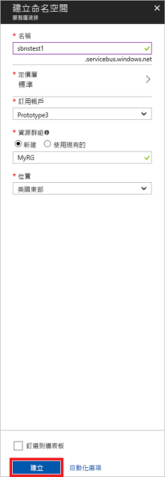

# <a name="quickstart-send-and-receive-messages-using-the-azure-portal-and-net"></a>快速入門：使用 Azure 入口網站和 .NET 傳送和接收訊息

Microsoft Azure 服務匯流排是一項企業整合訊息代理程式，可提供安全的傳訊和絕對的可靠性。 典型的服務匯流排案例通常會牽涉到將兩個或更多應用程式、服務或程序彼此分開處理，以及傳輸狀態或資料變更。 此類案例可能牽涉到在另一個應用程式或服務中排程多個批次作業，或觸發訂單履行。 例如，零售公司可能會將其銷售點資料傳送至後端辦公室或區域配送中心，以進行補貨和庫存更新。 在此案例中，用戶端應用程式會對服務匯流排佇列傳送及接收訊息。  


本快速入門說明如何使用 [Azure 入口網站][Azure portal]建立傳訊命名空間和該命名空間內的佇列，以對服務匯流排佇列傳送和接收訊息，以及如何取得該命名空間上的授權認證。 程序接著會說明如何使用 [.NET Standard 程式庫](https://www.nuget.org/packages/Microsoft.Azure.ServiceBus)從這個佇列傳送和接收訊息。

如果您沒有 Azure 訂用帳戶，您可以在開始前建立[免費帳戶][]。

## <a name="prerequisites"></a>先決條件

若要完成本教學課程，請確定您已安裝︰

- [Visual Studio 2017 Update 3 (版本 15.3, 26730.01)](http://www.visualstudio.com/vs) 或更新版本。
- [.NET Core SDK](https://www.microsoft.com/net/download/windows)，2.0 版或更新版本。

## <a name="log-on-to-the-azure-portal"></a>登入 Azure 入口網站

首先，使用您的 Azure 訂用帳戶移至 [Azure 入口網站][Azure portal]並登入。 第一個步驟是建立**傳訊**類型的服務匯流排命名空間。

## <a name="create-a-service-bus-namespace"></a>建立服務匯流排命名空間

服務匯流排傳訊命名空間提供唯一的範圍容器 (依其[完整網域名稱][]來參考)，您可以在其中建立一或多個佇列、主題和訂用帳戶。 下列範例會在新的或現有的[資源群組](/azure/azure-resource-manager/resource-group-portal)中建立服務匯流排傳訊命名空間：

1. 在入口網站的左方瀏覽窗格中，依序按一下 [+ 建立資源]、[企業整合] 及 [服務匯流排]。
2. 在 [建立命名空間]  對話方塊中，輸入命名空間名稱。 系統會立即檢查此名稱是否可用。
3. 確定命名空間名稱可用之後，請選擇定價層 ([標準] 或 [進階])。
4. 在 [訂用帳戶]  欄位中，選擇要在其中建立命名空間的 Azure 訂用帳戶。
5. 在 [資源群組]  欄位中，選擇將存留命名空間的現有資源群組，或是建立新的資源群組。      
6. 在 [位置] 中，選擇應裝載您命名空間的國家或地區。
7. 按一下頁面底部的 [新增] 。 此時系統會建立並啟用命名空間。 系統為帳戶提供資源時，您可能需要等幾分鐘。



### <a name="obtain-the-management-credentials"></a>取得管理認證

建立新命名空間會自動產生初始共用存取簽章 (SAS) 規則，其利用相關聯的主要和次要金鑰組，分別授與命名空間的所有層面的完全控制權。 若要複製初始規則，請遵循下列步驟： 

1.  按一下 [所有資源]，然後按一下新建立的命名空間名稱。
2. 在命名空間視窗中，按一下 [共用存取原則]。
3. 在 [共用存取原則] 畫面中，按一下 **RootManageSharedAccessKey**。
4. 在 [原則: RootManageSharedAccessKey] 視窗中，按一下 [主要連接字串] 旁邊的 [複製] 按鈕，將連接字串複製到剪貼簿以供後續使用。 將此值貼到記事本或一些其他暫存位置。 

    ![connection-string][connection-string]
5. 重複前一個步驟，複製 [主要金鑰] 的值並貼到暫存位置以供後續使用。

## <a name="create-a-queue"></a>建立佇列

若要建立服務匯流排佇列，請指定您要用來建立主題的命名空間。 下列範例說明如何在入口網站上建立佇列：

1. 在入口網站的左方瀏覽窗格中，按一下 [服務匯流排] \(如果您未看見 [服務匯流排]，請按一下 [更多服務])。
2. 按一下要在其中建立佇列的命名空間。
3. 在命名空間視窗中，按一下 [佇列]，然後在 [佇列] 視窗中，按一下 [+ 佇列]。
4. 輸入佇列 [名稱] 並且讓其他值保留其預設值。
5. 在視窗底部按一下 [建立]。
6. 記下佇列名稱。

## <a name="send-and-receive-messages"></a>傳送及接收訊息

佈建命名空間和佇列，且您已擁有必要的認證之後，您即可傳送和接收訊息。 您可以在[此 GitHub 範例資料夾](https://github.com/Azure/azure-service-bus/tree/master/samples/Java/quickstarts-and-tutorials/quickstart-jms)中查看程式碼。

若要執行程式碼，請執行下列動作：

1. 發出下列命令，以複製[服務匯流排 GitHub 存放庫](https://github.com/Azure/azure-service-bus/)︰

   ```shell
   git clone https://github.com/Azure/azure-service-bus.git
   ```

3. 瀏覽至範例資料夾 `azure-service-bus\samples\DotNet\GettingStarted\BasicSendReceiveQuickStart\BasicSendReceiveQuickStart`。

4. 複製您在[取得管理認證](#obtain-the-management-credentials)一節中取得的連接字串和佇列名稱。

5.  在命令提示字元中，輸入下列命令：

   ```shell
   dotnet build
   ```

6.  瀏覽到 `bin\Debug\netcoreapp2.0` 資料夾。

7.  輸入下列命令以執行程式。 請務必將 `myConnectionString` 取代為您先前取得的值，並將 `myQueueName` 取代為您已建立的佇列名稱：

   ```shell
   dotnet BasicSendReceiveQuickStart.dll -ConnectionString "myConnectionString" -QueueName "myQueueName"
   ``` 

8. 觀察 10 個傳送至佇列，和後續接收自佇列的訊息：

   

## <a name="clean-up-resources"></a>清除資源

您可以使用入口網站移除資源群組、命名空間和佇列。

## <a name="understand-the-sample-code"></a>了解範例程式碼

本節將詳細說明範例程式碼的功能。 

### <a name="get-connection-string-and-queue"></a>取得連接字串和佇列

連接字串和佇列名稱會傳至 `Main()` 方法作為命令列引數。 `Main()` 會宣告兩個字串變數來保存這些值：

```csharp
static void Main(string[] args)
{
    string ServiceBusConnectionString = "";
    string QueueName = "";

    for (int i = 0; i < args.Length; i++)
    {
        var p = new Program();
        if (args[i] == "-ConnectionString")
        {
            Console.WriteLine($"ConnectionString: {args[i+1]}");
            ServiceBusConnectionString = args[i + 1]; 
        }
        else if(args[i] == "-QueueName")
        {
            Console.WriteLine($"QueueName: {args[i+1]}");
            QueueName = args[i + 1];
        }                
    }

    if (ServiceBusConnectionString != "" && QueueName != "")
        MainAsync(ServiceBusConnectionString, QueueName).GetAwaiter().GetResult();
    else
    {
        Console.WriteLine("Specify -Connectionstring and -QueueName to execute the example.");
        Console.ReadKey();
    }                            
}
```
 
接著，`Main()` 方法會啟動非同步訊息迴圈 `MainAsync()`。

### <a name="message-loop"></a>訊息迴圈

MainAsync() 方法會使用命令列引數建立佇列用戶端、呼叫名為 `RegisterOnMessageHandlerAndReceiveMessages()` 的接收訊息處理常式，並傳送訊息組：

```csharp
static async Task MainAsync(string ServiceBusConnectionString, string QueueName)
{
    const int numberOfMessages = 10;
    queueClient = new QueueClient(ServiceBusConnectionString, QueueName);

    Console.WriteLine("======================================================");
    Console.WriteLine("Press any key to exit after receiving all the messages.");
    Console.WriteLine("======================================================");

    // Register QueueClient's MessageHandler and receive messages in a loop
    RegisterOnMessageHandlerAndReceiveMessages();

    // Send Messages
    await SendMessagesAsync(numberOfMessages);

    Console.ReadKey();

    await queueClient.CloseAsync();
}
```

`RegisterOnMessageHandlerAndReceiveMessages()` 方法只需設定幾個訊息處理常式選項，然後呼叫佇列用戶端的 `RegisterMessageHandler()` 方法，即可開始接收：

```csharp
static void RegisterOnMessageHandlerAndReceiveMessages()
{
    // Configure the MessageHandler Options in terms of exception handling, number of concurrent messages to deliver etc.
    var messageHandlerOptions = new MessageHandlerOptions(ExceptionReceivedHandler)
    {
        // Maximum number of Concurrent calls to the callback `ProcessMessagesAsync`, set to 1 for simplicity.
        // Set it according to how many messages the application wants to process in parallel.
        MaxConcurrentCalls = 1,

        // Indicates whether MessagePump should automatically complete the messages after returning from User Callback.
        // False below indicates the Complete will be handled by the User Callback as in `ProcessMessagesAsync` below.
        AutoComplete = false
    };

    // Register the function that will process messages
    queueClient.RegisterMessageHandler(ProcessMessagesAsync, messageHandlerOptions);
} 
```

### <a name="send-messages"></a>傳送訊息

訊息建立和傳送作業會在 `SendMessagesAsync()` 方法中執行：

```csharp
static async Task SendMessagesAsync(int numberOfMessagesToSend)
{
    try
    {
        for (var i = 0; i < numberOfMessagesToSend; i++)
        {
            // Create a new message to send to the queue
            string messageBody = $"Message {i}";
            var message = new Message(Encoding.UTF8.GetBytes(messageBody));

            // Write the body of the message to the console
            Console.WriteLine($"Sending message: {messageBody}");

            // Send the message to the queue
            await queueClient.SendAsync(message);
        }
    }
    catch (Exception exception)
    {
        Console.WriteLine($"{DateTime.Now} :: Exception: {exception.Message}");
    }
}
```

### <a name="process-messages"></a>處理訊息

`ProcessMessagesAsync()` 方法會認可、處理以及完成訊息的接收：

```csharp
static async Task ProcessMessagesAsync(Message message, CancellationToken token)
{
    // Process the message
    Console.WriteLine($"Received message: SequenceNumber:{message.SystemProperties.SequenceNumber} Body:{Encoding.UTF8.GetString(message.Body)}");

    // Complete the message so that it is not received again.
    await queueClient.CompleteAsync(message.SystemProperties.LockToken);
}
```

## <a name="next-steps"></a>後續步驟

在本文中，您已建立從佇列傳送和接收訊息所需的服務匯流排命名空間和其他資源。 若要深入了解如何撰寫用來傳送和接收訊息的程式碼，請繼續進行服務匯流排的下列教學課程：

> [!div class="nextstepaction"]
> [使用 Azure 入口網站更新庫存](./service-bus-tutorial-topics-subscriptions-portal.md)


[免費帳戶]: https://azure.microsoft.com/free/?ref=microsoft.com&utm_source=microsoft.com&utm_medium=docs&utm_campaign=visualstudio
[完整網域名稱]: https://wikipedia.org/wiki/Fully_qualified_domain_name
[Azure portal]: https://portal.azure.com/

[connection-string]: ./media/service-bus-quickstart-portal/connection-string.png
[service-bus-flow]: ./media/service-bus-quickstart-portal/service-bus-flow.png
