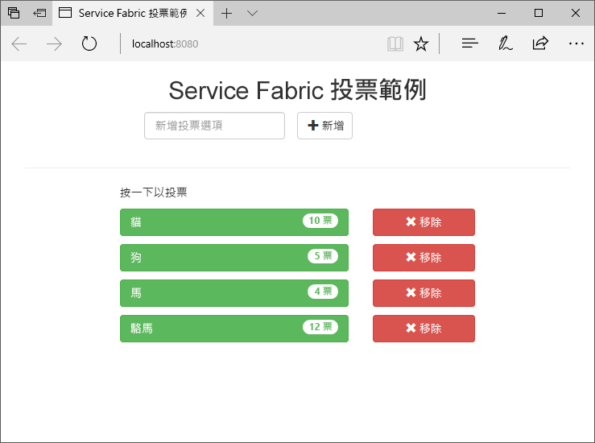
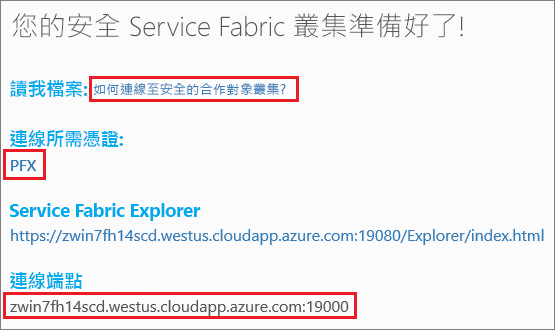
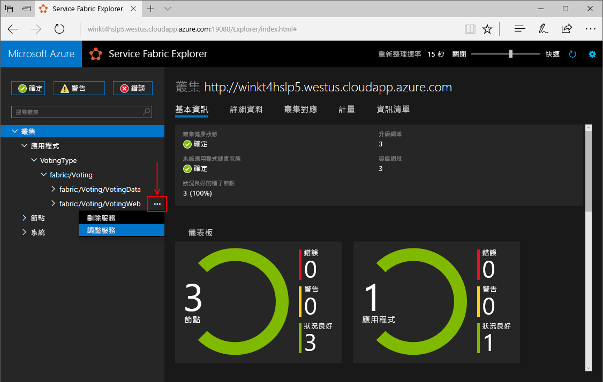
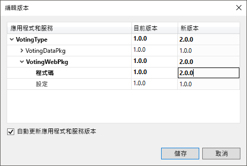

# <a name="create-a-net-service-fabric-application-in-azure"></a>在 Azure 中建立 .NET Service Fabric 應用程式
Azure Service Fabric 是一個分散式系統平台，可讓您部署及管理可調整和可信賴的微服務與容器。 

本快速入門示範如何將您的第一個 .NET 應用程式部署到 Service Fabric。 當您完成時，您會有一個投票應用程式，其 ASP.NET Core Web 前端會將投票結果儲存在叢集中具狀態的後端服務。



使用此應用程式，您將了解如何：
> [!div class="checklist"]
> * 建立使用 .NET 和 Service Fabric 的應用程式
> * 使用 ASP.NET Core 作為 Web 前端
> * 將應用程式資料儲存在具狀態服務中
> * 在本機偵錯您的應用程式
> * 將應用程式部署到 Azure 中的叢集
> * 跨多個節點相應放大應用程式
> * 執行輪流應用程式升級

## <a name="prerequisites"></a>先決條件
若要完成本快速入門：
1. [安裝 Visual Studio 2017](https://www.visualstudio.com/)，其中包含 **Azure 開發**以及 **ASP.NET 和 Web 開發**工作負載。
2. [安裝 Git](https://git-scm.com/)
3. [安裝 Microsoft Azure Service Fabric SDK](http://www.microsoft.com/web/handlers/webpi.ashx?command=getinstallerredirect&appid=MicrosoftAzure-ServiceFabric-CoreSDK)
4. 執行下列命令以將 Visual Studio 部署到本機 Service Fabric 叢集：
    ```powershell
    Set-ExecutionPolicy -ExecutionPolicy Unrestricted -Force -Scope CurrentUser
    ```

>[!NOTE]
> 在本快速入門中，範例應用程式使用的功能在 Windows 7 中無法使用。
>

## <a name="download-the-sample"></a>下載範例
在命令視窗中執行下列命令，將範例應用程式存放庫複製到本機電腦。
```
git clone https://github.com/Azure-Samples/service-fabric-dotnet-quickstart
```

## <a name="run-the-application-locally"></a>在本機執行應用程式
以滑鼠右鍵按一下 [開始] 功能表中的 Visual Studio 圖示，然後選擇 [以系統管理員身分執行]。 若要將偵錯工具附加至您的服務，您需要以系統管理員身分執行 Visual Studio。

從您複製的存放庫開啟 **Voting.sln** Visual Studio 方案。  

根據預設，投票應用程式設定為在連接埠 8080 上接聽。  應用程式連接埠設定於 */VotingWeb/PackageRoot/ServiceManifest.xml* 檔案中。  更新 [端點] 元素的 [連接埠] 屬性，即可變更應用程式連接埠。  若要在本機上部署並執行應用程式，則必須在您的電腦上開啟此應用程式連接埠並讓連接埠可供使用。  如果您變更了應用程式連接埠，請以新的應用程式連接埠值取代本篇文章中所有的 "8080"。

若要部署應用程式，請按 **F5**。

> [!NOTE]
> 您第一次執行及部署應用程式時，Visual Studio 會建立本機叢集以供偵錯。 這項作業可能需要一些時間。 叢集建立狀態會顯示在 Visual Studio 輸出視窗中。  在輸出中，會顯示如下的訊息：「應用程式 URL 未設定或不是 HTTP/HTTPS URL，所以瀏覽器不會開啟應用程式。」  此訊息不表示發生錯誤，而是代表瀏覽器將無法自動啟動。

部署完成之後，啟動瀏覽器並開啟此頁面：`http://localhost:8080` - 應用程式的 Web 前端。


您現在可以新增一組投票選項，並開始進行投票。 應用程式會執行並將所有資料儲存在 Service Fabric 叢集中，而不需要個別資料庫。

## <a name="walk-through-the-voting-sample-application"></a>逐步解說投票範例應用程式
投票應用程式包含兩個服務：
- Web 前端服務 (VotingWeb) 是 ASP.NET Core Web 前端服務，可作為網頁，並公開 Web API 來與後端服務通訊。
- 後端服務 (VotingData) 是 ASP.NET Core Web 服務，會公開 API 來將投票結果儲存在磁碟上所保存的可靠字典中。


當您在應用程式中投票時，會發生下列事件：
1. JavaScript 會將投票要求當做 HTTP PUT 要求，傳送至 Web 前端服務中的 Web API。

2. Web 前端服務使用 Proxy 來尋找 HTTP PUT 要求，並將其轉送至後端服務。

3. 後端服務會接受傳入要求，並將更新的結果儲存在可靠的字典中，以複寫至叢集中的多個節點並保存在磁碟上。 應用程式的所有資料都會儲存在叢集中，因此不需要資料庫。

## <a name="debug-in-visual-studio"></a>在 Visual Studio 中偵錯
在 Visual Studio 中偵錯應用程式時，您會使用本機 Service Fabric 開發叢集。 您可以根據自己的情況選擇調整偵錯體驗。 在這個應用程式中，我們會使用可靠的字典，將資料儲存在後端服務中。 當您停止偵錯工具時，Visual Studio 預設會移除應用程式。 移除應用程式也會導致移除後端服務中的資料。 若要保存偵錯工作階段之間的資料，您可以在 Visual Studio 中，將 [應用程式偵錯模式] 當做 [投票] 專案上的屬性來變更。

若要查看對程式碼的影響，請完成下列步驟：
1. 開啟 **/VotingWeb/Controllers/VotesController.cs** 檔案，並在 Web API 的 **Put** 方法 (第 47 行) 中設定中斷點 - 您可以在 Visual Studio 的方案總管中搜尋此檔案。

2. 開啟 **/VotingData/Controllers/VoteDataController.cs** 檔案，並在這個 Web API 的 **Put** 方法 (第 50 行) 中設定中斷點。

3. 返回到瀏覽器，並按一下投票選項或新增投票選項。 您到達 Web 前端之 API 控制器的第一個中斷點。
    - 瀏覽器中的 JavaScript 會在此位置，將要求傳送至前端服務中的 Web API 控制器。
    
    

    - 首先，請針對後端服務 **(1)** 建構 ReverseProxy 的 URL。
    - 接著，將 HTTP PUT 要求傳送至 ReverseProxy **(2)**。
    - 最後，將後端服務的回應傳回給用戶端 **(3)**。

4. 按 **F5** 繼續
    - 您現在位於後端服務的中斷點。
    
    

    - 在方法的第一行 **(1)** 中，`StateManager` 會取得或新增名為 `counts` 的可靠字典。
    - 與可靠字典中的值進行的所有互動，都需要交易，這會使用陳述式 **(2)** 建立該交易。
    - 在交易中，更新投票選項的相關索引鍵值，然後認可作業 **(3)**。 一旦傳回認可方法，字典中的資料會更新並複寫至叢集中的其他節點。 資料現在會安全地儲存在叢集中，而且後端服務可以容錯移轉到仍有可用資料的其他節點。
5. 按 **F5** 繼續

若要停止偵錯工作階段，請按 **Shift+F5**。

## <a name="deploy-the-application-to-azure"></a>將應用程式部署至 Azure
若要將應用程式部署至 Azure，您需要執行該應用程式的 Service Fabric 叢集。 

### <a name="join-a-party-cluster"></a>加入合作對象叢集
合作對象的叢集是免費的限時 Service Fabric 叢集，裝載於 Azure 上，並且由任何人都可以部署應用程式並了解平台的 Service Fabric 小組執行。 叢集會針對節點對節點和用戶端對節點安全性，使用單一的自我簽署憑證。 

登入並[加入 Windows 叢集](http://aka.ms/tryservicefabric) \(英文\)。 藉由按一下 [PFX] 連結，將 PFX 憑證下載至您的電腦。 後續步驟中會使用該憑證和 [連線端點] 值。



在 Windows 電腦上，將 PFX 安裝在 *CurrentUser\My* 憑證存放區。

```powershell
PS C:\mycertificates> Import-PfxCertificate -FilePath .\party-cluster-873689604-client-cert.pfx -CertStoreLocation Cert:
\CurrentUser\My


   PSParentPath: Microsoft.PowerShell.Security\Certificate::CurrentUser\My

Thumbprint                                Subject
----------                                -------
3B138D84C077C292579BA35E4410634E164075CD  CN=zwin7fh14scd.westus.cloudapp.azure.com
```

請記住指紋以在後續步驟中使用。

> [!Note]
> 根據預設，Web 前端服務設定為在連接埠 8080 上接聽傳入流量。 在合作對象叢集中，會開啟連接埠 8080。  如果您需要變更應用程式連接埠，請將它變更為合作對象叢集中開啟的連接埠之一。
>

### <a name="deploy-the-application-using-visual-studio"></a>使用 Visual Studio 部署應用程式
應用程式備妥後，即可直接從 Visual Studio 將其部署到叢集。

1. 以滑鼠右鍵按一下方案總管中的 [投票]，並選擇 [發行]。 [發行] 對話方塊隨即出現。


2. 將合作對象叢集頁面上的 [連線端點] 複製到 [連線端點] 欄位。 例如： `zwin7fh14scd.westus.cloudapp.azure.com:19000`。 按一下 [進階連線參數] 並填入下列資訊。  *FindValue* 和 *ServerCertThumbprint* 值必須符合先前步驟中安裝的憑證指紋。 

    ![[發佈] 對話方塊](./media/service-fabric-quickstart-dotnet/publish-app.png)

    叢集中的每個應用程式都必須有一個唯一的名稱。  合作對象叢集是公用的共用環境，可能會與現有的應用程式發生衝突。  如果發生名稱衝突，請將 Visual Studio 專案重新命名並再次部署。

3. 按一下 [發佈] 。

4. 開啟瀏覽器並鍵入叢集位址，再加上 ': 8080' 以連接叢集中的應用程式 - 例如，`http://zwin7fh14scd.westus.cloudapp.azure.com:8080`。 您現在應該會看到應用程式在 Azure 的叢集中執行。


## <a name="scale-applications-and-services-in-a-cluster"></a>調整叢集中的應用程式和服務
您可以在整個叢集內輕鬆地調整 Service Fabric 服務，以符合服務上的負載變更。 您可以藉由變更叢集中執行的執行個體數目來調整服務。 您有多種方法來調整您的服務，您可以使用 PowerShell 或 Service Fabric CLI (sfctl) 中的指令碼或命令。 在此範例中，請使用 Service Fabric Explorer。

Service Fabric Explorer 會在所有 Service Fabric 叢集中執行，並可從瀏覽器瀏覽至叢集 HTTP 管理連接埠 (19080) 來存取，例如 `http://zwin7fh14scd.westus.cloudapp.azure.com:19080`。 

您可能會收到位置不受信任的瀏覽器警告。 這是因為憑證是自我簽署的憑證。 您可以選擇忽略警告並繼續進行。 當瀏覽器出現提示時，選取已安裝的憑證來進行連線。 

若要調整 Web 前端服務，請執行下列步驟：

1. 在您的叢集中開啟 Service Fabric Explorer，例如 `http://zwin7fh14scd.westus.cloudapp.azure.com:19080`。
2. 按一下樹狀檢視中 **fabric:/Voting/VotingWeb** 節點旁的省略符號 (三個點)，然後選擇 [調整服務]。

    

    您現在可以選擇調整 Web 前端服務的執行個體數目。

3. 將數字變更為 **2**，然後按一下 [調整服務]。
4. 按一下樹狀檢視中的 **fabric:/Voting/VotingWeb** 節點，然後展開資料分割節點 (以 GUID 表示)。

    ![Service Fabric Explorer 的 [調整服務]](./media/service-fabric-quickstart-dotnet/service-fabric-explorer-scaled-service.png)

    在延遲之後，您可以看到服務有兩個執行個體。  您可以在樹狀檢視中查看執行個體在哪些節點上執行。

藉由這項簡單的管理工作，前端服務可獲得加倍的資源來處理使用者負載。 請務必了解，您不需要多個服務執行個體，就能夠可靠地執行。 如果服務失敗，Service Fabric 可確保新的服務執行個體在叢集中執行。

## <a name="perform-a-rolling-application-upgrade"></a>執行輪流應用程式升級
將新的更新部署到應用程式時，Service Fabric 會以安全的方式來推出更新。 輪流升級可讓您在不需要停機的情況下進行升級，並在發生錯誤時自動復原。

若要升級應用程式，請執行下列動作：

1. 在 Visual Studio 中開啟 **/VotingWeb/Views/Home/Index.cshtml** 檔案。
2. 新增或更新文字以變更頁面上的標題。 例如，將標題變更為「Service Fabric 投票範例第 2 版」。
3. 儲存檔案。
4. 以滑鼠右鍵按一下方案總管中的 [投票]，並選擇 [發行]。 [發行] 對話方塊隨即出現。
5. 按一下 [資訊清單版本] 按鈕以變更服務和應用程式的版本。
6. 例如，將 [VotingWebPkg] 下的 [Code] 元素版本變更為 "2.0.0"，然後按一下 [儲存]。

    
7. 在 [發行 Service Fabric 應用程式] 對話方塊中，核取 [升級應用程式] 核取方塊，然後按一下 [發行]。

    
8. 開啟您的瀏覽器，然後瀏覽至連接埠 19080 上的叢集位址，例如 `http://zwin7fh14scd.westus.cloudapp.azure.com:19080`。
9. 按一下樹狀檢視中的 [應用程式] 節點，然後按一下右窗格中的 [正在升級]。 您會看到在叢集的升級網域中輪流升級的情況，請確保每個網域的狀況良好，再繼續下一步。 當網域的健康狀態通過驗證時，進度列中的升級網域即會呈現綠色。
    

    Service Fabric 會等候兩分鐘，再升級叢集中每個節點上的服務，以確保安全升級。 整個更新預計需要約八分鐘。

10. 執行升級期間，您仍然可以使用應用程式。 由於您有兩個服務執行個體正在叢集中執行，因此其中一些要求可能會取得應用程式的升級版本，而其他要求可能仍然會取得舊版。

## <a name="next-steps"></a>後續步驟
在此快速入門中，您已了解如何：

> [!div class="checklist"]
> * 建立使用 .NET 和 Service Fabric 的應用程式
> * 使用 ASP.NET Core 作為 Web 前端
> * 將應用程式資料儲存在具狀態服務中
> * 在本機偵錯您的應用程式
> * 將應用程式部署到 Azure 中的叢集
> * 跨多個節點相應放大應用程式
> * 執行輪流應用程式升級

若要深入了解 Service Fabric 和 .NET，請參閱下列教學課程：
> [!div class="nextstepaction"]
> [Service Fabric 上的 .NET 應用程式](service-fabric-tutorial-create-dotnet-app.md)
