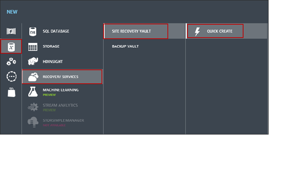
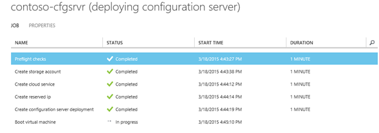
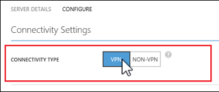
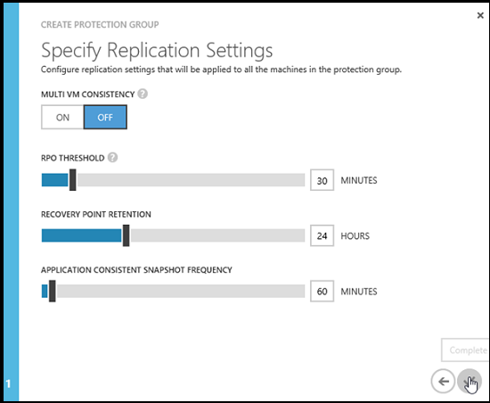
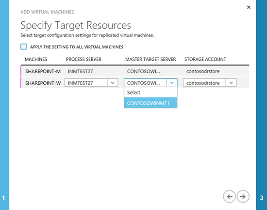
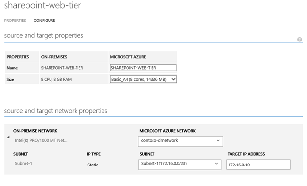

<properties 
	pageTitle="設定在內部部署 VMWare 虛擬機器或實體伺服器與 Azure 之間的保護" 
	description="Azure Site Recovery 可協調位於 Azure 之內部部署 VMWare 伺服器上的虛擬機器，以及實體內部部署伺服器和 Azure 之間的複寫、容錯移轉和復原。" 
	services="site-recovery" 
	documentationCenter="" 
	authors="raynew" 
	manager="jwhit" 
	editor="tysonn"/>

<tags 
	ms.service="site-recovery" 
	ms.workload="backup-recovery" 
	ms.tgt_pltfrm="na" 
	ms.devlang="na" 
	ms.topic="article" 
	ms.date="03/26/2015" 
	ms.author="raynew"/>

# 設定在內部部署 VMWare 虛擬機器或實體伺服器與 Azure 之間的保護

Azure Site Recovery 可藉由協調虛擬機器與實體伺服器的複寫、容錯移轉及復原，為您的商務持續性與災害復原做出貢獻。了解 [Azure Site Recovery 概觀](hyper-v-recovery-manager-overview.md) 中的可能部署案例。

本逐步解說說明如何將 Site Recovery 部署至：

- **保護 Azure 的內部部署 VMWare 虛擬機器**
- **保護 Azure 的內部部署實體 Windows 和 Linux 伺服器**

商務優點包括：

- 實體 Windows 或 Linux 伺服器的保護。
- 使用 Azure Site Recovery 入口網站的簡單複寫、容錯移轉及復原作業。
- 透過網際網路、站對站 VPN 連線或透過 Azure ExpressRoute 進行的資料複寫。   
- 從 Azure 到內部部署 VMWare 基礎結構的容錯回復 (還原)。 
- 簡化的 VMWare 虛擬機器探索。
- 多 VM 一致性，讓執行特定工作負載的虛擬機器和實體伺服器可以同時復原到一致的資料點。
- 簡化容錯移轉的復原計劃和工作負載的復原會在多部機器進行階層化。

這項功能目前只能預覽。閱讀 [預覽專用的使用補充條款](preview-supplemental-terms).

## 關於本指南

本指南包含概觀和部署的必要條件。它會引導您設定所有部署元件，並啟用虛擬機器和伺服器的保護。最後它會測試容錯移轉，藉此確定一切如預期般運作。

如果您碰到問題，請將您到問題張貼至 [Azure 復原服務論壇](http://go.microsoft.com/fwlink/?LinkId=313628)。

## 概觀

此圖說明部署元件。

### 部署元件

- **內部部署機器**-您的內部部署站台有您想要保護的機器。這些機器是在 VMWare hypervisor 上執行的虛擬機器，或是執行 Windows 或 Linux 的實體伺服器。

- **內部部署處理序伺服器**-受保護的機器會傳送複寫資料給內部部署處理序伺服器。處理序伺服器會對資料執行一些動作。將資料傳送至 Azure 中的主要目標伺服器之前，它會將資料最佳化。它具有磁碟快取功能，可快取本身接收的複寫資料。它還會處理行動服務 (必須安裝於您要保護的每部虛擬機器或實體伺服器) 的推入安裝，並執行 VMWare vCenter 伺服器的自動探索。這個處理序伺服器乃是執行 Windows Server 2012 R2 的虛擬或實體伺服器。建議您將它放置在與您要保護之機器相同的網路與 LAN 區段上，只要受保護的機器具有 L3 網路可見性，它就可以在不同的網路上運作。在部署期間，您將設定處理序伺服器，並在設定伺服器上註冊此伺服器。

- **Azure Site Recovery 保存庫**-這個保存庫可在您的內部部署站台與 Azure 之間協調資料複寫、容錯移轉及復原等作業。

- **Azure 設定伺服器**-這個設定伺服器可在 Azure 中的受保護機器、處理序伺服器與主要目標伺服器之間協調通訊。它會在容錯移轉發生時在 Azure 中設定複寫並協調復原。這個設定伺服器會在 Azure 訂用帳戶中的 Azure 標準 A3 虛擬機器上運作。在部署期間，您將設定伺服器並在 Azure Site Recovery 保存庫中註冊此伺服器。

- **主要目標伺服器**-Azure 中的主要目標伺服器會使用在您的 Azure 儲存體帳戶之 Blob 儲存體上所建立的附加 VHD，從您的受保護機器保留複寫的資料。您可將其部署為 Azure 虛擬機器，做為以 Windows Server 2012 R2 組件庫映像為基礎的 Windows 伺服器 (以保護 Windows 機器)，或做為以 OpenLogic CentOS 6.6 組件庫映像為基礎的 Linux 伺服器 (以保護 Linux 機器)。共有兩種大小選項可供使用 - 標準 A3 及標準 D14。此伺服器可與相同的 Azure 網路連接，以做為設定伺服器。在部署期間，您將建立伺服器並在設定伺服器中註冊此伺服器。

- **行動服務**-您要在想要保護的每部 VMWare 虛擬機器或 Windows/Linux 實體伺服器上安裝行動服務。這個服務會傳送複寫資料給處理序伺服器，而該伺服器會將資料傳送給 Azure 中的主要目標伺服器。這個處理序伺服器可自動在受保護的機器上安裝行動服務，您也可以使用內部軟體部署處理序手動部署服務。

- **資料通訊與複寫通道**-共有數個選項。請注意，這些選項都不會要求您開啟受保護機器上的任何輸入網路連接埠。所有的網路通訊是從內部部署站台起始。
	- **透過網際網路**-透過安全的公用網際網路連線，從受保護的內部部署伺服器與 Azure 進行通訊與複寫資料。這是預設選項。
	- **VPN/ExpressRoute**-透過 VPN 連線，在內部部署伺服器與 Azure 之間進行通訊與複寫資料。您必須在內部部署站台與您的 Azure 網路之間設定站對站 VPN 或 [ExpressRoute](expressroute)  連線。 

 
## 容量規劃

- 為了達到最佳效能，並利用可將多部受保護機器復原到一致資料點的多 VM 一致性功能，建議您將虛擬機器依工作負載收集至保護群組中。
- 您無法跨多個主要目標伺服器保護一部機器，因為在磁碟複寫時，會在 Azure Blob 儲存體上建立可反映磁碟大小的 VHD，並將其附加至主要目標伺服器做為資料磁碟。很明顯地，您可以利用一個主要目標伺服器保護多部機器。
- 主要目標伺服器虛擬機器可為 Azure 標準 A4 或 D14：
	- 利用標準 A4 磁碟，您可以將 16 個資料磁碟 (每個資料磁碟最多包含 1023 GB) 加入至每部虛擬機器。
	- 利用標準 D14 磁碟，您可以將 32 個資料磁碟 (每個資料磁碟最多包含 1023 GB) 加入至每部虛擬機器。
- 請注意，附加至主要目標伺服器的其中一個磁碟將保留做為保留磁碟機。Azure Site Recovery 可讓您定義保留視窗，並且隨時在視窗內復原受保護的機器。保留磁碟機會在視窗的存在期間持續記錄磁碟變更。這樣會使 A4 的最大磁碟數降低至 15，使 D14 的最大磁碟數降低至 31。 
- 若要調整部署，您可以加入多個處理序伺服器和主要目標伺服器。如果您現有的主要目標伺服器上沒有足夠的可用磁碟，您應該部署第二個主要目標伺服器。如果受保護機器的資料變更率超過現有處理序伺服器的容量，您應該部署額外的處理序伺服器。請注意，處理序伺服器與主要目標伺服器不需要一對一對應。您可以同時部署第一個處理序伺服器與第二個主要目標伺服器，並以此類推。
處理序伺服器使用磁碟快取。確保快取有足夠的可用空間 C:/。您所保護之機器的資料變更率會影響快取大小。一般建議之中等大小部署的快取目錄大小為 600 GB，但是您可以使用下列指導方針。

	

## 開始之前

### Azure 必要條件

- 您將需要 [Microsoft Azure](http://azure.microsoft.com/) 帳戶。您可以從[免費試用](http://aka.ms/try-azure)開始。 
- 您需要 Azure 儲存體帳戶來儲存複寫的資料。此帳戶必須啟用異地複寫。應該與 Azure Site Recovery 保存庫位於相同的區或，且與相同的訂用帳戶相關聯。若要深入了解，請參閱 [Microsoft Azure 儲存體簡介](http://go.microsoft.com/fwlink/?LinkId=398704)。
- 您需要 Azure 虛擬網路以部署設定伺服器與主要目標伺服器。需與 Azure Site Recovery 保存庫位於相同的訂用帳戶與區域中。
- 請確認您有足夠的 Azure 資源以部署所有元件。深入了解 [Azure 訂閱限制](azure-subscription-service-limits).
- 檢查您要保護的機器是否符合 Azure 虛擬機器的必要條件。 

	- **磁碟計數**-一個受保護的伺服器最多可支援 31 個磁碟
	- **磁碟大小**-個別磁碟容量不可超過 1023 GB
	- **叢集**-不支援叢集伺服器
	- **開機**-不支援整合可延伸韌體介面 (UEFI)/可延伸韌體介面 (EFI) 開機
	- **磁碟區**-不支援 Bitlocker 加密的磁碟區
	- **伺服器名稱**-名稱應包含介於 1 到 63 個字元 (字母、數字和連字號)。名稱必須以字母或數字開頭，並以字母或數字結尾。機器受到保護之後，您可以修改 Azure 的名稱。	

	深入了解[虛擬機器支援](https://msdn.microsoft.com/library/azure/dn469078.aspx#BKMK_E2A)中的 Azure 要求。

### 案例元件的必要條件

- 處理序伺服器：
	- 您可以在執行最新版更新之 Windows Server 2012 R2 的實體或虛擬機器上部署處理序伺服器。在 C:/ 上安裝。
	- 伺服器至少需要 8 處理器核心，且建議 C: 上要有 300 GB 的可用空間。
	- 建議您將此伺服器放在與您要保護的機器相同的網路與子網路上。
	- 在伺服器上安裝 VMware vSphere CLI 5.1，讓它可以執行 VMWare vCenter 伺服器的自動探索。
- 設定伺服器、主要目標伺服器、處理序伺服器和容錯回復伺服器的安裝路徑應該僅使用英文字元。例如，執行 Linux 的主要目標伺服器之路徑應為 **/usr/local/ASR**。

### VMWare 必要條件

- VMWare vCenter 伺服器，管理您的 VMware vSphere hypervisor。它應該執行 vCenter 5.0 版或更新版本的最新更新。 
- 一或多個 vSphere hypervisor，包含您要保護的 VMWare 虛擬機器。hypervisor 應該執行 ESX/ESXi 5.0 版或更新版本的最新更新。
- 透過 vCenter 伺服器探索的 VMWare 虛擬機器應已安裝 VMware 工具並處於執行中狀態。

### 受保護的 Windows 機器必要條件

執行 Windows 的受保護實體伺服器或 VMWare 虛擬機器應該具有下列項目：

- 受支援的 64 位元作業系統：Windows Server 2012 R2、Windows Server 2012 或 Windows Server 2008 R2 至少含 SP1。
- 主機名稱、掛接點、 裝置名稱、Windows 系統路徑 (例如：C:\Windows) 僅可使用英文。
- 作業系統應該安裝在 C:\ 磁碟機上。
- 支援 Windows 伺服器的一般儲存體選項。
- 受保護機器上的防火牆規則應該允許它們連線到 Azure 中的設定和主要目標伺服器。 
- 容錯移轉之後，如果您想要使用遠端桌面連線到 Azure 中的 Windows 虛擬機器，請確認內部部署機器的遠端桌面已啟用。如果您不透過 VPN 防火牆連線，規則應該允許透過網際網路的遠端桌面連線。

### 受保護的 Linux 機器必要條件

執行 Linux 的受保護實體伺服器或 VMWare 虛擬機器應該具有下列項目：

- 受支援的作業系統：Centos 6.4、6.5、6.6 (32 或 64 位元)；Oracle Enterprise Linux 6.4、6.5 (32 或 64 位元)，執行 Red Hat 相容核心或 Unbreakable Enterprise Kern 第 3 版 (UEK3)、SUSE Linux Enterprise Server 11 SP3 (32 位元或 64 位元)
- 主機名稱、掛接點、裝置名稱和 Linux 系統路徑和檔案名稱 (eg /etc/; /usr) 僅可使用英文。
- 可以利用下列儲存體啟用內部部署機器的保護：
	- 檔案系統：EXT3、ETX4、ReiserFS、XFS
	- 多重路徑軟體：裝置對應工具 - 多重路徑
	- 磁碟區管理員：LVM2
	- 不支援使用 HP CCISS 控制站儲存體的實體伺服器。
- 受保護機器上的防火牆規則應該允許它們連線到 Azure 中的設定和主要目標伺服器。
- 如果您想要在容錯轉移之後使用安全殼層用戶端 (ssh) 連線到執行 Linux 的 Azure 虛擬機器，請確認受保護機器上的安全殼層服務已設為在系統開機時自動啟動，且防火牆規則允許 ssh 與其連線。  

### 第三方廠商必要條件

在這個案例中某些部署元件取決於第三方廠商軟體才能正常運作。如須完整清單，請參閱 <a href="#thirdparty">第三方廠商軟體注意事項和資訊</a>。 

## 步驟 1：建立保存庫

1. 登入 [管理入口網站](https://portal.azure.com)。

2. 展開 [**資料服務**] > [**復原服務**] 並且按一下 [**Site Recovery 保存庫**]。

3. 按一下 [**新建**] > [**快速建立**]。
	
4. 在 [名稱] 中，輸入用於識別保存庫的易記名稱。

5. 在 [地區] 中，選取保存庫的地理區域。如果要檢查受支援的區域，請參閱 [Azure Site Recovery 訂價詳細資料](href="http://go.microsoft.com/fwlink/?LinkId=389880)中的＜各地區上市情況＞。

6. 按一下 [建立保存庫]。 

	

檢查狀態列，以確認是否順利建立保存庫。保存庫將在 [**復原服務**] 主要頁面上列為 [**使用中**]。

## 步驟 2：部署設定伺服器

1. 在 [復原服務] 頁面中，按一下保存庫以開啟 [快速入門] 頁面。您也可以使用圖示隨時開啟 [快速入門]。

	

2. 在下拉式清單中，選取 [**在附帶 VMware/實體伺服器的內部部署站台與 Azure 之間**]。
3. 在 [**準備目標資源**] 按一下 [**部署設定伺服器**]。

	

4. 指定設定伺服器的詳細資訊和認證以連接到伺服器。選取伺服器所在地方的 Azure 網路。指定要指派給伺服器的內部 IP 位址與子網路。當您按一下 [**確定**]，會在您的訂用帳戶中為設定伺服器建立以 Azure Site Recovery Windows Server 2012 R2 組件庫映像為基礎的標準 A3 虛擬機器。這個虛擬機器的建立，可在附帶保留公用 IP 位址的新雲端服務中做為第一個執行個體。

	

5. 您可以在 [**工作**] 標籤中監視進度。

	

8.  部署設定伺服器之後，請在 Azure 入口網站的 [**虛擬機器**] 頁面中注意指派給此伺服器的公用 IP 位址。然後在 [**端點**] 標籤上注意對應至私人連接埠 443 的公用 HTTPS 連接埠。稍後當您在主要目標與處理序伺服器上註冊此設定伺服器的時候，您會需要這個資訊。這個設定伺服器利用 4 個公用端點進行部署：

	- 443：用來協調元件伺服器與 Azure 之間通訊的 HTTPS 通道。
	- 9443：用於容錯回復工具與容錯回復通訊。
	- 遠端桌面
	- PowerShell

## 步驟 3：在保存庫中註冊設定伺服器

1. 在 [**準備目標資源**] 中，按一下 [**下載註冊金鑰**]。金鑰檔案會隨即自動產生。該金鑰在產生後會維持 5 天有效。將檔案複製到設定伺服器。
2. 在虛擬機器的 [**儀表板**] 頁面上，按一下 [**連線**]。使用下載的 RDP 檔案登入附帶遠端桌面的設定伺服器。當您第一次登入 Azure Site Recovery 時，安裝與註冊精靈會自動執行。

	

3. 遵循精靈的指示。您必須先下載並安裝 MySQL 伺服器並為其指定認證。在 [**Azure Site Recovery 註冊**] 頁面上，瀏覽至您複製到伺服器的金鑰檔案。

	

4. 註冊完成後，隨即會產生複雜密碼。將其複製到安全的位置。您在設定伺服器上驗證與註冊處理序與主要目標伺服器時將會需要這個密碼。這個密碼也可以用來確認設定伺服器通訊中的通道完整性。您可以重新產生複雜密碼，但是屆時您也必須以新的複雜密碼再次註冊主要目標與處理序伺服器。

	

註冊完成後，設定伺服器會列在保存庫的 [**設定伺服器**] 頁面上。

## 步驟 4：設定 VPN 連線
 
您可以透過網際網路或使用 VPN 或 ExpressRoute 連線連接到設定伺服器。網際網路連線使用虛擬機器的端點搭配伺服器的公用虛擬 IP 位址。VPN 會使用伺服器的內部 IP 位址與端點私人連接埠。
 
您可以使用下列方式設定 VPN 與伺服器的連線：

1. 如果您尚未設定站對站或 Azure ExpressRoute 連線，您可以在此深入了解：

	- [ExpressRoute 或 VPN - 哪一個最適合我](http://azure.microsoft.com/blog/2014/06/10/expressroute-or-virtual-network-vpn-whats-right-for-me/) 
	- [設定與 Azure 虛擬機器的站對站連線](https://msdn.microsoft.com/library/azure/dn133795.aspx)
	- [設定 ExpressRoute](https://msdn.microsoft.com/library/azure/dn606306.aspx) 
	
2. 在保存庫中，按一下 [**伺服器**] > [**設定伺服器**] > [設定伺服器] > [**設定**]。
3. 在 [**連線設定**] 中，將 [**連線類型**] 設為 **VPN**。請注意，如果您已設定 VPN 且沒有內部部署站台的網際網路存取，請確認您已選取 VPN 選項。如果您未選取，處理序伺服器就無法傳送複寫資料給其公用端點上的主要目標伺服器。

	

## 步驟 5：部署主要目標伺服器

1. 在 [**準備目標資源**] 中，按一下 [**部署主要目標伺服器**]。
2. 指定主要目標伺服器的詳細資料和認證。伺服器將部署在與您註冊之設定伺服器相同的 Azure 網路。當您按一下以完成動作時，隨即會建立附帶 Windows 或 Linux 組件庫映像的 Azure 虛擬機器。 

	

3. 利用這些公用 TCP 端點建立 Windows 主要伺服器虛擬機器：

	- 自訂：公用連接埠可用來透過網際網路傳送複寫資料。處理序伺服器可使用私人連接埠 9443 透過 VPN 傳送資料給主要目標伺服器。
	- Custom1：處理序伺服器可使用私人連接埠 9080 透過 VPN 傳送資料給目標伺服器。
	- PowerShell：私人連接埠：5986
	- 遠端桌面：私人連接埠：3389

4. 利用這些端點建立 Linux 主要伺服器虛擬機器：

	- 自訂：公用連接埠可用來透過網際網路傳送複寫資料。處理序伺服器可使用私人連接埠 9443 透過 VPN 傳送資料給主要目標伺服器。
	- Custom1：處理序伺服器可使用私人連接埠 9080 透過 VPN 傳送資料給主要目標伺服器
	- SSH：私人連接埠 22

5. 在 [**虛擬機器**] 中，等待虛擬機器啟動。 

	- 如果您已利用 Windows 設定伺服器，請記下遠端桌面詳細資料。
	- 如果您已利用 Linux 設定，並透過 VPN 連線，請注意虛擬機器的內部 IP 位址。如果您透過網際網路連線，請注意公用 IP 位址。
6.  登入伺服器以完成安裝，並在設定伺服器上註冊該伺服器。如果您在執行 Windows：

	1.啟動與虛擬機器的遠端桌面連線。第一次登入指令碼會在 PowerShell 視窗中執行。不要關閉它。完成時，主機代理程式設定工具會自動開啟註冊伺服器。
	2.在 [**主機代理程式設定**] 中，指定設定伺服器的內部 IP 位址與連接埠 443。即使您並非透過 VPN 模式連線，您還是可以使用內部位址與私人連接埠 443，因為虛擬機器附加於和設定伺服器相同的 Azure 網路。讓 [**使用 HTTPS**] 保持啟用狀態。輸入您先前所記下的設定伺服器複雜密碼。按一下 [**確定**] 以註冊伺服器。請注意，您可以忽略頁面上的 NAT 選項。它們不會被使用。

	

6. 如果您在執行 Linux：
	1.使用 sftp 用戶端將[伺服器安裝程式 tar 檔案](http://go.microsoft.com/fwlink/?LinkID=529757&clcid=0x409)複製到虛擬機器。或者您可以登入並使用 wget 在 [快速入門] 頁面中從連結下載檔案。 
	2.使用安全殼層用戶端登入伺服器。請注意，如果您已透過 VPN 連線到 Azure 網路，請使用內部 IP 位址。否則請使用外部 IP 位址與 SSH 公用端點。
	3.執行下列項目以從 gzipped 安裝程式解壓縮檔案：**tar -xvzf Microsoft-ASR_UA_8.2.0.0_RHEL6-64***."   

		

	4.請確認您在解壓縮 tar 檔案內容的目錄中，並且執行 "**sudo ./install.sh**" 命令。選取選項 **2。主要目標**。保留其他選項的預設設定。

		

	5.完成安裝之後，命令列**主機設定介面**隨即出現。不調整視窗大小。 
	6.使用方向鍵來選取 [**全域**] 並按下 Enter。
	7.在 [**輸入 IP 位址**] 中，輸入設定伺服器與連接埠 22 的內部位址。
	8.指定您先前記下的設定伺服器複雜密碼，然後按 enter。選取 [**結束**] 以完成安裝。請注意，如果您使用 PuTTY 用戶端 ssh 虛擬機器，您可以使用 Shift+Insert 貼上。 
	9.使用向右鍵結束並按 Enter。

		

7. 等候幾分鐘 (5-10)，然後在 [**伺服器**] > [**設定伺服器**] 頁面上檢查主要目標伺服器在 [**伺服器詳細資料**] 索引標籤上是否列為已註冊。如果您在執行 Linux 而且伺服器並未註冊，請再次從 /usr/local/ASR/Vx/bin/hostconfigcli 執行主機設定工具。您必須藉由執行 chmod 做為進階使用者，以設定存取權限。

	

## 步驟 6：部署內部部署處理序伺服器

1. 按一下 [快速入門] > [**安裝處理序伺服器內部部署**] > [**下載與安裝處理序伺服器**]。

	

2. 將下載的 zip 檔案複製到您要安裝處理序伺服器的伺服器。zip 檔案包含兩個安裝檔案：

	- Microsoft-ASR_CX_TP_8.2.0.0_Windows*
	- Microsoft-ASR_CX_8.2.0.0_Windows*

3. 解壓縮封存，並將安裝檔案複製到伺服器上的位置。
4. 執行 **Microsoft-ASR_CX_TP_8.2.0.0_Windows*** 安裝檔案，然後遵循指示。這樣可以安裝部署所需第三方廠商元件。
5. 然後執行 **Microsoft-ASR_CX_8.2.0.0_Windows***。
6. 在 [**伺服器模式**] 頁面上，選取 [**處理序伺服器**]。
7.	在 [**設定伺服器詳細資料**] 中，如果您透過 VPN 連線，請指定設定伺服器的內部 IP 位址以及連接埠 443。否則，請指定公用虛擬 IP 位址和對應的公用 HTTP 端點。
8.	如果您想要在使用自動推入安裝服務時停用驗證，請清除 **驗證行動服務軟體簽章**。簽章驗證需要處理序伺服器的網際網路連線能力。
9.	輸入設定伺服器的複雜密碼。

	

8. 完成安裝伺服器。請記助您必須在伺服器上安裝 VMware vSphere CLI 5.1 才能探索 vCenter Server。

	

驗證處理序伺服器已成功在保存庫中註冊 > [**設定伺服器**] > [**伺服器詳細資料**]。

請注意，如果您在註冊處理序伺服器的時候未停用簽章驗證，您可以稍後再依下列說明停用簽章：

1. 以系統管理員身分登入處理序伺服器，並開啟 C:\pushinstallsvc\pushinstaller.conf 檔案進行編輯。在 [**[PushInstaller.transport]**] 區段下加入這一行：**SignatureVerificationChecks="0"**。儲存並關閉檔案。
1. 重新啟動 InMage PushInstall 服務。

## 步驟 7：加入 vCenter 伺服器

1. 在 [**伺服器**] > [**設定伺服器**] 索引標籤上，選取設定伺服器並按一下以加入 vCenter 伺服器。

	

2. 指定 vCenter 伺服器的詳細資料並選取將用來探索詳細資料的處理序伺服器。處理序伺服器必須與 vCenter 伺服器在相同的網路上，並且已安裝 VMware vSphere CLI 5.1。
3. 探索完成之後，vCenter 伺服器將會列在設定伺服器詳細資料之下。
	
	

## 步驟 8：建立保護群組

1. 開啟 [**受保護項目**] > [**保護群組**] 並且按一下以加入保護群組。

	

2. 在 [**指定保護群組設定**] 頁面上，指定群組名稱，並且選取您要建立群組的設定伺服器。

	

3. 在 [**指定複寫設定**] 頁面上，進行將用於群組中所有機器的複寫設定。   

	

4. 設定：
	- **多 VM 一致性**：如果您開啟此功能，它會在保護群組中跨機器建立共用的應用程式一致復原點。當保護群組中的所有機器都執行相同的工作負載時，這項設定就可以發揮最高的重要性。所有機器都將復原到相同的資料點。僅適用於 Windows 伺服器。 
	- **RPO 臨界值**：當連續資料保護複寫 RPO 超過設定的 RPO 臨界值時，就會產生警示。
	- **復原點保留**：指定保留週期。受保護的機器可以復原到這個週期內的任意點。
	- **應用程式一致快照頻率**：指定建立包含應用程式一致快照之復原點的頻率。

您可以監視保護群組，因為它們是建立在 [**受保護項目**] 頁面上。 

## 步驟 9：推入行動服務

當您將機器加入保護群組時，行動服務會自動由處理序伺服器推入並安裝於每部機器上。如果您想要使用這個執行 Windows 之受保護機器的自動推入機制，您必須在每部機器上執行下列作業：

1. 設定 Windows 防火牆，允許**檔案及印表機共用**和 **Windows Management Instrumentation**。針對隸屬於網域中的機器，您可以利用 GPO 設定防火牆原則。
2. 用來執行推入安裝的帳戶必須在您要保護之機器的系統管理員群組中。請注意，這些認證僅可用於推入安裝。行動服務不會在任何地方儲存這些認證，在伺服器受到保護之後就會捨棄這些認證。當您將機器加入保護群組時，您將會提供這些認證。

	

3. 如果系統管理員帳戶不是網域帳戶，您必須停用本機電腦上的遠端使用者存取控制。若要在 HKEY_LOCAL_MACHINE\SOFTWARE\Microsoft\Windows\CurrentVersion\Policies\System 這麼做，請建立 LocalAccountTokenFilterPolicy 項目，如果該項目不存在，請為其指派下列 DWORD 值： 

如果您想要保護執行 Linux 的機器，您必須執行下列動作：

1. 確認帳戶是來源 Linux 伺服器上的根使用者
1. 在您想要保護的電腦上安裝最新的 openssh、openssh 伺服器、openssl 套件。
1. 啟用 ssh 連接埠 22。
2. 在 sshd 設定檔中啟用 Sftp 子系統與密碼驗證：
	1.登入根使用者帳戶。
	2.在 /etc/ssh/sshd_config 檔案中以 "PasswordAuthentication" 開頭的那一行。取消該行的註解並將值從 "no" 變更為 "yes"。 

		

	4.尋找以 "Subsystem" 開頭的行並取消其註解。 

		

## 步驟 10：將機器加入保護群組

1. 開啟 [**受保護項目**] > [**保護群組**] > [**機器**] 索引標籤，並加入由探索的 vCenter 伺服器所管理的虛擬或實體機器。我們建議保護群組應反映您的工作負載，這樣一來您才可以將執行特定應用程式的機器加入相同的群組。

	

2. 在 [**加入虛擬機器**] 的 [**選取虛擬機器**] 頁面中，選取 V-Center 伺服器，然後在其中選取機器。

	

3. 當您將機器加入保護群組，行動服務會自動從內部部署處理序伺服器安裝。若要讓自動推入機制運作，請確認已將受保護機器如上一個步驟所述進行設定。
4. 在 [**選取虛擬機器**] 中，選取管理您要保護之機器的 vCenter 伺服器，然後選取虛擬機器。

4. 選取要用於複寫的伺服器和儲存體。 

	

5. 提供來源伺服器的使用者認證。要自動在來源機器上安裝行動服務，這是必要的動作。對於 Windows 伺服器而言，帳戶應該具有來源伺服器上的系統管理員權限。對於 Linux 而言，帳戶必須具有伺服器上的進階使用者權限。

	

6. 按一下核取記號，以完成將機器加入保護群組，並啟動每部機器的初始複寫。您可以在 [**工作**] 頁面上監視狀態。

	

7. 此外，按一下 [**受保護項目**] > <保護群組> > [**虛擬機器**] 以監視保護狀態。在初始複寫完成之後且機器在同步處理資料時，仍會顯示**受保護**狀態。

	

## 步驟 11：設定受保護機器屬性

1. 在機器具有**受保護**狀態之後，您可以設定其容錯移轉屬性。在保護群組詳細資料中，選取機器並開啟 [**設定**] 索引標籤。
2. 在容錯移轉和 Azure 大小調整之後，您可以修改要提供給 Azure 中機器的名稱。您也可以選取機器要在容錯移轉之後要連結的 Azure 網路。請注意：

	- Azure 機器的名稱必須符合「必要條件」中所述的 Azure 要求。
	- 根據預設，Azure 中的複寫虛擬機器不會與 Azure 網路連線。如果您要讓複寫的虛擬機器進行通訊，請務必為其設定相同的 Azure 網路。

	

## 步驟 12：執行容錯移轉

1. 在 [**復原計畫**] 頁面上，並加入復原計畫。指定計畫的詳細資料並選取 [**Azure**] 做為目標。

	

2. 在 [**選取虛擬機器**] 中，選取保護群組，然後在群組中選取要加入復原計畫的機器。

	

3. 必要時，您可以自訂計畫以建立群組並決定機器在復原計劃中容錯移轉的順序。您也可以加入進行手動動作和指令碼的提示。

	

5. 在 [**復原計畫**] 頁面中，選取計畫並按一下 [**測試容錯移轉**]。
6. 在 [**確認容錯移轉**] 中，確認容錯移轉方向 (朝向 Azure)，然後選取容錯移轉的目標復原點。 
7. 等候容錯移轉工作完成，然後確認容錯移轉如預期般運作，且複寫的虛擬機器在 Azure 中成功啟動。

<h2>THIRD-PARTY SOFTWARE NOTICES AND INFORMATION</h2>

Do Not Translate or Localize

The software and firmware running in the Microsoft product or service is based on or incorporates material from the projects listed below (collectively, “Third Party Code”).  Microsoft is the not original author of the Third Party Code.  The original copyright notice and license, under which Microsoft received such Third Party Code, are set forth below.

The information in Section A is regarding Third Party Code components from the projects listed below. Such licenses and information are provided for informational purposes only.  This Third Party Code is being relicensed to you by Microsoft under Microsoft's software licensing terms for the Microsoft product or service.  

The information in Section B is regarding Third Party Code components that are being made available to you by Microsoft under the original licensing terms. 

The complete file may be found on the [Microsoft Download Center](http://go.microsoft.com/fwlink/?LinkId=530254)  h. Microsoft reserves all rights not expressly granted herein, whether by implication, estoppel or otherwise.

<!--HONumber=49-->