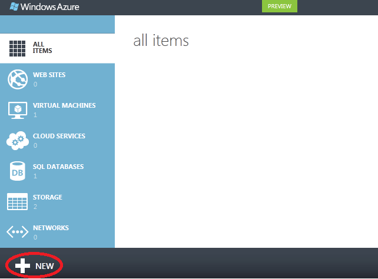
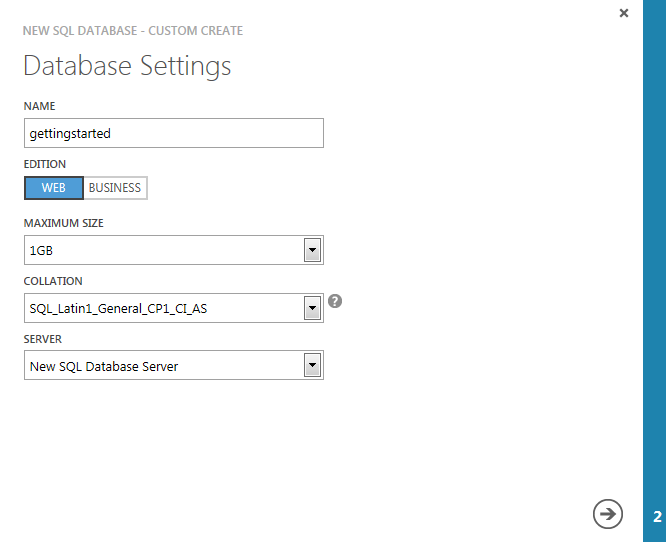
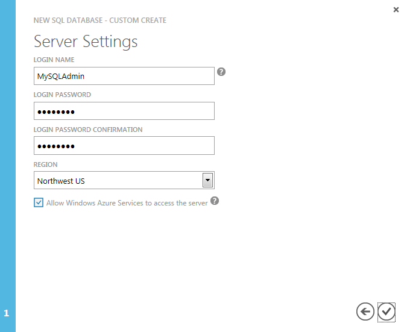
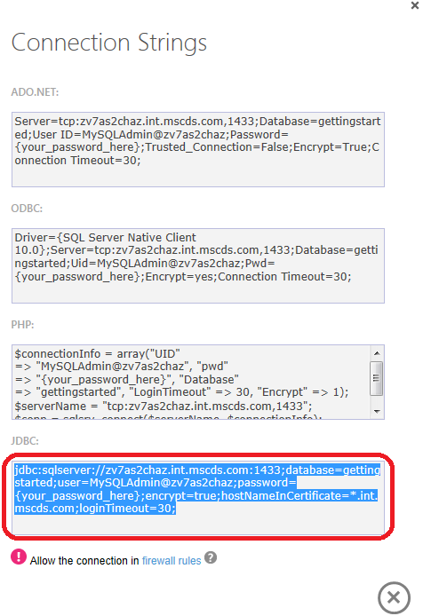
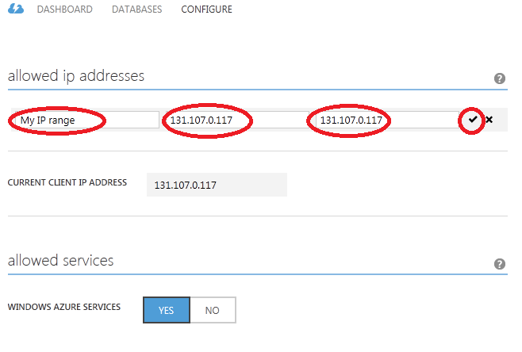

<properties linkid="develop-java-sql-azure" urlDisplayName="SQL Database" pageTitle="How to use SQL Azure (Java) - Azure feature guide" metaKeywords="" description="Learn how to use the Azure SQL Database from Java code. " metaCanonical="" services="sql-database" documentationCenter="Java" title="How to Use Azure SQL Database in Java" authors="waltpo" solutions="" manager="" editor="mollybos" />

如何使用採用 Java 的 Azure SQL Database
=======================================

下列步驟說明如何使用採用 Java 的 Azure SQL Database。為節省篇幅，僅顯示命令列範例，但幾乎類似的步驟也適用於 Azure 或其他環境中內部部署託管的 Web 應用程式。本指南涵蓋從 [Azure 管理入口網站](https://windows.azure.com)建立伺服器與建立資料庫。如需從生產入口網站執行這些工作的相關資訊，請參閱[使用採用 Java 的 SQL Database](http://msdn.microsoft.com/en-us/library/windowsazure/hh749029.aspx)。

什麼是 Azure SQL Database
-------------------------

Azure SQL Database 為 Azure 提供關聯式資料庫管理系統，並以 SQL Server 技術為基礎。在 SQL Database 執行個體中，您可以輕鬆地將關聯式資料庫解決方案佈建及部署到雲端，並充分利用分散式資料中心，而該資料中心可提供企業級的可用性、延展性和安全性，以及內建資料防護和自我修復功能。

目錄
----

-   [概念](#concepts)
-   [必要條件](#prerequisites)
-   [建立 Azure SQL Database](#create_db)
-   [判斷 SQL Database 連接字串](#determine_connection_string)
-   [允許存取 IP 位址範圍](#specify_allowed_ips)
-   [使用採用 Java 的 Azure SQL Database](#use_sql_azure_in_java)
-   [從程式碼與 Azure SQL Database 通訊](#communicate_from_code)
-   [建立資料表](#to_create_table)
-   [建立資料表上的索引](#to_create_index)
-   [插入資料列](#to_insert_rows)
-   [擷取資料列](#to_retrieve_rows)
-   [使用 WHERE 子句擷取資料列](#to_retrieve_rows_using_where)
-   [擷取資料列的計數](#to_retrieve_row_count)
-   [更新資料列](#to_update_rows)
-   [刪除資料列](#to_delete_rows)
-   [檢查資料表是否存在](#to_check_table_existence)
-   [放置索引](#to_drop_index)
-   [放置資料表](#to_drop_table)
-   [在 Azure 部署中使用採用 Java 的 SQL Database](#using_in_azure)
-   [後續步驟](#nextsteps)

概念
----

由於 Azure SQL Database 是以 SQL Server 技術為基礎組建的，因此從 Java 存取 SQL Database 與從 Java 存取 SQL Server 非常類似。您可以在本機開發應用程式 (使用 SQL Server)，然後藉由只變更連線字串來連接 SQL Database。您可以將 SQL Server JDBC 驅動程式用於應用程式中。然而，SQL Database 和 SQL Server 之間存在某些可能會影響應用程式的差異。如需詳細資訊，請參閱 [Azure SQL Database 指導方針和限制](http://msdn.microsoft.com/en-us/library/windowsazure/ff394102.aspx)。

如需 SQL Database 的其他資源，請參閱[後續步驟](#nextsteps)一節。

必要條件
--------

如果您打算使用採用 Java 的 SQL Database，下列是必要條件。

-   Java Developer Kit (JDK) 1.6 版或更新版本。
-   Azure 訂閱，可從 <http://www.microsoft.com/windowsazure/offers/> 取得。
-   如果使用 Eclipse，您將需要 Eclipse IDE for Java EE Developers (Indigo 或更新版本)。這可從 <http://www.eclipse.org/downloads/> (英文) 下載。您還需要 Azure Plugin for Eclipse with Java (由 Microsoft Open Technologies 提供)。在此外掛程式安裝期間，請確定其中包括 Microsoft JDBC Driver 4.0 for SQL Server。如需詳細資訊，請參閱[安裝 Azure Plugin for Eclipse with Java (由 Microsoft Open Technologies 提供)](http://msdn.microsoft.com/en-us/library/windowsazure/hh690946.aspx) (英文)。
-   如果不是使用 Eclipse，您將需要 Microsoft JDBC Driver 4.0 for SQL Server，這可從 <http://www.microsoft.com/en-us/download/details.aspx?id=11774> (英文) 下載。

建立 Azure SQL Database
-----------------------

使用採用 Java 程式碼的 Azure SQL Database 之前，您需要建立 Azure SQL Database 伺服器。

1.  登入 [Azure 管理入口網站](https://manage.windowsazure.com)。
2.  按一下 **[新增]**。

    

3.  按一下 **[SQL Database]**，再按一下 **[Custom Create]**。

    

4.  在 **[資料庫設定]** 對話方塊中指定資料庫名稱。在本指南中，將使用 **gettingstarted** 作為資料庫名稱。
5.  在 **[伺服器]** 中選取 **[New SQL Database server]**。在其他欄位中使用預設值。

    

6.  按下一個箭頭。
7.  在 **[伺服器設定]** 對話方塊中指定 SQL Server 登入名稱。在本指南中會使用 **MySQLAdmin**。指定並確認密碼。指定區域，並確定已勾選 **[允許 Azure 服務存取伺服器]**。

    

8.  按一下 [完成] 按鈕。

判斷 SQL Database 連接字串
--------------------------

1.  登入 [Azure 管理入口網站](https://manage.windowsazure.com)。
2.  按一下 **[SQL Databases]**。
3.  按一下要使用的資料庫。
4.  按一下 **[顯示連接字串]**。
5.  反白顯示 **JDBC** 連接字串的內容。

    

6.  以滑鼠右鍵按一下反白顯示的 **JDBC** 連接字串內容，並按一下 **[複製]**。
7.  您現在可以將此值貼到程式碼檔案中，以建立下列格式的連接字串。以您在上一個步驟中所複製的文字取代 *your\_server* (共有兩個位置)，並以在建立 SQL Database 帳戶時所指定的密碼值取代*your\_password*。(並分別取代指派給 **database=** 和 **user=** 的值，如果您沒有使用 **gettingstarted** 和 **MySQLAdmin** 的話。)

    String connectionString =
		"jdbc:sqlserver://*your_server*.database.windows.net:1433" + ";" +  
    	"database=gettingstarted" + ";" + 
    	"user=MySQLAdmin@*your_server*" + ";" +  
    	"password=*your_password*" + ";" +  
        "encrypt=true" + ";" +
        "hostNameInCertificate=*.int.mscds.com" + ";" +  
        "loginTimeout=30";

稍後在本指南中，我們將使用此字串，現在先了解判斷連接字串的步驟。另外，視您的應用程式需求而定，您可能不需要使用 **encrypt** 和 **hostNameInCertificate** 設定，且您可能需要修改 **loginTimeout** 設定。

允許存取 IP 位址範圍
--------------------

1.  登入[管理入口網站](https://manage.windowsazure.com)。
2.  按一下 **[SQL Databases]**。
3.  按一下 **[伺服器]**。
4.  按一下要使用的伺服器。
5.  按一下 **[管理]**。
6.  按一下 **[設定]**。
7.  在 **[允許的 IP 位址]** 下輸入新的 IP 規則名稱。指定 IP 位址的起始和結束範圍。為了方便起見，會顯示目前的用戶端 IP 位址。下列範例允許使用單一用戶端 IP 位址 (您的 IP 位址會有所不同)。

    

8.  按一下 [完成] 按鈕。您所指定的 IP 位址將無法存取您的資料庫伺服器。

使用採用 Java 的 Azure SQL Database
-----------------------------------

1.  建立 Java 專案。在本教學課程中，此專案名稱為 **HelloSQLAzure**。
2.  將名為 **HelloSQLAzure.java** 的 Java 類別檔案新增至專案。
3.  將 **Microsoft JDBC Driver for SQL Server** 新增至您的組建路徑。

    如果使用 Eclipse：

    1.  在Eclipse 的專案總管中，於 **HelloSQLAzure** 專案上按一下滑鼠右鍵，並按一下 **[內容]**。
    2.  在 **[內容]** 對話方塊的左窗格中，按一下 **[Java Build Path]**。
    3.  按一下 **[程式庫]** 索引標籤，然後按一下 **[新增程式庫]**。
    4.  在 **[新增程式庫]** 對話方塊中選取 **[Microsoft JDBC Driver 4.0 for SQL Server]**，按 **[下一步]**，然後按一下 **[完成]**。
    5.  按一下 **[確定]** 以關閉 **[內容]** 對話方塊。

    如果不是使用 Eclipse，則將 Microsoft JDBC Driver 4.0 for SQL Server JAR 新增至您的類別路徑。如需相關資訊，請參閱[使用 JDBC 驅動程式](http://msdn.microsoft.com/en-us/library/ms378526.aspx)。

4.  在 **HelloSQLAzure.java** 程式碼中加入 `import` 陳述式，如下所示：

        import java.sql.*;
        import com.microsoft.sqlserver.jdbc.*;

5.  指定連接字串。下列是一個範例。依照上述方式，以適用於 SQL Database 伺服器的值取代 *your\_server* (共有兩個位置)、*your\_user* 和 *your\_password*。

        String connectionString =
        	"jdbc:sqlserver://your_server.database.windows.net:1433" + ";" +  
        		"database=master" + ";" + 
        		"user=your_user@your_server" + ";" +  
        		"password=your_password";

現在您已準備就緒，可以開始加入與 SQL Database 伺服器通訊的程式碼。

從程式碼與 Azure SQL Database 通訊
----------------------------------

本主題其他部分說明執行下列動作的範例：

1.  連線至 SQL Database 伺服器。
2.  定義 SQL 陳述式，例如，建立或放置資料表、插入/選取/刪除資料列等。
3.  透過呼叫 **executeUpdate** 或 **executeQuery** 執行 SQL 陳述式。
4.  顯示查詢結果 (如果適用)。

請依序讀取 (取樣) 下列章節。第一個程式碼片段是完整範例；其他的程式碼片段將仰賴完整範例中的部分架構，例如 **import** 陳述式、**class** 和 **main** 宣告、錯誤處理及資源關閉。

建立資料表
----------

下列程式碼說明如何建立名為 **Person** 的資料表。

    import java.sql.*;
    import com.microsoft.sqlserver.jdbc.*;

    public class HelloSQLAzure {

    public static void main(String[] args) 
        {

            // Connection string for your SQL Database server.
            // Change the values assigned to your_server, 
            // your_user@your_server,
            // and your_password.
            String connectionString = 
                "jdbc:sqlserver://your_server.database.windows.net:1433" + ";" +  
                    "database=gettingstarted" + ";" + 
                    "user=your_user@your_server" + ";" +  
                    "password=your_password";
            
            // The types for the following variables are
            // defined in the java.sql library.
            Connection connection = null;  // For making the connection
            Statement statement = null;    // For the SQL statement
            ResultSet resultSet = null;    // For the result set, if applicable
            
            try
            {
                // Ensure the SQL Server driver class is available.
                Class.forName("com.microsoft.sqlserver.jdbc.SQLServerDriver");
            
                // Establish the connection.
                connection = DriverManager.getConnection(connectionString);
            
                // Define the SQL string.
                String sqlString = 
                    "CREATE TABLE Person (" + 
                        "[PersonID] [int] IDENTITY(1,1) NOT NULL," +
                        "[LastName] [nvarchar](50) NOT NULL," + 
                        "[FirstName] [nvarchar](50) NOT NULL)";
            
                // Use the connection to create the SQL statement.
                statement = connection.createStatement();
            
                // Execute the statement.
                statement.executeUpdate(sqlString);
            
                // Provide a message when processing is complete.
                System.out.println("Processing complete.");
            
            }
            // Exception handling
    catch (ClassNotFoundException cnfe)  
            {
                
    System.out.println("ClassNotFoundException " +
    cnfe.getMessage());
            }
    catch (Exception e)
            {
    System.out.println("Exception " + e.getMessage());
    e.printStackTrace();
            }
    finally
            {
    try
                {
    // Close resources.
    if (null != connection) connection.close();
    if (null != statement) statement.close();
    if (null != resultSet) resultSet.close();
                }
    catch (SQLException sqlException)
                {
    // No additional action if close() statements fail.
                }
            }
            
        }

    }

建立資料表上的索引
------------------

下列程式碼說明如何使用 **PersonID** 欄，在 **Person** 資料表上建立名為 **index1** 的索引。

	// Connection string for your SQL Database server.
	// Change the values assigned to your_server, 
	// your_user@your_server,
	// and your_password.
	String connectionString = 
		"jdbc:sqlserver://your_server.database.windows.net:1433" + ";" +  
			"database=gettingstarted" + ";" + 
			"user=your_user@your_server" + ";" +  
			"password=your_password";
	
	// The types for the following variables are
	// defined in the java.sql library.
	Connection connection = null;  // For making the connection
	Statement statement = null;    // For the SQL statement
	ResultSet resultSet = null;    // For the result set, if applicable
	
	try
	{
	    // Ensure the SQL Server driver class is available.
	    Class.forName("com.microsoft.sqlserver.jdbc.SQLServerDriver");
	
	    // Establish the connection.
	    connection = DriverManager.getConnection(connectionString);
	
	    // Define the SQL string.
	    String sqlString = 
			"CREATE CLUSTERED INDEX index1 " + "ON Person (PersonID)";
	
	    // Use the connection to create the SQL statement.
	    statement = connection.createStatement();
	
	    // Execute the statement.
	    statement.executeUpdate(sqlString);
	
	    // Provide a message when processing is complete.
	    System.out.println("Processing complete.");
	
	}
	// Exception handling and resource closing not shown...

插入資料列
----------

下列程式碼說明如何將資料列新增至 **Person** 資料表。

	// Connection string for your SQL Database server.
	// Change the values assigned to your_server, 
	// your_user@your_server,
	// and your_password.
	String connectionString = 
		"jdbc:sqlserver://your_server.database.windows.net:1433" + ";" +  
			"database=gettingstarted" + ";" + 
			"user=your_user@your_server" + ";" +  
			"password=your_password";
	
	// The types for the following variables are
	// defined in the java.sql library.
	Connection connection = null;  // For making the connection
	Statement statement = null;    // For the SQL statement
	ResultSet resultSet = null;    // For the result set, if applicable
	
	try
	{
	    // Ensure the SQL Server driver class is available.
	    Class.forName("com.microsoft.sqlserver.jdbc.SQLServerDriver");
	
	    // Establish the connection.
	    connection = DriverManager.getConnection(connectionString);
	
	    // Define the SQL string.
	    String sqlString = 
			"SET IDENTITY_INSERT Person ON " + 
	        	"INSERT INTO Person " + 
	            "(PersonID, LastName, FirstName) " + 
	            "VALUES(1, 'Abercrombie', 'Kim')," + 
	            	  "(2, 'Goeschl', 'Gerhard')," + 
	                  "(3, 'Grachev', 'Nikolay')," + 
	                  "(4, 'Yee', 'Tai')," + 
	                  "(5, 'Wilson', 'Jim')";
	
	    // Use the connection to create the SQL statement.
	    statement = connection.createStatement();
	
	    // Execute the statement.
	    statement.executeUpdate(sqlString);
	
	    // Provide a message when processing is complete.
	    System.out.println("Processing complete.");
	
	}
	// Exception handling and resource closing not shown...

擷取資料列
----------

下列程式碼說明如何從 **Person** 資料表中擷取資料列。

	// Connection string for your SQL Database server.
	// Change the values assigned to your_server, 
	// your_user@your_server,
	// and your_password.
	String connectionString = 
		"jdbc:sqlserver://your_server.database.windows.net:1433" + ";" +  
			"database=gettingstarted" + ";" + 
			"user=your_user@your_server" + ";" +  
			"password=your_password";
	
	// The types for the following variables are
	// defined in the java.sql library.
	Connection connection = null;  // For making the connection
	Statement statement = null;    // For the SQL statement
	ResultSet resultSet = null;    // For the result set, if applicable
	
	try
	{
	    // Ensure the SQL Server driver class is available.
	    Class.forName("com.microsoft.sqlserver.jdbc.SQLServerDriver");
	
	    // Establish the connection.
	    connection = DriverManager.getConnection(connectionString);
	
	    // Define the SQL string.
	    String sqlString = "SELECT TOP 10 * FROM Person";
	
	    // Use the connection to create the SQL statement.
	    statement = connection.createStatement();
	
	    // Execute the statement.
	    resultSet = statement.executeQuery(sqlString);
	
	    // Loop through the results
	    while (resultSet.next())
	    {
	        // Print out the row data
	        System.out.println(
	        	"Person with ID " + 
	        	resultSet.getString("PersonID") + 
	        	" has name " +
	        	resultSet.getString("FirstName") + " " +
	       		resultSet.getString("LastName"));
	        }
	
	    // Provide a message when processing is complete.
	    System.out.println("Processing complete.");
	
	}
	// Exception handling and resource closing not shown...

上述程式碼會選取 **Person** 資料表中的前 10 行資料列。如果您要傳回所有資料列，請修改 SQL 陳述式，如下所示：

    String sqlString = "SELECT * FROM Person";

使用 WHERE 子句擷取資料列
-------------------------

若要使用子句擷取資料列，您可以使用上述程式碼，除了將 SQL 陳述式變更為子句之外。下列 SQL 陳述式包括其中 **FirstName** 值等於 **Jim** 的資料列子句。

    // Define the SQL string.
    String sqlString = "SELECT * FROM Person WHERE FirstName='Jim'";

擷取計數、更新資料列或刪除資料列時，您也可以使用 WHERE 子句。

擷取資料列的計數
----------------

下列程式碼說明如何從 **Person** 資料表中擷取資料列的計數。

	// Connection string for your SQL Database server.
	// Change the values assigned to your_server, 
	// your_user@your_server,
	// and your_password.
	String connectionString = 
		"jdbc:sqlserver://your_server.database.windows.net:1433" + ";" +  
			"database=gettingstarted" + ";" + 
			"user=your_user@your_server" + ";" +  
			"password=your_password";
	
	// The types for the following variables are
	// defined in the java.sql library.
	Connection connection = null;  // For making the connection
	Statement statement = null;    // For the SQL statement
	ResultSet resultSet = null;    // For the result set, if applicable
	
	try
	{
	    // Ensure the SQL Server driver class is available.
	    Class.forName("com.microsoft.sqlserver.jdbc.SQLServerDriver");
	
	    // Establish the connection.
	    connection = DriverManager.getConnection(connectionString);
	
	// Define the SQL string.
	    String sqlString = "SELECT COUNT (PersonID) FROM Person";
	
	    // Use the connection to create the SQL statement.
	    statement = connection.createStatement();
	
	    // Execute the statement.
	    resultSet = statement.executeQuery(sqlString);
	
	    // Print out the returned number of rows.
	    while (resultSet.next())
	    {
	        System.out.println("There were " + 
	                         resultSet.getInt(1) +
	                         " rows returned.");
	    }
	
	    // Provide a message when processing is complete.
	    System.out.println("Processing complete.");
	
	}
	// Exception handling and resource closing not shown...

更新資料列
----------

下列程式碼說明如何更新資料列。在此範例中，針對 **FirstName** 值為 **Jim** 的任何資料列，會將 **LastName** 值變更為 **Kim**。

	// Connection string for your SQL Database server.
	// Change the values assigned to your_server, 
	// your_user@your_server,
	// and your_password.
	String connectionString = 
		"jdbc:sqlserver://your_server.database.windows.net:1433" + ";" +  
			"database=gettingstarted" + ";" + 
			"user=your_user@your_server" + ";" +  
			"password=your_password";
	
	// The types for the following variables are
	// defined in the java.sql library.
	Connection connection = null;  // For making the connection
	Statement statement = null;    // For the SQL statement
	ResultSet resultSet = null;    // For the result set, if applicable
	
	try
	{
	    // Ensure the SQL Server driver class is available.
	    Class.forName("com.microsoft.sqlserver.jdbc.SQLServerDriver");
	
	    // Establish the connection.
	    connection = DriverManager.getConnection(connectionString);
	
	    // Define the SQL string.
	    String sqlString = 
			"UPDATE Person " + "SET LastName = 'Kim' " + "WHERE FirstName='Jim'";
	
	    // Use the connection to create the SQL statement.
	    statement = connection.createStatement();
	    
	    // Execute the statement.
	    statement.executeUpdate(sqlString);
	
	    // Provide a message when processing is complete.
	    System.out.println("Processing complete.");
	
	}// Exception handling and resource closing not shown...

刪除資料列
----------

下列程式碼說明如何刪除資料列。在此範例中，會刪除 **FirstName** 值為 **Jim** 的任何資料列。

	// Connection string for your SQL Database server.
	// Change the values assigned to your_server, 
	// your_user@your_server,
	// and your_password.
	String connectionString = 
		"jdbc:sqlserver://your_server.database.windows.net:1433" + ";" +  
			"database=gettingstarted" + ";" + 
			"user=your_user@your_server" + ";" +  
			"password=your_password";
	
	// The types for the following variables are
	// defined in the java.sql library.
	Connection connection = null;  // For making the connection
	Statement statement = null;    // For the SQL statement
	ResultSet resultSet = null;    // For the result set, if applicable
	
	try
	{
	    // Ensure the SQL Server driver class is available.
	    Class.forName("com.microsoft.sqlserver.jdbc.SQLServerDriver");
	
	    // Establish the connection.
	    connection = DriverManager.getConnection(connectionString);
	
	    // Define the SQL string.
	    String sqlString = 
			"DELETE from Person " + 
				"WHERE FirstName='Jim'";
	
	    // Use the connection to create the SQL statement.
	    statement = connection.createStatement();
	
	    // Execute the statement.
	    statement.executeUpdate(sqlString);
	
	    // Provide a message when processing is complete.
	    System.out.println("Processing complete.");
	
	}
	// Exception handling and resource closing not shown...

檢查資料表是否存在
------------------

下列程式碼說明如何判斷資料表是否存在。

	// Connection string for your SQL Database server.
	// Change the values assigned to your_server, 
	// your_user@your_server,
	// and your_password.
	String connectionString = 
		"jdbc:sqlserver://your_server.database.windows.net:1433" + ";" +  
			"database=gettingstarted" + ";" + 
			"user=your_user@your_server" + ";" +  
			"password=your_password";
	
	// The types for the following variables are
	// defined in the java.sql library.
	Connection connection = null;  // For making the connection
	Statement statement = null;    // For the SQL statement
	ResultSet resultSet = null;    // For the result set, if applicable
	
	try
	{
	    // Ensure the SQL Server driver class is available.
	    Class.forName("com.microsoft.sqlserver.jdbc.SQLServerDriver");
	
	    // Establish the connection.
	    connection = DriverManager.getConnection(connectionString);
	
	    // Define the SQL string.
	    String sqlString = 
			"IF EXISTS (SELECT 1 " +
	        	"FROM sysobjects " + 
	            "WHERE xtype='u' AND name='Person') " +
	            "SELECT 'Person table exists.'" +
	            "ELSE  " +
	            "SELECT 'Person table does not exist.'";
	
	    // Use the connection to create the SQL statement.
	    statement = connection.createStatement();
	
	    // Execute the statement.
	    resultSet = statement.executeQuery(sqlString);
	
	    // Display the result.
	    while (resultSet.next())
	    {
	        System.out.println(resultSet.getString(1));
	    }
	
	    // Provide a message when processing is complete.
	    System.out.println("Processing complete.");
	
	}
	// Exception handling and resource closing not shown...

放置索引
--------

下列程式碼說明如何在 **Person** 資料表上放置名為 **index1** 的索引。

	// Connection string for your SQL Database server.
	// Change the values assigned to your_server, 
	// your_user@your_server,
	// and your_password.
	String connectionString = 
		"jdbc:sqlserver://your_server.database.windows.net:1433" + ";" +
			"database=gettingstarted" + ";" +
			"user=your_user@your_server" + ";" +
			"password=your_password";
	
	// The types for the following variables are
	// defined in the java.sql library.
	Connection connection = null;  // For making the connection
	Statement statement = null;    // For the SQL statement
	ResultSet resultSet = null;    // For the result set, if applicable
	
	try
	{
	    // Ensure the SQL Server driver class is available.
	    Class.forName("com.microsoft.sqlserver.jdbc.SQLServerDriver");
	
	    // Establish the connection.
	    connection = DriverManager.getConnection(connectionString);
	
	    // Define the SQL string.
	    String sqlString = 
			"DROP INDEX index1 " + 
	        	"ON Person";
	
	    // Use the connection to create the SQL statement.
	    statement = connection.createStatement();
	
	    // Execute the statement.
	    statement.executeUpdate(sqlString);
	
	    // Provide a message when processing is complete.
	    System.out.println("Processing complete.");
	
	}
	// Exception handling and resource closing not shown...

放置資料表
----------

下列程式碼說明如何放置名為 **Person** 的資料表。

	// Connection string for your SQL Database server.
	// Change the values assigned to your_server, 
	// your_user@your_server,
	// and your_password.
	String connectionString = 
		"jdbc:sqlserver://your_server.database.windows.net:1433" + ";" +  
			"database=gettingstarted" + ";" + 
			"user=your_user@your_server" + ";" +  
			"password=your_password";
	
	// The types for the following variables are
	// defined in the java.sql library.
	Connection connection = null;  // For making the connection
	Statement statement = null;    // For the SQL statement
	ResultSet resultSet = null;    // For the result set, if applicable
	
	try
	{
	    // Ensure the SQL Server driver class is available.
	    Class.forName("com.microsoft.sqlserver.jdbc.SQLServerDriver");
	
	    // Establish the connection.
	    connection = DriverManager.getConnection(connectionString);
	
	    // Define the SQL string.
	    String sqlString = "DROP TABLE Person";
	
	    // Use the connection to create the SQL statement.
	    statement = connection.createStatement();
	
	    // Execute the statement.
	    statement.executeUpdate(sqlString);
	
	    // Provide a message when processing is complete.
	    System.out.println("Processing complete.");
	
	}
	// Exception handling and resource closing not shown...

在 Azure 部署中使用採用 Java 的 SQL Database
--------------------------------------------

若要在 Azure 部署中使用採用 Java 的 SQL Database，除了將 Microsoft JDBC Driver 4.0 for SQL Server 作為類別路徑的程式庫之外 (如上所述)，您還需要將它納入部署套件。

**如果使用 Eclipse，請將 Microsoft JDBC Driver 4.0 SQL Server 納入套件。**

1.  在Eclipse 的專案總管中，於專案上按一下滑鼠右鍵，並按一下 **[內容]**。
2.  在 **[內容]** 對話方塊的左窗格中，按一下 **[Deployment Assembly]**，然後按一下 **[新增]**。
3.  在 **[New Assembly Directive]** 對話方塊中，按一下 **[Java Build Path Entries]**，再按 **[下一步]**。
4.  選取 **[Microsoft JDBC Driver 4.0 SQL Server]**，然後按一下 **[完成]**。
5.  按一下 **[確定]** 以關閉 **[內容]** 對話方塊。
6.  將專案的 WAR 檔案匯出至您的 approot 資料夾，並根據[使用 Azure Plugin for Eclipse with Java 建立 Hello World 應用程式 (由 Microsoft Open Technologies 提供)](http://msdn.microsoft.com/en-us/library/windowsazure/hh690944.aspx) (英文) 中所記載的步驟重建 Azure 專案。該主題也說明如何在運算模擬器和 Azure 中執行應用程式。

**如果不是使用 Eclipse，請將 Microsoft JDBC Driver 4.0 SQL Server 納入套件。**

-   請確定 Microsoft JDBC Driver 4.0 SQL Server 程式庫會包含在與 Java 應用程式相同的 Azure 角色中，並會新增至應用程式的類別路徑中。

後續步驟
--------

若要深入了解 Microsoft JDBC Driver for SQL Server，請參閱 [JDBC 驅動程式的概觀](http://msdn.microsoft.com/en-us/library/ms378749.aspx) (英文)。若要深入了解 SQL Database，請參閱 [SQL Database 概觀](http://msdn.microsoft.com/en-us/library/windowsazure/ee336241.aspx) (英文)。

