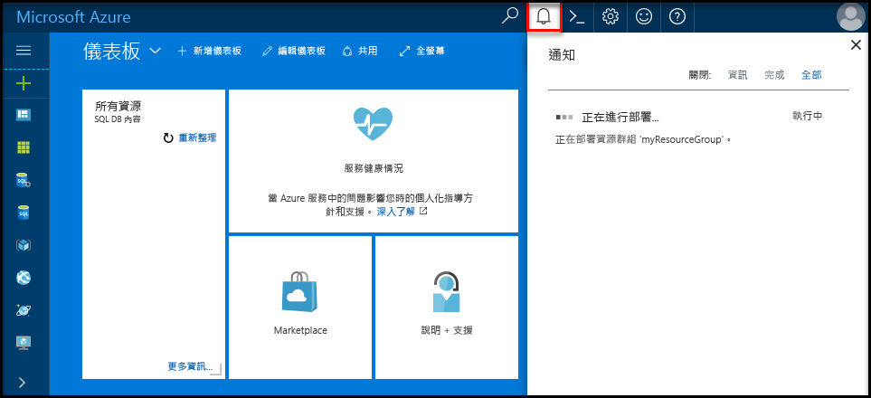
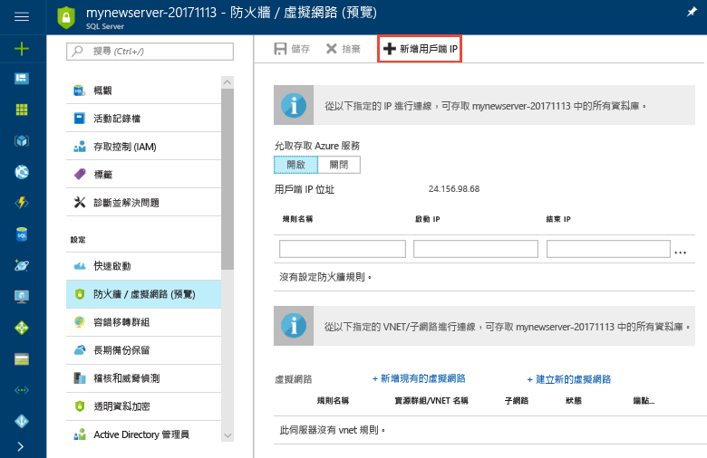

# <a name="use-polybase-to-load-data-from-azure-blob-storage-to-azure-sql-data-warehouse"></a>使用 PolyBase 將資料從 Azure Blob 儲存體載入 SQL 資料倉儲中

PolyBase 是將資料放入 SQL 資料倉儲的標準載入技術。 本教學課程中，您可以使用 PolyBase 將紐約計程車資料從 Azure blob 儲存體載入 Azure SQL 資料倉儲中。 本教學課程是使用 [Azure 入口網站](https://portal.azure.com)和 [SQL Server Management Studio](/sql/ssms/download-sql-server-management-studio-ssms.md) (SSMS)： 

> [!div class="checklist"]
> * 在 Azure 入口網站中建立資料倉儲
> * 在 Azure 入口網站中設定伺服器層級的防火牆規則
> * 使用 SSMS 連線到資料倉儲
> * 建立針對載入資料指定的使用者
> * 在 Azure Blob 儲存體中建立資料的外部資料表
> * 使用 CTAS T-SQL 陳述式將資料載入資料倉儲
> * 在載入時，檢閱資料的進度
> * 建立新載入資料的統計資料

如果您沒有 Azure 訂用帳戶，請在開始之前先[建立免費帳戶](https://azure.microsoft.com/free/)。

## <a name="before-you-begin"></a>開始之前

開始本教學課程之前，請下載並安裝最新版的 [SQL Server Management Studio](/sql/ssms/download-sql-server-management-studio-ssms.md) (SSMS)。


## <a name="log-in-to-the-azure-portal"></a>登入 Azure 入口網站

登入 [Azure 入口網站](https://portal.azure.com/)。

## <a name="create-a-blank-sql-data-warehouse"></a>建立空白的 SQL 資料倉儲

Azure SQL 資料倉儲會使用一組定義的[計算資源](performance-tiers.md)建立。 此資料庫建立於 [Azure 資源群組](../azure-resource-manager/resource-group-overview.md)和 [Azure SQL 邏輯伺服器](../sql-database/sql-database-features.md)內。 

遵循以下步驟來建立空白 SQL 資料倉儲。 

1. 按一下 Azure 入口網站左上角的 [新增] 按鈕。

2. 從 [新增] 頁面中選取 [資料庫]，然後在 [新增] 頁面的 [精選] 下選取 [SQL 資料倉儲]。

    

3. 在 SQL 資料倉儲表單中填寫下列資訊︰   

   | 設定 | 建議的值 | 說明 | 
   | ------- | --------------- | ----------- | 
   | **資料庫名稱** | mySampleDataWarehouse | 如需有效的資料庫名稱，請參閱[資料庫識別碼](/sql/relational-databases/databases/database-identifiers)。 | 
   | **訂用帳戶** | 您的訂用帳戶  | 如需訂用帳戶的詳細資訊，請參閱[訂用帳戶](https://account.windowsazure.com/Subscriptions)。 |
   | **資源群組** | myResourceGroup | 如需有效的資源群組名稱，請參閱[命名規則和限制](https://docs.microsoft.com/azure/architecture/best-practices/naming-conventions)。 |
   | **選取來源** | 空白資料庫 | 指定以建立空白資料庫。 請注意，資料倉儲是一種資料庫。|

    

4. 按一下 [伺服器] 為您的新資料庫建立及設定新的伺服器。 在**新伺服器表單**表單中填寫下列資訊︰ 

    | 設定 | 建議的值 | 說明 | 
    | ------- | --------------- | ----------- |
    | **伺服器名稱** | 任何全域唯一名稱 | 如需有效的伺服器名稱，請參閱[命名規則和限制](https://docs.microsoft.com/azure/architecture/best-practices/naming-conventions)。 | 
    | **伺服器管理員登入** | 任何有效名稱 | 如需有效的登入名稱，請參閱[資料庫識別碼](https://docs.microsoft.com/sql/relational-databases/databases/database-identifiers)。|
    | **密碼** | 任何有效密碼 | 您的密碼至少要有 8 個字元，而且必須包含下列幾種字元的其中三種︰大寫字元、小寫字元、數字和非英數字元。 |
    | **位置** | 任何有效位置 | 如需區域的相關資訊，請參閱 [Azure 區域](https://azure.microsoft.com/regions/)。 |

    

5. 按一下 [選取] 。

6. 按一下 [效能層] 可指定資料倉儲是否針對彈性或計算最佳化，以及資料倉儲單位的數目。 

7. 此教學課程中，選取 [針對彈性最佳化] 服務層。 根據預設，滑桿會設定為 **DW400**。  請嘗試向上和向下移動以查看其運作方式。 

    

8. 按一下 [Apply (套用)] 。
9. 在 [SQL 資料倉儲] 頁面上，針對空白資料庫選取 [定序]。 本教學課程使用預設值。 如需定序的詳細資訊，請參閱[定序](/sql/t-sql/statements/collations.md)。

11. 您現在已完成 SQL Database 表單，請按一下 [建立] 來佈建資料庫。 佈建需要幾分鐘的時間。 

    ![按一下 [建立]](media/load-data-from-azure-blob-storage-using-polybase/click-create.png)

12. 在工具列上，按一下 [通知] 以監視部署程序。
    
     

## <a name="create-a-server-level-firewall-rule"></a>建立伺服器層級防火牆規則

SQL 資料倉儲服務會在伺服器層級建立防火牆，防止外部應用程式和工具連線到伺服器或伺服器上的任何資料庫。 若要啟用連線，您可以新增防火牆規則以啟用特定 IP 位址之連線。  遵循以下步驟建立用戶端 IP 位址的[伺服器層級防火牆規則](../sql-database/sql-database-firewall-configure.md)。 

> [!NOTE]
> SQL 資料倉儲會透過連接埠 1433 通訊。 如果您嘗試從公司網路內進行連線，您網路的防火牆可能不允許透過連接埠 1433 的輸出流量。 若情況如此，除非 IT 部門開啟連接埠 1433，否則您無法連線至 Azure SQL Database 伺服器。
>

1. 部署完成之後，按一下左側功能表中的 [SQL Database]，然後按一下 [SQL Database] 頁面上的 [mySampleDatabase]。 資料庫的概觀頁面隨即開啟，其中會顯示完整伺服器名稱 (例如 **mynewserver-20171113.database.windows.net**)，並提供進一步的組態選項。 

2. 在後續的快速入門中，請複製此完整伺服器名稱，才能用來連線到伺服器及其資料庫。 然後按一下伺服器名稱以開啟伺服器設定。

     

3. 按一下伺服器名稱以開啟伺服器設定。

     

5. 按一下 [顯示防火牆設定]。 SQL Database 伺服器的 [防火牆設定] 頁面隨即開啟。 

     

4. 按一下工具列上的 [新增用戶端 IP]，將目前的 IP 位址新增至新的防火牆規則。 防火牆規則可以針對單一 IP 位址或 IP 位址範圍開啟連接埠 1433。

5. 按一下 [儲存] 。 系統便會為目前的 IP 位址建立伺服器層級防火牆規則，以便在邏輯伺服器上開啟連接埠 1433。

6. 依序按一下 [確定]，然後關閉 [防火牆設定] 頁面。

您現在可以使用這個 IP 位址連線到 SQL Server 及其資料倉儲。 可從 SQL Server Management Studio 或您選擇的另一個工具來運作連線。 當您連線時，請使用先前建立的 ServerAdmin 帳戶。  

> [!IMPORTANT]
> 根據預設，已對所有 Azure 服務啟用透過 SQL Database 防火牆存取。 在此頁面上按一下 [關閉]，然後按一下 [儲存] 可停用所有 Azure 服務的防火牆。

## <a name="get-the-fully-qualified-server-name"></a>取得完整的伺服器名稱

請在 Azure 入口網站中取得 SQL 伺服器的完整伺服器名稱。 稍後您在連線到伺服器時，要使用完整伺服器名稱。

1. 登入 [Azure 入口網站](https://portal.azure.com/)。
2. 從左側功能表中選取 [SQL Database]，按一下 [SQL Database]頁面上您的資料庫。 
3. 在 Azure 入口網站中您資料庫的 [基本資訊] 窗格中，找到後複製 [伺服器名稱]。 在此範例中，完整的名稱是 mynewserver 20171113.database.windows.net。 

      

## <a name="connect-to-the-server-as-server-admin"></a>以伺服器系統管理員身分連線到伺服器

本節使用 [SQL Server Management Studio](/sql/ssms/download-sql-server-management-studio-ssms.md) (SSMS) 建立對 Azure SQL Server 的連線。

1. 開啟 SQL Server Management Studio。

2. 在 [連接到伺服器] 對話方塊中，輸入下列資訊：

    | 設定      | 建議的值 | 說明 | 
    | ------------ | --------------- | ----------- | 
    | 伺服器類型 | 資料庫引擎 | 這是必要值 |
    | 伺服器名稱 | 完整伺服器名稱 | 名稱應該類似這樣︰**mynewserver-20171113.database.windows.net**。 |
    | 驗證 | SQL Server 驗證 | 在本教學課程中，我們只設定了 SQL 驗證這個驗證類型。 |
    | 登入 | 伺服器管理帳戶 | 這是您在建立伺服器時所指定的帳戶。 |
    | 密碼 | 伺服器管理帳戶的密碼 | 這是您在建立伺服器時所指定的密碼。 |

    

4. 按一下 [ **連接**]。 [物件總管] 視窗隨即在 SSMS 中開啟。 

5. 在 [物件總管] 中，展開 [資料庫]。 然後展開 [系統資料庫] 和 [主要資料庫] 來檢視主要資料庫中的物件。  展開 [mySampleDatabase] 可檢視新資料庫中的物件。

     

## <a name="create-a-user-for-loading-data"></a>建立載入資料的使用者

伺服器系統管理員帳戶旨在執行管理作業，並不適合用於在使用者資料上執行查詢。 載入資料通常需要大量記憶體。 [記憶體的最大值](performance-tiers.md#memory-maximums)是根據[效能層級](performance-tiers.md)和[資源類別](resource-classes-for-workload-management.md)來定義。 

您最好建立載入資料專用的登入和使用者。 然後將載入使用者新增至可進行適當最大記憶體配置的[資源類別](resource-classes-for-workload-management.md)。

因為您目前以伺服器管理員的身分連線，就可以建立登入和使用者。 使用下列步驟來建立登入和名為 **LoaderRC20** 的使用者。 然後將使用者指派至 **staticrc20** 資源類別。 

1.  在 SSMS 中，以滑鼠右鍵按一下 [主要資料庫] 可顯示下拉式選單，然後選擇 [新增查詢]。 新的查詢視窗隨即開啟。

    

2. 在查詢視窗中，輸入這些 T-SQL 命令來建立登入和名為 LoaderRC20 的使用者，以取代您自己的 'a123STRONGpassword!' 密碼。 

    ```sql
    CREATE LOGIN LoaderRC20 WITH PASSWORD = 'a123STRONGpassword!';
    CREATE USER LoaderRC20 FOR LOGIN LoaderRC20;
    ```

3. 按一下 [Execute (執行)] 。

4. 以滑鼠右鍵按一下 [mySampleDataWarehouse]，然後選擇 [新增查詢]。 新的查詢視窗隨即開啟。  

    
 
5. 輸入下列 T-SQL 命令，針對 LoaderRC20 登入建立名為 LoaderRC20 的資料庫使用者。 第二行會在新的資料倉儲上授與新的使用者控制權限。  這些權限類似於讓使用者成為資料庫的擁有者。 第三行會將新的使用者新增為 staticrc20 [資源類別](resource-classes-for-workload-management.md)的成員。

    ```sql
    CREATE USER LoaderRC20 FOR LOGIN LoaderRC20;
    GRANT CONTROL ON DATABASE::[mySampleDataWarehouse] to LoaderRC20;
    EXEC sp_addrolemember 'staticrc20', 'LoaderRC20';
    ```

6. 按一下 [Execute (執行)] 。

## <a name="connect-to-the-server-as-the-loading-user"></a>以載入使用者身分連線到伺服器

載入資料的首要步驟是以 LoaderRC20 身分登入。  

1. 在 [物件總管] 中，按一下 [連線] 下拉功能表並選取 [資料庫引擎]。 [連線到伺服器] 對話方塊隨即出現。

    

2. 輸入完整伺服器名稱，但這次輸入 **LoaderRC20** 作為登入。  輸入您 LoaderRC20 的密碼。

3. 按一下 [ **連接**]。

4. 您的連線就緒時，會在 [物件總管] 中看到兩個伺服器連線。 一個是以 ServerAdmin 連線，另一個是以 MedRCLogin 連線。

    

## <a name="create-external-tables-for-the-sample-data"></a>為範例資料建立外部資料表

您已準備好開始將資料載入新資料倉儲的程序。 本教學課程會示範如何使用 [Polybase](/sql/relational-databases/polybase/polybase-guide.md)從 Azure 儲存體 blob 載入紐約市計程車資料。 如需日後參考，要了解如何將您的資料置於 Azure blob 儲存體，或直接從您的來源將資料載入 SQL 資料倉儲，請參閱[載入概觀](sql-data-warehouse-overview-load.md)。

執行下列 SQL 指令碼可指定您要載入之資料的相關資訊。 這項資訊包括資料所在位置、資料內容的格式，以及資料的資料表定義。 

1. 在上一節中，您以 LoaderRC20 身分登入您的資料倉儲。 在 SSMS 中，以滑鼠右鍵按一下 [LoaderRC20] 連線，然後選取 [新增查詢]。  新的查詢視窗隨即開啟。 

    

2. 比較您的查詢視窗與上一個影像。  請確認您的 [新增查詢] 視窗是以 LoaderRC20 身分執行，並在 MySampleDataWarehouse 資料庫上執行查詢。 您可以使用這個查詢視窗來執行所有的載入步驟。

3. 建立 MySampleDataWarehouse 資料庫的主要金鑰。 您只需要為每個資料庫建立一次主要金鑰。 

    ```sql
    CREATE MASTER KEY;
    ```

4. 執行下列 [CREATE EXTERNAL DATA SOURCE](/sql/t-sql/statements/create-external-data-source-transact-sql.md) 陳述式來定義 Azure blob 的位置。 這是外部計程車資料的位置。  若要執行您已附加到查詢視窗中的命令，請反白顯示您需要執行的命令，然後按一下 [執行]。

    ```sql
    CREATE EXTERNAL DATA SOURCE NYTPublic
    WITH
    (
        TYPE = Hadoop,
        LOCATION = 'wasbs://2013@nytaxiblob.blob.core.windows.net/'
    );
    ```

5. 執行下列 [CREATE EXTERNAL FILE FORMAT](/sql/t-sql/statements/create-external-file-format-transact-sql.md) T-SQL 陳述式來指定格式的特性和外部資料檔案的選項。 這個陳述式會指定外部資料儲存為文字，並以管道 ('|') 字元來分隔值。 外部檔案是以 Gzip 壓縮。 

    ```sql
    CREATE EXTERNAL FILE FORMAT uncompressedcsv
    WITH (
        FORMAT_TYPE = DELIMITEDTEXT,
        FORMAT_OPTIONS ( 
            FIELD_TERMINATOR = ',',
            STRING_DELIMITER = '',
            DATE_FORMAT = '',
            USE_TYPE_DEFAULT = False
        )
    );
    CREATE EXTERNAL FILE FORMAT compressedcsv
    WITH ( 
        FORMAT_TYPE = DELIMITEDTEXT,
        FORMAT_OPTIONS ( FIELD_TERMINATOR = '|',
            STRING_DELIMITER = '',
        DATE_FORMAT = '',
            USE_TYPE_DEFAULT = False
        ),
        DATA_COMPRESSION = 'org.apache.hadoop.io.compress.GzipCodec'
    );
    ```

6.  執行下列 [CREATE SCHEMA](/sql/t-sql/statements/create-schema-transact-sql.md) 陳述式可建立外部檔案格式的結構描述。 結構描述會提供一種方式，讓您組織即將建立的外部資料表。

    ```sql
    CREATE SCHEMA ext;
    ```

7. 建立外部資料表。 資料表定義會儲存在 SQL 資料倉儲中，但資料表是參考儲存在 Azure blob 儲存體中的資料。 執行下列 T-SQL 命令來建立數個外部資料表，而這些資料表都指向我們先前在外部資料來源中定義的 Azure blob。

    ```sql
    CREATE EXTERNAL TABLE [ext].[Date] 
    (
        [DateID] int NOT NULL,
        [Date] datetime NULL,
        [DateBKey] char(10) COLLATE SQL_Latin1_General_CP1_CI_AS NULL,
        [DayOfMonth] varchar(2) COLLATE SQL_Latin1_General_CP1_CI_AS NULL,
        [DaySuffix] varchar(4) COLLATE SQL_Latin1_General_CP1_CI_AS NULL,
        [DayName] varchar(9) COLLATE SQL_Latin1_General_CP1_CI_AS NULL,
        [DayOfWeek] char(1) COLLATE SQL_Latin1_General_CP1_CI_AS NULL,
        [DayOfWeekInMonth] varchar(2) COLLATE SQL_Latin1_General_CP1_CI_AS NULL,
        [DayOfWeekInYear] varchar(2) COLLATE SQL_Latin1_General_CP1_CI_AS NULL,
        [DayOfQuarter] varchar(3) COLLATE SQL_Latin1_General_CP1_CI_AS NULL,
        [DayOfYear] varchar(3) COLLATE SQL_Latin1_General_CP1_CI_AS NULL,
        [WeekOfMonth] varchar(1) COLLATE SQL_Latin1_General_CP1_CI_AS NULL,
        [WeekOfQuarter] varchar(2) COLLATE SQL_Latin1_General_CP1_CI_AS NULL,
        [WeekOfYear] varchar(2) COLLATE SQL_Latin1_General_CP1_CI_AS NULL,
        [Month] varchar(2) COLLATE SQL_Latin1_General_CP1_CI_AS NULL,
        [MonthName] varchar(9) COLLATE SQL_Latin1_General_CP1_CI_AS NULL,
        [MonthOfQuarter] varchar(2) COLLATE SQL_Latin1_General_CP1_CI_AS NULL,
        [Quarter] char(1) COLLATE SQL_Latin1_General_CP1_CI_AS NULL,
        [QuarterName] varchar(9) COLLATE SQL_Latin1_General_CP1_CI_AS NULL,
        [Year] char(4) COLLATE SQL_Latin1_General_CP1_CI_AS NULL,
        [YearName] char(7) COLLATE SQL_Latin1_General_CP1_CI_AS NULL,
        [MonthYear] char(10) COLLATE SQL_Latin1_General_CP1_CI_AS NULL,
        [MMYYYY] char(6) COLLATE SQL_Latin1_General_CP1_CI_AS NULL,
        [FirstDayOfMonth] date NULL,
        [LastDayOfMonth] date NULL,
        [FirstDayOfQuarter] date NULL,
        [LastDayOfQuarter] date NULL,
        [FirstDayOfYear] date NULL,
        [LastDayOfYear] date NULL,
        [IsHolidayUSA] bit NULL,
        [IsWeekday] bit NULL,
        [HolidayUSA] varchar(50) COLLATE SQL_Latin1_General_CP1_CI_AS NULL
    )
    WITH
    (
        LOCATION = 'Date',
        DATA_SOURCE = NYTPublic,
        FILE_FORMAT = uncompressedcsv,
        REJECT_TYPE = value,
        REJECT_VALUE = 0
    ); 
    CREATE EXTERNAL TABLE [ext].[Geography]
    (
        [GeographyID] int NOT NULL,
        [ZipCodeBKey] varchar(10) COLLATE SQL_Latin1_General_CP1_CI_AS NOT NULL,
        [County] varchar(50) COLLATE SQL_Latin1_General_CP1_CI_AS NULL,
        [City] varchar(50) COLLATE SQL_Latin1_General_CP1_CI_AS NULL,
        [State] varchar(50) COLLATE SQL_Latin1_General_CP1_CI_AS NULL,
        [Country] varchar(50) COLLATE SQL_Latin1_General_CP1_CI_AS NULL,
        [ZipCode] varchar(50) COLLATE SQL_Latin1_General_CP1_CI_AS NULL
    )
    WITH
    (
        LOCATION = 'Geography',
        DATA_SOURCE = NYTPublic,
        FILE_FORMAT = uncompressedcsv,
        REJECT_TYPE = value,
        REJECT_VALUE = 0 
    );      
    CREATE EXTERNAL TABLE [ext].[HackneyLicense]
    (
        [HackneyLicenseID] int NOT NULL,
        [HackneyLicenseBKey] varchar(50) COLLATE SQL_Latin1_General_CP1_CI_AS NOT NULL,
        [HackneyLicenseCode] varchar(50) COLLATE SQL_Latin1_General_CP1_CI_AS NULL
    )
    WITH
    (
        LOCATION = 'HackneyLicense',
        DATA_SOURCE = NYTPublic,
        FILE_FORMAT = uncompressedcsv,
        REJECT_TYPE = value,
        REJECT_VALUE = 0
    );
    CREATE EXTERNAL TABLE [ext].[Medallion]
    (
        [MedallionID] int NOT NULL,
        [MedallionBKey] varchar(50) COLLATE SQL_Latin1_General_CP1_CI_AS NOT NULL,
        [MedallionCode] varchar(50) COLLATE SQL_Latin1_General_CP1_CI_AS NULL
    )
    WITH
    (
        LOCATION = 'Medallion',
        DATA_SOURCE = NYTPublic,
        FILE_FORMAT = uncompressedcsv,
        REJECT_TYPE = value,
        REJECT_VALUE = 0
    )
    ;  
    CREATE EXTERNAL TABLE [ext].[Time]
    (
        [TimeID] int NOT NULL,
        [TimeBKey] varchar(8) COLLATE SQL_Latin1_General_CP1_CI_AS NOT NULL,
        [HourNumber] tinyint NOT NULL,
        [MinuteNumber] tinyint NOT NULL,
        [SecondNumber] tinyint NOT NULL,
        [TimeInSecond] int NOT NULL,
        [HourlyBucket] varchar(15) COLLATE SQL_Latin1_General_CP1_CI_AS NOT NULL,
        [DayTimeBucketGroupKey] int NOT NULL,
        [DayTimeBucket] varchar(100) COLLATE SQL_Latin1_General_CP1_CI_AS NOT NULL
    )
    WITH
    (
        LOCATION = 'Time',
        DATA_SOURCE = NYTPublic,
        FILE_FORMAT = uncompressedcsv,
        REJECT_TYPE = value,
        REJECT_VALUE = 0
    );
    CREATE EXTERNAL TABLE [ext].[Trip]
    (
        [DateID] int NOT NULL,
        [MedallionID] int NOT NULL,
        [HackneyLicenseID] int NOT NULL,
        [PickupTimeID] int NOT NULL,
        [DropoffTimeID] int NOT NULL,
        [PickupGeographyID] int NULL,
        [DropoffGeographyID] int NULL,
        [PickupLatitude] float NULL,
        [PickupLongitude] float NULL,
        [PickupLatLong] varchar(50) COLLATE SQL_Latin1_General_CP1_CI_AS NULL,
        [DropoffLatitude] float NULL,
        [DropoffLongitude] float NULL,
        [DropoffLatLong] varchar(50) COLLATE SQL_Latin1_General_CP1_CI_AS NULL,
        [PassengerCount] int NULL,
        [TripDurationSeconds] int NULL,
        [TripDistanceMiles] float NULL,
        [PaymentType] varchar(50) COLLATE SQL_Latin1_General_CP1_CI_AS NULL,
        [FareAmount] money NULL,
        [SurchargeAmount] money NULL,
        [TaxAmount] money NULL,
        [TipAmount] money NULL,
        [TollsAmount] money NULL,
        [TotalAmount] money NULL
    )
    WITH
    (
        LOCATION = 'Trip2013',
        DATA_SOURCE = NYTPublic,
        FILE_FORMAT = compressedcsv,
        REJECT_TYPE = value,
        REJECT_VALUE = 0
    );
    CREATE EXTERNAL TABLE [ext].[Weather]
    (
        [DateID] int NOT NULL,
        [GeographyID] int NOT NULL,
        [PrecipitationInches] float NOT NULL,
        [AvgTemperatureFahrenheit] float NOT NULL
    )
    WITH
    (
        LOCATION = 'Weather',
        DATA_SOURCE = NYTPublic,
        FILE_FORMAT = uncompressedcsv,
        REJECT_TYPE = value,
        REJECT_VALUE = 0
    )
    ;
    ```

8. 在 [物件總管] 中，展開 [mySampleDataWarehouse] 可查看您剛才建立的外部資料表清單。

    

## <a name="load-the-data-into-your-data-warehouse"></a>將資料載入資料倉儲

本節會使用您剛定義的外部資料表，將範例資料從 Azure 儲存體 Blob 載入 SQL 資料倉儲中。  

指令碼會使用 [CREATE TABLE AS SELECT (CTAS)](/sql/t-sql/statements/create-table-as-select-azure-sql-data-warehouse.md) T-SQL 陳述式，將資料從 Azure 儲存體 Blob 載入資料倉儲中的新資料表。 CTAS 會以 select 陳述式的結果作為基礎，建立新的資料表。 新的資料表擁有和 select 陳述式結果相同的資料行和資料類型。 當 select 陳述式從外部資料表選取時，SQL 資料倉儲會將資料匯入資料倉儲中的關聯式資料表。 

1. 執行下列指令碼，將資料載入資料倉儲中的新資料表。

    ```sql
    CREATE TABLE [dbo].[Date]
    WITH
    ( 
        DISTRIBUTION = ROUND_ROBIN,
        CLUSTERED COLUMNSTORE INDEX
    )
    AS SELECT * FROM [ext].[Date]
    OPTION (LABEL = 'CTAS : Load [dbo].[Date]')
    ;
    CREATE TABLE [dbo].[Geography]
    WITH
    ( 
        DISTRIBUTION = ROUND_ROBIN,
        CLUSTERED COLUMNSTORE INDEX
    )
    AS
    SELECT * FROM [ext].[Geography]
    OPTION (LABEL = 'CTAS : Load [dbo].[Geography]')
    ;
    CREATE TABLE [dbo].[HackneyLicense]
    WITH
    ( 
        DISTRIBUTION = ROUND_ROBIN,
        CLUSTERED COLUMNSTORE INDEX
    )
    AS SELECT * FROM [ext].[HackneyLicense]
    OPTION (LABEL = 'CTAS : Load [dbo].[HackneyLicense]')
    ;
    CREATE TABLE [dbo].[Medallion]
    WITH
    (
        DISTRIBUTION = ROUND_ROBIN,
        CLUSTERED COLUMNSTORE INDEX
    )
    AS SELECT * FROM [ext].[Medallion]
    OPTION (LABEL = 'CTAS : Load [dbo].[Medallion]')
    ;
    CREATE TABLE [dbo].[Time]
    WITH
    (
        DISTRIBUTION = ROUND_ROBIN,
        CLUSTERED COLUMNSTORE INDEX
    )
    AS SELECT * FROM [ext].[Time]
    OPTION (LABEL = 'CTAS : Load [dbo].[Time]')
    ;
    CREATE TABLE [dbo].[Weather]
    WITH
    ( 
        DISTRIBUTION = ROUND_ROBIN,
        CLUSTERED COLUMNSTORE INDEX
    )
    AS SELECT * FROM [ext].[Weather]
    OPTION (LABEL = 'CTAS : Load [dbo].[Weather]')
    ;
    CREATE TABLE [dbo].[Trip]
    WITH
    (
        DISTRIBUTION = ROUND_ROBIN,
        CLUSTERED COLUMNSTORE INDEX
    )
    AS SELECT * FROM [ext].[Trip]
    OPTION (LABEL = 'CTAS : Load [dbo].[Trip]')
    ;
    ```

2. 檢視載入中的資料。 您會載入數 GB 的資料，並將其壓縮成高效能的叢集資料行存放區索引。 執行下列會使用動態管理檢視 (DMV) 來顯示載入狀態的查詢。 啟動查詢之後，喝咖啡吃點心等候 SQL 資料倉儲進行一些繁重的工作。

    ```sql
    SELECT
        r.command,
        s.request_id,
        r.status,
        count(distinct input_name) as nbr_files,
        sum(s.bytes_processed)/1024/1024/1024 as gb_processed
    FROM 
        sys.dm_pdw_exec_requests r
        INNER JOIN sys.dm_pdw_dms_external_work s
        ON r.request_id = s.request_id
    WHERE
        r.[label] = 'CTAS : Load [dbo].[Date]' OR
        r.[label] = 'CTAS : Load [dbo].[Geography]' OR
        r.[label] = 'CTAS : Load [dbo].[HackneyLicense]' OR
        r.[label] = 'CTAS : Load [dbo].[Medallion]' OR
        r.[label] = 'CTAS : Load [dbo].[Time]' OR
        r.[label] = 'CTAS : Load [dbo].[Weather]' OR
        r.[label] = 'CTAS : Load [dbo].[Trip]'
    GROUP BY
        r.command,
        s.request_id,
        r.status
    ORDER BY
        nbr_files desc, 
        gb_processed desc;
    ```

3. 檢視所有系統查詢。

    ```sql
    SELECT * FROM sys.dm_pdw_exec_requests;
    ```

4. 輕鬆看著資料順利載入資料倉儲中。

    

## <a name="create-statistics-on-newly-loaded-data"></a>建立新載入資料的統計資料

SQL 資料倉儲不會自動建立或自動更新統計資料。 因此，若要達到高查詢效能，請務必在第一次載入後，於每個資料表的每個資料行上建立統計資料。 另外，也請務必在大幅變更資料後更新統計資料。

1. 執行這些命令可在要用於聯結的資料行上建立統計資料。

    ```sql
    CREATE STATISTICS [dbo.Date DateID stats] ON dbo.Date (DateID);
    CREATE STATISTICS [dbo.Trip DateID stats] ON dbo.Trip (DateID);
    ```

## <a name="clean-up-resources"></a>清除資源

您需要支付計算資源和您載入資料倉儲之資料的費用。 這些會分開計費。 

- 如果您需要將資料保留在儲存體中，可以在您不使用資料倉儲時暫停運算。 暫停計算時，您只需支付資料儲存體的費用，並在您準備好要使用資料時，隨時繼續計算。
- 如果您需要移除未來的費用，可以將資料倉儲刪除。 

遵循下列步驟，視需要清除資源。

1. 登入 [Azure 入口網站](https://portal.azure.com)，按一下您的資料倉儲。

    

2. 若要暫停計算，請按一下 [暫停] 按鈕。 資料倉儲暫停時，您會看到 [啟動] 按鈕。  若要繼續計算，請按一下 [啟動]。

3. 若要移除資料倉儲而不再支付運算或儲存體的費用，請按一下 [刪除]。

4. 若要移除您所建立的 SQL Server，請按一下先前映像中的 [mynewserver 20171113.database.windows.net]，然後按一下 [刪除]。  請謹慎使用這個，因為刪除伺服器會將所有指派給伺服器的資料庫刪除。

5. 若要移除此資源群組，請按一下 [myResourceGroup]，然後按一下 [刪除資源群組]。

## <a name="next-steps"></a>後續步驟 
在本教學課程中，您已了解如何建立資料倉儲，以及建立載入資料的使用者。 建立外部資料表來定義儲存在 Azure 儲存體 Blob 中的資料結構，然後使用 PolyBase CREATE TABLE AS SELECT 陳述式將資料載入資料倉儲。 

您進行了下列事項：
> [!div class="checklist"]
> * 在 Azure 入口網站中建立資料倉儲
> * 在 Azure 入口網站中設定伺服器層級的防火牆規則
> * 使用 SSMS 連線到資料倉儲
> * 建立針對載入資料指定的使用者
> * 在 Azure 儲存體 Blob 中建立資料的外部資料表
> * 使用 CTAS T-SQL 陳述式將資料載入資料倉儲
> * 在載入時，已檢閱資料的進度
> * 建立新載入資料的統計資料

前進到移轉概觀，以了解如何將現有的資料庫移轉至 SQL 資料倉儲。

> [!div class="nextstepaction"]
>[了解如何將現有的資料庫移轉至 SQL 資料倉儲](sql-data-warehouse-overview-migrate.md)
