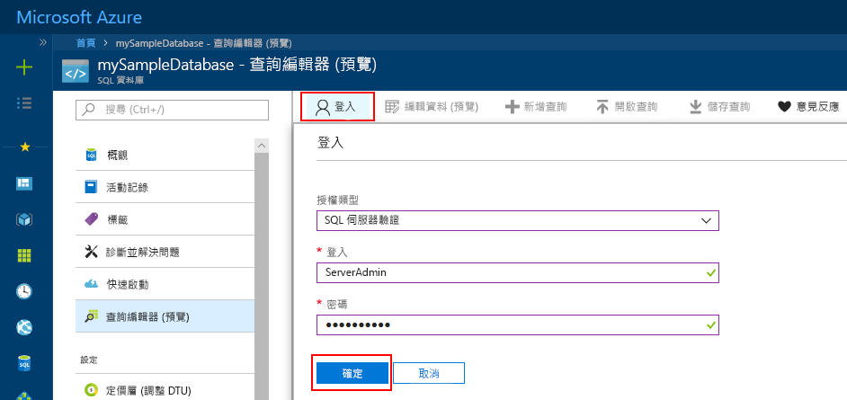

# <a name="quickstart-azure-portal-use-the-sql-query-editor-to-connect-and-query-data"></a>快速入門：Azure 入口網站：使用 SQL 查詢編輯器進行連線並查詢資料

SQL 查詢編輯器是瀏覽器查詢工具，可讓您有效率且輕鬆地在 Azure SQL Database 或 Azure SQL 資料倉儲上執行 SQL 查詢，且不需要離開 Azure 入口網站。 此快速入門會示範如何使用查詢編輯器來連線至 SQL Database，然後使用 Transact-SQL 陳述式來查詢、插入、更新和刪除資料庫中的資料。

## <a name="prerequisites"></a>必要條件

本快速入門可作為在其中一個快速入門中所建立資源的起點︰

[!INCLUDE [prerequisites-create-db](../../includes/sql-database-connect-query-prerequisites-create-db-includes.md)]

> [!NOTE]
> 在 SQL Server 防火牆設定中，確定 [允許存取 Azure 服務] 選項設為 [開啟]。 此選項會允許 SQL 查詢編輯器存取您的資料庫和資料倉儲。

## <a name="log-in-to-the-azure-portal"></a>登入 Azure 入口網站

登入 [Azure 入口網站](https://portal.azure.com/)。


## <a name="connect-using-sql-authentication"></a>使用 SQL 驗證進行連線

1. 從左側功能表中按一下 [SQL 資料庫]，然後按一下您要查詢的資料庫。

2. 在您資料庫的 SQL 資料庫頁面上，尋找並按一下左側功能表中的 [查詢編輯器 (預覽)]。

    

3. 按一下 [登入]，然後在出現提示時選取 [SQL Server 驗證]，接著提供建立資料庫時提供的伺服器管理員登入和密碼。

    

4. 按一下 [確定] 以登入。


## <a name="connect-using-azure-ad"></a>使用 Azure AD 進行連線

設定 Active Directory 管理員，可讓您使用單一識別身分登入 Azure 入口網站和您的 SQL 資料庫。 請遵循下列步驟，為您建立的 SQL Server 設定 Active Directory 管理員。

> [!NOTE]
> 不支援使用電子郵件帳戶 (例如 outlook.com、hotmail.com、live.com、gmail.com 或 yahoo.com) 作為 Active Directory 管理員。 請務必選擇在 Azure Active Directory 原生建立的使用者，或是 Azure Active Directory 的同盟使用者。

1. 從左側功能表中選取 [SQL Server]，並從伺服器清單中選取您的 SQL Server。

2. 在 SQL Server 的設定功能表中，選取 [Active Directory 管理員] 設定。

3. 在 [Active Directory 管理員] 刀鋒視窗中，按一下 [設定管理員] 命令，然後選取將成為 Active Directory 管理員的使用者或群組。

    

4. 在 [Active Directory 管理員] 刀鋒視窗的頂端，按一下 [儲存] 命令，來設定您的 Active Directory 管理員。

瀏覽至您要查詢的 SQL 資料庫，從左側功能表按一下 [資料總管 (預覽)]。 資料總管分頁隨即開啟，並會自動將您連線至資料庫。


## <a name="run-query-using-query-editor"></a>使用查詢編輯器執行查詢

經過驗證後，在查詢編輯器窗格中輸入下列查詢，即可查詢到依類別分類的前 20 個產品。

```sql
 SELECT TOP 20 pc.Name as CategoryName, p.name as ProductName
 FROM SalesLT.ProductCategory pc
 JOIN SalesLT.Product p
 ON pc.productcategoryid = p.productcategoryid;
```

按一下 [執行]，然後在 [結果] 窗格中檢閱查詢結果。


## <a name="insert-data-using-query-editor"></a>使用查詢編輯器插入資料

使用下列程式碼，藉由使用 [INSERT](https://msdn.microsoft.com/library/ms174335.aspx) Transact-SQL 陳述式將新產品插入 SalesLT.Product 資料表中。

1. 在查詢視窗中，以下列查詢取代先前的查詢︰

   ```sql
   INSERT INTO [SalesLT].[Product]
           ( [Name]
           , [ProductNumber]
           , [Color]
           , [ProductCategoryID]
           , [StandardCost]
           , [ListPrice]
           , [SellStartDate]
           )
     VALUES
           ('myNewProduct'
           ,123456789
           ,'NewColor'
           ,1
           ,100
           ,100
           ,GETDATE() );
   ```

2. 在工具列上，按一下 [執行] 以在 Product 資料表中插入新資料列。

## <a name="update-data-using-query-editor"></a>使用查詢編輯器更新資料

使用下列程式碼，藉由使用 [UPDATE](https://msdn.microsoft.com/library/ms177523.aspx) Transact-SQL 陳述式更新您先前新增的產品。

1. 在查詢視窗中，以下列查詢取代先前的查詢︰

   ```sql
   UPDATE [SalesLT].[Product]
   SET [ListPrice] = 125
   WHERE Name = 'myNewProduct';
   ```

2. 在工具列上，按一下 [執行] 以在 Product 資料表中更新指定的資料列。

## <a name="delete-data-using-query-editor"></a>使用查詢編輯器刪除資料

使用下列程式碼，藉由使用 [DELETE](https://msdn.microsoft.com/library/ms189835.aspx) Transact-SQL 陳述式刪除您先前新增的產品。

1. 在查詢視窗中，以下列查詢取代先前的查詢︰

   ```sql
   DELETE FROM [SalesLT].[Product]
   WHERE Name = 'myNewProduct';
   ```

2. 在工具列上，按一下 [執行] 以在 Product 資料表中刪除指定的資料列。


## <a name="query-editor-considerations"></a>查詢編輯器的考量

使用查詢編輯器時，有一些使用事項須注意：

1. 在 Azure SQL Server 防火牆設定中，確定 [允許存取 Azure 服務] 選項已設為 [開啟]。 此選項會允許 SQL 查詢編輯器存取您的 SQL 資料庫和資料倉儲。

2. 如果 SQL 伺服器位於虛擬網路中，則無法使用查詢編輯器來查詢該伺服器中的資料庫。

3. 按 F5 鍵將會重新整理 [查詢編輯器] 頁面，但會遺失正在處理的查詢。 使用工具列上的 [執行] 按鈕來執行查詢。

4. 查詢編輯器不支援與主要 DB 連線

5. 查詢執行的逾時時間是 5 分鐘。

6. Azure Active Directory 管理員登入不適用於啟用雙因素驗證的帳戶。

7. 不支援使用電子郵件帳戶 (例如 outlook.com、hotmail.com、live.com、gmail.com 或 yahoo.com) 作為 Active Directory 管理員。 請務必選擇在 Azure Active Directory 原生建立的使用者，或是 Azure Active Directory 的同盟使用者

8. 查詢編輯器僅支援地理資料類型的圓柱形投影。

9. 不支援用於資料庫表格和檢視的 IntelliSense。 不過，編輯器支援已輸入名稱的自動完成功能。


## <a name="next-steps"></a>後續步驟

- 若要深入了解 Azure SQL 資料庫中的 Transact-SQL 支援，請參閱 [SQL 資料庫中的 Transact-SQL 差異](sql-database-transact-sql-information.md)。
