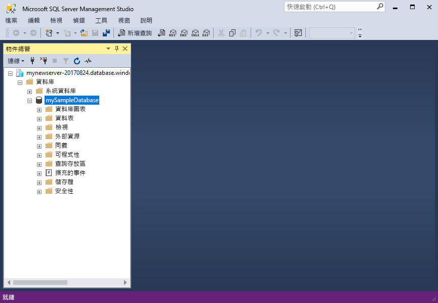
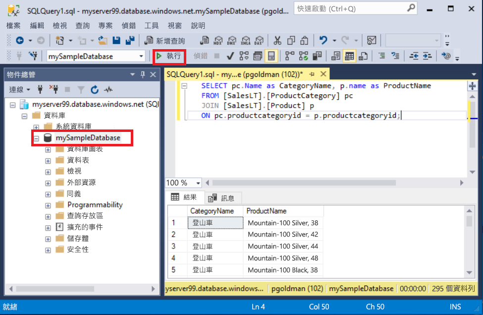
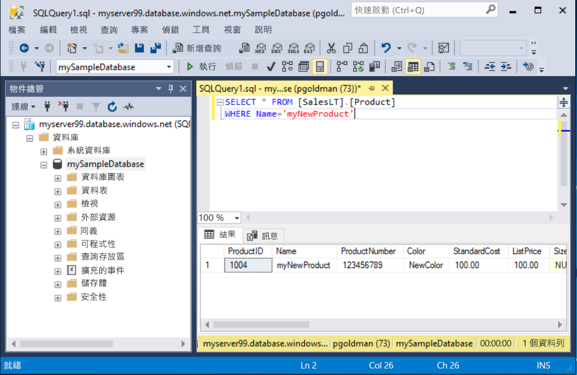

# <a name="quickstart-use-sql-server-management-studio-to-connect-and-query-an-azure-sql-database"></a>快速入門：使用 SQL Server Management Studio 連線和查詢 Azure SQL Database

在本快速入門中，您將使用 [SQL Server Management Studio][ssms-install-latest-84g] (SSMS) 來連線到 Azure SQL 資料庫。 接著，您將執行 Transact-SQL 陳述式來查詢、插入、更新和刪除資料。 您可以使用 SSMS 來管理任何 SQL 基礎結構，範圍從 Microsoft Windows 的 SQL Server 到 SQL Database。  

## <a name="prerequisites"></a>必要條件

- Azure SQL Database。 您可以使用其中一個快速入門，在 Azure SQL Database 中建立資料庫並加以設定：

  || 單一資料庫 | 受控執行個體 |
  |:--- |:--- |:---|
  | 建立| [入口網站](sql-database-single-database-get-started.md) | [入口網站](sql-database-managed-instance-get-started.md) |
  || [CLI](scripts/sql-database-create-and-configure-database-cli.md) | [CLI](https://medium.com/azure-sqldb-managed-instance/working-with-sql-managed-instance-using-azure-cli-611795fe0b44) |
  || [PowerShell](scripts/sql-database-create-and-configure-database-powershell.md) | [PowerShell](scripts/sql-database-create-configure-managed-instance-powershell.md) |
  | 設定 | [伺服器層級 IP 防火牆規則](sql-database-server-level-firewall-rule.md)| [VM 的連線能力](sql-database-managed-instance-configure-vm.md)|
  |||[現場的連線能力](sql-database-managed-instance-configure-p2s.md)
  |載入資料|每個快速入門載入的 Adventure Works|[還原 Wide World Importers](sql-database-managed-instance-get-started-restore.md)
  |||從 [GitHub](https://github.com/Microsoft/sql-server-samples/tree/master/samples/databases/adventure-works) 中的 [BACPAC](sql-database-import.md) 檔案還原或匯入 Adventure Works|
  |||

  > [!IMPORTANT]
  > 本文中已撰寫的指令碼會使用 Adventure Works 資料庫。 對於受控執行個體，您必須將 Adventure Works 資料庫匯入執行個體資料庫中，或將本文中的指令碼修改為使用 Wide World Importers 資料庫。

## <a name="install-the-latest-ssms"></a>安裝最新的 SSMS

在開始之前，請確定您已安裝最新的 [SSMS][ssms-install-latest-84g]。

## <a name="get-sql-server-connection-information"></a>取得 SQL Server 連線資訊

取得連線到 Azure SQL Database 所需的連線資訊。 在後續程序中，您將需要完整的伺服器名稱或主機名稱、資料庫名稱和登入資訊。

1. 登入 [Azure 入口網站](https://portal.azure.com/)。

2. 瀏覽至 [SQL 資料庫] 或 [SQL 受控執行個體] 頁面。

3. 在 [概觀] 頁面上，針對單一資料庫檢閱 [伺服器名稱] 旁的完整伺服器名稱，若為受控執行個體，則檢閱 [主機] 旁的完整伺服器名稱。 若要複製伺服器名稱或主機名稱，請將滑鼠暫留在其上方，然後選取 [複製] 圖示。

## <a name="connect-to-your-database"></a>連接到您的資料庫

在 SMSS 中，連線到您的 Azure SQL Database 伺服器。

> [!IMPORTANT]
> Azure SQL Database 伺服器會接聽連接埠 1433。 若要連線到公司防火牆後方的 SQL Database 伺服器，該防火牆必須開啟此連接埠。
>

1. 開啟 SSMS。 [連線到伺服器] 對話方塊隨即出現。

2. 輸入以下資訊：

   | 設定      | 建議的值    | 說明 |
   | ------------ | ------------------ | ----------- |
   | **伺服器類型** | 資料庫引擎 | 必要值。 |
   | **伺服器名稱** | 完整伺服器名稱 | 應該類似這樣︰**mynewserver20170313.database.windows.net**。 |
   | **驗證** | SQL Server 驗證 | 本教學課程使用 SQL 驗證。 |
   | **登入** | 伺服器管理帳戶使用者識別碼 | 建立伺服器時所使用伺服器系統管理員帳戶的使用者識別碼。 |
   | **密碼** | 伺服器系統管理員帳戶密碼 | 建立伺服器時所使用伺服器系統管理員帳戶的密碼。 |
   ||||

     

3. 選取 [連線到伺服器] 對話方塊中的 [選項]。 在 [連線到伺服器] 下拉式功能表中，選取 **mySampleDatabase**。

     

4. 選取 [ **連接**]。 此時會開啟 [物件總管] 視窗。

5. 若要檢視資料庫的物件，請展開 [資料庫]，然後展開 **mySampleDatabase**。

     

## <a name="query-data"></a>查詢資料

執行此 [SELECT](https://msdn.microsoft.com/library/ms189499.aspx) Transact-SQL 程式碼，依照類別查詢前 20 項產品。

1. 在 [物件總管] 中，於 **mySampleDatabase** 上按一下滑鼠右鍵，然後選取 [新增查詢]。 連線到您資料庫的新查詢視窗將會開啟。

2. 在查詢視窗中，貼上此 SQL 查詢。

   ```sql
   SELECT pc.Name as CategoryName, p.name as ProductName
   FROM [SalesLT].[ProductCategory] pc
   JOIN [SalesLT].[Product] p
   ON pc.productcategoryid = p.productcategoryid;
   ```

3. 在工具列上，選取 [執行] 以擷取 `Product` 和 `ProductCategory` 資料表中的資料。

    

## <a name="insert-data"></a>插入資料

執行此 [INSERT](https://msdn.microsoft.com/library/ms174335.aspx) Transact-SQL 程式碼，以在 `SalesLT.Product` 資料表中建立新產品。

1. 使用此查詢取代先前的查詢。

   ```sql
   INSERT INTO [SalesLT].[Product]
           ( [Name]
           , [ProductNumber]
           , [Color]
           , [ProductCategoryID]
           , [StandardCost]
           , [ListPrice]
           , [SellStartDate] )
     VALUES
           ('myNewProduct'
           ,123456789
           ,'NewColor'
           ,1
           ,100
           ,100
           ,GETDATE() );
   ```

2. 選取 [執行] 以在 `Product` 資料表中插入新資料列。 [訊息] 窗格會顯示 [(1 個資料列受影響)]。

## <a name="view-the-result"></a>檢視結果

1. 使用此查詢取代先前的查詢。

   ```sql
   SELECT * FROM [SalesLT].[Product]
   WHERE Name='myNewProduct'
   ```

2. 選取 [執行] 。 此時會出現下列結果。

   

## <a name="update-data"></a>更新資料

執行此 [UPDATE](https://msdn.microsoft.com/library/ms177523.aspx) Transact-SQL 程式碼以修改您的新產品。

1. 使用此查詢取代先前的查詢。

   ```sql
   UPDATE [SalesLT].[Product]
   SET [ListPrice] = 125
   WHERE Name = 'myNewProduct';
   ```

2. 選取 [執行] 以在 `Product` 資料表中更新指定的資料列。 [訊息] 窗格會顯示 [(1 個資料列受影響)]。

## <a name="delete-data"></a>刪除資料

執行此 [DELETE](https://msdn.microsoft.com/library/ms189835.aspx) Transact-SQL 程式碼以移除新產品。

1. 使用此查詢取代先前的查詢。

   ```sql
   DELETE FROM [SalesLT].[Product]
   WHERE Name = 'myNewProduct';
   ```

2. 選取 [執行] 以在 `Product` 資料表中刪除指定的資料列。 [訊息] 窗格會顯示 [(1 個資料列受影響)]。

## <a name="next-steps"></a>後續步驟

- 如需有關 SSMS 的資訊，請參閱 [SQL Server Management Studio](https://msdn.microsoft.com/library/ms174173.aspx)。
- 若要使用 Azure 入口網站連線及查詢，請參閱[使用 Azure 入口網站 SQL 查詢編輯器連線和查詢](sql-database-connect-query-portal.md)。
- 若要使用 Visual Studio Code 進行連線和查詢，請參閱[使用 Visual Studio Code 進行連線和查詢](sql-database-connect-query-vscode.md)。
- 若要使用 .NET 進行連線和查詢，請參閱[使用 .NET 進行連線和查詢](sql-database-connect-query-dotnet.md)。
- 若要使用 PHP 進行連線和查詢，請參閱[使用 PHP 進行連線和查詢](sql-database-connect-query-php.md)。
- 若要使用 Node.js 進行連線和查詢，請參閱[使用 Node.js 進行連線和查詢](sql-database-connect-query-nodejs.md)。
- 若要使用 Java 進行連線和查詢，請參閱[使用 Java 進行連線和查詢](sql-database-connect-query-java.md)。
- 若要使用 Python 進行連線和查詢，請參閱[使用 Python 進行連線和查詢](sql-database-connect-query-python.md)。
- 若要使用 Ruby 進行連線和查詢，請參閱[使用 Ruby 進行連線和查詢](sql-database-connect-query-ruby.md)。

<!-- Article link references. -->

[ssms-install-latest-84g]: https://docs.microsoft.com/sql/ssms/sql-server-management-studio-ssms