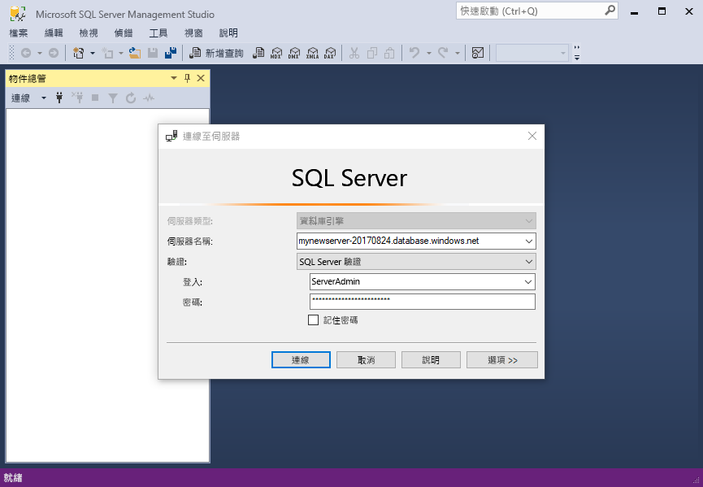

<a id="azure-sql-database-use-sql-server-management-studio-to-connect-and-query-data" class="xliff"></a>

# Azure SQL Database：使用 SQL Server Management Studio 連接及查詢資料

[SQL Server Management Studio](https://msdn.microsoft.com/library/ms174173.aspx) (SSMS) 是整合式的環境，可用來管理任何 SQL 基礎結構，範圍從 Microsoft Windows 的 SQL Server 到 SQL Database。 此快速入門示範如何使用 SSMS 來連線至 Azure SQL Database，然後使用 Transact-SQL 陳述式來查詢、插入、更新和刪除資料庫中的資料。 

<a id="prerequisites" class="xliff"></a>

## 必要條件

本快速入門可做為在其中一個快速入門中建立之資源的起點︰

- [建立 DB - 入口網站](sql-database-get-started-portal.md)
- [建立 DB - CLI](sql-database-get-started-cli.md)
- [建立 DB - PowerShell](sql-database-get-started-powershell.md)

開始之前，確定您已安裝最新版的 [SSMS](https://msdn.microsoft.com/library/mt238290.aspx)。 

<a id="get-connection-information" class="xliff"></a>

## 取得連線資訊

取得連線到 Azure SQL Database 所需的連線資訊。 您在下一個程序中需要完整的伺服器名稱、資料庫名稱和登入資訊。

1. 登入 [Azure 入口網站](https://portal.azure.com/)。
2. 從左側功能表中選取 [SQL Database]，按一下 [SQL Database]頁面上您的資料庫。 
3. 在您資料庫的 [概觀] 頁面上，檢閱如下圖所示的完整伺服器名稱。 您可以將滑鼠移至伺服器名稱上，以帶出 [按一下以複製] 選項。

    

4. 如果您忘記 Azure SQL Database 伺服器的登入資訊，請瀏覽至 [SQL Database 伺服器] 頁面來檢視伺服器系統管理員名稱，並視需要重設密碼。 

<a id="connect-to-your-database" class="xliff"></a>

## 連接到您的資料庫

使用 SQL Server Management Studio (SSMS) 建立對 Azure SQL Database 伺服器的連線。 

> [!IMPORTANT]
> Azure SQL Database 邏輯伺服器會接聽連接埠 1433。 如果您嘗試從公司防火牆連線至 Azure SQL Database 邏輯伺服器，則必須在公司防火牆中開啟此連接埠，您才能成功連線。
>

1. 開啟 SQL Server Management Studio。

2. 在 [連接到伺服器] 對話方塊中，輸入下列資訊：

   | 設定       | 建議的值 | 說明 | 
   | ------------ | ------------------ | ------------------------------------------------- | 
   | **伺服器類型** | 資料庫引擎 | 需要此值。 |
   | **伺服器名稱** | 完整伺服器名稱 | 此名稱應該類似這樣︰**mynewserver20170313.database.windows.net**。 |
   | **驗證** | SQL Server 驗證 | 在本教學課程中，我們只設定了 SQL 驗證這個驗證類型。 |
   | **登入** | 伺服器管理帳戶 | 這是您在建立伺服器時所指定的帳戶。 |
   | **密碼** | 伺服器管理帳戶的密碼 | 這是您在建立伺服器時所指定的密碼。 |

     

3. 按一下 [連接到伺服器] 對話方塊中的 [選項]。 在 [連線到資料庫] 區段中，輸入 **mySampleDatabase** 以連線到這個資料庫。

     

4. 按一下 [ **連接**]。 [物件總管] 視窗隨即在 SSMS 中開啟。 

     

5. 在 [物件總管] 中，展開 [資料庫]，然後展開 [mySampleDatabase] 以檢視範例資料庫中的物件。

<a id="query-data" class="xliff"></a>

## 查詢資料

使用下列程式碼，可藉由使用 [SELECT](https://msdn.microsoft.com/library/ms189499.aspx) Transact-SQL 陳述式來依照類別查詢前 20 項產品。

1. 在 [物件總管] 中，於 **mySampleDatabase** 上按一下滑鼠右鍵，然後按一下 [新增查詢]。 隨即開啟已連線到您資料庫的空白查詢視窗。
2. 在查詢視窗中，輸入下列查詢︰

   ```sql
   SELECT pc.Name as CategoryName, p.name as ProductName
   FROM [SalesLT].[ProductCategory] pc
   JOIN [SalesLT].[Product] p
   ON pc.productcategoryid = p.productcategoryid;
   ```

3. 在工具列上，按一下 [執行] 來擷取 Product 和 ProductCategory 資料表中的資料。

    

<a id="insert-data" class="xliff"></a>

## 插入資料

使用下列程式碼，藉由使用 [INSERT](https://msdn.microsoft.com/library/ms174335.aspx) Transact-SQL 陳述式將新產品插入 SalesLT.Product 資料表中。

1. 在查詢視窗中，以下列查詢取代先前的查詢︰

   ```sql
   INSERT INTO [SalesLT].[Product]
           ( [Name]
           , [ProductNumber]
           , [Color]
           , [ProductCategoryID]
           , [StandardCost]
           , [ListPrice]
           , [SellStartDate]
           )
     VALUES
           ('myNewProduct'
           ,123456789
           ,'NewColor'
           ,1
           ,100
           ,100
           ,GETDATE() );
   ```

2. 在工具列上，按一下 [執行] 以在Product 資料表中插入新資料列。

    

<a id="update-data" class="xliff"></a>

## 更新資料

使用下列程式碼，藉由使用 [UPDATE](https://msdn.microsoft.com/library/ms177523.aspx) Transact-SQL 陳述式更新您先前新增的產品。

1. 在查詢視窗中，以下列查詢取代先前的查詢︰

   ```sql
   UPDATE [SalesLT].[Product]
   SET [ListPrice] = 125
   WHERE Name = 'myNewProduct';
   ```

2. 在工具列上，按一下 [執行] 以在Product 資料表中更新指定的資料列。

    

<a id="delete-data" class="xliff"></a>

## 刪除資料

使用下列程式碼，藉由使用 [DELETE](https://msdn.microsoft.com/library/ms189835.aspx) Transact-SQL 陳述式刪除您先前新增的產品。

1. 在查詢視窗中，以下列查詢取代先前的查詢︰

   ```sql
   DELETE FROM [SalesLT].[Product]
   WHERE Name = 'myNewProduct';
   ```

2. 在工具列上，按一下 [執行] 以在Product 資料表中刪除指定的資料列。

    

<a id="next-steps" class="xliff"></a>

## 後續步驟

- 關於使用 Transact-SQL 建立及管理伺服器和資料庫，請參閱[深入了解 Azure SQL Database 伺服器和資料庫](sql-database-servers-databases.md)。
- 如需有關 SSMS 的資訊，請參閱 [使用 SQL Server Management Studio](https://msdn.microsoft.com/library/ms174173.aspx)。
- 若要使用 Visual Studio Code 進行連線和查詢，請參閱[使用 Visual Studio Code 進行連線和查詢](sql-database-connect-query-vscode.md)。
- 若要使用 .NET 進行連線和查詢，請參閱[使用 .NET 進行連線和查詢](sql-database-connect-query-dotnet.md)。
- 若要使用 PHP 進行連線和查詢，請參閱[使用 PHP 進行連線和查詢](sql-database-connect-query-php.md)。
- 若要使用 Node.js 進行連線和查詢，請參閱[使用 Node.js 進行連線和查詢](sql-database-connect-query-nodejs.md)。
- 若要使用 Java 進行連線和查詢，請參閱[使用 Java 進行連線和查詢](sql-database-connect-query-java.md)。
- 若要使用 Python 進行連線和查詢，請參閱[使用 Python 進行連線和查詢](sql-database-connect-query-python.md)。
- 若要使用 Ruby 進行連線和查詢，請參閱[使用 Ruby 進行連線和查詢](sql-database-connect-query-ruby.md)。

