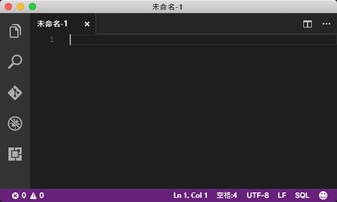
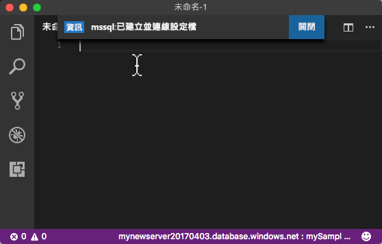
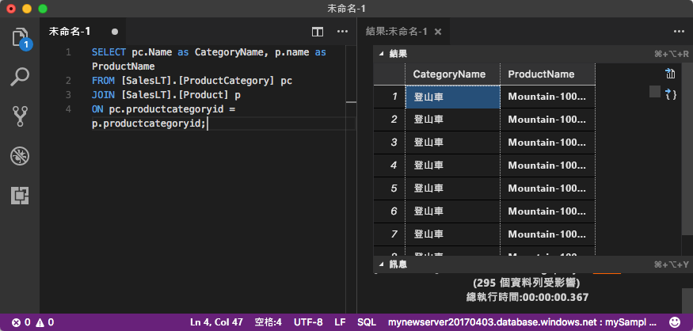

# <a name="azure-sql-database-use-visual-studio-code-to-connect-and-query-data"></a>Azure SQL Database︰使用 Visual Studio Code 連接及查詢資料

[Visual Studio Code](https://code.visualstudio.com/docs) 是一個圖形化程式碼編輯器，適用於支援擴充功能的 Linux、macOS 和 Windows，包括可供查詢 Microsoft SQL Server、Azure SQL Database 和 SQL 資料倉儲的 [mssql extension](https://aka.ms/mssql-marketplace)。 此快速入門示範如何使用 Visual Studio Code 來連線至 Azure SQL 資料庫，然後使用 Transact-SQL 陳述式來查詢、插入、更新和刪除資料庫中的資料。

## <a name="prerequisites"></a>先決條件

本快速入門可作為在其中一個快速入門中所建立資源的起點︰

[!INCLUDE [prerequisites-create-db](../../includes/sql-database-connect-query-prerequisites-create-db-includes.md)]

#### <a name="install-vs-code"></a>安裝 VS Code

開始之前，確定您已安裝最新版的 [Visual Studio Code](https://code.visualstudio.com/Download) 並已載入 [mssql 擴充功能](https://aka.ms/mssql-marketplace)。 如需 mssql 擴充功能的安裝指引，請參閱[安裝 VS Code](https://docs.microsoft.com/sql/linux/sql-server-linux-develop-use-vscode#install-vs-code)和[適用於 Visual Studio Code 的 mssql](https://marketplace.visualstudio.com/items?itemName=ms-mssql.mssql)。 

## <a name="configure-vs-code"></a>設定 VS Code 

### <a name="mac-os"></a>**Mac OS**
對於 macOS，您必須安裝 OpenSSL，這是 mssql 擴充功能使用之 DotNet Core 的必要條件。 開啟您的終端機，並輸入下列命令以安裝 **brew** 和 **OpenSSL**。 

```bash
ruby -e "$(curl -fsSL https://raw.githubusercontent.com/Homebrew/install/master/install)"
brew update
brew install openssl
mkdir -p /usr/local/lib
ln -s /usr/local/opt/openssl/lib/libcrypto.1.0.0.dylib /usr/local/lib/
ln -s /usr/local/opt/openssl/lib/libssl.1.0.0.dylib /usr/local/lib/
```

### <a name="linux-ubuntu"></a>**Linux (Ubuntu)**

不需要特別設定。

### <a name="windows"></a>**Windows**

不需要特別設定。

## <a name="sql-server-connection-information"></a>SQL Server 連線資訊

取得連線到 Azure SQL Database 所需的連線資訊。 您在下一個程序中需要完整的伺服器名稱、資料庫名稱和登入資訊。

[!INCLUDE [prerequisites-server-connection-info](../../includes/sql-database-connect-query-prerequisites-server-connection-info-includes.md)]

## <a name="set-language-mode-to-sql"></a>將語言模式設定為 SQL

在 Visual Studio Code 中將語言模式設定為 **SQL**，以啟用 mssql 命令和 T-SQL IntelliSense。

1. 開啟新的 Visual Studio Code 視窗。 

2. 按一下狀態列右下角的 [純文字]。
3. 在開啟的 [選取語言模式] 下拉式功能表中，輸入 **SQL**，然後按 **ENTER** 將語言模式設定為 SQL。 

   

## <a name="connect-to-your-database"></a>連接到您的資料庫

使用 Visual Studio Code 建立對 Azure SQL Database 伺服器的連線。

> [!IMPORTANT]
> 在繼續之前，確定您已備妥伺服器、資料庫和登入資訊。 開始輸入連線設定檔資訊後，如果您的焦點變換自 Visual Studio Code，則必須重新開始建立連線設定檔。
>

1. 在 VS Code 中，按 **CTRL+SHIFT+P** (或 **F1**) 以開啟命令選擇區。

2. 輸入 **sqlcon** 並且按 **ENTER**。

3. 按 **ENTER** 以選取 [建立連線設定檔]。 這會為您的 SQL Server 執行個體建立連線設定檔。

4. 請依照提示指定新連線設定檔的連線屬性。 指定每個值之後，按 **ENTER** 繼續。 

   | 設定       | 建議的值 | 說明 |
   | ------------ | ------------------ | ------------------------------------------------- | 
   | **伺服器名稱 | 完整伺服器名稱 | 此名稱應該類似這樣︰**mynewserver20170313.database.windows.net**。 |
   | **資料庫名稱** | mySampleDatabase | 所要連線的目標資料庫名稱。 |
   | **驗證** | SQL 登入| 在本教學課程中，我們只設定了 SQL 驗證這個驗證類型。 |
   | **使用者名稱** | 伺服器管理帳戶 | 這是您在建立伺服器時所指定的帳戶。 |
   | **密碼 (SQL 登入)** | 伺服器管理帳戶的密碼 | 這是您在建立伺服器時所指定的密碼。 |
   | **儲存密碼？** | 是或否 | 如果您不希望每次都要輸入密碼，請選取 [是]。 |
   | **輸入這個設定檔的名稱** | 設定檔名稱，例如 **mySampleDatabase** | 儲存設定檔名稱可讓您在後續登入時加快連線速度。 | 

5. 按 **ESC** 鍵來關閉通知已建立並連接設定檔的資訊訊息。

6. 在狀態列中確認您的連線。

   

## <a name="query-data"></a>查詢資料

使用下列程式碼，可藉由使用 [SELECT](https://msdn.microsoft.com/library/ms189499.aspx) Transact-SQL 陳述式來依照類別查詢前 20 項產品。

1. 在 [編輯器] 視窗中，於空白查詢視窗中輸入下列查詢︰

   ```sql
   SELECT pc.Name as CategoryName, p.name as ProductName
   FROM [SalesLT].[ProductCategory] pc
   JOIN [SalesLT].[Product] p
   ON pc.productcategoryid = p.productcategoryid;
   ```

2. 按 **CTRL+SHIFT+E** 來擷取 Product 和 ProductCategory 資料表中的資料。

    

## <a name="insert-data"></a>插入資料

使用下列程式碼，藉由使用 [INSERT](https://msdn.microsoft.com/library/ms174335.aspx) Transact-SQL 陳述式將新產品插入 SalesLT.Product 資料表中。

1. 在 [編輯器] 視窗中，刪除先前的查詢並輸入下列查詢︰

   ```sql
   INSERT INTO [SalesLT].[Product]
           ( [Name]
           , [ProductNumber]
           , [Color]
           , [ProductCategoryID]
           , [StandardCost]
           , [ListPrice]
           , [SellStartDate]
           )
     VALUES
           ('myNewProduct'
           ,123456789
           ,'NewColor'
           ,1
           ,100
           ,100
           ,GETDATE() );
   ```

2. 按 **CTRL+SHIFT+E** 以在 Product 資料表中插入新資料列。

## <a name="update-data"></a>更新資料

使用下列程式碼，藉由使用 [UPDATE](https://msdn.microsoft.com/library/ms177523.aspx) Transact-SQL 陳述式更新您先前新增的產品。

1.  在 [編輯器] 視窗中，刪除先前的查詢並輸入下列查詢︰

   ```sql
   UPDATE [SalesLT].[Product]
   SET [ListPrice] = 125
   WHERE Name = 'myNewProduct';
   ```

2. 按 **CTRL+SHIFT+E** 以在 Product 資料表中更新指定的資料列。

## <a name="delete-data"></a>刪除資料

使用下列程式碼，藉由使用 [DELETE](https://docs.microsoft.com/sql/t-sql/statements/delete-transact-sql) Transact-SQL 陳述式刪除您先前新增的產品。

1. 在 [編輯器] 視窗中，刪除先前的查詢並輸入下列查詢︰

   ```sql
   DELETE FROM [SalesLT].[Product]
   WHERE Name = 'myNewProduct';
   ```

2. 按 **CTRL+SHIFT+E** 以在 Product 資料表中刪除指定的資料列。

## <a name="next-steps"></a>後續步驟

- 若要使用 SQL Server Management Studio 來連線和查詢，請參閱[使用 SSMS 連線及查詢](sql-database-connect-query-ssms.md)。
- 若要使用 Azure 入口網站連線及查詢，請參閱[使用 Azure 入口網站 SQL 查詢編輯器連線和查詢](sql-database-connect-query-portal.md)。
- 如需有關使用 Visual Studio Code 的 MSDN 雜誌文章，請參閱[使用 MSSQL 擴充功能建立資料庫 IDE 部落格文章](https://msdn.microsoft.com/magazine/mt809115)。
