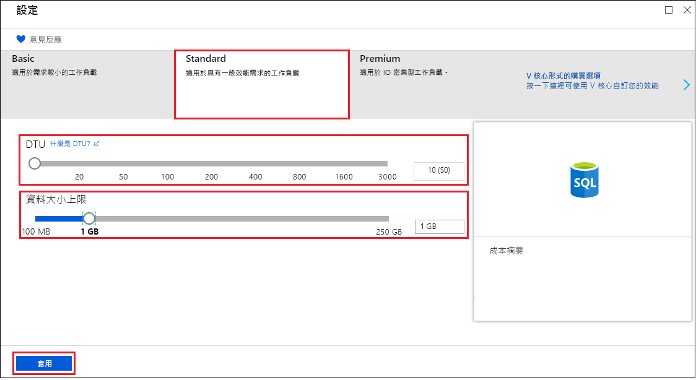
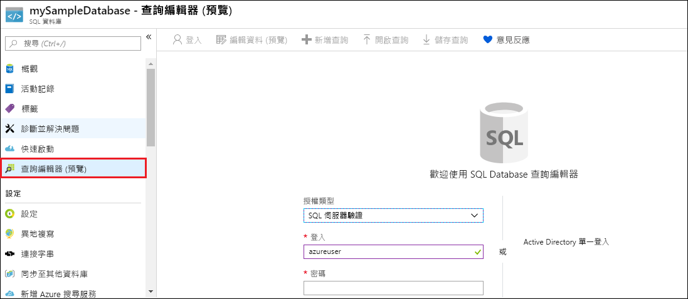

# <a name="quickstart-create-an-azure-sql-database-in-the-azure-portal"></a>快速入門：在 Azure 入口網站中建立 Azure SQL Database

Azure SQL Database 是可讓您在雲端中執行及調整高可用性 SQL Server 資料庫的*資料庫即服務*。 本快速入門說明如何開始使用 Azure 入口網站建立 Azure SQL Database 並進行查詢。 

如果您沒有 Azure 訂用帳戶，請[建立免費帳戶](https://azure.microsoft.com/free/)。

若要進行本快速入門中的所有步驟，請登入 [Azure 入口網站](https://portal.azure.com/)。

## <a name="create-a-sql-database"></a>建立 SQL 資料庫

Azure SQL Database 具有一組已定義的[計算和儲存體資源](sql-database-service-tiers-dtu.md)。 您可以在 [Azure SQL Database 邏輯伺服器](sql-database-features.md)的 [Azure 資源群組](../azure-resource-manager/resource-group-overview.md)中建立資料庫。

若要建立包含 AdventureWorksLT 範例資料的 SQL 資料庫：

1. 選取 Azure 入口網站左上角的 [建立資源]。
   
1. 選取 [資料庫]，然後選取 [SQL Database]。
   
1. 在 [建立 SQL Database] 表單中，輸入或選取下列值： 
   
   - **資料庫名稱**：輸入 mySampleDatabase。
   - 訂用帳戶：下拉並選取正確的訂用帳戶 (若未出現)。
   - **資源群組**：選取 [新建]，輸入 *myResourceGroup*，然後選取 [確定]。 
   - **選取來源**：下拉並選取 [範例 (AdventureWorksLT)]。
    
    >[!IMPORTANT]
    >請務必選取 [範例 (AdventureWorksLT)] 資料，以便依照本快速入門和使用這項資料的其他 Azure SQL Database 快速入門的指示操作。
  
   
   
1. 在 [伺服器] 底下，選取 [新建]。 
   
1. 在 [新增伺服器] 表單中，輸入或選取下列值： 
   
   - **伺服器名稱**：輸入 mysqlserver。
   - **伺服器管理員登入**：輸入 azureuser。 
   - **密碼**：輸入 Azure1234567。 
   - **確認密碼**：重新輸入密碼。
   - **位置**：下拉並選取任何有效位置。  
   
   >[!IMPORTANT]
   >請記得記錄下伺服器管理員登入和密碼，以便在進行這個和其他快速入門時能夠登入伺服器和資料庫。 如果您忘記登入或密碼，您可以在 [SQL Server] 頁面上取得登入名稱或重設密碼。 若要開啟 [SQL Server] 頁面，請在資料庫建立後，選取資料庫 [概觀] 頁面上的伺服器名稱。
   
    

1. 選擇 [選取]。
   
1. 在 [SQL Database] 表單上，選取 [定價層]。 瀏覽每個服務層可用的 DTU 數量和儲存體。
   
   >[!NOTE]
   >本快速入門使用 [DTU 型購買模型](sql-database-service-tiers-dtu.md)，但[虛擬核心型購買模型](sql-database-service-tiers-vcore.md)也可供使用。
   
   >[!NOTE]
   >所有區域目前均可使用進階層中超過 1 TB 的儲存體，但下列區域除外：英國北部、美國中西部、英國南部2、中國東部、USDoDCentral、德國中部、USDoDEast、US Gov (西南部)、US Gov (中南部)、德國東北部、中國北部和 US Gov (東部)。 在這些區域中，進階層中的儲存空間上限為 1 TB。 如需詳細資訊，請參閱 [P11-P15 目前的限制](sql-database-dtu-resource-limits-single-databases.md#single-database-limitations-of-p11-and-p15-when-the-maximum-size-greater-than-1-tb)。  
   
1. 在此快速入門中，請選取 [標準] 服務層，然後使用滑桿選取 **10 DTU (S0)** 和 **1** GB 的儲存體。
   
1. 選取 [套用] 。  
   
   
   
1. 在 [SQL Database] 表單中，選取 [建立] 以部署和佈建資源群組、伺服器和資料庫。 
   
   部署需要幾分鐘的時間。 您可以選取工具列上的 [通知] 來監視部署進度。

   

## <a name="query-the-sql-database"></a>查詢 SQL Database

您現在已建立 Azure SQL Database，接著請使用 Azure 入口網站內建的查詢工具連線到資料庫並查詢資料。

1. 在資料庫的 [SQL Database] 頁面上，選取左側功能表中的 [查詢編輯器 (預覽)]。 
   
   
   
1. 輸入您的登入資訊，並選取 [確定]。
   
1. 在 [查詢編輯器] 窗格中輸入下列查詢。
   
   ```sql
   SELECT TOP 20 pc.Name as CategoryName, p.name as ProductName
   FROM SalesLT.ProductCategory pc
   JOIN SalesLT.Product p
   ON pc.productcategoryid = p.productcategoryid;
   ```
   
1. 選取 [執行]，然後在 [結果] 窗格中檢閱查詢結果。

   
   
1. 關閉 [查詢編輯器] 頁面，並在系統提示是否要捨棄未儲存的編輯時選取 [確定]。

## <a name="clean-up-resources"></a>清除資源

如果您想要繼續進行[後續步驟](#next-steps)，請保留此資源群組、SQL 伺服器和 SQL 資料庫。 後續步驟會示範如何使用不同的方法連接及查詢您的資料庫。 

這些資源使用完畢後，您可以依照下列方式加以刪除：

1. 從 Azure 入口網站的左側功能表中，依序選取 [資源群組] 和 [myResourceGroup]。
1. 在資源群組頁面上，選取 [刪除資源群組]。 
1. 在欄位中輸入 myResourceGroup，然後選取 [刪除]。

## <a name="next-steps"></a>後續步驟

- 建立伺服器層級的防火牆規則，以從內部部署或遠端工具連線到您的 Azure SQL Database。 如需詳細資訊，請參閱[建立伺服器層級防火牆規則](sql-database-get-started-portal-firewall.md)。
- 在建立伺服器層級的防火牆規則後，使用數種不同的工具或語言來[連線及查詢](sql-database-connect-query.md)您的資料庫。 
  - [使用 SQL Server Management Studio 進行連線和查詢](sql-database-connect-query-ssms.md)
  - [使用 Azure Data Studio 進行連線及查詢](https://docs.microsoft.com/sql/azure-data-studio/quickstart-sql-database?toc=/azure/sql-database/toc.json)
- 若要使用 Azure CLI 建立 Azure SQL Database，請參閱 [Azure CLI 範例](sql-database-cli-samples.md)。
- 若要使用 Azure PowerShell 建立 Azure SQL Database，請參閱 [Azure PowerShell 範例](sql-database-powershell-samples.md)。
