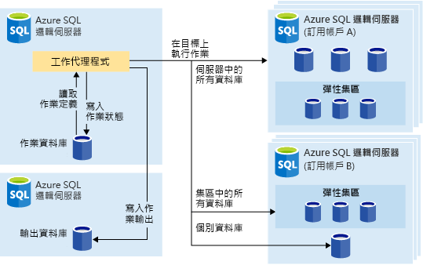

# <a name="automate-management-tasks-using-database-jobs"></a>使用資料庫作業將管理工作自動化

Azure SQL Database 可讓您建立及排程可針對一或多個資料庫定期執行的作業，以便執行 T-SQL 查詢及執行維護工作。 每項作業會記錄執行狀態，如果發生任何失敗，也會自動重試作業。
您可以定義將執行作業的目標資料庫或 Azure SQL 資料庫群組，也可定義可供執行作業的排程。
作業可處理登入目標資料庫的工作。 您也要定義、維護及保存要在 Azure SQL 資料庫群組中執行的 Transact-SQL 指令碼。

## <a name="when-to-use-automated-jobs"></a>使用自動化工作的時機

您可以使用工作自動化的案例有數個：

- 將管理工作自動化，並將這些工作排定為在每個工作天、下班時間等執行。
  - 部署結構描述變更、認證管理、效能資料收集或租用戶 (客戶) 遙測收集。
  - 更新參考資料 (所有資料庫通用的資訊)，並從 Azure Blob 儲存體載入資料。
  - 重建索引以提升查詢效能。 將作業設定為以週期性基礎跨資料庫的集合執行，例如在離峰時段。
  - 以持續執行的基礎從一組資料庫將查詢結果收集至中央資料表。 效能查詢可以持續執行，並設定為觸發要執行的其他作業。
- 收集資料以供報告
  - 將 Azure SQL 資料庫集合中的資料彙總到單一目的地資料表中。
  - 跨大型資料庫集合執行較長的執行資料處理查詢，例如客戶遙測的集合。 結果會收集到單一目的地資料表做進一步的分析。
- 資料移動
  - 建立一些作業，以將在您資料庫中所做的變更複寫到其他資料庫，或收集在遠端資料庫中所進行的更新並且在資料庫中套用變更。
  - 建立一些作業，以使用 SQL Server Integration Services (SSIS) 在您的資料庫中載入資料。

## <a name="overview"></a>概觀

Azure SQL Database 中可用的作業排程技術如下：

- **SQL Agent 作業**是經過實戰測試的傳統 SQL Server 作業排程元件，適用於受控執行個體中。 SQL Agent 作業不適用於單一資料庫。
- **彈性資料庫作業**是可在一或多個 Azure SQL Database 上執行自訂作業的作業排程服務。

值得注意的是 SQL Agent (可用於內部部署且作為 SQL Database 受控執行個體的一部分) 與資料庫彈性作業代理程式 (適用於 Azure SQL 資料庫中的單一資料庫，以及 SQL 資料倉儲中的資料庫) 之間的差異。

|  |彈性作業  |SQL Agent |
|---------|---------|---------|
|影響範圍     |  與作業代理程式位於相同 Azure 雲端中任何數目的 Azure SQL 資料庫和/或資料倉儲。 目標可以位於不同的 SQL Database 伺服器、訂用帳戶和/或區域。 <br><br>目標群組可由個別資料庫或資料倉儲，或伺服器、集區或 shardmap 中的所有資料庫所組成 (在作業執行階段以動態方式列舉)。 | 與 SQL 代理程式位於相同 SQL Server 執行個體中的任何個別資料庫。 |
|支援的 API 和工具     |  入口網站、PowerShell、T-SQL、Azure Resource Manager      |   T-SQL、SQL Server Management Studio (SSMS)     |

## <a name="sql-agent-jobs"></a>SQL Agent 作業

SQL Agent 作業是針對您的資料庫指定的 T-SQL 指令碼系列。 使用作業來定義可執行一或多次並監視成功或失敗的系統管理工作。
一個作業可以在一部本機伺服器或在多部遠端伺服器上執行。 SQL Agent 作業是在受控執行個體服務中執行的內部資料庫引擎元件。
SQL Agent 作業中有數個重要概念：

- **作業步驟**可設定應在作業內執行的一或多個步驟。 針對每個作業步驟，您可以定義重試策略，以及在作業步驟成功或失敗時應發生的動作。
- **排程**可定義應執行作業的時間。
- **通知**可讓您定義一些規則，這些規則將在作業完成後用於透過電子郵件通知操作員。

### <a name="job-steps"></a>作業步驟

SQL Agent 作業步驟是 SQL Agent 應該執行的動作序列。 每個步驟都有在步驟成功或失敗時所應執行的後續步驟，以及在失敗時的重試次數。
SQL Agent 可讓您建立不同類型的作業步驟 (例如針對資料庫執行單一 Transact-SQL 批次的 Transact-SQL 作業步驟，或可以執行自訂 OS 指令碼的 OS 命令/PowerShell 步驟)，SSIS 作業步驟可讓您使用 SSIS 執行階段載入資料，或是可以將您資料庫中的變更發佈至其他資料庫的[複寫](sql-database-managed-instance-transactional-replication.md)步驟。

[異動複寫](sql-database-managed-instance-transactional-replication.md)是一項資料庫引擎功能，可讓您發佈在一個資料庫中一或多個資料表上所做的變更，並將這些變更發佈/散發至一組訂閱者資料庫。 發佈變更是使用下列的 SQL Agent 作業步驟類型來實作：

- 交易記錄讀者。
- 快照集。
- 散發者。

目前不支援其他類型的作業步驟，包括：

- 不支援合併複寫作業步驟。
- 不支援佇列讀取器。
- 不支援 Analysis Services

### <a name="job-schedules"></a>作業排程

排程可指定執行作業的時間。 您可以依照相同的排程執行一項以上的作業，而且可以將一個以上的排程套用至相同的作業。
排程可以針對作業的執行時間定義下列條件：

- 每當執行個體重新啟動時 (或當 SQL Server Agent 啟動時)。 作業會在每次容錯移轉後啟動。
- 在特定日期和時間執行一次，這適合用於某項作業延遲執行時。
- 依照週期性排程。

> [!Note]
> 受控執行個體目前無法讓您在執行個體「閒置」時啟動作業。

### <a name="job-notifications"></a>作業通知

SQL Agent 作業可讓您在作業順利完成或失敗時取得通知。 您可以透過電子郵件接收電子郵件通知。

首先，您必須設定將用來傳送電子郵件通知的電子郵件帳戶，並將此帳戶指派給名為 `AzureManagedInstance_dbmail_profile` 的電子郵件設定檔，如下列範例所示：

```sql
-- Create a Database Mail account
EXECUTE msdb.dbo.sysmail_add_account_sp
    @account_name = 'SQL Agent Account',
    @description = 'Mail account for Azure SQL Managed Instance SQL Agent system.',
    @email_address = '$(loginEmail)',
    @display_name = 'SQL Agent Account',
    @mailserver_name = '$(mailserver)' ,
    @username = '$(loginEmail)' ,  
    @password = '$(password)' 

-- Create a Database Mail profile
EXECUTE msdb.dbo.sysmail_add_profile_sp
    @profile_name = 'AzureManagedInstance_dbmail_profile',
    @description = 'E-mail profile used for messages sent by Managed Instance SQL Agent.' ;

-- Add the account to the profile
EXECUTE msdb.dbo.sysmail_add_profileaccount_sp
    @profile_name = 'AzureManagedInstance_dbmail_profile',
    @account_name = 'SQL Agent Account',
    @sequence_number = 1;
```

您也需要在受控執行個體上啟用 Database Mail：

```sql
GO
EXEC sp_configure 'show advanced options', 1;  
GO  
RECONFIGURE;  
GO  
EXEC sp_configure 'Database Mail XPs', 1;  
GO  
RECONFIGURE 
```

您可以通知操作員，您的 SQL Agent 作業發生狀況。 操作員可定義負責維護一或多個受控執行個體的個人連絡資訊。 有時會將操作員責任指派給某一個人。
在具有多個受控執行個體或 SQL Server 的系統中，許多人可以分擔操作員責任。 操作員不包含安全性資訊，並不會定義安全性主體。

您可以使用 SSMS 或 Transact-SQL 指令碼來建立操作員，如下列範例所示：

```sql
EXEC msdb.dbo.sp_add_operator 
    @name=N'Mihajlo Pupun', 
        @enabled=1, 
        @email_address=N'mihajlo.pupin@contoso.com'
```

您可以使用 SSMS 或下列 Transact-SQL 指令碼來修改任何作業並指派操作員，該操作員會在作業完成、失敗或成功時透過電子郵件收到通知：

```sql
EXEC msdb.dbo.sp_update_job @job_name=N'Load data using SSIS', 
        @notify_level_email=3,                        -- Options are: 1 on succeed, 2 on failure, 3 on complete
        @notify_email_operator_name=N'Mihajlo Pupun'
```

### <a name="sql-agent-job-limitations"></a>SQL Agent 作業限制

受控執行個體不支援有些適用於 SQL Server 的 SQL Agent 功能：
- SQL 代理程式設定是唯讀狀態。 受控執行個體中不支援 `sp_set_agent_properties` 程序。
- 受控執行個體目前不支援啟用/停用代理程式。 SQL Agent 一直在執行中。
- 部分支援通知
  - 不支援呼叫器。
  - 不支援 NetSend。
  - 尚不支援警示。
- 不支援 Proxy。
- 不支援 Eventlog。

如需有關 SQL Server Agent 的資訊，請參閱 [SQL Server Agent](https://docs.microsoft.com/sql/ssms/agent/sql-server-agent)。

## <a name="elastic-database-jobs"></a>彈性資料庫作業

**彈性資料庫作業**提供依照排程或需求，跨越大量資料庫平行執行一或多個 T-SQL 指令碼的功能。

**對任何資料庫組合執行作業**：一或多個個別的資料庫、伺服器上的所有資料庫、彈性集區中的所有資料庫，或 shardmap，具有額外彈性可納入或排除任何特定資料庫。 **作業可以跨越多部伺服器、多個集區執行，甚至可以針對不同訂用帳戶中的資料庫執行。** 伺服器和集區都會以動態方式列舉在執行階段，因此作業會針對在執行階段存在於目標群組的所有資料庫執行。

下圖顯示跨不同類型的目標群組執行作業的作業代理程式：



### <a name="elastic-job-components"></a>彈性作業元件

|元件  | 描述 (其他詳細資料位於表格下方) |
|---------|---------|
|[**彈性作業代理程式**](#elastic-job-agent) |  您建立用來執行和管理作業的 Azure 資源。   |
|[**作業資料庫**](#job-database)    |    作業代理程式用來儲存作業相關資料、作業定義等的 Azure SQL Database。      |
|[**目標群組**](#target-group)      |  要執行作業的伺服器、集區、資料庫和分區對應集合。       |
|[**作業**](#job)  |  作業是由一或多個[作業步驟](#job-step)所組成的工作單位。 作業步驟可指定要執行的 T-SQL 指令碼，以及執行指令碼所需的其他詳細資料。  |


#### <a name="elastic-job-agent"></a>彈性作業代理程式

彈性作業代理程式是用於建立、執行和管理作業的 Azure 資源。 彈性作業代理程式是您在入口網站中建立的 Azure 資源 (也支援 [PowerShell](elastic-jobs-powershell.md) 和 REST)。 

建立**彈性作業代理程式**時需要現有的 SQL 資料庫。 此代理程式會將這個現有資料庫設定為[作業資料庫](#job-database)。

彈性作業代理程式是免費的。 作業資料庫與任何 SQL 資料庫的費率相同。

#### <a name="job-database"></a>作業資料庫

「作業資料庫」用於定義作業以及追蹤作業執行的狀態與歷程記錄。 *作業資料庫*也用來儲存代理程式中繼資料、記錄、結果、作業定義，也包含許多有用的預存程序和其他資料庫物件，以便使用 T-SQL 建立、執行和管理作業。

對於目前的預覽，需要現有的 Azure SQL Database (S0 或更高版本) 才能建立彈性作業代理程式。

「作業資料庫」不一定要是新的，但應該是乾淨、空白、 S0 或更高的服務層。 「作業資料庫」的建議服務層為 S1 或更高版本，但實際上取決於作業的效能需求：作業步驟數、作業的執行次數和頻率。 例如，若為每小時執行少量作業的作業代理程式，S0 資料庫可能就已足夠，但是每分鐘執行一項作業時效能不足，更高的服務層可能比較適合。


##### <a name="job-database-permissions"></a>作業資料庫權限

在作業代理程式建立期間，會在「作業資料庫」中建立結構描述、資料表，以及名為 jobs_reader 的角色。 此角色會具有下列權限，而且旨在賦予系統管理員更細微的存取控制以便監視作業：


|角色名稱  |'jobs' 結構描述權限  |'jobs_internal' 結構描述權限  |
|---------|---------|---------|
|**jobs_reader**     |    SELECT     |    None     |

> [!IMPORTANT]
> 在以資料庫管理員身分授與「作業資料庫」存取權之前，請考慮安全性含意。 有權建立或編輯作業的惡意使用者可以建立或編輯一項作業，該作業使用預存認證來連線到惡意使用者所掌控的資料庫，這可讓惡意使用者決定認證的密碼。


#### <a name="target-group"></a>目標群組

「目標群組」可定義一組將會執行某個作業步驟的資料庫。 目標群組可以包含下列各項的任意組合：

- **SQL Database 伺服器** - 如果未指定伺服器，則在作業執行階段存在於伺服器中的所有資料庫都是群組的一部分。 必須提供 master 資料庫認證，才能在作業執行之前列舉並更新群組。
- **彈性集區** - 如果已指定彈性集區，則在作業執行階段彈性集區中的所有資料庫都是群組的一部分。 針對伺服器，必須提供 master 資料庫認證，才能在作業執行之前更新群組。
- **單一資料庫** - 將一或多個個別資料庫指定為群組的一部分。
- **Shardmap** - Shardmap 的資料庫。

> [!TIP]
> 在執行作業時，「動態列舉」會重新評估包含伺服器或集區的目標群組中的資料庫集合。 動態列舉可確保**作業會在執行階段跨越伺服器或集區中所有現有的資料庫執行**。 在執行階段重新評估資料庫清單特別適用於集區或伺服器成員資格經常變更的案例。

您可以將集區與單一資料庫指定為在群組中包含或排除。 這能夠建立含有任意資料庫組合的目標群組。 例如，您可以將伺服器新增至目標群組，但是在彈性集區中排除特定資料庫 (或排除整個集區)。

目標群組可以包含多個訂用帳戶中的資料庫，而且橫跨多個區域。 請注意，跨區域執行比在同區域內執行的延遲較高。

下列範例顯示當作業執行時，不同目標群組定義是如何以動態方式列舉的，進而決定作業將執行哪些資料庫：


**範例 1** 顯示由一系列個別資料庫組成的目標群組。 當使用這個目標群組來執行作業步驟時，作業步驟的動作將會在其中每一個資料庫中執行。<br>
**範例 2** 顯示包含以 Azure SQL Server 作為目標的目標群組。 當使用這個目標群組來執行作業步驟時，伺服器會以動態方式列舉，以決定目前在伺服器中的資料庫清單。 作業步驟的動作會在其中每個資料庫中執行。<br>
**範例 3** 顯示與*範例 2* 類似的目標群組，但特別排除個別資料庫。 作業步驟的動作「不會」在排除的資料庫中執行。<br>
**範例 4** 顯示包含以彈性集區作為目標的目標群組。 類似於*範例 2*，集區會在作業執行時間以動態方式列舉，以決定集區中的資料庫清單。
<br><br>


**範例 5** 和**範例 6** 顯示進階案例，其中 Azure SQL 伺服器、彈性集區和資料庫都可使用包含及排除規則來結合。<br>
**範例 7** 顯示分區對應中的分區也可在作業執行階段進行評估。

#### <a name="job"></a>工作 (Job)

「作業」是依照排程執行的工作單位，或為一次性作業。 一項作業包含一或多個「作業步驟」。

##### <a name="job-step"></a>作業步驟

每個作業步驟都會指定要執行的 T-SQL 指令碼、要執行 T-SQL 指令碼的一或多個目標群組，以及作業代理程式連線到目標資料庫所需的認證。 每個作業步驟都有可自訂的逾時和重試原則，而且可以選擇性地指定輸出參數。

#### <a name="job-output"></a>作業輸出

每個目標資料庫上的作業步驟結果都會詳加記錄，而且可以將指令碼輸出擷取至指定的資料表。 您可以指定要儲存作業所傳回資料的資料庫。

#### <a name="job-history"></a>作業歷程記錄

作業執行歷程記錄會儲存在「作業資料庫」中。 系統清理作業會清除留存超過 45 天的執行歷程記錄。 若要移除留存少於 45 天的歷程記錄，請在「作業資料庫」中呼叫 **sp_purge_history** 預存程序。

### <a name="agent-performance-capacity-and-limitations"></a>代理程式效能、容量和限制

彈性作業在等待長時間執行的作業完成時，會使用最少的運算資源。

視資料庫的目標群組大小和作業所需的執行時間 (並行背景工作數目) 而定，代理程式需要不同的計算量和「作業資料庫」效能 (目標愈多和作業數目較高，所需的計算量就愈高)。

預覽版本目前受限於 100 個並行作業。

#### <a name="prevent-jobs-from-reducing-target-database-performance"></a>避免作業降低目標資料庫效能

若要確保在對 SQL 彈性集區中的資料庫執行作業時，資源不會負擔過重，則可以設定作業來限制作業可以同時執行的資料庫數目。

## <a name="next-steps"></a>後續步驟

- 請參閱[什麼是 SQL Server Agent](https://docs.microsoft.com/sql/ssms/agent/sql-server-agent) 
- [如何建立及管理彈性作業](elastic-jobs-overview.md) 
- [使用 PowerShell 建立及管理彈性作業](elastic-jobs-powershell.md) 
- [使用 Transact-SQL (T-SQL) 來建立及管理彈性作業](elastic-jobs-tsql.md) 
