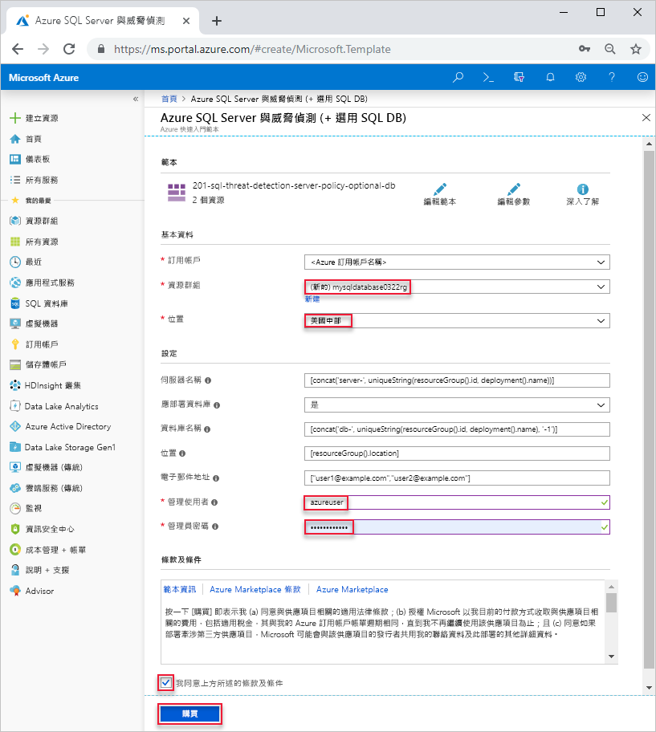

# <a name="quickstart-create-a-single-database-in-azure-sql-database-using-the-azure-resource-manager-template"></a>快速入門：使用 Azure Resource Manager 範本在 Azure SQL Database 中建立單一資料庫

要在 Azure SQL Database 中建立資料庫，建立[單一資料庫](sql-database-single-database.md)是最快速且最簡單的部署選項。 本快速入門說明如何使用 Azure Resource Manager 範本建立單一資料庫。 如需詳細資訊，請參閱 [Azure Resource Manager 文件](/azure/azure-resource-manager/)。

如果您沒有 Azure 訂用帳戶，請[建立免費帳戶](https://azure.microsoft.com/free/)。

## <a name="create-a-single-database"></a>建立單一資料庫

單一資料庫具有一組使用兩個[購買模型](sql-database-purchase-models.md)之一定義的計算、記憶體、IO 和儲存體資源。 當您建立單一資料庫時，您也會定義 [SQL Database 伺服器](sql-database-servers.md)加以管理，並將其放入指定區域中的 [Azure 資源群組](../azure-resource-manager/resource-group-overview.md)內。

下列 JSON 檔案是本文中所用的範本。 此範本會儲存在 Azure 儲存體帳戶中。 在[這裡](https://azure.microsoft.com/resources/templates/?resourceType=Microsoft.Sql&pageNumber=1&sort=Popular)可找到更多 Azure SQL Database 範本範例。

```json
{
  "$schema": "https://schema.management.azure.com/schemas/2015-01-01/deploymentTemplate.json#",
  "contentVersion": "1.0.0.0",
  "parameters": {
    "serverName": {
      "type": "string",
      "defaultValue": "[concat('server-', uniqueString(resourceGroup().id, deployment().name))]",
      "metadata": {
        "description": "Name for the SQL server"
      }
    },
    "shouldDeployDb": {
      "type": "string",
      "allowedValues": [
        "Yes",
        "No"
      ],
      "defaultValue": "Yes",
      "metadata": {
        "description": "Whether an Azure SQL Database should be deployed under the server"
      }
    },
    "databaseName": {
      "type": "string",
      "defaultValue": "[concat('db-', uniqueString(resourceGroup().id, deployment().name), '-1')]",
      "metadata": {
        "description": "Name for the SQL database under the SQL server"
      }
    },
    "location": {
      "type": "string",
      "defaultValue": "[resourceGroup().location]",
      "metadata": {
        "description": "Location for server and optional DB"
      }
    },
    "emailAddresses": {
      "type": "array",
      "defaultValue": [
        "user1@example.com",
        "user2@example.com"
      ],
      "metadata": {
        "description": "Email addresses for receiving alerts"
      }
    },
    "adminUser": {
      "type": "string",
      "metadata": {
        "description": "Username for admin"
      }
    },
    "adminPassword": {
      "type": "securestring",
      "metadata": {
        "description": "Password for admin"
      }
    }
  },
  "variables": {
    "databaseServerName": "[toLower(parameters('serverName'))]",
    "databaseName": "[parameters('databaseName')]",
    "shouldDeployDb": "[parameters('shouldDeployDb')]",
    "databaseServerLocation": "[parameters('location')]",
    "databaseServerAdminLogin": "[parameters('adminUser')]",
    "databaseServerAdminLoginPassword": "[parameters('adminPassword')]",
    "emailAddresses": "[parameters('emailAddresses')]"
  },
  "resources": [
    {
      "type": "Microsoft.Sql/servers",
      "name": "[variables('databaseServerName')]",
      "location": "[variables('databaseServerLocation')]",
      "apiVersion": "2015-05-01-preview",
      "properties": {
        "administratorLogin": "[variables('databaseServerAdminLogin')]",
        "administratorLoginPassword": "[variables('databaseServerAdminLoginPassword')]",
        "version": "12.0"
      },
      "tags": {
        "DisplayName": "[variables('databaseServerName')]"
      },
      "resources": [
        {
          "type": "securityAlertPolicies",
          "name": "DefaultSecurityAlert",
          "apiVersion": "2017-03-01-preview",
          "dependsOn": [
            "[variables('databaseServerName')]"
          ],
          "properties": {
            "state": "Enabled",
            "emailAddresses": "[variables('emailAddresses')]",
            "emailAccountAdmins": true
          }
        }
      ]
    },
    {
      "condition": "[equals(variables('shouldDeployDb'), 'Yes')]",
      "type": "Microsoft.Sql/servers/databases",
      "name": "[concat(string(variables('databaseServerName')), '/', string(variables('databaseName')))]",
      "location": "[variables('databaseServerLocation')]",
      "apiVersion": "2017-10-01-preview",
      "dependsOn": [
        "[concat('Microsoft.Sql/servers/', variables('databaseServerName'))]"
      ],
      "properties": {},
      "tags": {
        "DisplayName": "[variables('databaseServerName')]"
      }
    }
  ]
}
```

1. 選取以下影像來登入 Azure 並開啟範本。

    <a href="https://portal.azure.com/#create/Microsoft.Template/uri/https%3A%2F%2Farmtutorials.blob.core.windows.net%2Fcreatesql%2Fazuredeploy.json"></a>

2. 選取或輸入下列值。  

    

    除非有指定，否則使用預設值。

    * **訂用帳戶**：選取 Azure 訂用帳戶。
    * [資源群組]選取 [新建]，輸入資源群組的唯一名稱，然後按一下 [確認]。 
    * **位置**：選取位置。  例如，**美國中部**。
    * **管理員使用者**：指定 SQL 資料庫伺服器的管理員使用者名稱。
    * **管理員密碼**：指定管理員密碼。 
    * **我同意上方所述的條款及條件**：選取。
3. 選取 [購買]。

## <a name="query-the-database"></a>查詢資料庫

若要查詢資料庫，請參閱[查詢資料庫](./sql-database-single-database-get-started.md#query-the-database)。

## <a name="clean-up-resources"></a>清除資源

如果您想要繼續進行[後續步驟](#next-steps)，請保留此資源群組、資料庫伺服器和單一資料庫。 後續步驟會示範如何使用不同的方法連接及查詢您的資料庫。

若要使用 Azure CLI 或 Azure Powershell 刪除資源群組：

```azurecli-interactive
echo "Enter the Resource Group name:" &&
read resourceGroupName &&
az group delete --name $resourceGroupName 
```

```azurepowershell-interactive
$resourceGroupName = Read-Host -Prompt "Enter the Resource Group name"
Remove-AzResourceGroup -Name $resourceGroupName 
```

## <a name="next-steps"></a>後續步驟

- 建立伺服器層級的防火牆規則，以從內部部署或遠端工具連線到您的單一資料庫。 如需詳細資訊，請參閱[建立伺服器層級防火牆規則](sql-database-server-level-firewall-rule.md)。
- 在建立伺服器層級的防火牆規則後，使用數種不同的工具或語言來[連線及查詢](sql-database-connect-query.md)您的資料庫。
  - [使用 SQL Server Management Studio 進行連線和查詢](sql-database-connect-query-ssms.md)
  - [使用 Azure Data Studio 進行連線及查詢](https://docs.microsoft.com/sql/azure-data-studio/quickstart-sql-database?toc=/azure/sql-database/toc.json)
- 若要使用 Azure CLI 建立單一資料庫，請參閱 [Azure CLI 範例](sql-database-cli-samples.md)。
- 若要使用 Azure PowerShell 建立單一資料庫，請參閱 [Azure PowerShell 範例](sql-database-powershell-samples.md)。
