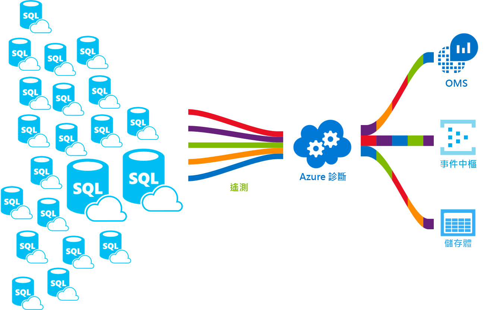

# 什麼是 Azure SQL Database 服務？ 

SQL Database 是 Microsoft Azure 中一般用途的關聯式資料庫服務，可支援關聯式資料、JSON、空間和 XML 等結構。 它可提供[動態可調式效能](sql-database-service-tiers.md)，而且提供[資料行存放區索引](https://docs.microsoft.com/sql/relational-databases/indexes/columnstore-indexes-overview)等選項來進行極限分析和報告，以及[記憶體內部 OLTP](sql-database-in-memory.md) 來進行極限交易處理。 Microsoft 可順暢地處理 SQL 程式碼基底的所有修補和更新，並抽走基礎結構的所有管理功能。 

SQL Database 與 [Microsoft SQL Server 資料庫引擎](https://docs.microsoft.com/sql/sql-server/sql-server-technical-documentation)共用其程式碼基底。 依據 Microsoft 的雲端優先策略，SQL Server 的最新功能會先在 SQL Database 中發行，然後在 SQL Server 本身發行。 這種方法可為您提供最新的 SQL Server 功能，但沒有修補或升級的額外負荷，而這些新功能已在數百萬個資料庫上進行測試。 當新功能宣佈時，如需其相關資訊，請參閱：

- **[適用於 SQL Database 的 Azure 藍圖](https://azure.microsoft.com/roadmap/?category=databases)**：您可以在此得知新增和即將推出的功能。 
- **[Azure SQL Database 部落格](https://azure.microsoft.com/blog/topics/database)**：SQL Server 產品團隊成員發表 SQL Database 消息和功能的地方。 

SQL Database 提供多個服務等級的可預測效能，這可提供無停機時間的動態延展性、內建智慧型最佳化、全域延展性和可用性，以及進階安全性選項，且全都幾乎免管理。 這些功能可讓您專注於快速開發應用程式及加快上市時間，而不是將寶貴的時間和資源耗費在管理虛擬機器和基礎結構上。 SQL Database 服務目前在全球 38 個資料中心提供，還有更多資料中心會定期上線，可讓您在附近的資料中心執行您的資料庫。

> [!NOTE]
> 如需 Azure 平台安全性的相關資訊，請參閱 [Azure 信任中心](https://azure.microsoft.com/support/trust-center/security/)。
>

## 可擴充的效能和集區

採用 SQL Database，每個資料庫會彼此隔離並且可攜，每個都有自己的[服務層](sql-database-service-tiers.md)和保證的效能層級。 SQL Database 會針對不同的需求提供不同的效能層級，並可讓資料庫集區化，以充分利用資和節省成本。

### 無須停機即可調整效能和規模

SQL Database 提供四個服務層來支援各種資料庫工作負載 (輕量型到重量型)：基本、標準、進階和進階 RS。 您可以在一個小型單一資料庫中建置第一個應用程式，每個月所需的成本很低。接著隨時以手動或程式設計方式變更其服務層，以符合您的方案需求。 您的應用程式或客戶皆無須停機，即可調整效能。 動態延展性可讓您的資料庫以透明的方式回應快速變化的資源需求，並且讓您只需支付您所需的資源費用。

   

### 可將資源使用量最大化的彈性集區

對於許多企業和應用程式而言，只要能夠建立單一資料庫，並依需求調高或調低的效能即可，尤其是當使用模式相當容易預測時更是如此。 但如果您有無法預測的使用模式，則管理成本和商務模式就會變得相當困難。 [彈性集區](sql-database-elastic-pool.md)的設計可解決此問題。 概念很簡單。 您可將效能資源配置到集區，而非個別的資料庫，並支付該集區的集體效能資源，而非單一資料庫效能的費用。 

   

使用彈性集區，您就不必隨著資源的需求波動，專注於調高或調低資料庫效能。 集區中的資料庫會視需要取用彈性集區的效能資源。 集區中的資料庫會取用集區的資源，但不會超過其限制，因此您的成本可在個別資料庫使用情形無法預測的狀況下維持可預測性。 此外，您還可以 [將資料庫移入/移出集區](sql-database-elastic-pool-manage-portal.md)，並將您的應用程式從數個資料庫擴充至數千個，而且全都在您可掌控的預算之內。 您也可以控制集區中資料庫可用的資源上限和下限，以確保集區中不會有任一資料庫使用所有的集區資源，且集區中的每個資料庫都有保證的資源數量下限。 若要深入了解使用彈性集區的 SaaS 應用程式的設計模式，請參閱 [採用 SQL Database 的多租用戶 SaaS 應用程式的設計模式](sql-database-design-patterns-multi-tenancy-saas-applications.md)。

### 混合使用單一資料庫與集區中的資料庫

不論您要使用單一資料庫或彈性集區，都將不再受到限制。 您可以混合使用單一資料庫與彈性集區，並快速且輕易地變更單一資料庫和彈性集區的服務層來適應您的情況。 透過 Azure 功能強大而無遠弗屆的特性，您可以使用 SQL Database 混合和搭配其他 Azure 服務，滿足您獨特應用程式的設計需求、有效運用成本和資源，並且產生新的商機。

### 廣泛的監視和警示功能

但是，您要如何比較單一資料庫和彈性集區的相對效能？ 當您調高和調低效能時，要如何知道該在何處停止？ 您可使用[內建的效能監視](sql-database-performance.md)和[警示](sql-database-insights-alerts-portal.md)工具，加上以[適用於單一資料庫的資料庫交易單位 (DTU) 及適用於彈性集區的彈性 DTU (eDTU)](sql-database-what-is-a-dtu.md) 為根據的效能分級。 使用這些工具，您可以根據目前或專案的效能需求快速評估相應增加或減少的影響。 如需詳細資訊，請參閱 [SQL Database 選項和效能：了解每個服務層中可用的項目](sql-database-service-tiers.md) 。

此外，SQL Database 可以[發出計量和診斷記錄](sql-database-metrics-diag-logging.md)以便進行監視。 您可以將 SQL Database 設定為將資源使用量、背景工作與工作階段及連線儲存到下列其中一項 Azure 資源：

- **Azure 儲存體**：用於封存大量遙測資料，價格低廉
- **Azure 事件中樞**：用於整合 SQL Database 遙測與自訂監視解決方案或管線
- **Azure Log Analytics**：適用於具有報告、警示及緩和功能的內建監視解決方案

    

## 可用性功能

Azure 領先業界的 99.99% 可用性服務等級協定 [(SLA)](http://azure.microsoft.com/support/legal/sla/)(由 Microsoft 管理之資料中心的全球網路提供支援)，可協助讓您的應用程式 24 小時全年無休地運作。 此外，SQL Database 還提供內建[業務持續性和全域延展性](sql-database-business-continuity.md)功能，包括：

- **[自動備份](sql-database-automated-backups.md)**：SQL Database 會自動執行完整、差異及交易記錄備份。
- **[時間點還原](sql-database-recovery-using-backups.md)**：SQL Database 支援復原到自動備份保留期間內的任何時間點。
- **[主動式異地複寫](sql-database-geo-replication-overview.md)**：SQL Database 可讓您在相同或全域分散的 Azure 資料中心最多設定 4 個可讀取的次要資料庫。  例如，如果 SaaS 應用程式的目錄資料庫有大量的並行唯讀交易，請使用主動式異地複寫功能來啟用全域讀取範圍，並移除主要資料庫上因為讀取工作負載所造成的瓶頸。 
- **[容錯移轉群組](sql-database-geo-replication-overview.md)**：SQL Database 可讓您全面啟用高可用性和負載平衡，包括大量資料庫與彈性集區的透明異地複寫和容錯移轉。 容錯移轉群組和主動式異地複寫能夠建立全域分散的 SaaS 應用程式，其管理負擔最小，可讓 SQL Database 處理所有複雜的監視、路由傳送及容錯移轉協調流程。

## 內建智慧

採用 SQL Database，您可取得內建智慧來協助您大幅降低執行和管理資料庫的成本，並將應用程式的效能和安全性最大化。 SQL Database 隨時執行數以百萬計的客戶工作負載，並收集和處理大量的遙測資料，同時完全尊重幕後的客戶隱私權。 各種演算法會持續評估遙測資料，讓服務能夠了解您的應用程式並隨之調整。 根據這項分析，服務會提出針對特定工作負載量身訂做的效能改善建議。 

### 自動的效能監視和微調

SQL Database 會提供您需要監視之查詢的詳細解析。 SQL Database 會了解您的資料庫模式，並可讓您根據您的工作負載調整資料庫結構描述。 SQL Database 提供[效能微調建議](sql-database-advisor.md)，您可以在其中檢閱微調動作並加以套用。 

不過，持續監視資料庫是冗長乏味的艱辛工作，尤其是在處理許多資料庫時。 [智慧型深入解析](sql-database-intelligent-insights.md)會自動地大規模監視 SQL Database 效能來替您代勞，並通知效能降低的問題，還會識別問題的根本原因，然後盡可能提供效能改善建議。

即使使用 SQL Database 和 Azure 入口網站提供的所有可用工具和報告，都可能無法有效率地管理大量資料庫。 除了手動監視和調整資料庫，您也可以考慮使用[自動調整](sql-database-automatic-tuning.md)，將一些監視和微調動作委派給 SQL Database。 SQL Database 會自動套用建議、測試及驗證每個調整動作，以確保持續改善效能。 如此一來，SQL Database 會以受控制且安全的方式自動調整您的工作負載。 自動調整表示在每個調整動作前後，資料庫效能都會受到仔細的監控和比較，而如果效能沒有改善，則會還原調整動作。

現今，在 SQL Database 之上執行 [SaaS 多租用戶應用程式](sql-database-design-patterns-multi-tenancy-saas-applications.md)的許多合作夥伴都依賴自動效能微調，來確保其應用程式始終擁有穩定且可預測的效能。 對他們而言，這項功能可大幅降低夜間發生效能事件的風險。 此外，由於其部分客戶也使用 SQL Server，所以他們會使用 SQL Database 所提供的相同索引建議來協助其 SQL Server 客戶。

[SQL Database 中可用的](sql-database-automatic-tuning.md)自動調整層面有兩個：

- **自動索引管理**：識別應該在資料庫中新增的索引，以及應該移除的索引。
- **自動計劃修正**：識別有問題的計劃並修正 SQL 計劃效能問題 (即將推出，SQL Server 2017 中已提供)。

### 自適性查詢處理

我們也將[自適性查詢處理](/sql/relational-databases/performance/adaptive-query-processing)功能系列新增至 SQL Database，包括交錯執行多陳述式的資料表值函式、批次模式記憶體授與意見反應，以及批次模式自適性聯結。 每個自適性查詢處理功能都會應用類似的「了解並適應」技術，協助進一步解決與過去很棘手的查詢最佳化問題相關的效能問題。

### 智慧型威脅偵測

 [SQL 威脅偵測](sql-database-threat-detection.md)運用 [SQL Database 稽核](sql-database-auditing.md)，持續監視 Azure SQL 資料庫中可能有害的敏感性資料存取嘗試。 SQL 威脅偵測提供新的一層安全性，在發生異常活動時會提供安全性警示，讓客戶偵測並回應潛在威脅。 一旦有可疑的資料庫活動、潛在弱點、SQL 插入式攻擊和異常資料庫存取模式發生，使用者就會收到警示。 SQL 威脅偵測警示會提供可疑活動的詳細資料，以及如何調查與降低威脅的建議。 使用者可以探索可疑的事件，以判斷事件的原因是否為有人嘗試存取、破壞或利用資料庫中的資料。 您不必是安全性專家，也不需要管理進階的安全性監視系統，威脅偵測讓您輕鬆解決資料庫的潛在威脅。

## 進階安全性與合規性

SQL Database 提供了各式各樣的[內建安全性與合規性功能](sql-database-security-overview.md)，協助您的應用程式符合各種安全性與合規性需求。 

### 合規性和安全性稽核

[SQL Database 稽核](sql-database-auditing.md)會追蹤資料庫事件並將事件寫入您 Azure 儲存體帳戶中的稽核記錄。 稽核可協助您保持法規遵循、了解資料庫活動，以及深入了解可指出商務考量或疑似安全違規的不一致和異常。

### 待用資料加密

SQL Database 的[透明資料加密](/sql/relational-databases/security/encryption/transparent-data-encryption-azure-sql)可在不需變更應用程式的情況下，對靜止的資料庫、相關聯的備份和交易記錄執行即時加密和解密，協助防止惡意活動的威脅。 從 2017 年 5 月開始，會使用透明資料加密 (TDE) 自動保護所有新建的 Azure SQL 資料庫。 TDE 是 SQL 經實證的靜態加密技術，許多合規性標準都需要這項奇數才能防禦儲存媒體的竊取。 客戶可以使用 Azure Key Vault，以安全且符合規範的方式管理 TDE 加密金鑰和其他祕密。

### 移動中資料加密

SQL Database 是唯一可使用 [Always Encrypted](https://docs.microsoft.com/sql/relational-databases/security/encryption/always-encrypted-database-engine) 提供傳輸中、待用和查詢處理期間敏感性資料防護的資料庫系統。 Always Encrypted 是業界優先，可提供無與倫比的資料安全性，以對抗涉及重要資料竊取的入侵。 例如，透過 Always Encrypted，客戶的信用卡號碼會永遠加密儲存在資料庫中，即使在查詢處理期間，都允許需要處理該資料的已授權人員或應用程式在使用時解密。

### 動態資料遮罩

[SQL Database 動態資料遮罩](sql-database-dynamic-data-masking-get-started.md)可藉由遮罩處理，使不具權限的使用者無法看見敏感性資料。 動態資料遮罩可讓客戶在應用程式層級受到最小影響的情況下指定要顯示多少機密資料，而協助防止未經授權者存取機密資料。 它是以原則為基礎的安全性功能，可針對指定的資料庫欄位隱藏查詢結果集中的機密資料，而不變更資料庫中的資料。

### 資料列層級安全性

[資料列層級安全性](https://docs.microsoft.com/sql/relational-databases/security/row-level-security)讓客戶能夠根據執行查詢之使用者的特性 (例如，依群組成員資格或執行內容) 來控制資料庫資料表中的資料列存取。 資料列層級安全性 (RLS) 可簡化應用程式安全性的設計和編碼。 RLS 可讓您實作資料的資料列存取限制。 例如，確保背景工作角色只能存取其部門相關資料列，或將客戶的資料存取權限制為其公司的相關資料。

### Azure Active Directory 整合和多重要素驗證

SQL Database 可讓您透過 [Azure Active Directory 整合](sql-database-aad-authentication.md)，集中管理資料庫使用者和其他 Microsoft 服務的身分識別。 這項功能簡化了權限管理並增強安全性。 Azure Active Directory 支援[多重要素驗證](sql-database-ssms-mfa-authentication.md) (MFA)，以提高資料和應用程式安全性，同時支援單一登入程序。

### 合規性認證

SQL Database 會參與定期稽核，並已經過數個合規性標準的認證。 如需詳細資訊，請參閱 [Microsoft Azure 信任中心](https://azure.microsoft.com/support/trust-center/)，您可以在當中找到 [SQL Database 法規認證](https://azure.microsoft.com/support/trust-center/services/)的最新清單。

## 容易使用

SQL Database 讓應用程式的建置及維護更簡易也更有生產力。 SQL Database 讓您將精力集中於拿手項目：建置絕佳的應用程式。 您可以使用已經擁有的工具和技巧，在 SQL Database 中進行管理和開發。

- **[Azure 入口網站](https://portal.azure.com/)**：網頁型應用程式，可用於管理所有 Azure 服務 
- **[SQL Server Management Studio](https://docs.microsoft.com/sql/ssms/download-sql-server-management-studio-ssms)**：可下載的免費用戶端應用程式，可用於管理任何 SQL 基礎結構 (從 SQL Server 到 SQL Database)
- **[Visual Studio 中的 SQL Server Data Tools](https://docs.microsoft.com/sql/ssdt/download-sql-server-data-tools-ssdt)**：可下載的免費用戶端應用程式，可用於開發 SQL Server 關聯式資料庫、Azure SQL 資料庫、Integration Services 套件、Analysis Services 資料模型及 Reporting Services 報告。
- **[Visual Studio Code](https://code.visualstudio.com/docs)**：免費、可下載、開放原始碼的程式碼編輯器，適用於支援擴充功能的 Windows、macOS 和 Linux，包括可供查詢 Microsoft SQL Server、Azure SQL Database 和 SQL 資料倉儲的 [mssql 擴充功能](https://aka.ms/mssql-marketplace)。

SQL Database 支援在 MacOS、Linux 和 Windows 上使用 Python、Java、Node.js、PHP、Ruby 和 .NET 建置應用程式。 SQL Database 支援與 SQL Server 相同的[連線庫](sql-database-libraries.md)。

## 洽詢 SQL Server 工程團隊

- [DBA Stack Exchange](https://dba.stackexchange.com/questions/tagged/sql-server)：詢問資料庫管理問題
- [堆疊溢位](http://stackoverflow.com/questions/tagged/sql-server)：詢問開發問題
- [MSDN 論壇](https://social.msdn.microsoft.com/Forums/en-US/home?category=sqlserver)：詢問技術問題
- [Microsoft Connect](https://connect.microsoft.com/SQLServer/Feedback)：回報錯誤和要求功能
- [Reddit](https://www.reddit.com/r/SQLServer/)：討論 SQL Server

## 後續步驟

- 如需單一資料庫及彈性資料庫的成本比較和計算機，請參閱[價格頁面](https://azure.microsoft.com/pricing/details/sql-database/)。

- 請參閱下列快速入門，以便開始使用產品：

  - [在 Azure 入口網站中建立 SQL Database](sql-database-get-started-portal.md)  
  - [使用 Azure CLI 建立 SQL Database](sql-database-get-started-cli.md)
  - [使用 PowerShell 建立 SQL Database](sql-database-get-started-powershell.md)

- 如需一組 Azure CLI 和 PowerShell 範例，請參閱︰
  - [SQL Database 的 Azure CLI 範例](sql-database-cli-samples.md)
  - [SQL Database 的 Azure PowerShell 範例](sql-database-powershell-samples.md)
