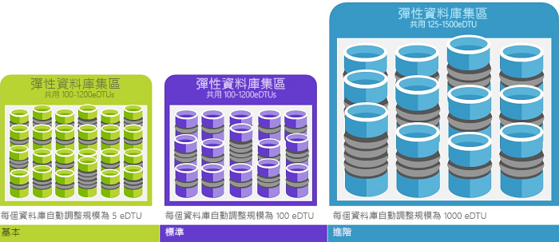

<properties
	pageTitle="SQL Database：DTU 是什麼？ | Microsoft Azure"
	description="了解 Azure SQL Database 交易單元是什麼。"
	keywords="資料庫選項, 資料庫效能"
	services="sql-database"
	documentationCenter=""
	authors="CarlRabeler"
	manager="jhubbard"
	editor="CarlRabeler"/>

<tags
	ms.service="sql-database"
	ms.devlang="na"
	ms.topic="get-started-article"
	ms.tgt_pltfrm="na"
	ms.workload="NA"
	ms.date="09/06/2016"
	ms.author="carlrab"/>

# 說明資料庫交易單位 (DTU) 和彈性資料庫交易單位 (eDTU)

本文說明資料庫交易單位 (DTU) 和彈性資料庫交易單位 (eDTU)，以及當您達到 DTU 或 eDTU 上限時會發生什麼狀況。

## 何謂資料庫交易單位 (DTU)

DTU 是資源的度量單位，而這些資源保證可用於[獨立資料庫服務層](sql-database-service-tiers.md#standalone-database-service-tiers-and-performance-levels)內特定效能等級的獨立 Azure SQL 資料庫。DTU 是 CPU、記憶體、資料 I/O 和交易記錄檔 I/O 的混合量值，以設計成為典型真實世界 OLTP 工作負載的 OLTP 基準測試工作負載所決定的比率來表示。藉由提升資料庫的效能等級來使 DTU 加倍，等於讓該資料庫可用的資源集合加倍。例如，相較於具有 5 個 DTU 的 Basic 資料庫，具有 1750 個 DTU 的 Premium P11 資料庫可提供 350 倍的 DTU 計算能力。若要了解 OLTP 基準測試工作負載用來判斷 DTU 混合的方法，請參閱 [SQL Database 基準測試概觀](sql-database-benchmark-overview.md)。

您可以在應用程式停機時間最短 (通常平均少於四秒) 的情況下，隨時[變更服務層](sql-database-scale-up.md)。對於許多企業和應用程式而言，只要能夠建立資料庫，並依需求調高或調低單一資料庫的效能即可，尤其是當使用模式相當容易預測時更是如此。但如果您有無法預測的使用模式，則管理成本和商務模式就會變得相當困難。在此案例中，您可使用具有特定 eDTU 數目的彈性集區。

## 何謂彈性資料庫交易單位 (eDTU)

eDTU 是可以在 Azure SQL 伺服器上一組資料庫 (稱為[彈性集區](sql-database-elastic-pool.png)) 之間共用的資源集 (DTU) 的度量單位。彈性集區提供符合成本效益的簡單解決方案，以管理多個不同且具備無法預測的使用模式資料庫的效能目標。如需詳細資訊，請參閱[彈性集區和服務層](sql-database-service-tiers.md#elastic-pool-service-tiers-and-performance-in-edtus)。

集區以固定價格提供固定數目的 eDTU。在集區內，會給予個別資料庫彈性以在設定的參數內自動調整。負載量大時，資料庫可以取用更多的 eDTU 以滿足需求。負載較輕的資料庫取用較少的 eDTU，而完全無負載的資料庫不會取用任何 eDTU。針對整個集區佈建資源，而不是針對單一資料庫佈建資源，可簡化管理工作。此外，您還可以有可預測的集區預算。

其他 eDTU 可以加入現有集區，而不會有資料庫停機，或對於彈性集區中資料庫有負面影響。同樣地，如果不再需要額外 eDTU，則隨時可以從現有集區中移除。您可以在集區新增或減少資料庫。如果可以預測資料庫使用少量資源，則將它移出。

## 如何判斷我的工作負載所需的 DTU 數目？

如果您希望將現有的內部部署或 SQL Server 虛擬機器工作負載移轉至 Azure SQL Database，您可以使用 [DTU 計算機](http://dtucalculator.azurewebsites.net/)來估計所需的 DTU 數目。對於現有的 Azure SQL Database 工作負載，您可以使用 [SQL Database 查詢效能深入解析](sql-database-query-performance.md)來了解您的資料庫資源耗用量 (DTU)，以深入了解如何最佳化您的工作負載。您也可以使用 [sys.dm\_db\_ resource\_stats](https://msdn.microsoft.com/library/dn800981.aspx) DMV，取得最近一小時的資源耗用資訊。或者，也可查詢目錄檢視 [sys.resource\_stats](http://msdn.microsoft.com/library/dn269979.aspx)，以取得最近 14 天的相同資料，雖然五分鐘平均值的精確度較低。

## 如何得知我能受益於彈性資源集區？

集區適合於具備特定使用模式的大量資料庫。針對指定的資料庫，此模式的特徵是低平均使用量與相對不頻繁的使用量高峰。SQL Database 會自動評估現有 SQL Database 伺服器中資料庫過去的資源使用量，並在 Azure 入口網站中建議適當的集區組態。如需詳細資訊，請參閱[何時應該使用彈性資料庫集區？](sql-database-elastic-pool-guidance.md)

## 當我達到 DTU 上限時會發生什麼狀況

效能層級會受校正和管理，以提供所需資源來將您的資料庫工作負載執行到您所選服務層/效能層級允許的上限。如果您的工作負載達到 CPU/資料 IO/記錄檔 IO 限制的其中一項限制，您可繼續接收允許之最大層級的資源，但您可能會經歷較長的查詢延遲。這些限制並不會導致任何錯誤，但除非是速度慢到使查詢開始逾時，否則會使工作負載速度變慢。如果您達到最大允許並行使用者工作階段/要求 (背景工作執行緒) 的限制，您會看到明確的錯誤。如需 CPU、記憶體、資料 I/O 和交易記錄檔 I/O 以外的資源限制資訊，請參閱 [Azure SQL Database 資源限制](sql-database-resource-limits.md)。

## 後續步驟

- 如需獨立資料庫和彈性集區可用的 DTU 和 eDTU 相關資訊，請參閱[服務層](sql-database-service-tiers.md)。
- 如需 CPU、記憶體、資料 I/O 和交易記錄檔 I/O 以外的資源限制資訊，請參閱 [Azure SQL Database 資源限制](sql-database-resource-limits.md)。
- 請參閱 [SQL Database 查詢效能深入解析](sql-database-query-performance.md)，以了解您的 (DTU) 耗用量。
- 請參閱 [SQL Database 基準測試概觀](sql-database-benchmark-overview.md)，以了解 OLTP 基準測試工作負載用來判斷 DTU 混合的方法。

<!---HONumber=AcomDC_0914_2016-->