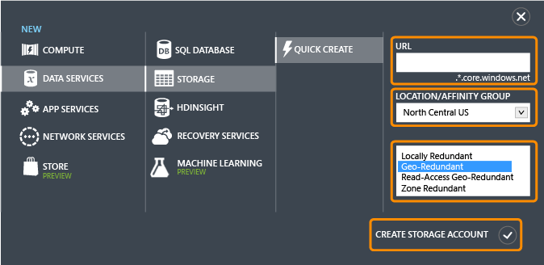

<properties linkid="manage-services-how-to-create-a-storage-account" urlDisplayName="How to create" pageTitle="How to create a storage account | Azure" metaKeywords="" description="Learn how to create a storage account in the Azure management portal." metaCanonical="" services="storage" documentationCenter="" title="How To Create a Storage Account" authors="tysonn" solutions="" manager="paulettm" editor="cgronlun" />

如何建立儲存體帳戶
==================

若要在 Azure 的 Blob、資料表和佇列服務中儲存檔案和資料，您必須在想要儲存資料的地理區域中建立儲存體帳戶。儲存體帳戶可以包含多達 200 TB 的資料，而您可以為每項 Azure 訂閱建立多達 20 個儲存體帳戶。如需詳細資訊，請參閱 [Azure 儲存體延展性和效能目標](http://msdn.microsoft.com/zh-tw/library/dn249410.aspx) (英文)。

本主題說明如何在 Azure 管理入口網站中建立儲存體帳戶。

**注意**

對於 Azure 虛擬機器，如果您在部署位置中沒有儲存體帳戶，則會在該位置自動建立儲存體帳戶。儲存體帳戶名稱將以虛擬機器名稱為基礎。

目錄
----

-   [作法：建立儲存體帳戶](#create)
-   [後續步驟](#next)

作法：建立儲存體帳戶
--------------------

1.  登入[管理入口網站](https://manage.windowsazure.com)。

2.  依序按一下 **[建立新的]**、**[儲存體]** 和 **[快速建立]**。

    

3.  在 **[URL]** 中，輸入要用於儲存體帳戶 URL 的子網域名稱。若要存取儲存體中的物件，請將物件的位置附加至端點。例如，可供存取 BLOB 的 URL 可能是 http://*myaccount*.blob.core.windows.net/*mycontainer*/*myblob*。

4.  在 **[Region/Affinity Group]** 中，選取儲存體的區域或同質群組。如果您希望儲存體服務位於與您目前使用的其他 Azure 服務相同的資料中心，請選取同質群組而非區域。這麼做可改善效能，而且出口流量不會產生任何費用。

    > [WACOM.NOTE]
    >  \> 若要建立同質群組，請開啟管理入口網站的 **[網路]** 區域，按一下 **[同質群組]**，再按一下 **[建立新的同質群組]** 或 **[建立]**。您可以使用在先前管理入口網站中建立的同質群組。若要開啟其他入口網站，按一下標題列上的 **[預覽]**，然後按一下 **[Take me to the previous portal]** (若要返回此入口網站，按一下入口網站底部的 **[View the Preview Portal]**)。您也可以使用 Azure 服務管理 API 建立和管理同質群組。如需詳細資訊，請參閱[同質群組的相關作業](http://msdn.microsoft.com/zh-tw/library/windowsazure/ee460798.aspx)。

5.  如果您有一個以上的 Azure 訂閱，則會顯示 **[訂閱]** 欄位。在 **[訂閱]** 中，輸入您要使用儲存體帳戶的 Azure 訂閱。您可以針對一項訂閱建立多達 5 個儲存體帳戶。

6.  在 **[複寫]** 中，選取您的儲存體帳戶所需的複寫層級。

    依預設，複寫會設定為 **[Geo-Redundant]**。使用地理區域備援複寫，在主要位置發生主要災害事件時，您的儲存體帳戶與其中的所有資料都會容錯移轉至次要位置。Azure 會在相同的區域中指派次要位置，該位置無法加以變更。容錯移轉之後，次要位置會成為儲存體帳戶的主要位置，而您的資料會複寫到新的次要位置。

    如果要能夠從次要位置讀取資料，可以選取 **[Read-Access Geo-Redundant]** 複寫。這個選擇提供了地理區域備援複寫，能夠唯讀存取次要位置中複寫的資料。讀取存取地理區域備援複寫可讓您在主要或次要位置其中之一無法使用的情況下，從另外一個位置存取資料。

    第三個複寫選項 **[Read Access Geo-Redundant]** 目前只能預覽。這個選項可讓您唯讀存取次要位置中複寫的資料。讀取存取地理區域備援複寫可讓您在主要或次要位置其中之一無法使用的情況下，從另外一個位置存取資料。

    > [WACOM.NOTE]
    >  \> 若要使用只能預覽的讀取存取地理區域備援複寫，您必須手動要求針對您的訂閱啟用該功能。造訪 [Azure 預覽功能](https://account.windowsazure.com/PreviewFeatures)頁面，針對您的訂閱要求讀取存取地理區域備援複寫。如需讀取存取地理區域備援複寫的詳細資訊，請參閱 [Azure 儲存體團隊部落格](http://blogs.msdn.com/b/windowsazurestorage/archive/2013/12/04/introducing-read-access-geo-replicated-storage-ra-grs-for-windows-azure-storage.aspx) (英文)。如果讀取存取地理區域備援複寫並未當作您訂閱的預覽功能啟用，則會停用針對您的儲存體帳戶進行選取的選項。

    如需儲存體帳戶複寫的定價資訊，請參閱[儲存體定價詳細資料](http://www.windowsazure.com/zh-tw/pricing/details/storage/)。

7.  按一下 **[建立儲存體帳戶]**。

    建立儲存體帳戶可能需要花費數分鐘的時間。若要檢查狀態，可以監控位於入口網站底部的通知。建立儲存體帳戶之後，新的儲存體帳戶會處於 **[線上]** 狀態並可提供使用。

    

後續步驟
--------

-   若要深入了解 Azure 儲存體服務，請參閱 [Azure 資料管理：做正確的選擇](http://www.windowsazure.com/zh-tw/develop/net/fundamentals/cloud-storage/) (英文) 和 [儲存體](http://msdn.microsoft.com/zh-tw/library/gg433040.aspx)。

-   請造訪 [Azure 儲存體團隊部落格](http://blogs.msdn.com/b/windowsazurestorage/) (英文)。

-   將應用程式設定成使用 Azure Blob、資料表和佇列服務。[Azure 開發人員中心](http://www.windowsazure.com/zh-tw/develop/overview/) (英文) 提供在 .NET、Node.js、Java 和 PHP 應用程式中使用 Blob、資料表和佇列服務的作法指南。如需程式設計語言的特定指示，請參閱該語言的作法指南。

