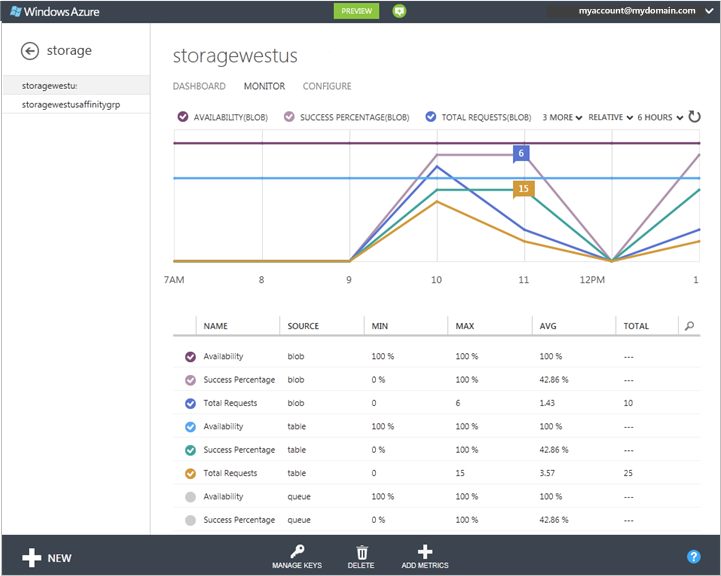

<properties linkid="manage-services-how-to-monitor-a-storage-account" urlDisplayName="How to monitor" pageTitle="How to monitor a storage account | Microsoft Azure" metaKeywords="Azure monitor storage accounts, storage account management portal, storage account dashboard, storage metrics table, storage metrics chart" description="Learn how to monitor a storage account in Azure by using the Management Portal." metaCanonical="" services="storage" documentationCenter="" title="How To Monitor a Storage Account" authors="tamram" solutions="" manager="mbaldwin" editor="cgronlun" />

<tags ms.service="storage" ms.workload="storage" ms.tgt_pltfrm="na" ms.devlang="na" ms.topic="article" ms.date="01/01/1900" ms.author="tamram" />

# </a>如何監視儲存體帳戶

您可以在 Azure 預覽管理入口網站中監視儲存體帳戶。針對每個與儲存體帳戶相關的儲存服務 (Blob、佇列及資料表)，您可以選擇監視等級 - 最小或詳細資訊 - 並指定適當的資料保留原則。

在設定儲存體帳戶的監視之前，不會收集任何監視資料，且儀表板和 [監視] 頁面上的度量圖表為空白。

 
<b>注意</b> 

其他成本也與在管理入口網站中查看監視資料相關。如需詳細資訊，請參閱<a href="http://msdn.microsoft.com/zh-tw/library/windowsazure/hh360997.aspx">儲存體分析及計費</a>。
 

## 目錄

-   [作法：設定儲存體帳戶的監視][作法：設定儲存體帳戶的監視]
-   [作法：自訂儀表板以進行監視][作法：自訂儀表板以進行監視]
-   <a href="#customizemonitorpage">作法：自訂 [監視] 頁面</a>
-   [作法：將度量新增至度量表][作法：將度量新增至度量表]
-   <a href="#customizemetricschart">作法：自訂 [監視] 頁面上的度量圖表</a>
-   [作法：設定記錄][作法：設定記錄]

## </a>作法：設定儲存體帳戶的監視

1.  在[管理入口網站][管理入口網站]中，按一下 [儲存體]，然後按一下儲存體帳戶名稱即可開啟儀表板。

2.  按一下 [設定]，然後向下捲動到 Blob、資料表及佇列服務的 [監視] 設定，如下所示。

    ![MonitoringOptions][MonitoringOptions]

3.  在 [監視] 中，設定每個服務的監視等級和資料保留原則：

-   若要設定監視等級，請選取下列其中一項：

    「最小」 - 可收集針對 Blob、資料表和佇列服務彙總的度量 (例如入口流量/出口流量、可用性、延遲和成功百分比)。

    「詳細資訊」 - 除了最小度量之外，在 Azure 儲存體服務 API 中也針對每個儲存體作業收集相同的度量集合。詳細資訊度量可供進一步分析在應用程式運作期間發生的問題。

    「關閉」 - 關閉監視。現有的監視資料會儲存到保留期間結束。

-   若要設定資料保留原則，請在 [Retention (in days)] 中，輸入要保留資料的天數，範圍從 1 到 365 天。如果不想設定保留原則，則請輸入零。如果沒有保留原則，您可以決定是否刪除監視資料。我們建議根據要保留帳戶的儲存體分析資料多久來設定保留原則，以便系統可以不花費成本地刪除舊的無用分析資料。

1.  完成監視組態時，按一下 [儲存]。

您應該在大約一小時後，開始在儀表板及 [監視] 頁面上看到監視資料。

度量存放在儲存體帳戶中的四個資料表：$MetricsTransactionsBlob、$MetricsTransactionsTable、$MetricsTransactionsQueue 及 $MetricsCapacityBlob。如需詳細資訊，請參閱[關於儲存體分析度量][關於儲存體分析度量]。

設定監視等級與保留原則之後，您可以在管理入口網站選擇要監視哪些可用的度量，以及在度量圖表上繪製哪些度量。每個監視等級會顯示一組預設的度量。您可以使用 [Add Metrics] 從度量清單新增或移除度量。

## </a>作法：自訂儀表板以進行監視

在儀表板上，您可以從九個可用度量中選擇最多六個度量，繪製在度量圖表上。針對每個服務 (Blob、資料表和佇列)，可以使用「可用性」、「成功百分比」和「要求總數」等度量。對於最小或詳細資訊監視，儀表板上的可用度量相同。

1.  在[管理入口網站][管理入口網站]中，按一下 [儲存體]，然後按一下儲存體帳戶名稱即可開啟儀表板。

2.  若要變更圖表上繪製的度量，請採取下列其中一個動作：

-   若要新增度量到圖表，請按一下度量標頭旁邊的核取方塊。在縮小顯示上，按一下 [*n* more] 存取無法顯示在標頭區域的標頭。

-   若要隱藏圖表上繪製的度量，請清除度量標頭旁邊的核取方塊。

    

1.  圖表預設會顯示趨勢，且只顯示每個度量的目前值 (圖表頂端的 [相對] 選項)。若要顯示 Y 軸以看到絕對值，請選取 [絕對]。

2.  若要變更度量圖表顯示的時間範圍，請選取圖表頂端的 [6 hours]、[24 hours] 或 [7 days]。

## </a>作法：自訂 [監視] 頁面

在 [監視] 頁面上，您可以檢視儲存體帳戶的完整度量集合。

-   如果儲存體帳戶已設定最小監視，則會從 Blob、資料表和佇列服務彙總例如入口流量/出口流量、可用性、延遲和成功百分比等度量。

-   如果您的儲存體帳戶已設定詳細資訊監視，則除了服務等級彙總，度量也可以用來更精細地解析個別儲存體作業。

請使用下列程序選擇在 [監視] 頁面上顯示的度量圖表及資料表中，可檢視哪些儲存體度量。這些設定不會影響儲存體帳戶中的監視資料收集、彙總和儲存。

## </a>作法：將度量新增至度量表

1.  在[管理入口網站][管理入口網站]中，按一下 [儲存體]，然後按一下儲存體帳戶名稱即可開啟儀表板。

2.  按一下 [監視]。

    即會開啟 [監視] 頁面。依預設，度量表會顯示一部份可用於監視的度量。下圖顯示所有三個服務都設定詳細資訊監視的儲存體帳戶預設 [監視] 顯示。請使用 [Add Metrics] 從所有可用度量中選取您要監視的度量。

    

    
 
    <b>注意</b> 
    
選取度量時請考慮成本。重新整理監視顯示時有相關的交易和出口流量成本。如需詳細資訊，請參閱<a href="http://msdn.microsoft.com/zh-tw/library/windowsazure/hh360997.aspx">儲存體分析及計費</a>。
 
    

3.  按一下 [Add Metrics]。

    最小監視中可用的彙總度量在清單的頂端。如果選取核取方塊，度量便會顯示在度量清單中。

    ![AddMetricsInitialDisplay][AddMetricsInitialDisplay]

4.  移動游標停留在對話方塊的右邊，以顯示捲軸，您可以拖曳捲軸來將其他度量捲入檢視中。

    ![AddMetricsScrollbar][AddMetricsScrollbar]

5.  按一下度量旁邊的向下箭頭，展開可以包含該度量的操作清單。選取要在管理入口網站的度量表中檢視的每個操作。

    在下圖中，已展開 AUTHORIZATION ERROR PERCENTAGE 度量。

    ![ExpandCollapse][ExpandCollapse]

6.  選取所有服務的度量後，按一下 [確定] (核取記號) 更新監視組態。選取的度量隨即新增到度量表。

7.  若要從度量表刪除度量，請按一下度量加以選取，然後按一下 [Delete Metric]，如下所示。

    ![DeleteMetric][DeleteMetric]

## </a>作法：自訂 [監視] 頁面上的度量圖表

1.  在儲存體帳戶的 [監視] 頁面上，在度量表中選取最多 6 個度量，在度量圖表上繪製。若要選取度量，請按一下左邊的核取方塊。若要從圖表移除度量，請清除核取方塊。

2.  若要切換圖表的相對值 (只顯示最終值) 和絕對值 (顯示 Y 軸)，請選取圖表頂端的 [相對] 或 [絕對]。

3.  若要變更度量圖表顯示的時間範圍，請選取圖表頂端的 [6 hours]、[24 hours] 或 [7 days]。

## </a>作法：設定記錄

針對儲存體帳戶能使用的每個儲存服務 (Blob、資料表和佇列)，您可以儲存「讀取要求」、「寫入要求」及/或「刪除要求」的診斷記錄檔，也可以設定每個服務的資料保留原則。

1.  在[管理入口網站][管理入口網站]中，按一下 [儲存體]，然後按一下儲存體帳戶名稱即可開啟儀表板。

2.  按一下 [設定]，然後使用鍵盤上的向下箭頭，向下捲動到 [記錄] (如下所示)。

    ![Storagelogging][Storagelogging]

3.  針對每個服務 (Blob、資料表和佇列)，設定下列各項：

    -   要記錄的要求類型：「讀取要求」、「寫入要求」及「刪除要求」

    -   記錄資料的保留天數。如果不想設定保留原則，請輸入零。如果沒有設定保留原則，您可以決定是否刪除記錄檔。

4.  按一下 [儲存]。

診斷記錄檔儲存在儲存體帳戶中的 $logs Blob 容器。如需存取 $logs 容器的詳細資訊，請參閱[關於儲存體分析記錄][關於儲存體分析記錄]。

  [作法：設定儲存體帳戶的監視]: #configurestoragemonitoring
  [作法：自訂儀表板以進行監視]: #customizestoragemonitoring
  [作法：將度量新增至度量表]: #addmonitoringmetrics
  [作法：設定記錄]: #configurelogging
  [管理入口網站]: https://manage.windowsazure.com/
  [MonitoringOptions]: ./media/storage-monitor-storage-account/Storage_MonitoringOptions.png
  [關於儲存體分析度量]: http://msdn.microsoft.com/zh-tw/library/windowsazure/hh343258.aspx
  [AddMetricsInitialDisplay]: ./media/storage-monitor-storage-account/Storage_AddMetrics_InitialDisplay.png
  [AddMetricsScrollbar]: ./media/storage-monitor-storage-account/Storage_AddMetrics_Scrollbar.png
  [ExpandCollapse]: ./media/storage-monitor-storage-account/Storage_AddMetrics_ExpandCollapse.png
  [DeleteMetric]: ./media/storage-monitor-storage-account/Storage_DeleteMetric.png
  [Storagelogging]: ./media/storage-monitor-storage-account/Storage_LoggingOptions.png
  [關於儲存體分析記錄]: http://msdn.microsoft.com/zh-tw/library/windowsazure/hh343262.aspx
